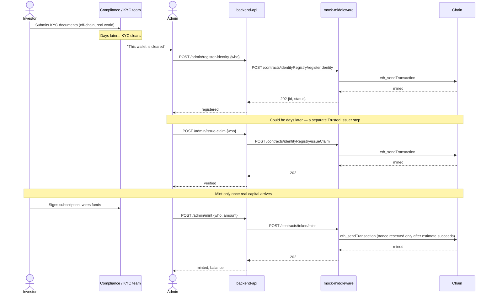
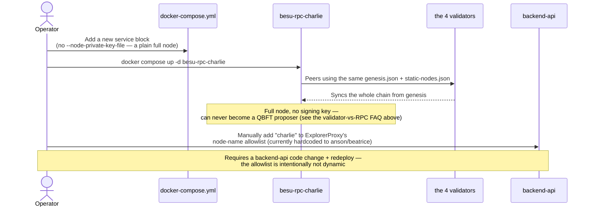
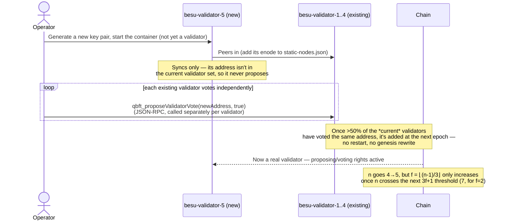
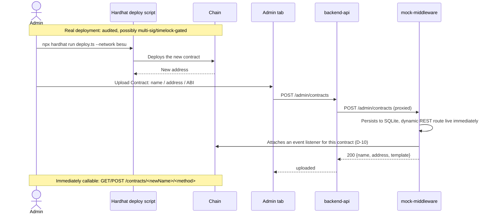

# FAQ

> Answers to specific "why does this work like that?" questions that come up while reading the code or running the demo. For the full picture, see [docs/architecture.md](architecture.md) (system design) or [docs/mock-middleware-technical.md](mock-middleware-technical.md) (gateway internals).

---

### The validator and RPC node service definitions in `docker-compose.yml` look almost identical. How does Besu tell them apart?

Not by container name or by anything in `docker-compose.yml` at all — by **whether the node's private key's address appears in `genesis.json`'s `extraData` field.**

`network-config/genesis.json`'s `extraData` was written once, at genesis-generation time (Phase 1, M1.1), with exactly 4 validator addresses baked in. Besu doesn't care what a node is called; it only checks whether the node's own identity (derived from whichever private key it was started with) matches one of those 4 addresses.

- `besu-validator-1..4` each get `--node-private-key-file=/data/key`, pointing at `validator-keys/validator-{1..4}/key` — the exact 4 keys whose addresses are in `extraData`. That's what gives them QBFT proposing/voting rights.
- `besu-rpc-anson`/`besu-rpc-beatrice` have **no** `--node-private-key-file` flag at all. Besu auto-generates a random ephemeral node key for them instead, which is (by construction) never one of the 4 addresses in `extraData` — so these nodes sync and serve RPC, but never propose or vote on a block.

If you added `--node-private-key-file` pointing at `validator-1/key` to `besu-rpc-anson`, it would become a validator — and collide with `besu-validator-1`, since they'd share the same on-chain identity. The role is entirely a function of the key, not the container.

Everything else that differs between the two groups (`--rpc-ws-enabled`, published `ports:`, `depends_on`, static IP ranges `.11`–`.14` vs `.21`–`.22`) is operational convenience, not part of how consensus membership is decided.

One more detail: `network-config/static-nodes.json` lists only the 4 validator enodes. Every node — including the RPC nodes themselves — dials out to those 4 on startup; nothing is configured to dial the RPC nodes back. They're reachable purely because Besu's own peer discovery finds them once the initial connections are up, not because anything statically points at them.

---

### Why does the block count keep going up every time I open the Explorer tab, even when nobody's doing anything?

Because this is a QBFT chain with a **fixed block period**, not a "block only when there's a transaction" chain. `network-config/genesis.json`'s `qbft.blockperiodseconds` is `2` — every 2 seconds, whichever validator is up for its round proposes a new block, empty or not. You'll see plenty of `Tx count: 0` rows in the Recent Blocks table for exactly this reason.

So "Latest block" is a snapshot of wherever the chain happens to be the instant you look, not a value that only moves when you do something. Leave the tab open for a minute and refresh — it'll have climbed by roughly 30 blocks, transaction or no transaction.

This tradeoff is deliberate: fixed block period means every transaction confirms within ~2 seconds no matter what else is happening, at the cost of the chain growing continuously even when idle. It's not a problem here because there's no persistent Besu volume (D-15) — `docker compose down -v` resets everything back to block 0.

---

### Why does `contracts/` have a nested `contracts/contracts/` folder?

Two different reasons stacked on top of each other:

1. **The outer `contracts/`** is one of this repo's independent npm sub-projects (alongside `mock-middleware/`, `backend-api/`, `frontend/`), each with its own `package.json`. This is just repo-level layering, unrelated to Solidity.
2. **The inner `contracts/contracts/`** is a Hardhat convention, not something specific to this repo — Hardhat expects `.sol` source files in a subdirectory literally named `contracts` by default (see `contracts/hardhat.config.ts`'s `paths.sources: "./contracts"`). `test/`, `scripts/`, `cache/`, `artifacts/`, and `typechain-types/` sitting next to it are the same story — standard Hardhat project layout, present in any Hardhat project.

There's a third, intentional layer beyond those two: `contracts/contracts/compliance/` groups `BasicCompliance.sol` and its interface `IModularCompliance.sol` separately from the core T-REX contracts. `Token.sol` only ever depends on the `IModularCompliance` interface, never on a concrete implementation — keeping the concrete module in its own folder makes that "swappable compliance module" design (D-01) visible in the file layout, not just in the code. A future country-restriction or max-holder-count module would go in the same folder.

---

### If I don't run `npm run seed`, can I do the whole onboarding flow manually from the Admin page?

Partly. `npm run seed` is really four steps bolted together, and only the last two have a UI equivalent:

1. **Deploy the contract suite** (`npm run deploy:besu` inside `contracts/`) — no UI for this at all, and there never will be by design: `mock-middleware` only knows how to generate REST for a contract that's *already* deployed (D-07), not how to deploy new bytecode. This is a Hardhat CLI step, full stop.
2. **Resync `mock-middleware`'s nonce cache** (`POST /admin/nonces/resync`) — needed because step 1 signs 9 transactions with the admin key directly against chain, bypassing `mock-middleware` entirely (see `docs/mock-middleware-technical.md` §5). No UI button for this either.
3. **Register `token` and `identityRegistry` with `mock-middleware`** — this *is* the Admin tab's **Upload Contract** form. You need the deployed address (from `deployed-addresses.json`) and the ABI (from the matching Hardhat artifact's `.abi` field) for each of the two contracts, uploaded as two separate submissions.
4. **Onboard Anson/Beatrice and mint** — exactly the Admin tab's **Register / Issue Claim / Mint** buttons, one identity at a time.

The name matters for step 3: `backend-api`'s `MockMiddlewareChainService` is hardcoded to look up contracts named exactly `identityRegistry` and `token` — register them under any other name and every Admin-tab button 404s.

---

### In reality, when do you register a wallet, issue a KYC claim, mint, or upload a contract — do they happen together?

Not usually. The demo does all three onboarding steps back-to-back because that's convenient for a walkthrough, but each one corresponds to a distinct real-world trigger, often separated by days and handled by different people:

| Step | Real-world trigger | Who |
|---|---|---|
| **Register wallet** | An investor *starts* KYC — submits documents | Token Agent (this demo's Admin) |
| **Issue KYC claim** | KYC/AML *actually clears* — can take days of document review, sanctions-list screening | Trusted Issuer — a role the contracts model separately from Token Agent (D-02) even though this demo's single Admin wallet plays both; in reality this could be an independent, licensed KYC provider |
| **Mint** | The investor *actually funds* — a signed subscription agreement and a cleared wire, not just KYC | Token Agent, usually gated by finance/compliance sign-off |

`registerIdentity` attests "this wallet started KYC." `issueClaim` attests "KYC passed." `mint` attests "capital was received and units were issued." Three separate commercial events, not one.

**Uploading a contract** is a different kind of event entirely — it's not per-investor, it's per-asset-launch. It happens when the business deploys a genuinely new instrument (a second token, a new compliance module), typically after an audit and (in a real deployment) through a deployment pipeline with more controls than this demo's plain `hardhat run deploy.ts` — then the resulting address+ABI gets uploaded once, and `mock-middleware` generates REST for it immediately with no gateway code change (D-07).

---

### What do the different onboarding scenarios actually look like end to end? (new wallet, new RPC node, new validator, new contract)

Four genuinely different flows, at different layers of the stack. Only the first and last have any UI or API in this project at all — adding a node (RPC or validator) is pure Besu/Docker infrastructure work, entirely outside `mock-middleware`'s scope.

#### A — Onboard a new investor wallet (this demo supports this)

#### B — Onboard a new RPC node (no UI — pure infra)

E.g. a third investor, "Charlie," wants an independent RPC endpoint instead of trusting Anson's or Beatrice's view.

Adding an RPC node has **zero consensus impact** — it holds no signing key, so `f=1` fault tolerance is completely unaffected. Nothing in `backend-api`/`mock-middleware` exposes an API for this; it's `docker-compose.yml` plus a manual code change.

#### C — Onboard a new validator node (no UI — Besu's live QBFT voting, not a genesis rewrite)

The one mistake to avoid: this is **not** "edit `genesis.json` and restart" — that would fork the chain. Besu's QBFT implementation supports adding a validator to the *live* set via voting.

Real mechanism: `qbft_proposeValidatorVote`/`qbft_discardValidatorVote`, called against each *existing* validator's own RPC individually — there's no single "add validator" call. `genesis.json`'s `extraData` is only the **starting** validator set; the live set is queried with `qbft_getValidatorsByBlockNumber` and can diverge from genesis as votes land. Nothing in this project exposes any of this — it's a raw `curl` against a validator's port.

#### D — Onboard a new contract/asset (this demo supports this)

#### Which layer owns each scenario

| Scenario | Layer | UI/API in this project? |
|---|---|---|
| New investor wallet (register/claim/mint) | `backend-api` → `mock-middleware` | ✅ Admin tab |
| New asset/contract | `backend-api` → `mock-middleware` | ✅ Upload Contract form |
| New RPC node | Docker Compose + Besu P2P | ❌ Infra only, plus a manual `ExplorerProxy` allowlist edit |
| New validator node | Besu's native QBFT voting JSON-RPC | ❌ Infra only, `qbft_proposeValidatorVote` via raw RPC |
