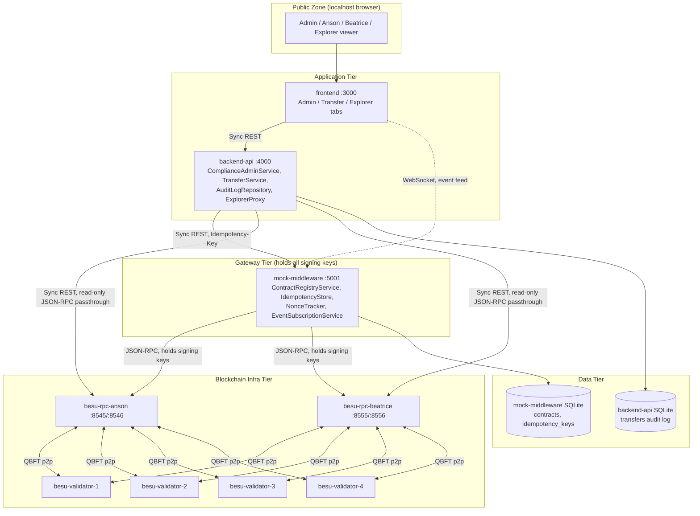
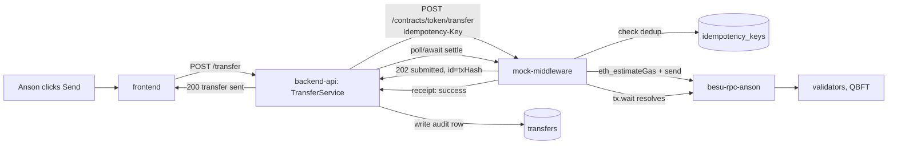
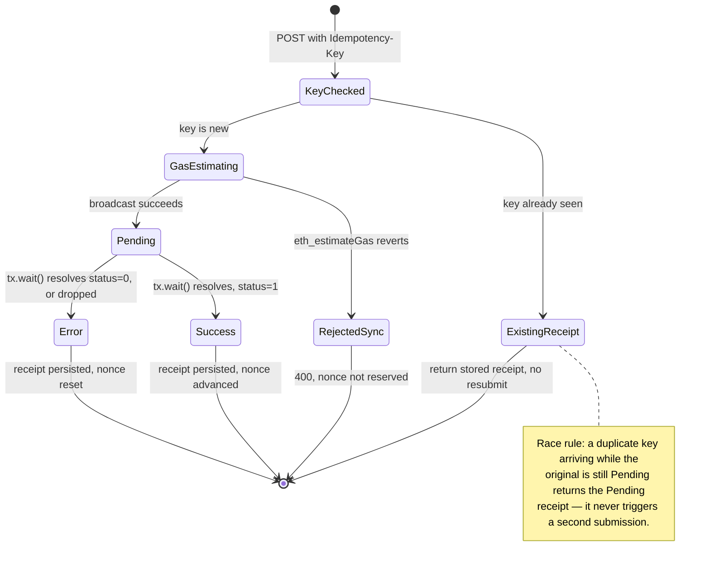
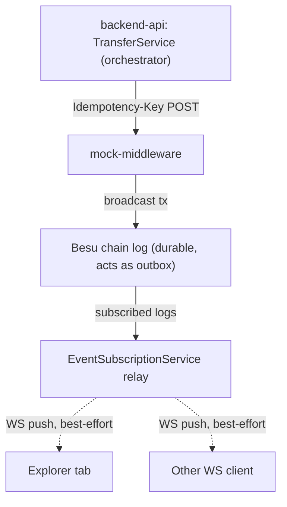

# Architecture — Hyperledger-Besu-Docker-Testnet

> **Owner:** Howin Ho · **Created:** 2026-09-15 · **Status:** Locked (post grill-me)

---

## §1 Overview

**Architecture style: Hybrid** — a modular monolith (`backend-api`) plus one deliberately extracted service (`mock-middleware`), a thin SPA frontend, and a blockchain infra tier. `mock-middleware` is extracted (not folded into `backend-api`) because it is the sole holder of every signing key in the system and needs its own, narrowly-scoped security boundary as a generic ABI-driven gateway — a compliance-isolation reason, not a scaling reason (see decision table in `docs/plan.md` §2).

**Deployment model:** 9 containers on a single Docker Compose stack, single host, no orchestrator:
- `besu-validator-1..4` — QBFT validators
- `besu-rpc-anson`, `besu-rpc-beatrice` — RPC nodes
- `mock-middleware` — ABI-driven gateway, sole chain transport
- `backend-api` — business orchestration + audit log + Explorer read proxy
- `frontend` — React SPA (Admin / Transfer / Explorer tabs)

**Data tier:**
| Store | Role | Owner |
|---|---|---|
| Besu chain state | Source of truth for balances, identity/claim state, compliance state | `besu-validator-*`/`besu-rpc-*` (no persistent volume — resets every `docker compose down`) |
| `mock-middleware` SQLite (`node:sqlite`) | Contract registry, idempotency-key → receipt map, nonce state | `mock-middleware` only |
| `backend-api` SQLite (`node:sqlite`) | `transfers` audit log | `backend-api` only |

**External services:** none. Fully local/offline demo — no third-party SaaS, no email/SMS provider, no payment processor.

**Locked stack decisions:** TypeScript strict, Node 24, Express, ethers.js, SQLite/`node:sqlite`, React+Vite, Solidity+Hardhat, Docker Compose — see `docs/plan.md` §3 (D-01–D-22) for the full decision log and rationale.

---

## §2 Modules / Services and Capability Mapping

| # | Name | Capabilities owned | Data owned | Depth |
|---|---|---|---|---|
| 1 | `ComplianceAdminService` (module, in `backend-api`) | `registerIdentity`, `issueClaim`, `mintToken` orchestration; skip-if-already-true checks | none (delegates to chain via `mock-middleware`) | deep |
| 2 | `TransferService` (module, in `backend-api`) | `transfer` orchestration, compliance-rejection surfacing | none | deep |
| 3 | `AuditLogRepository` (module, in `backend-api`) | Persist/read transfer history | `transfers` table (SQLite) | shallow |
| 4 | `ExplorerProxy` (module, in `backend-api`) | Read-only block/tx passthrough to Besu RPC, node-name allowlisting | none | shallow |
| 5 | `ContractRegistryService` (in `mock-middleware`) | ABI upload/validation, dynamic REST method dispatch | `contracts` table (SQLite) | deep |
| 6 | `IdempotencyStore` (in `mock-middleware`) | Dedup write calls by `Idempotency-Key` | `idempotency_keys` table (SQLite) | deep |
| 7 | `NonceTracker` (in `mock-middleware`) | Per-identity nonce sequencing, reset-on-revert, confirmation tracking | nonce/receipt state (SQLite) | deep |
| 8 | `EventSubscriptionService` (in `mock-middleware`) | WebSocket fan-out of on-chain events, filter by address/template | subscription state (in-memory, ephemeral by design) | deep |
| 9 | T-REX Contract Suite (on-chain) | Identity/claim/balance state, compliance enforcement | Chain state | deep |
| 10 | `frontend` (SPA) | Admin / Transfer / Explorer UI | none (no secrets ever reach the browser) | shallow |

**MVP simplification block:**

| Component | MVP (ship this) | Phase N upgrade |
|---|---|---|
| `EventSubscriptionService` delivery | WebSocket push only | Add webhook delivery mode (PRD FR-17, post-MVP) |
| Besu chain data | Ephemeral, reset every `docker compose down` | Optional persistent-volume mode (PRD FR-18, post-MVP) |
| Investor identity model | Wallet address used directly as identity key (no OnchainID proxies) | Full per-investor OnchainID (deferred, inherited from `my-besu-net`) |

Net effect: all 10 units above are active in MVP — nothing is deferred out of the running topology, only specific capabilities within `EventSubscriptionService` and chain persistence are deferred.

**Topology:**

---

## §3 Integration Patterns Per Interaction

| Interaction | From → To | Pattern | Why this pattern |
|---|---|---|---|
| Dashboard actions | `frontend` → `backend-api` | Sync REST | Simple request/response, no long-running work at this hop |
| Business orchestration → chain transport | `backend-api` → `mock-middleware` | Sync REST (`202` + async settlement) + `Idempotency-Key` | Caller gets a fast ack; settlement is polled/awaited internally by `backend-api` so the *external* behaviour still looks synchronous to `frontend` (same pattern `my-besu-net`'s BaaS-gateway transport service used, D-05) |
| Explorer reads | `frontend` → `backend-api` → `besu-rpc-{anson,beatrice}` | Sync REST (read-through proxy) | Keeps raw JSON-RPC off the browser's network surface; lets `backend-api` allowlist which RPC node name is valid |
| Live event push | `mock-middleware` → `frontend` | Async WebSocket push (fire-and-forget) | Explorer/pending-tx UI needs near-real-time updates without polling; no delivery guarantee needed since it's observability, not settlement |
| Chain writes/reads | `mock-middleware` → `besu-rpc-{anson,beatrice}` | Direct chain call (ethers.js JSON-RPC) | `mock-middleware` is the sole key-holder and sole transport (D-06) |
| On-chain log → subscriber | Besu event log → `mock-middleware` → WS clients | Fire-and-forget push | Chain logs are the durable source; the WS relay is a best-effort convenience layer on top, not the system of record |

**Failure handling on critical paths:**

| Path | Failure mode | Behaviour |
|---|---|---|
| `backend-api` → `mock-middleware` | Unreachable | `backend-api` returns `503` immediately, no silent retry; `frontend` shows an inline error |
| `mock-middleware` → `besu-rpc` | `eth_estimateGas` reverts pre-broadcast | Nonce never reserved; request fails synchronously with `400` + revert reason; no receipt created |
| `mock-middleware` → `besu-rpc` | Broadcast tx dropped from mempool | Receipt resolves to `error`; nonce reset so the identity isn't stuck waiting for a nonce that will never arrive |
| WebSocket subscriber | Disconnects mid-stream | Subscription silently dropped; no backlog replay on reconnect (at-most-once by design) |
| `backend-api` → `besu-rpc` (Explorer proxy) | RPC node unreachable | `503` from the proxy route; Explorer shows "node unavailable" for that side only — switching "View as" to the other node is unaffected |

**Integration critical path — transfer flow:**

---

## §4 Event Catalog

No internal domain-event broker drives business orchestration — all `backend-api` orchestration stays synchronous REST (inherited from `my-besu-net` D-17). `mock-middleware`'s WebSocket subscription is a **read-only observability relay** of on-chain contract events, not a pub/sub broker for application state; it has no bearing on transaction settlement, which is why receipts are tracked separately via the idempotency/nonce state, never via this feed.

**Producer:** any contract registered in `mock-middleware`'s `ContractRegistryService` (D-07/PRD FR-4). The gateway doesn't hardcode event names — it relays whatever `event` declarations exist in the uploaded ABI, consistent with the generic-gateway design (PRD FR-8).

**Envelope** (added by the relay, not part of the on-chain schema): `event_name`, `contract_address`, `contract_template`, `block_number`, `transaction_hash`, `decoded_args`. Schema versioning is owned by the contract's ABI itself — the relay does no transformation beyond decoding.

**Consumers in MVP:** Explorer tab's live feed and pending-tx panel; any ad-hoc WS test client (US-007).

---

## §5 Event Sourcing and CQRS — Scope and Rationale

- **Event sourcing:** not used anywhere. The chain itself is the append-only source of truth for balances/compliance state; `backend-api`'s `transfers` table is a denormalized log of "what business action was performed," not an event-sourced aggregate that gets replayed.
- **CQRS:** not used. Reads and writes both go through `backend-api`'s REST routes for business data; Explorer reads bypass the write path entirely via a separate read-only proxy — that's a different *data source* (raw chain RPC vs. SQLite audit log), not a CQRS read-model split.
- **Why this is correct for this phase:** solo PoC, no read/write scaling divergence exists to justify either pattern. Event sourcing here would add derivation/replay complexity with zero payoff.

**Primary entity lifecycle — the receipt / idempotency-key state machine:**

**Decision rule:** a flow is orchestrated when a single caller must enforce an invariant across multiple steps before any chain write happens (e.g. "claim requires prior registration"). A flow is choreographed when independent observers merely want to know something happened, with no invariant to enforce — the WS event relay is choreographed for exactly this reason.

---

## §6 Per-Module Rationale

**`ComplianceAdminService` / `TransferService` (backend-api):**
- Forces: business invariants ("claim requires registration", "transfer requires both parties verified") must live somewhere other than the Express route handlers or the generic gateway.
- Alternative: push these invariants into `mock-middleware` itself.
- Rejected because: it would make `mock-middleware` no longer generic — the whole point of an ABI-driven gateway is that it doesn't know what "registering an identity" means (PRD §1 domain vocabulary).

**`AuditLogRepository` (backend-api):**
- Forces: need a durable, queryable record of transfers independent of chain-log parsing.
- Alternative: derive transfer history by querying `mock-middleware`'s relayed events instead of maintaining a separate table.
- Rejected because: the WS relay is explicitly best-effort/at-most-once (§4) — using it as the audit source would silently lose rows on any disconnect.

**`ExplorerProxy` (backend-api):**
- Forces: Explorer needs raw JSON-RPC data (blocks/tx), which is a different concern from contract-method calls.
- Alternative: route Explorer reads through `mock-middleware`'s contract gateway.
- Rejected because: raw block/tx browsing isn't a contract call at all — forcing it through the ABI gateway would bolt an unrelated generic-JSON-RPC-proxy concern onto a component whose entire value is being narrowly scoped to contract calls (confirmed in grill-me interview).

**`ContractRegistryService` (mock-middleware):**
- Forces: the "upload an ABI, get REST for free" requirement means the set of callable contracts can't be hardcoded (as it was in `my-besu-net`).
- Alternative: keep the hardcoded `contracts.ts` instance list and only add new instances via a code change + redeploy.
- Rejected because: that isn't actually "upload" — it defeats the requirement's purpose (verified with the user directly during grill-me).

**`IdempotencyStore` (mock-middleware):**
- Forces: retried writes must not double-submit a transaction.
- Alternative: derive idempotency implicitly from `(contract, method, params, from)` hashing instead of a client-supplied key.
- Rejected because: two legitimately identical consecutive transfers (same amount, same parties) would be misdiagnosed as duplicates and silently dropped.

**`NonceTracker` (mock-middleware):**
- Forces: multiple identities submitting concurrently must not race on Besu's "pending" nonce (the exact bug `my-besu-net` hit and fixed).
- Alternative: let `ethers.NonceManager`'s default behaviour handle it with no extra tracking layer.
- Rejected because: `my-besu-net` proved `NonceManager` alone leaves a nonce reserved forever after a reverted `eth_estimateGas` — an explicit reset step is mandatory, not optional.

**`EventSubscriptionService` (mock-middleware):**
- Forces: consumers need push, not poll, for near-real-time event visibility (grill-me decision).
- Alternative: webhook delivery (closer to real commercial BaaS-gateway products, D-05).
- Rejected for MVP because: webhooks need a publicly reachable callback URL, which is awkward for a localhost-only demo with no separate receiver service; kept as a Post-MVP option (PRD FR-17).

**T-REX Contract Suite (on-chain):**
- Forces: this is `my-besu-net`'s core, unmodified compliance guarantee — it must remain the actual authorization boundary.
- Alternative: enforce compliance in `backend-api` instead of on-chain.
- Rejected because: that would let anyone bypass compliance by calling the chain directly — the same reasoning `my-besu-net` already locked in (its README/architecture explicitly call this out).

**`frontend` (SPA):**
- Forces: one dashboard for Admin/Transfer/Explorer, consistent with `my-besu-net`'s all-in-one decision.
- Alternative: split Explorer into its own deployable app (the recommended option in grill-me).
- Rejected by the user in favor of a single frontend with an extra tab, trading a cleaner separation of "chain-exploration tool" vs. "business dashboard" audiences for lower build cost.

---

## §7 Integration Pattern Decisions and Rationale

**A. `frontend` → `backend-api`, Sync REST**
- Forces: simple CRUD-shaped dashboard actions, single request/response needed.
- Alternative considered: GraphQL.
- Rejected: schema complexity doesn't justify it — six-ish REST routes with fixed shapes, no client-driven field selection need.

**B. `backend-api` → `mock-middleware`, Sync REST + `Idempotency-Key`**
- Forces: `backend-api` must never talk to chain directly (D-06); write calls must be safely retryable.
- Alternative considered: `backend-api` generates its own dedup key implicitly (hash of payload).
- Rejected: (see §6 `IdempotencyStore` rationale) — legitimate duplicate-looking calls would be dropped.

**C. `frontend`/Explorer → `besu-rpc-*`, via `backend-api` proxy**
- Forces: browser shouldn't hit Besu JSON-RPC directly (CORS/host-allowlist surface, and no reason to expose two more raw endpoints to the browser).
- Alternative considered: `frontend` calls `besu-rpc-anson`/`besu-rpc-beatrice` directly (both already expose HTTP-RPC on host ports).
- Rejected: would bypass `backend-api`'s node-name allowlisting entirely, and couples the browser to Besu's raw JSON-RPC error shapes instead of a stable internal API.

**D. `mock-middleware` → `frontend`, WebSocket push**
- Forces: near-real-time event visibility without polling.
- Alternative considered: Server-Sent Events (SSE).
- Rejected: WS was the explicit grill-me decision, and SSE offers no material advantage here (no need for HTTP/2 multiplexing or auto-reconnect semantics beyond what a small demo needs).

---

## §8 Orchestration vs Choreography Deep Dive

**Decision rule:** orchestrate when a single owner must enforce a strict step order and can't let any step be skipped or reordered (identity onboarding, transfers); choreograph when consumers only need best-effort notice that something happened, with no invariant depending on them receiving it (the on-chain event feed).

**What we orchestrate:**
- **Owner:** `backend-api`'s `ComplianceAdminService` / `TransferService`.
- **Sequence (onboarding):** ① check `isRegistered` → ② `registerIdentity` if not → ③ check `isVerified` → ④ `issueClaim` if not → ⑤ `mint` (requires verified recipient, enforced again on-chain).
- **Sequence (transfer):** ① both parties' verification implicitly re-checked on-chain by `Token._update` → ② `mock-middleware` call with `Idempotency-Key` → ③ await settlement → ④ write audit row only on confirmed success.
- **Why mandatory:** skipping the registration-before-claim check, or trusting an optimistic UI state instead of re-querying `isRegistered`/`isVerified`, is exactly the bug class `my-besu-net`'s Phase 4 fixes addressed (redundant no-op transactions). The contract's own `require` statements are the final backstop, but the orchestration layer exists to avoid paying full transaction latency for calls that will predictably fail.
- **Failure handling responsibility:** `backend-api` — translates chain reverts into clean `400`s with the revert reason, never silently swallows a failed step.

**What we choreograph:**
- **Chain:** T-REX contract emits `Transfer`/registry events → Besu chain log → `mock-middleware`'s `EventSubscriptionService` → any connected WS client (Explorer tab, test clients).
- **Why choreography fits:** no natural single owner of "who needs to know a transfer happened" — the Explorer tab, and potentially future consumers, are all independent, loosely-coupled observers.
- **Failure handling:** independent per-consumer — a disconnected WS client simply misses events until it reconnects; no compensating action needed because this path carries no invariant (§4).

**Hybrid boundary:** the blockchain's own durable event log acts as the de facto "outbox" — once a transaction is mined, its logs are permanently part of chain state, so `mock-middleware` doesn't need a separate outbox table to guarantee it *can* relay an event; it only guarantees best-effort *delivery* to currently-connected WS clients. Internally, `backend-api` remains a strict orchestrator for anything that writes to the audit log or that a user is waiting on; externally, any number of choreographed consumers can independently watch the same chain log without `backend-api` knowing or caring that they exist.

**Failure modes:**

| Pattern | Typical failure mode | Mitigation in this design |
|---|---|---|
| Orchestration (`backend-api`) | God-service coupling creep | `ComplianceAdminService`/`TransferService` only orchestrate identity/transfer flows and reach chain exclusively through `mock-middleware`'s generic interface — surface stays narrow |
| Choreography (WS relay) | Lost event mid-stream on disconnect | Accepted — no replay buffer. Any consumer needing guaranteed delivery must poll `mock-middleware`'s REST receipt/nonce-status endpoints (durable) instead of relying on WS (best-effort) |

**When to revisit:** if a second consumer ever needs *guaranteed* (not best-effort) delivery of chain events — e.g. a future audit/compliance service — promote the WS relay to a persisted outbox + broker. Until then, REST polling covers the durable case and WS covers the live-UI case; building both durability guarantees into one channel would be unjustified duplication for a solo PoC.

---

## §9 Tech Stack and Rationale

**Defaults (whole application):**

| Layer | Default |
|---|---|
| Language/runtime | TypeScript strict, Node 24 |
| HTTP framework | Express (`backend-api`, `mock-middleware`) |
| Chain client | ethers.js |
| DB | SQLite via `node:sqlite`, no ORM |
| Frontend | React + Vite |
| Contracts | Solidity + Hardhat |
| Deployment | Docker Compose, single host |
| Secrets | `.env.local`, gitignored, never logged or returned in responses |

**Per-unit deviations:**

| # | Module/Service | Frontend | Backend | Data | Notable choices and rationale |
|---|---|---|---|---|---|
| 1 | `mock-middleware` | n/a | Express + `ws` (WebSocket) | SQLite: `contracts`, `idempotency_keys` | `ws` chosen over Socket.IO — clients are simple/internal, no need for room abstractions or transport fallback |
| 2 | `backend-api` | n/a | Express | SQLite: `transfers` | Unchanged from `my-besu-net` |
| 3 | `frontend` | React + Vite, native `WebSocket` browser API | n/a | n/a | No WS client library needed for one fixed endpoint |
| 4 | Besu nodes | n/a | `hyperledger/besu:latest` (prebuilt image) | Chain state, ephemeral | Unchanged from `my-besu-net` |

**Alternatives explicitly rejected:**
- Microservices for the whole system — rejected: solo dev, no team-ownership or scaling divergence to justify splitting `backend-api` further than the one extraction already made
- Socket.IO over raw `ws` — rejected: no need for room/broadcast abstractions or transport fallback on localhost
- Postgres over SQLite for `mock-middleware` — rejected: matches `backend-api`'s existing no-C++-toolchain constraint, avoids adding a DB container
- Webhook-only event delivery — rejected as MVP default: needs a public reachable callback URL, awkward for a localhost demo (kept as Post-MVP, PRD FR-17)
- Persistent chain volume — rejected for MVP: a clean, reproducible demo state matters more than session continuity for a solo learning project (kept as Post-MVP, PRD FR-18)
- GraphQL for `frontend` ↔ `backend-api` — rejected: fixed-shape REST routes are sufficient, no client-driven field selection need

---

## §10 Security Measures

**Baseline controls:**
- No authN/authZ anywhere in the system — accepted MVP risk, mitigated only by localhost/Docker-internal-network binding
- Signing keys live only in `mock-middleware`'s process (loaded from `.env.local`), never returned in any API response, never present in `backend-api` or `frontend`
- Input validation: `mock-middleware` validates an uploaded ABI is valid JSON and parses as an `ethers.Interface` before persisting; malformed uploads are rejected, not partially stored
- Output encoding: n/a — JSON APIs only, no server-rendered HTML of untrusted content
- Logging hygiene: errors sanitized before logging (carried from `my-besu-net`'s `ChainService` pattern) — never log raw private keys or full request bodies containing keys
- Container hardening: Besu containers run as non-root (`user: "1000:1000"`, inherited from `my-besu-net`)
- Dependency hygiene: pinned versions in `package.json` and Docker image tags
- Rate limiting: none (accepted, localhost-only)
- Audit logging: `backend-api`'s `transfers` table logs every successful transfer; failed attempts are not persisted (matches `my-besu-net`)

**Per-module table:**

| # | Module/Service | Authn | Authz | Data protection at rest | Boundary-specific threats and controls |
|---|---|---|---|---|---|
| 1 | `frontend` | None | None | n/a (no secrets reach the browser) | XSS via rendering uploaded ABI JSON — mitigate by never `dangerouslySetInnerHTML`-rendering uploaded content, treat it as data only |
| 2 | `backend-api` | None | None | SQLite file, unencrypted, localhost only | SSRF via Explorer proxy if the RPC-node parameter isn't strictly allowlisted — must accept only the literal values `anson`/`beatrice`, never an arbitrary URL |
| 3 | `mock-middleware` | None | None | SQLite file, unencrypted; private keys in-process memory only | Arbitrary contract call via ABI upload — since anyone can register any address/ABI and no authZ exists, any local caller can register and invoke methods on any contract; explicitly accepted MVP risk, new relative to `my-besu-net`'s hardcoded-instance design |
| 4 | `besu-rpc-*` / validators | None (`--host-allowlist=*`) | n/a | Chain state, ephemeral | Permissive host-allowlist by design for local demo — must never be exposed beyond localhost/Docker network |

**Trust zones:**
- **Public Zone** — localhost browser (`frontend`)
- **Application Zone** — `backend-api`, `mock-middleware` (Docker internal network, `backend-api`/`mock-middleware`/frontend ports also published to host for local dev convenience)
- **Infra Zone** — Besu validators/RPC nodes (Docker internal network; RPC ports published to host for curl/debugging only)
- **Data Zone** — SQLite files on host filesystem via Docker volumes/bind mounts

**Cross-cutting controls tied to FRs:**
- PRD FR-6 (idempotency) reduces duplicate-transaction risk, though it is a correctness control, not a security control per se
- PRD FR-9 (`mock-middleware` as sole transport) concentrates all key custody in one place — a single, well-understood attack surface rather than keys scattered across `backend-api` too
- PRD FR-11 (Explorer proxy) must allowlist the RPC-node parameter (see threats table) — a new attack surface not present in `my-besu-net`

**Threats explicitly accepted as MVP risk:**
- No authN/authZ anywhere — R1 in `docs/plan.md` risk register; phase gate: must be added before any non-local deployment
- Uploaded-ABI gateway lets any local caller invoke any method on any registered contract — new risk from PRD FR-4/FR-5, not present in `my-besu-net`; accepted because still localhost-only

---

## §11 Tests to Invest In

- **Receipt/idempotency state machine** (§5 diagram): full coverage of pending/success/error/duplicate-key paths — proves the exactly-once guarantee is real, not just documented
- **Idempotent delivery:** duplicate `Idempotency-Key` via both a direct `mock-middleware` POST and via `backend-api`'s retried orchestration call — proves the guarantee holds across the whole write path, not just at the gateway's edge
- **Nonce-reset-on-revert regression tests:** carried from `my-besu-net`'s two real production bugs (NonceManager race, stuck reservation) — proves the same class of bug can't resurface silently
- **Compliance-rejection anti-gate:** ported from `my-besu-net` — proves the on-chain guarantee still reverts for an unverified party after the transport change
- **Two-RPC-node consistency:** integration test asserting both RPC endpoints report matching chain state after a write settles — proves the "2 RPC nodes" topology decision actually behaves as advertised, not just that two containers happen to run
- **WebSocket event delivery:** integration test per US-007 (subscribe by address, subscribe by template, late-registered contract still matches an active template subscription) — proves the choreographed path actually fans out correctly
- **Playwright E2E (6 specs, PRD US-012):** `onboarding`, `happy-path-transfer`, `compliance-rejection` ported unchanged; `abi-upload`, `idempotent-retry`, `explorer-view-as` new. A passing run proves the full stack — browser → `backend-api` → `mock-middleware` → chain → back — is wired correctly end to end, not just that individual units work in isolation

---

## §12 Diagrams

| Diagram | Location | Description |
|---|---|---|
| Topology | §2, embedded Mermaid `graph TD` | All 9 services, trust-relevant data flows, data tier |
| Transfer critical path | §3, embedded Mermaid `graph LR` | Full transfer flow from click to audit-log write |
| Receipt/idempotency state machine | §5, embedded Mermaid `stateDiagram-v2` | Every state a submitted transaction can reach, including the duplicate-key race rule |
| Orchestration/choreography boundary | §8, embedded Mermaid `graph TD` | How the orchestrated write path and the choreographed event relay meet at the chain log |

Additional per-flow sequence diagrams live in `docs/use-cases.md`.

---

## §13 Related Artifacts

- [docs/prd.md](prd.md) — product requirements, user stories, functional requirements
- [docs/plan.md](plan.md) — phase plan, locked decisions (D-01–D-22), risk register
- [docs/use-cases.md](use-cases.md) — end-to-end flows with sequence diagrams
- [docs/deliverables.md](deliverables.md) — phase-by-phase deliverables and "how to try it" guides
