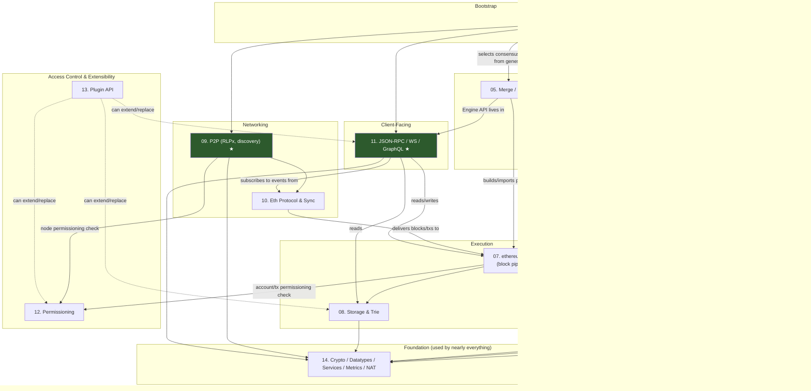

# Besu Internals — Architecture Reference

> A chapter-by-chapter technical deep dive into the internal implementation of Hyperledger Besu, based on the vendored source at [`_references/besu`](../../_references/besu) (pinned to the `hyperledger/besu:26.8.1` line this repo runs, per `docker-compose.yml`). Each chapter was produced by reading the actual Java source — classes, packages, and file paths cited throughout are real, not inferred from documentation or general Ethereum-client knowledge. Where the source was ambiguous or a feature turned out to be absent/removed, the relevant chapter says so explicitly rather than guessing.
>
> This is documentation of **Besu itself** — how the client is built internally. It is a companion to, not a replacement for, this repo's own operational docs: [`docs/architecture.md`](../architecture.md) (this project's own service architecture) and [`docs/Besu-config.md`](../Besu-config.md) (this project's Besu configuration reference, i.e. what flags/genesis fields *this repo* sets and why).

---

## How to read this

Each chapter is self-contained: a component diagram, one or more runtime-flow diagrams (mermaid `sequenceDiagram`/`flowchart`/`stateDiagram-v2`), a table of key classes with real file paths (relative to `_references/besu`), and — where relevant — a note on how that module connects to this repo's actual 4-validator QBFT testnet. Chapters cross-reference each other by number rather than repeating content.

**If you only read three chapters**, read these — they cover what this repo's testnet actually runs: **02** (QBFT, the consensus engine in use), **11** (JSON-RPC/WebSocket, what `mock-middleware` and `backend-api` talk to), and **07** (block processing pipeline, the core execution path). Chapters 04, 05, and parts of 03 document consensus modes and protocols this repo does **not** use (Clique, PoS/Engine API, IBFT-legacy) — read them for context on Besu's broader capability, not as descriptions of this deployment.

---

## Chapter index

### Consensus (`consensus/`)

| # | Chapter | Covers | Used by this repo? |
|---|---|---|---|
| [01](01-consensus-common.md) | BFT Consensus Common Infrastructure | Shared scaffolding (`consensus/common`, `consensus/qbft-core`) that QBFT/IBFT2 build on: validator/vote-tallying, extraData codec, the BFT event queue/timers | Indirectly — QBFT (02) is built on part of this |
| [02](02-consensus-qbft.md) | Consensus: QBFT | The full QBFT round-change state machine, message types, validator voting — **the consensus engine this repo's testnet runs** | **Yes — this repo's actual consensus** |
| [03](03-consensus-ibft.md) | Consensus: IBFT2 and IBFT-Legacy | IBFT2's round protocol and its differences from QBFT; IBFT-legacy's reduced (validation-only) structure | No |
| [04](04-consensus-clique.md) | Consensus: Clique (Proof of Authority) | Signer-rotation PoA, EIP-3436 fork choice — **mining/block-production for Clique has been removed from this vendored Besu build**; only historical-chain validation remains | No |
| [05](05-consensus-merge-pos.md) | Consensus: Post-Merge / Proof-of-Stake Integration | The Engine API (`engine_forkchoiceUpdated`/`getPayload`/`newPayload`), Besu's role as an execution client post-Merge | No |

### Execution & data model

| # | Chapter | Covers | Used by this repo? |
|---|---|---|---|
| [06](06-evm-execution.md) | EVM Execution Engine | The interpreter loop, gas metering, precompiles, CALL/CREATE semantics, fork/spec versioning | Yes — active at Berlin (`berlinBlock: 0`) |
| [07](07-ethereum-core.md) | `ethereum/core`: Block Data Model and the Block Processing Pipeline | Block/Transaction/Receipt structures, `Blockchain`, `ProtocolSchedule`/`ProtocolSpec`, the full block-import pipeline | Yes — the core execution path |
| [08](08-storage-trie.md) | State Storage and the Merkle Trie | The Merkle Patricia Trie, world-state storage strategies (Forest vs. **Bonsai**, the confirmed default; no Verkle support) | Yes — storage engine (ephemeral, no volume mount in this repo) |

### Networking

| # | Chapter | Covers | Used by this repo? |
|---|---|---|---|
| [09](09-p2p-networking.md) | P2P Networking | RLPx handshake/transport, discv4/v5 discovery, static-nodes/bootnodes — traces this repo's actual `network-config/static-nodes.json` end to end | Yes — 4 validators statically peered |
| [10](10-eth-protocol-sync.md) | Eth Subprotocol & Blockchain Synchronization | The eth wire protocol (**eth/68–71** in this vendored source), sync strategies (**FULL and SNAP only** — no separate "fast sync" mode), tx pool gossip, block propagation | Partially — small always-connected network, sync strategy largely moot |

### Client-facing API

| # | Chapter | Covers | Used by this repo? |
|---|---|---|---|
| [11](11-json-rpc-api.md) | The Client-Facing API Layer (`ethereum/api`) | HTTP JSON-RPC, WebSocket subscriptions, GraphQL, the RPC method registry/namespaces, JWT auth — **what `mock-middleware` and `backend-api`'s Explorer proxy actually talk to** | **Yes — this repo's primary Besu integration surface** |

### Access control & extensibility

| # | Chapter | Covers | Used by this repo? |
|---|---|---|---|
| [12](12-permissioning.md) | Node and Account Permissioning | Local-allowlist node/account permissioning — **onchain/smart-contract permissioning was removed in Besu 25.6.0** and is not present in this vendored source (see note below) | No — this repo deliberately runs without Besu-level permissioning (`docs/plan.md` D-17) |
| [13](13-plugin-api.md) | Plugin Framework | `BesuPlugin` lifecycle, the ~27 injectable service interfaces, ServiceLoader discovery, example plugins (health, RocksDB) | No — no custom plugins in this repo |

### Foundation modules

| # | Chapter | Covers | Used by this repo? |
|---|---|---|---|
| [14](14-crypto-datatypes-services.md) | Crypto, Datatypes, Services, Metrics, and NAT | SECP256K1/SECP256R1 signing, core value types (`Address`, `Wei`, `Hash`...), the `KeyValueStorage` service SPI, the metrics abstraction (Prometheus/OTel), NAT traversal | Partially — SECP256K1 signing, metrics abstraction in general use |
| [15](15-cli-bootstrap.md) | CLI Entrypoint and Node Bootstrap (`app` module) | `BesuCommand`, config precedence (CLI > env > TOML), the startup sequence that wires every other module together, and how genesis's `"qbft"` key drives consensus-module selection | Yes — traces this repo's actual `--genesis-file` → QBFT selection path |

---

## Architectural map

How the chapters above relate to each other, at the level of "what depends on what" (not exhaustive — see individual chapters for full detail):

★ = the three modules this repo's testnet actually exercises most directly (QBFT consensus, P2P/static-nodes peering, JSON-RPC/WebSocket as the sole integration surface for `mock-middleware` and `backend-api`).

---

## Cross-cutting findings worth knowing before you read further

These surfaced repeatedly while researching individual chapters and materially affect how to read this vendored source — collected here so they're not missed if you jump straight to a single chapter:

1. **Clique can no longer mine blocks.** Chapter 04 found that block production and all `clique_*` RPC methods were removed from this Besu build across Besu 25.x (`CliqueBesuControllerBuilder.createMiningCoordinator()` now always returns a no-op). Only validating pre-existing Clique-derived chains still works.
2. **Onchain/smart-contract permissioning has been removed.** Chapter 12 found no `SmartContractPermission*` classes anywhere in the source, and `TransactionValidationParams.checkOnchainPermissions()` is vestigial (always `false`). **This contradicts [`docs/Besu-config.md`](../Besu-config.md) §4.17**, which still documents onchain contract-based permissioning flags as available — that section is now stale against this repo's pinned Besu version and may be worth a follow-up correction.
3. **No BLS12-381 signing path exists.** Chapter 14 found `datatypes.BLSPublicKey`/`BLSSignature` are reserved types with zero references elsewhere in the tree — Besu is an execution client; QBFT validators (including this repo's 4) sign with ordinary SECP256K1 keys.
4. **No Verkle trie support.** Chapter 08 confirmed via full-tree grep — state storage is Merkle-Patricia-only, with **Bonsai** (flat KV + diff layers) as the confirmed default strategy over the older Forest strategy.
5. **The eth wire protocol in this source is eth/68–71, not eth/66/67**, and sync has exactly two modes (`FULL`, `SNAP`) — "fast sync" survives only as internal naming inside the snap-sync package, not a selectable third mode (Chapter 10).
6. **QBFT does not extend the same shared controller base class IBFT2 does.** Chapter 01/02 found `consensus/qbft-core` defines its own parallel `Qbft*`-prefixed type family over `QbftBlock`/`QbftBlockHeader` rather than extending `BaseBftController` the way IBFT2's `IbftController` does; a `BftEventHandlerAdaptor` bridges it back onto the shared event queue.
7. **Non-validator nodes still run the full BFT event pump.** Chapter 02 found `QbftBlockHeightManagerFactory` swaps in a `NoOpBlockHeightManager` for non-validator nodes (i.e. this repo's two RPC nodes) — same event loop, zero consensus participation.
8. **This repo's genesis (`berlinBlock: 0`, no later fork block) pins the protocol schedule at Berlin permanently** — Chapter 07 traced `MainnetProtocolSpecs`' milestone-buffering logic to confirm the schedule never advances past Berlin without an explicit later fork field. Practically: PUSH0 (Shanghai) and later opcodes are inactive; Solidity must be compiled with `--evm-version berlin` or below (Chapter 06).
9. **RPC servers start before the node has any peers.** Chapter 15 found `Runner.startExternalServices()` (JSON-RPC/GraphQL/WS/metrics) runs before `startEthereumMainLoop()` (P2P + sync) in the startup sequence.

---

## Related project docs

- [`docs/architecture.md`](../architecture.md) — this project's own service architecture (how `mock-middleware`, `backend-api`, `frontend`, and Besu fit together)
- [`docs/Besu-config.md`](../Besu-config.md) — this project's Besu configuration reference (flags/genesis fields this repo actually sets)
- [`docs/plan.md`](../plan.md) — locked design decisions (D-01–D-29) and risk register referenced throughout these chapters
