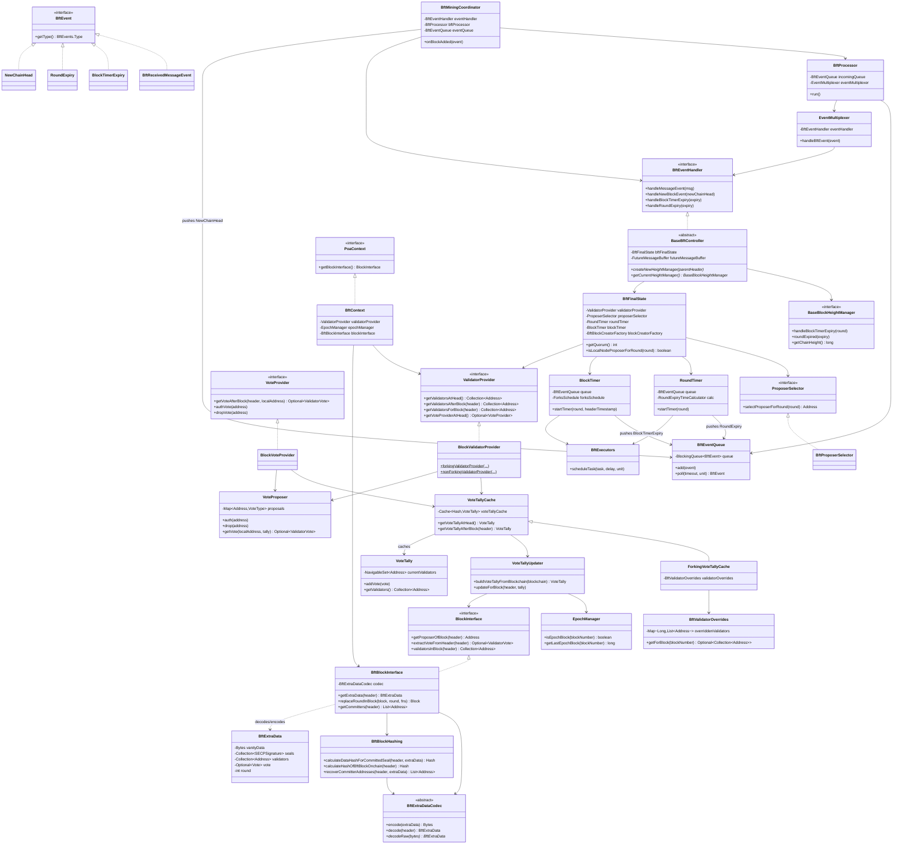
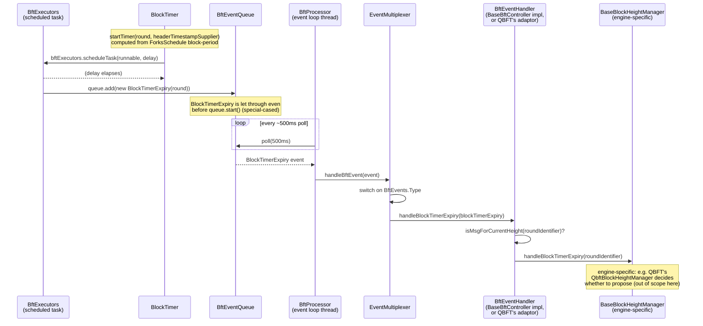
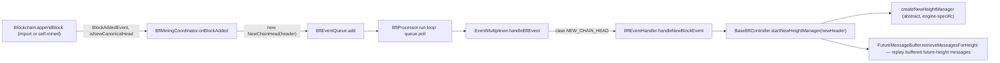

# 01 — BFT Consensus Common Infrastructure

> Source: `_references/besu/consensus/common` and `_references/besu/consensus/qbft-core`
> Scope: the shared scaffolding underneath Besu's BFT consensus engines (QBFT, IBFT2, IBFT-legacy). Round-change / proposal / prepare / commit logic for a specific engine is **not** covered here — see `consensus-qbft.md` and `consensus-ibft.md`.

---

## 1. What this layer is and why it exists

Besu ships three BFT-family consensus engines (QBFT, IBFT2, the deprecated IBFT-legacy) plus Clique (PoA, non-BFT). All of the BFT engines need the same non-negotiable plumbing: a way to track who the current validator set is and how it changes via on-chain votes, a way to encode that validator set (and round/seal data) into a block header's `extraData`, a way to turn wall-clock time into "propose now" / "round timed out" signals, and a single-threaded event loop that serialises network messages and timer expiries so the round state machine never has to worry about concurrency. `consensus/common` factors all of that out so QBFT and IBFT2 don't reimplement it twice, and so a future BFT variant (or Clique, for the parts it shares — vote tallying and `BlockInterface`) can reuse it. `consensus/qbft-core` sits one layer up: it is QBFT's engine-agnostic core (round/height state machine, message validation, payload types) built on top of `consensus/common`'s timers, events and network primitives, but expressed against QBFT's **own** `QbftBlock`/`QbftBlockHeader`/`QbftContext` type family rather than Besu's native `Block`/`BlockHeader`, so the QBFT protocol logic itself isn't hard-wired to Besu's block model. The bridge back to real Besu blocks, and the wiring that lets `consensus/common`'s generic event loop drive `qbft-core`'s state machine, lives in the separate `consensus/qbft` module (covered in `consensus-qbft.md`).

A useful way to read the package layout: `org.hyperledger.besu.consensus.common.validator(.blockbased)` is the **vote-tallying / validator-set** stack (chain-history driven, PoA-generic — also reused by Clique); `org.hyperledger.besu.consensus.common.bft` is the **BFT-specific** stack (event queue, timers, extra-data codec, block creation, network abstractions, and a legacy shared controller/state-machine base).

---

## 2. Component diagram

Two legacy-vs-modern branches worth calling out explicitly (verified by grep, not inferred):

- **IBFT2** (`consensus/ibft`): `IbftController extends BaseBftController` — it uses `consensus/common`'s shared `BftEventHandler`/`BaseBlockHeightManager` statemachine base directly.
- **QBFT** (`consensus/qbft`, which wraps `consensus/qbft-core`): does **not** extend `BaseBftController`. `qbft-core` defines its own parallel `QbftEventHandler`/`QbftFinalState`/`QbftContext`/`QbftValidatorProvider`/`QbftBlockInterface` types (working over `QbftBlock`/`QbftBlockHeader` instead of Besu's native `Block`/`BlockHeader`). `consensus/qbft` then supplies a `BftEventHandlerAdaptor implements BftEventHandler` that wraps a `QbftEventHandler`, so the same `BftProcessor` / `EventMultiplexer` / `BftEventQueue` / `BftMiningCoordinator` from `consensus/common` can still drive it. In other words: the **event loop and timers are fully shared**; the **height/round state machine base class is not** — QBFT reuses the primitives (`ConsensusRoundIdentifier`, `BlockTimer`, `RoundTimer`, event types, `MessageTracker`, `FutureMessageBuffer`, `ValidatorMulticaster`) but not `BaseBftController`/`BaseBlockHeightManager` themselves.

---

## 3. Runtime flow: block timer expiry → new block proposal trigger

This shows how a locally-running validator moves from "my block timer just fired" to the height manager being asked to act, using only shared-layer classes. This is the same queue/dispatch path a received network message or a new chain head takes (see `BftEventQueue.add`, `EventMultiplexer.handleBftEvent`) — only the concrete `*Type` and handler method differ.

For comparison, a mined block being appended to the local chain flows in the opposite direction and re-enters the same queue:

---

## 4. Key classes and interfaces

### Validator set / vote tallying — `org.hyperledger.besu.consensus.common.validator(.blockbased)`

| Class / interface | File (relative to `_references/besu`) | Responsibility |
|---|---|---|
| `ValidatorProvider` | `consensus/common/src/main/java/.../common/validator/ValidatorProvider.java` | Public read API for "who are the validators" (at head / after a given block / for a given block), and access to the `VoteProvider`. |
| `VoteProvider` | `.../common/validator/VoteProvider.java` | Lets the node operator queue an auth/drop vote and exposes the vote that should be embedded in the next block this node proposes. |
| `ValidatorVote` | `.../common/validator/ValidatorVote.java` | Immutable triple of (vote polarity, proposer, recipient) representing one cast vote. |
| `VoteType` | `.../common/validator/VoteType.java` | `ADD` / `DROP` enum. |
| `BlockValidatorProvider` | `.../common/validator/blockbased/BlockValidatorProvider.java` | Default chain-derived `ValidatorProvider` implementation; static factories `forkingValidatorProvider` / `nonForkingValidatorProvider` select whether validator-set overrides are honoured. |
| `VoteTally` *(package-private)* | `.../common/validator/blockbased/VoteTally.java` | In-memory tally of outstanding add/drop votes per subject address and the resulting current validator set; a vote takes effect once it crosses the `(size/2)+1` threshold. |
| `VoteProposer` *(package-private)* | `.../common/validator/blockbased/VoteProposer.java` | Holds this node's own pending auth/drop proposals and round-robins which one to embed in the next block header. |
| `VoteTallyCache` *(package-private)* | `.../common/validator/blockbased/VoteTallyCache.java` | Caches `VoteTally` by block hash; reconstructs a tally for an arbitrary header by walking back to the nearest epoch block (or cached ancestor) and replaying votes forward. |
| `ForkingVoteTallyCache` *(package-private)* | `.../common/validator/blockbased/ForkingVoteTallyCache.java` | `VoteTallyCache` subclass that lets a `BftValidatorOverrides` genesis/config entry force the validator set at a specific block number, short-circuiting normal vote replay. |
| `VoteTallyUpdater` *(package-private)* | `.../common/validator/blockbased/VoteTallyUpdater.java` | Applies one block's header (vote extraction + epoch-boundary reset) to a `VoteTally`; also builds one from scratch from the blockchain. |
| `BlockVoteProvider` *(package-private)* | `.../common/validator/blockbased/BlockVoteProvider.java` | `VoteProvider` implementation bridging `VoteTallyCache` + `VoteProposer`. |
| `BftValidatorOverrides` | `consensus/common/src/main/java/.../common/BftValidatorOverrides.java` | Simple `Map<Long, List<Address>>` of block-number → forced validator set, sourced from genesis config, for manual validator-set migrations. |
| `EpochManager` | `.../common/EpochManager.java` | Determines epoch-block boundaries (`isEpochBlock`, `getLastEpochBlock`); vote tallies reset at each epoch. |
| `BlockInterface` | `.../common/BlockInterface.java` | Engine-agnostic accessor interface for reading proposer/vote/validator-set data out of a `BlockHeader`; implemented per-consensus-family (BFT's implementation is `BftBlockInterface`; Clique has its own). |

### BFT extra-data / block encoding — `org.hyperledger.besu.consensus.common.bft`

| Class / interface | File | Responsibility |
|---|---|---|
| `BftExtraData` | `consensus/common/src/main/java/.../common/bft/BftExtraData.java` | Parsed representation of the BFT `extraData` field: vanity bytes, commit seals, optional vote, round number, validator list. |
| `BftExtraDataCodec` | `.../common/bft/BftExtraDataCodec.java` | Abstract RLP encode/decode contract for `BftExtraData`, with three encoding variants (full / without commit seals / without commit seals and round) used for different hashing purposes; concrete codec (QBFT vs IBFT2 wire format) is supplied by the consuming module. |
| `BftBlockInterface` | `.../common/bft/BftBlockInterface.java` | `BlockInterface` implementation for BFT chains: extracts proposer/vote/validator-set from a header via the codec, and can rebuild a block with a substituted round number. |
| `BftBlockHashing` | `.../common/bft/BftBlockHashing.java` | Computes the two block-hash variants BFT needs: the hash validators sign as a committed seal (seals excluded), and the canonical on-chain hash (seals *and* round excluded). |
| `BftBlockHeaderFunctions` | `.../common/bft/BftBlockHeaderFunctions.java` | `BlockHeaderFunctions` implementation wiring `BftBlockHashing` into Besu's generic header-hashing pipeline. |
| `Vote` | `.../common/bft/Vote.java` | Wire/header-serialisable form of a vote (recipient + add/drop byte), distinct from the business-logic `ValidatorVote`. |

### Event-driven engine scaffolding — `org.hyperledger.besu.consensus.common.bft` (+ `.events`, `.statemachine`)

| Class / interface | File | Responsibility |
|---|---|---|
| `BftEvent` | `consensus/common/src/main/java/.../common/bft/events/BftEvent.java` | Marker interface for anything that can be placed on the BFT event queue; exposes a `BftEvents.Type`. |
| `BftEvents` | `.../common/bft/events/BftEvents.java` | Holds the `Type` enum (`MESSAGE`, `ROUND_EXPIRY`, `NEW_CHAIN_HEAD`, `BLOCK_TIMER_EXPIRY`) and a `fromMessage(Message)` factory. |
| `BftReceivedMessageEvent` | `.../common/bft/events/BftReceivedMessageEvent.java` | Wraps an inbound p2p `Message` (a BFT protocol message from a peer). |
| `BlockTimerExpiry` | `.../common/bft/events/BlockTimerExpiry.java` | Fired when `BlockTimer`'s scheduled task elapses for a given round. |
| `RoundExpiry` | `.../common/bft/events/RoundExpiry.java` | Fired when `RoundTimer`'s scheduled task elapses for a given round (i.e. round-change timeout). |
| `NewChainHead` | `.../common/bft/events/NewChainHead.java` | Fired when the local blockchain's canonical head changes (own mined block or synced/imported block). |
| `BftEventQueue` | `.../common/bft/BftEventQueue.java` | Threadsafe, bounded `BlockingQueue<BftEvent>`; must be `start()`-ed before it accepts most events (a not-yet-started queue still accepts `BLOCK_TIMER_EXPIRY` so a pending timer isn't silently dropped). |
| `BftProcessor` | `.../common/bft/BftProcessor.java` | `Runnable` event loop: repeatedly polls `BftEventQueue` (500ms timeout) and dispatches to `EventMultiplexer`; owns start/stop/await-stop lifecycle on a dedicated thread. |
| `EventMultiplexer` | `.../common/bft/EventMultiplexer.java` | Switches on `BftEvent.getType()` and calls the matching `BftEventHandler` method; isolates the processor loop from exceptions thrown while handling an event. |
| `BftEventHandler` | `.../common/bft/statemachine/BftEventHandler.java` | The four-method contract (`handleMessageEvent`, `handleNewBlockEvent`, `handleBlockTimerExpiry`, `handleRoundExpiry`) plus `start`/`stop`, that any consensus engine's controller must satisfy to be driven by `BftProcessor`/`EventMultiplexer`. |
| `BaseBftController` | `.../common/bft/statemachine/BaseBftController.java` | Abstract `BftEventHandler` implementation providing shared height/round bookkeeping (duplicate-message filtering via `MessageTracker`, future-height buffering via `FutureMessageBuffer`, gossiping accepted messages via `Gossiper`); leaves `createNewHeightManager` / `getCurrentHeightManager` / `stopCurrentHeightManager` / `handleMessage` abstract. Used directly by IBFT2's `IbftController`. |
| `BaseBlockHeightManager` | `.../common/bft/statemachine/BaseBlockHeightManager.java` | Minimal interface (`handleBlockTimerExpiry`, `roundExpired`, `getChainHeight`, `getParentBlockHeader`) that `BaseBftController` delegates per-height work to. |
| `FutureMessageBuffer<T>` | `.../common/bft/statemachine/FutureMessageBuffer.java` | Bounded (by message count *and* total byte size) buffer for BFT messages that target a chain height above the current one, replayed once that height becomes current. |
| `BlockTimer` | `.../common/bft/BlockTimer.java` | Schedules the "time to try proposing a block" expiry based on the fork's configured block period (and empty-block period), pushing `BlockTimerExpiry` onto the queue. |
| `RoundTimer` | `.../common/bft/RoundTimer.java` | Schedules the round-change timeout for a `ConsensusRoundIdentifier`, pushing `RoundExpiry` onto the queue. Expiry duration comes from `RoundExpiryTimeCalculator`. |
| `RoundExpiryTimeCalculator` / `BftRoundExpiryTimeCalculator` | `.../common/bft/RoundExpiryTimeCalculator.java`, `BftRoundExpiryTimeCalculator.java` | Strategy for computing how long a given round should be allowed to run before expiring (grows with round number). |
| `BftExecutors` | `.../common/bft/BftExecutors.java` | Owns the executor/scheduler services `BlockTimer`, `RoundTimer` and `BftProcessor` schedule work on; lifecycle-managed by `BftMiningCoordinator`. |
| `ConsensusRoundIdentifier` | `.../common/bft/ConsensusRoundIdentifier.java` | `(sequence, round)` pair identifying chain height + round-attempt number; `Comparable` and RLP-serialisable. |
| `BftFinalState` | `.../common/bft/statemachine/BftFinalState.java` | Aggregates the read-mostly context a round needs: `ValidatorProvider`, node key/address, `ProposerSelector`, `ValidatorMulticaster`, `RoundTimer`, `BlockTimer`, `BftBlockCreatorFactory`, quorum calculation. |
| `ProposerSelector` / `BftProposerSelector` | `.../common/bft/blockcreation/ProposerSelector.java`, `BftProposerSelector.java` | Deterministically picks which validator proposes a given `(sequence, round)`, based on the previous block's proposer and the (possibly-changed) validator list — round-robins, with special handling if the previous proposer dropped out of the set. |
| `BftBlockCreator` / `BftBlockCreatorFactory<T>` | `.../common/bft/blockcreation/BftBlockCreator.java`, `BftBlockCreatorFactory.java` | Builds a candidate block for a round, including constructing the `BftExtraData` (vanity, pending vote, round, validator list) for the new header. |
| `BftMiningCoordinator` | `.../common/bft/blockcreation/BftMiningCoordinator.java` | Top-level `MiningCoordinator`; owns `BftProcessor`/`BftExecutors` lifecycle (`start`/`stop`/`enable`/`disable`, sync-aware pausing), and is the `BlockAddedObserver` that turns a new canonical head into a `NewChainHead` event. |
| `Gossiper` / `ValidatorMulticaster` / `UniqueMessageMulticaster` / `ValidatorPeers` | `.../common/bft/Gossiper.java`, `.../common/bft/network/*.java` | Peer-messaging abstractions: re-broadcast an accepted message (`Gossiper`), send to all validators (`ValidatorMulticaster`), de-duplicate outbound sends (`UniqueMessageMulticaster`), and track validator↔peer-connection mapping (`ValidatorPeers`). |
| `MessageTracker` | `.../common/bft/MessageTracker.java` | Fixed-size seen-message cache used by `BaseBftController` to drop duplicate inbound messages. |
| `BftContext` | `.../common/bft/BftContext.java` | `PoaContext`/`ConsensusContext` implementation exposing `ValidatorProvider`, `EpochManager` and `BftBlockInterface` to the rest of Besu (block validation rules, RPC methods) via `ProtocolContext.getConsensusContext(BftContext.class)`. |
| `PoaContext` | `consensus/common/src/main/java/.../common/PoaContext.java` | Narrow `ConsensusContext` interface exposing just `getBlockInterface()`, implemented by `BftContext` (and Clique's own context). |
| `MigratingConsensusContext` / `MigratingProtocolContext` / `MigratingMiningCoordinator` | `consensus/common/src/main/java/.../common/Migrating*.java` | Support for a single chain transitioning between consensus mechanisms at a configured fork block (e.g. IBFT2 → QBFT) by switching the active `ConsensusContext`/`ProtocolContext`/`MiningCoordinator` via a `ForksSchedule<ConsensusContext>`. |
| `ForksSchedule<C>` / `ForkSpec<C>` | `.../common/ForksSchedule.java`, `ForkSpec.java` | Generic block-number/timestamp-keyed schedule of config objects (BFT config options, or in the migrating case, whole `ConsensusContext`s), returning the applicable value for a given block. |
| `BftValidatorsValidationRule`, `BftCommitSealsValidationRule`, `BftCoinbaseValidationRule`, `BftVanityDataValidationRule` | `.../common/bft/headervalidationrules/*.java` | `AttachedBlockHeaderValidationRule` implementations plugged into the protocol schedule to check, respectively: validator list matches the tracked tally and is sorted; commit seals meet quorum and come from known validators; coinbase/proposer is valid; vanity data length. |
| `BaseBftProtocolScheduleBuilder` / `BftProtocolSchedule` | `.../common/bft/BaseBftProtocolScheduleBuilder.java`, `BftProtocolSchedule.java` | Shared construction of the `ProtocolSchedule` (block import/validation pipeline) common to all BFT engines, parameterised per-fork by `BftConfigOptions`. |
| `BftHelpers` | `.../common/bft/BftHelpers.java` | Static helpers: quorum math (`2f+1`, i.e. `ceil(2n/3)`), future-round-change quorum, and sealing a block with commit seals into final `BftExtraData`. |

### QBFT-core's parallel abstraction — `org.hyperledger.besu.consensus.qbft.core.types` (selected)

`qbft-core` reuses the shared timers/events/network primitives above as-is, but defines its own engine-facing type family rather than implementing `consensus/common`'s `BftEventHandler`/`BftContext`/`ValidatorProvider`/`BlockInterface` directly:

| Class / interface | File (relative to `_references/besu`) | Responsibility |
|---|---|---|
| `QbftEventHandler` | `consensus/qbft-core/src/main/java/.../qbft/core/types/QbftEventHandler.java` | QBFT's own analogue of `BftEventHandler` (same four dispatch methods, QBFT-typed parameters); implemented by `QbftController`. |
| `QbftController` | `.../qbft/core/statemachine/QbftController.java` | QBFT's own analogue of `BaseBftController` — height-manager lifecycle, duplicate/future-message handling — but a standalone class, not a `BaseBftController` subclass. |
| `QbftContext` | `.../qbft/core/types/QbftContext.java` | QBFT's own `ConsensusContext`, pairing a `QbftValidatorProvider` and `QbftBlockInterface`; does not implement `PoaContext`. |
| `QbftFinalState` | `.../qbft/core/types/QbftFinalState.java` | QBFT's analogue of `BftFinalState`; still directly reuses `consensus/common`'s `RoundTimer`, `BlockTimer` and `ValidatorMulticaster` types. |
| `QbftValidatorProvider` | `.../qbft/core/types/QbftValidatorProvider.java` | Cut-down `ValidatorProvider` analogue expressed over `QbftBlockHeader`. |
| `QbftBlockInterface` | `.../qbft/core/types/QbftBlockInterface.java` | QBFT analogue of `BftBlockInterface`, expressed over `QbftBlock`/`QbftBlockHeader` rather than Besu's native `Block`/`BlockHeader`. |

---

## 5. Used by

- **`consensus/ibft` (IBFT2)** — covered in `consensus-ibft.md`. Extends this layer directly and conventionally: `IbftController extends BaseBftController`, and it is expected to supply its own `BaseIbftBlockHeightManager` (implementing `BaseBlockHeightManager`), its own `BftExtraDataCodec`, and reuse `BlockTimer`/`RoundTimer`/`BftEventQueue`/`BftMiningCoordinator`/`BlockValidatorProvider` unchanged.
- **`consensus/qbft` + `consensus/qbft-core`** — covered in `consensus-qbft.md`. `qbft-core` builds its round/height state machine and message validation on top of this layer's timers, event types, `ConsensusRoundIdentifier`, `MessageTracker`, `FutureMessageBuffer` and network abstractions, but through its own `Qbft*`-prefixed type family (see §4 above) rather than by extending `BaseBftController`/`BftEventHandler` directly. `consensus/qbft` is the adaptation layer: it supplies the concrete `BftExtraDataCodec`, binds `QbftBlock`/`QbftBlockHeader` to Besu's real `Block`/`BlockHeader`, and bridges `QbftEventHandler` back into `BftEventHandler` (via `BftEventHandlerAdaptor`) so `BftProcessor`/`EventMultiplexer`/`BftMiningCoordinator` can drive it unmodified.
- **`consensus/clique`** — not a BFT engine and does not use the `.bft` package (no `BftEventQueue`/timers/`BaseBftController`), but it directly reuses the vote-tallying half of this layer: `CliqueContext` implements `PoaContext` (confirmed via `consensus/clique/src/main/java/.../clique/CliqueContext.java`), and Clique's validator-set/vote logic is built on the same `org.hyperledger.besu.consensus.common.validator` (`BlockValidatorProvider`, etc.) machinery documented in §4, with its own `CliqueBlockInterface`/`CliqueProposerSelector` replacing `BftBlockInterface`/`BftProposerSelector`. See `consensus-clique.md` for how Clique's own extra-data format and validation rules differ from the BFT ones documented here.
