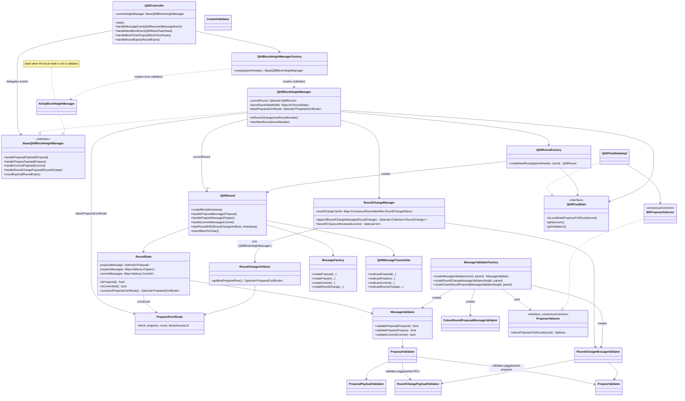
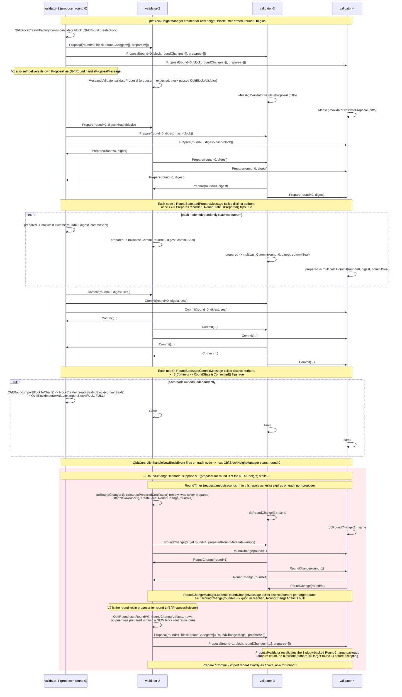
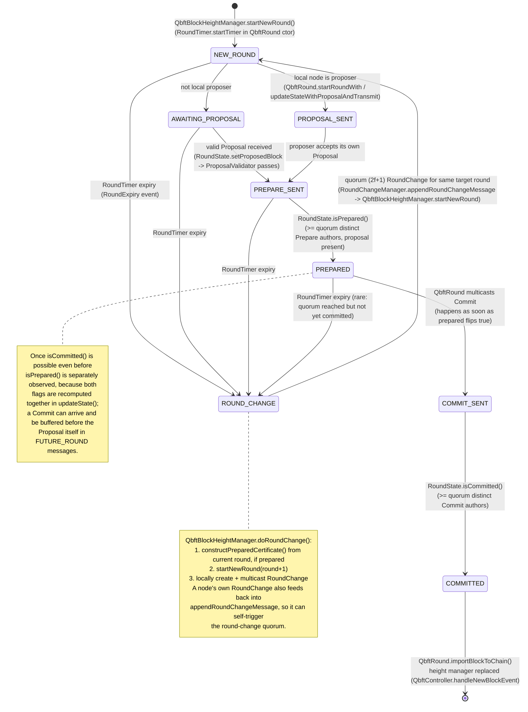

# 02 — Consensus: QBFT

> Source read: `_references/besu/consensus/qbft/src/main/java/**` and
> `_references/besu/consensus/qbft-core/src/main/java/**` (Besu source vendored in this repo).
> This is the consensus engine this project actually runs — `network-config/genesis.json` configures
> `config.qbft` with 4 validators, `blockperiodseconds: 2`, `requesttimeoutseconds: 4`,
> `epochlength: 30000` (see `docs/Besu-config.md` §3). No other consensus chapter gets this level of
> detail; this one earns it.

---

## 1. Overview

QBFT (Quorum Byzantine Fault Tolerant) is Besu's second-generation IBFT-family consensus algorithm — a
round-based, leader-driven BFT protocol tolerating `f` Byzantine validators out of `n = 3f + 1` total
(this repo runs `n = 4`, so `f = 1`; see `docs/Besu-config.md` §5). Each block height is driven through
one or more **rounds**: a round has a single **proposer** (deterministically selected by round-robin),
who broadcasts a candidate block; validators exchange `Prepare` and `Commit` votes; once `2f + 1`
(quorum) validators have prepared and committed, the block is sealed and imported. If a round's proposer
is unresponsive or byzantine, a timer expires and validators broadcast `RoundChange` — once `2f + 1`
validators agree to move to the same next round, a new proposer takes over, optionally re-proposing a
block another validator had already prepared (this is what makes QBFT **safe** across round changes,
not just live).

QBFT superseded IBFT2 (`consensus/ibft`) in Besu primarily to fix formally-verified safety gaps in
IBFT2's round-change justification (the piggy-backed `RoundChange`/`Prepare` certificate logic here is
stricter and was specified independently) and to support **validator-selection via a smart contract**
in addition to the original genesis-`extraData`/on-chain-vote model. The two algorithms are otherwise
structurally very similar (same message shapes, same round-based state machine) — this chapter does not
re-derive IBFT2, only notes divergence where relevant.

Besu splits the QBFT implementation across two Gradle modules:

- **`consensus/qbft-core`** — the actual QBFT algorithm: round/height state machines, message
  validators, message wrapper/payload (RLP) types. This code is written entirely against abstract
  `Qbft*` interfaces (`QbftBlock`, `QbftBlockchain`, `QbftBlockCreator`, …) and has **no dependency on
  Besu's concrete `Block`/`Blockchain`/`ProtocolContext` types**. This is the layer traced in depth
  below (sections 2–4).
- **`consensus/qbft`** (this chapter's nominal directory) — the **adaptor layer** that wires
  `qbft-core`'s abstractions to real Besu types (`org.hyperledger.besu.consensus.qbft.adaptor.*`), plus
  everything genesis/config/validator-set specific: `QbftExtraDataCodec`, `QbftProtocolScheduleBuilder`,
  `QbftBlockHeaderValidationRulesetFactory`, the validator-provider implementations, and the
  `qbft_*` JSON-RPC methods.

Both modules depend on **`consensus/common`** for BFT scaffolding shared with IBFT2 and Clique
(`ConsensusRoundIdentifier`, `RoundTimer`/`BlockTimer`, `BftExtraData`/`BftExtraDataCodec`,
`ProposerSelector`/`BftProposerSelector`, `EpochManager`, `Vote`/`VoteTally`, the `BftEventHandler` /
`BftProcessor` event pump). See the sibling chapter `01-consensus-common.md` for that layer in general;
section 7 below lists exactly which pieces of it QBFT pulls in.

---

## 2. Component / Class Diagram



---

## 3. Sequence Diagram — One Full Round, Across This Project's 4 Validators

This traces the happy path for one block on this repo's 4-validator network (`besu-validator-1..4`),
then a round-change caused by a proposer timeout. Quorum for `n=4` is
`BftHelpers.calculateRequiredValidatorQuorum(4)` = `ceil(2*4/3)` = **3** (`2f+1` with `f=1`).



Two details the diagram simplifies:

- **Message delivery is gossiped, not all-to-all.** `QbftGossiperImpl` (`consensus/qbft/network`)
  rebroadcasts every valid message to all other known validators except the original sender and the
  message's author, so in practice each node also receives duplicates via relay — `QbftController`
  drops these via `MessageTracker` (`duplicateMessageTracker.hasSeenMessage`).
- **If the round-change quorum instead includes a `PreparedCertificate`** (i.e. some validator *did*
  reach `prepared` in a prior round before the timeout), `RoundChangeArtifacts.create` picks the
  round-change with the **highest prepared round** among the quorum and the new proposer re-proposes
  *that* block (via `QbftBlockInterface.replaceRoundAndProposerForProposalBlock`, which — despite the
  name — only rewrites the round number, not the coinbase, to stay wire-compatible) instead of building
  a fresh one. This is the core QBFT safety property: a block a quorum could have committed is never
  silently discarded by a round change.

---

## 4. Round State Machine

Besu's QBFT implementation does **not** encode round state as a named enum (there is no `NEW_ROUND` /
`PREPARED` / `COMMITTED` type in the source). Instead:

- `RoundState` (`consensus/qbft-core/.../statemachine/RoundState.java`) tracks two booleans, `prepared`
  and `committed`, recomputed on every message via `updateState()` from the count of distinct-author
  `Prepare`/`Commit` messages against `quorum`.
- `QbftBlockHeightManager.MessageAge` (`PRIOR_ROUND` / `CURRENT_ROUND` / `FUTURE_ROUND`) is the one real
  enum in this area, and it classifies *incoming messages* relative to the currently active round, not
  the round's own lifecycle.
- Round progression itself is imperative: `QbftBlockHeightManager.startNewRound()` /
  `doRoundChange()` mutate `currentRound` and discard stale entries from
  `futureRoundStateBuffer` / `RoundChangeManager`.

The diagram below is therefore a **conceptual** state machine (matching the classic IBFT/QBFT
specification's terminology), with each state annotated with the actual Besu mechanism that implements
it:



Two implementation subtleties worth flagging explicitly:

- **Messages for a round that hasn't started yet are buffered, not dropped.** `QbftBlockHeightManager`
  keeps a `futureRoundStateBuffer: Map<Integer, RoundState>` — `Prepare`/`Commit` for a future round are
  validated against a `RoundState` created ahead of time and folded in once that round actually starts
  (`startNewRound` promotes the buffered `RoundState` instead of creating a fresh one).
- **`RoundChangeManager` supports an optional "early round change" mode** (`isEarlyRoundChangeEnabled`,
  wired via `QbftBlockHeightManagerFactory`, off by default) where `f+1` (not `2f+1`) `RoundChange`
  messages targeting a higher round are enough to preemptively jump forward
  (`RoundChangeManager.futureRCQuorumReceived`, quorum = `BftHelpers.calculateRequiredFutureRCQuorum` =
  `⌊(n-1)/3⌋+1` = **2** for this repo's `n=4`) — this is a liveness optimization to avoid waiting out a
  full timeout when it's already clear from `f+1` honest signals that the round has moved on.

---

## 5. Key Classes / Interfaces

### `consensus/qbft-core` — the algorithm

| Class / Interface | File | Responsibility |
|---|---|---|
| `QbftController` | `statemachine/QbftController.java` | Top-level event dispatcher (`QbftEventHandler`): routes decoded messages, block-timer/round-timer expiries, and new-chain-head events to the current `BaseQbftBlockHeightManager`; owns `MessageTracker`-based dedup and the future-height message buffer. |
| `BaseQbftBlockHeightManager` | `statemachine/BaseQbftBlockHeightManager.java` | Interface for "the thing managing consensus at one block height." |
| `QbftBlockHeightManager` | `statemachine/QbftBlockHeightManager.java` | The real implementation: owns the current `QbftRound`, the `RoundChangeManager`, drives round start/round-change, and decides whether a node proposes based on `QbftFinalState.isLocalNodeProposerForRound`. |
| `NoOpBlockHeightManager` | `statemachine/NoOpBlockHeightManager.java` | Used when the local node is **not** a validator — swallows all consensus events; the node still tracks chain height but never participates. |
| `QbftBlockHeightManagerFactory` | `statemachine/QbftBlockHeightManagerFactory.java` | Chooses `QbftBlockHeightManager` vs. `NoOpBlockHeightManager` based on `finalState.isLocalNodeValidator()`; wires up `RoundChangeManager` with quorum figures from `BftHelpers`. |
| `QbftRoundFactory` | `statemachine/QbftRoundFactory.java` | Builds a `QbftRound` for a given round number (or from a buffered `RoundState`), wiring in a fresh `QbftBlockCreator` and `QbftMessageTransmitter`. |
| `QbftRound` | `statemachine/QbftRound.java` | Behavior for **one round attempt**: creating/re-proposing a block, sending/handling `Proposal`/`Prepare`/`Commit`, constructing commit seals, and triggering block import once `RoundState.isCommitted()`. |
| `RoundState` | `statemachine/RoundState.java` | Pure bookkeeping for one round: the accepted `Proposal`, deduplicated `Prepare`/`Commit` maps keyed by author address, and the `prepared`/`committed` quorum flags. |
| `RoundChangeManager` | `statemachine/RoundChangeManager.java` | Collects `RoundChange` messages per target round (`RoundChangeStatus`, one message per author), returns a certificate once quorum is hit; also does diagnostic "which round is each validator on" logging when the chain appears stalled. |
| `RoundChangeArtifacts` | `statemachine/RoundChangeArtifacts.java` | Post-processes a quorum of `RoundChange` messages into the `List<SignedData<RoundChangePayload>>` to piggy-back on the next `Proposal`, plus the single `PreparedCertificate` (highest prepared round, if any) that must be re-proposed. |
| `PreparedCertificate` | `statemachine/PreparedCertificate.java` | Immutable bundle: a block + the `Prepare` quorum that justified it + the round it was prepared in — proof a quorum *could* have committed this block. |
| `MessageFactory` | `payload/MessageFactory.java` | Signs and constructs every outbound message type (`Proposal`/`Prepare`/`Commit`/`RoundChange`) using this node's `NodeKey`; also supports a legacy (pre-26.1.0) wire-encoding mode omitting the Block Access List field. |
| `QbftMessageTransmitter` | `network/QbftMessageTransmitter.java` | Thin wrapper: builds a message via `MessageFactory` then hands it to the `ValidatorMulticaster` (from `consensus/common`) to actually send over devp2p. |
| `MessageValidator` | `validation/MessageValidator.java` | Per-round gatekeeper: validates the (single) `Proposal`, then hands off to a `SubsequentMessageValidator` (bound to the accepted block's hash) for all later `Prepare`/`Commit`. |
| `MessageValidatorFactory` | `validation/MessageValidatorFactory.java` | Builds `MessageValidator` / `RoundChangeMessageValidator` / `FutureRoundProposalMessageValidator` instances bound to a specific round + parent header + validator set + `ProposerSelector`. |
| `ProposalValidator` / `ProposalPayloadValidator` | `validation/*.java` | Checks: author is the expected round-robin proposer, round/height match, block passes `QbftBlockValidator`, round-0 proposals carry no piggy-backed round-changes/prepares, round>0 proposals' piggy-backed `RoundChange` set has quorum + consistent prepared-round metadata + (if applicable) a valid `Prepare` quorum for the reused block. |
| `PrepareValidator` / `CommitValidator` | `validation/*.java` | Author is a known validator, round/height matches, digest matches the accepted proposal's block hash; `CommitValidator` additionally recovers the commit-seal signer address and checks it equals the message author. |
| `RoundChangeMessageValidator` / `RoundChangePayloadValidator` | `validation/*.java` | Author known + correct height/round range (`1..1000`); if a block is piggy-backed, it must pass `QbftBlockValidator` and its `Prepare` quorum must independently validate. |
| `FutureRoundProposalMessageValidator` | `validation/FutureRoundProposalMessageValidator.java` | Lets `QbftBlockHeightManager` validate a `Proposal` for a round it hasn't started yet *before* jumping into that round (prevents an attacker forcing a round jump with an invalid proposal). |
| `Proposal` / `Prepare` / `Commit` / `RoundChange` | `messagewrappers/*.java` | RLP-encodable message wrappers (extend common `BftMessage<P>`); `Proposal` carries the block + piggy-backed round-changes/prepares, `RoundChange` optionally carries a previously-prepared block + its prepares. |
| `ProposalPayload` / `PreparePayload` / `CommitPayload` / `RoundChangePayload` / `PreparedRoundMetadata` | `payload/*.java` | The signed payload bodies (round identifier + type-specific fields); `RoundChangePayload` embeds `Optional<PreparedRoundMetadata>` (prepared block hash + prepared round) as its round-change justification. |
| `QbftV1` | `messagedata/QbftV1.java` | Wire message codes: `PROPOSAL=0x12`, `PREPARE=0x13`, `COMMIT=0x14`, `ROUND_CHANGE=0x15`. |

### `consensus/qbft` — Besu integration / genesis / voting

| Class / Interface | File | Responsibility |
|---|---|---|
| `QbftExtraDataCodec` | `QbftExtraDataCodec.java` | RLP codec for the QBFT `extraData` structure (vanity, validators, vote, round, seals); `createGenesisExtraDataString` is what `besu operator generate-blockchain-config` uses to build this project's `genesis.json` `extraData`. |
| `QbftProtocolScheduleBuilder` | `QbftProtocolScheduleBuilder.java` | Assembles the `BftProtocolSchedule`, including the QBFT-specific block header validation ruleset. |
| `QbftBlockHeaderValidationRulesetFactory` | `QbftBlockHeaderValidationRulesetFactory.java` | Builds the `BlockHeaderValidator`: ancestry, gas usage/limit, timestamp, fixed `MixHash`/`Difficulty`, `QbftValidatorsValidationRule`, `BftCoinbaseValidationRule`, `BftCommitSealsValidationRule`, and (if `blockperiodseconds >= 1`) `TimestampMoreRecentThanParent`. |
| `QbftValidatorsValidationRule` | `headervalidationrules/QbftValidatorsValidationRule.java` | In contract-validator mode, asserts `extraData`'s validators/vote are **empty** (contract is authoritative); otherwise delegates to `consensus/common`'s `BftValidatorsValidationRule`. |
| `QbftBlockCreatorFactory` | `blockcreation/QbftBlockCreatorFactory.java` | Extends the common `BftBlockCreatorFactory`; overrides `createExtraData` to omit validators/vote from a proposed block's `extraData` when validator-contract mode is active for that fork. |
| `adaptor/*` (`BftEventHandlerAdaptor`, `QbftBlockCreatorAdaptor`, `QbftBlockImporterAdaptor`, `QbftBlockValidatorAdaptor`, `QbftBlockInterfaceAdaptor`, `QbftBlockchainAdaptor`, `QbftFinalStateImpl`, `QbftValidatorProviderAdaptor`, …) | `adaptor/*.java` | Bidirectional adaptors between `qbft-core`'s abstract `Qbft*` types and Besu's concrete `Block`/`Blockchain`/`BlockImporter`/`BlockValidator`/`ProtocolContext`/`ValidatorProvider`. This is the entire "glue" layer — `qbft-core` never imports a concrete Besu ethereum type directly. |
| `ForkingValidatorProvider` | `validator/ForkingValidatorProvider.java` | Picks, per block/fork, between block-based (`BlockValidatorProvider`) and contract-based (`TransactionValidatorProvider`) validator resolution, per `ForksSchedule<QbftConfigOptions>.isValidatorContractMode()`. |
| `TransactionValidatorProvider` / `ValidatorContractController` | `validator/*.java` | Reads the validator set by `eth_call`-ing a configured validator-management contract (`config.qbft.validatorcontractaddress`) — **not used by this repo**, which has no `validatorcontractaddress` set (see `docs/Besu-config.md` §3). |
| `QbftJsonRpcMethods` + `jsonrpc/methods/Qbft*` | `jsonrpc/*.java` | Implements `qbft_getValidatorsByBlockNumber`, `qbft_proposeValidatorVote`, `qbft_discardValidatorVote`, `qbft_getPendingVotes`, `qbft_getSignerMetrics`, `qbft_getRequestTimeoutSeconds`. |
| `QbftGossiperImpl` | `network/QbftGossiperImpl.java` | Rebroadcasts a valid consensus message to all other known validators except the original sender and the message's author. |
| `Istanbul100SubProtocol` | `protocol/Istanbul100SubProtocol.java` | Registers the devp2p subprotocol (`"istanbul"`, version `100`) QBFT messages travel over. |

---

## 6. Validator Set: Genesis `extraData` and Voting

This repo's `network-config/genesis.json` has **no** `config.qbft.validatorcontractaddress` — so QBFT
runs in **block-based (vote) validator mode**, the default, resolved through
`ForkingValidatorProvider` → `BlockValidatorProvider` (`consensus/common/validator/blockbased`) rather
than `TransactionValidatorProvider`.

**How the 4 validators get into the genesis block:** `extraData` is an RLP list, decoded/encoded by
`QbftExtraDataCodec.decodeRaw`/`encode`:

```
[ vanityData(32 bytes), validators: [Address...], vote: [] | [recipient, ADD|DROP],
  round: int, seals: [Signature...] ]
```

This repo's genesis (`network-config/genesis.json`) was generated once via
`besu operator generate-blockchain-config` at network-creation time (per `docs/Besu-config.md`) and its
`extraData` decodes to exactly the 4 validator addresses whose private keys live under
`network-config/validator-keys/`, an empty vote, round `0`, and no commit seals (genesis blocks have
none — `BftCommitSealsValidationRule` isn't applied to block 0). `EpochManager`
(`consensus/common/EpochManager.java`) tracks `epochlength` (`30000` in this repo, unchanged from
default) purely to know when to reset **outstanding, uncommitted** votes — it never touches the
already-committed validator set.

**How validator voting works (implemented, though this repo's network never exercises it at runtime):**

1. An operator calls `qbft_proposeValidatorVote(address, add: true|false)` (`QbftProposeValidatorVote`,
   `consensus/qbft/jsonrpc/methods/`) or `qbft_discardValidatorVote` against **any node's** RPC — this
   only registers *local intent* via `VoteProvider`/`VoteProposer`, it does not itself change anything
   on-chain.
2. The next time **that node** is the round's proposer, its `QbftBlockCreatorFactory` (via the common
   `BftBlockCreatorFactory`) embeds one pending vote — recipient address + `ADD`/`DROP` — into the
   proposed block's `extraData`, with the proposer's own address as the block's coinbase.
3. Every node's `BlockValidatorProvider` → `VoteTally` (`consensus/common/validator/blockbased/VoteTally.java`)
   observes every sealed block's `(coinbase, extraData.vote)` pair and tallies votes-by-subject. Once a
   subject has `>= (currentValidatorCount / 2) + 1` **distinct-proposer** `ADD` votes, it's added to the
   validator set; the same threshold for `DROP` removes it. Reaching threshold immediately discards all
   other outstanding votes for that subject (`VoteTally.discardOutstandingVotesFor`).
4. `QbftValidatorsValidationRule` (block-based branch) delegates to the common
   `BftValidatorsValidationRule`, which re-derives the expected validator set the same way and rejects
   any block whose `extraData.validators` list disagrees.
5. `BftProposerSelector` (`consensus/common/bft/blockcreation/BftProposerSelector.java`) recomputes the
   round-robin proposer order from whatever the **current** validator set is after every block —
   dropping or adding a validator immediately reshuffles round-robin order, it isn't queued for the next
   epoch. `QbftBlockHeightManager.logValidatorChanges` logs (at `INFO`) whenever the resolved validator
   set actually differs from the parent block's.

Because this repo never issues a `qbft_proposeValidatorVote` call in its documented workflows, the
validator set stays fixed at the 4 genesis addresses for the network's whole lifetime — but the
machinery above is fully live and would react correctly if an operator did call it.

---

## 7. Dependencies on `consensus/common` and Module Boundaries

**On `consensus/common` (see `01-consensus-common.md` for the general treatment):**

| What QBFT uses | Class | Purpose here |
|---|---|---|
| Round identity | `ConsensusRoundIdentifier` | `(sequence, round)` pair keying every message, `RoundState`, and the `futureRoundStateBuffer`. |
| Timers | `RoundTimer`, `BlockTimer`, `BftExecutors` | `RoundTimer` drives round-change timeouts (`requesttimeoutseconds`); `BlockTimer` paces empty/non-empty block production (`blockperiodseconds`, `emptyblockperiodseconds`). |
| Proposer election | `ProposerSelector` / `BftProposerSelector` | Round-robin proposer selection off the previous block's proposer + validator list; `MessageValidatorFactory`, `ProposalValidator`, and `QbftFinalStateImpl` all consume it. |
| Quorum math | `BftHelpers` | `calculateRequiredValidatorQuorum` (`2f+1`) and `calculateRequiredFutureRCQuorum` (`f+1`, early-round-change mode) used throughout `qbft-core`'s statemachine/validation packages. |
| Extra-data model | `BftExtraData`, `BftExtraDataCodec`, `Vote` | `QbftExtraDataCodec` extends `BftExtraDataCodec` directly; `Vote`/`VoteType` are the shared vote representation embedded in `extraData`. |
| Validator/vote tracking | `ValidatorProvider`, `VoteProvider`, `blockbased.{VoteTally,VoteProposer,BlockValidatorProvider}` | The block-based (non-contract) validator-set resolution path described in §6. |
| Event plumbing | `BftEventHandler`, `BftProcessor`, `BftEventQueue`, `EventMultiplexer`, `MessageTracker`, `FutureMessageBuffer` | `BftEventHandlerAdaptor` (`consensus/qbft/adaptor`) makes `QbftController` (a `QbftEventHandler`) pluggable into this shared event pump; `MessageTracker`/`FutureMessageBuffer` do duplicate-suppression and future-height buffering respectively, both reused as-is by `QbftController`. |
| Network | `ValidatorMulticaster`, `ValidatorPeers`, `UniqueMessageMulticaster` | `QbftMessageTransmitter` and `QbftGossiperImpl` both send through a `ValidatorMulticaster` rather than talking to devp2p directly. |
| Header validation building blocks | `BftCoinbaseValidationRule`, `BftCommitSealsValidationRule`, `BftValidatorsValidationRule` | Reused unmodified by `QbftBlockHeaderValidationRulesetFactory`; only `QbftValidatorsValidationRule` adds QBFT-specific contract-mode branching on top. |
| Epoch bookkeeping | `EpochManager` | Resets outstanding (not-yet-actioned) votes at `epochlength` boundaries. |

**On `consensus/qbft-core` (this module *is* `consensus/qbft-core`'s primary consumer):** everything
in §5's first table — the round/height state machines, all message validators, and all message/payload
types are implemented there against abstract interfaces. `consensus/qbft`'s job is exclusively to
provide concrete implementations of those interfaces (the `adaptor` package) plus everything that must
know about Besu's genesis/config/JSON-RPC surface, which `qbft-core` deliberately has no visibility into.

**Not used by this repo:** `TransactionValidatorProvider` / `ValidatorContractController`
(contract-based validator mode — this repo has no `validatorcontractaddress`), and the
early-round-change / `rcQuorum` path in `RoundChangeManager` (`isEarlyRoundChangeEnabled` defaults
`false` and this repo doesn't configure it on).
