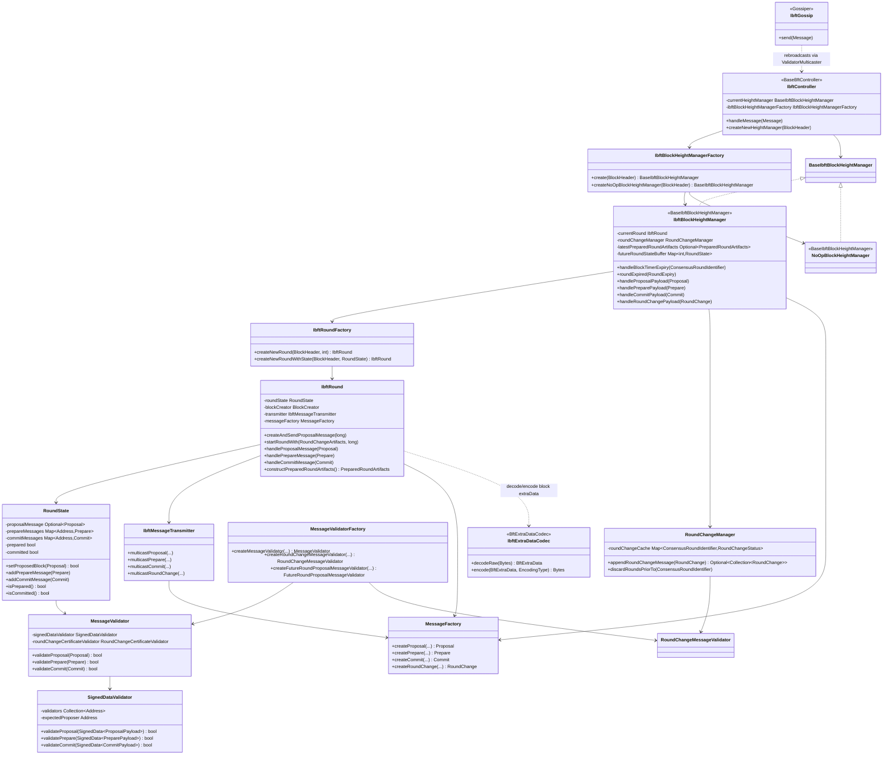
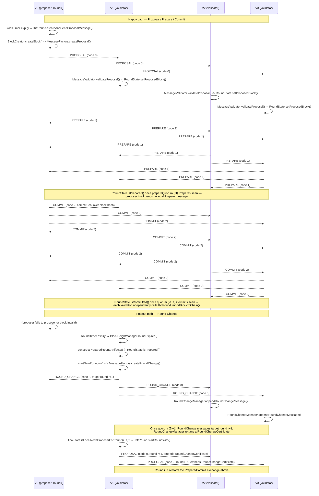

# 03 — Consensus: IBFT2 and IBFT-Legacy

> Source module: `consensus/ibft` (IBFT2, package `org.hyperledger.besu.consensus.ibft`) and `consensus/ibftlegacy` (original IBFT, package `org.hyperledger.besu.consensus.ibftlegacy`), vendored under `_references/besu`.
>
> This chapter assumes familiarity with the shared BFT scaffolding documented in `01-consensus-common.md` (`consensus/common/bft` — `ConsensusRoundIdentifier`, `BftExtraData`/`BftExtraDataCodec`, `SignedData`/`Payload`, `Gossiper`, `RoundTimer`, `BlockTimer`, `BftBlockInterface`, etc.) and the QBFT implementation documented in `02-consensus-qbft.md` (`consensus/qbft` + `consensus/qbft-core`). Only the facts needed for a concise IBFT2-vs-QBFT comparison are repeated here, sourced from the IBFT2 code itself.

---

## 1. Overview

**IBFT2** (`consensus/ibft`) is Besu's implementation of the Istanbul BFT 2.0 consensus algorithm: a round-based, leader-driven, three-phase (Proposal → Prepare → Commit) Byzantine fault-tolerant protocol tolerating up to `f` faulty validators out of `n = 3f + 1`. It is a full, actively-run consensus engine: it owns a round state machine (`IbftController` → `IbftBlockHeightManager` → `IbftRound`), a signed gossip-based wire protocol (devp2p subprotocol `"IBF"`, version 1), JSON-RPC validator-voting methods, and its own block-header `extraData` codec.

**IBFT-legacy** (`consensus/ibftlegacy`) is Besu's implementation of the original (pre-2.0) Istanbul BFT block-header format. Its package contains **no round state machine, no message-wrapper/payload classes, and no P2P network transmitter** — only:

- an `extraData` codec (`IbftExtraDataCodec`, `IbftLegacyExtraData`),
- block hashing / seal-recovery logic (`IbftBlockHashing`),
- block-header validation rules (`headervalidationrules/*`, `IbftBlockHeaderValidationRulesetFactory`),
- a `ProtocolSchedule` wiring class (`IbftProtocolSchedule`), and
- a `BftBlockInterface` implementation for reading proposer/validator/vote data out of a legacy header (`IbftLegacyBlockInterface`).

No class in `consensus/ibftlegacy` sends or receives a consensus message, and no reference to `ibftlegacy`/`IbftLegacy` was found outside the module itself except in the `config` module (`IbftLegacyConfigOptions`, used to parse the legacy `ibft` key out of a genesis file). **Ambiguity flag:** the module carries no explicit `@Deprecated` annotation or "this is deprecated" comment; the deprecation/legacy-support conclusion here is an inference from (a) the complete absence of an active consensus engine in the module (only header codec/validation code remains) and (b) the CHANGELOG entry *"Add IBFT1 to QBFT migration capability"* (`_references/besu/CHANGELOG.md:1124`), which frames IBFT-legacy ("IBFT1") purely as a migration source. Read together, this module's role today is to let a Besu node **decode, validate, and import blocks from a historical IBFT 1.0 chain** (and support migrating that chain to QBFT) — not to run IBFT 1.0 as a live consensus mechanism.

**Relationship to `consensus/common`:** both IBFT2 and (what remains of) IBFT-legacy build on the shared BFT primitives in `consensus/common/bft` — `ConsensusRoundIdentifier`, `BftExtraData`/`BftExtraDataCodec`, `BftBlockInterface`, `BftBlockHashing`/`BftBlockHeaderFunctions`, `BftHelpers` (quorum math), and (for IBFT2 only, since it's an active engine) `Gossiper`, `RoundTimer`, `BlockTimer`, `BftFinalState`, `MessageTracker`, `ValidatorMulticaster`, and the `statemachine`/`events` base classes (`BaseBftController`, `BaseBlockHeightManager`). IBFT2's `IbftController` extends `BaseBftController`; `BaseIbftBlockHeightManager` extends `BaseBlockHeightManager`. IBFT-legacy only reaches into the header/extraData/quorum primitives (`BftExtraData`, `BftBlockHeaderFunctions`, `BftHelpers`, `BftBlockHashing`) — it has no counterpart to the statemachine/event layer.

**Relationship to `consensus/qbft` / `consensus/qbft-core`:** no source file under `consensus/ibft` references the `qbft` package (verified by grep across `consensus/ibft/src/main/java`). `consensus/ibft` and `consensus/qbft`/`consensus/qbft-core` are structurally parallel, independent modules that both sit on top of `consensus/common/bft` — QBFT is not built on top of IBFT2's code, and IBFT2 was not refactored to share message/payload classes with QBFT. See §4 for the concrete protocol- and encoding-level differences visible from the IBFT2 side.

---

## 2. IBFT2 Component Diagram

`NoOpBlockHeightManager` is what `IbftBlockHeightManagerFactory.create()` returns when `BftFinalState.isLocalNodeValidator()` is `false` — a non-validator (RPC/full node) still runs `IbftController` to stay in sync with the chain, but every `BaseIbftBlockHeightManager` callback is a no-op (`consensus/ibft/src/main/java/.../statemachine/NoOpBlockHeightManager.java`).

---

## 3. IBFT2 Round Sequence

The sequence below shows one full round reaching consensus (Proposal → Prepare → Commit) and, separately, a round timing out and triggering Round-Change to the next proposer. `Vn` denotes validator *n*; `V0` is the round's proposer (selected by `ProposerSelector`, in `consensus/common`).

Key mechanics grounded in source:

- **Quorum:** `RoundState.updateState()` (`statemachine/RoundState.java`) requires `prepareMessages.size() >= BftHelpers.prepareMessageCountForQuorum(quorum)` for `prepared`, and `commitMessages.size() >= quorum` for `committed` — the Prepare quorum is one less than the Commit quorum because the proposer itself never sends a Prepare (`RoundState` comment: *"the proposer does not supply a prepare message"*).
- **Self-commit without a self-prepare:** in `IbftRound.updateStateWithProposedBlock()`, the proposer transitions straight from accepting its own Proposal to sending a Commit (using `RoundState.isPrepared()` becoming true purely from the block being proposed+quorum of peer Prepares), never needing to author a local Prepare message for its own block.
- **Round-Change carries a `PreparedRoundArtifacts`** (`statemachine/PreparedRoundArtifacts.java`) when the round reached `prepared` before expiring, so the new round's proposer can re-propose the *same* block (`IbftRound.startRoundWith()` uses `bftBlockInterface.replaceRoundInBlock(...)` to re-stamp the previously prepared block with the new round number) instead of creating a fresh one — this is what "PROPOSAL … embeds RoundChangeCertificate" carries downstream.
- **Message routing by age:** `IbftBlockHeightManager.determineAgeOfPayload()` classifies every inbound Prepare/Commit/RoundChange as `PRIOR_ROUND` (dropped), `CURRENT_ROUND` (handled immediately by `currentRound`), or `FUTURE_ROUND` (buffered into `futureRoundStateBuffer` until the local node itself advances to that round).

---

## 4. IBFT2 vs QBFT vs IBFT-Legacy

This table is built only from what is verifiable in `consensus/ibft` and `consensus/ibftlegacy` (plus the one `consensus/common`/`config` cross-reference noted). QBFT-column claims are limited to structural facts implied by IBFT2's own code (e.g., "separate module, no shared classes") — see `02-consensus-qbft.md` for QBFT's internals in depth.

| Aspect | IBFT2 (`consensus/ibft`) | QBFT (`consensus/qbft` + `qbft-core`) | IBFT-Legacy (`consensus/ibftlegacy`) |
|---|---|---|---|
| Module relationship | Own module; implements the full round state machine on top of `consensus/common/bft` | Separate, parallel module on top of `consensus/common/bft` — **no shared classes with `consensus/ibft`** (verified: no `qbft` import anywhere under `consensus/ibft/src/main/java`) | Own module; shares only header/extraData/quorum primitives from `consensus/common/bft` (`BftExtraData`, `BftBlockHeaderFunctions`, `BftHelpers`, `BftBlockHashing`) — no statemachine layer at all |
| Wire subprotocol | Custom devp2p capability, name `"IBF"`, version 1 (`IbftSubProtocol.IBFV1`), `MESSAGE_SPACE = 4` (`protocol/IbftSubProtocol.java`) | Its own devp2p capability defined in the `qbft` module (not inspected here — see `02-consensus-qbft.md`) | None — no `SubProtocol`/network classes exist in this module |
| Message types | `PROPOSAL=0`, `PREPARE=1`, `COMMIT=2`, `ROUND_CHANGE=3` (`messagedata/IbftV2.java`), each an RLP-encoded `SignedData<Payload>` wrapper (`payload/*Payload.java`, `messagewrappers/*.java`) | Defined independently in `qbft-core` — not re-derived here | N/A — no consensus messages are exchanged by this module |
| Message signing | Each payload individually ECDSA-signed (`SECPSignature` via `NodeKey.sign`), signer/author recovered from the signature (`payload/MessageFactory.createSignedMessage`, `common/bft/payload/SignedData`) | Same `SignedData`/`Payload` pattern from `consensus/common` is expected to apply, per `01-consensus-common.md` | N/A at the message layer; at the block layer, a single **proposer seal** (`SECPSignature`) is embedded directly in `extraData` (`IbftLegacyExtraData.getProposerSeal()`) and cryptographically recovered post-hoc (`IbftBlockHashing.recoverProposerAddress`) — IBFT2 has no equivalent header-embedded proposer seal; proposer authority is checked live, during consensus, by `SignedDataValidator` against `ProposerSelector` |
| `extraData` vanity encoding | Vanity is an RLP item *inside* the extraData list (`rlpInput.readBytes()`RLP-encoded, variable length) — `IbftExtraDataCodec.decodeRaw()` (`consensus/ibft`) | Not re-derived here (see `02-consensus-qbft.md`) | Vanity is a **fixed 32-byte raw prefix** (`EXTRA_VANITY_LENGTH = 32`) preceding a separate RLP list — *not* itself an RLP item (`ibftlegacy.IbftExtraDataCodec.decodeRaw()`) |
| `extraData` RLP body | `[vanity, validators[], vote-or-null, round:int, seals[]]` — includes an explicit `round` field and an in-band validator `vote` (`[recipient, ADD\|DROP byte]`) (`ibft.IbftExtraDataCodec`) | Not re-derived here | `[validators[], proposerSeal-or-null, seals[]]` — **no `round` field** (base `BftExtraData` round is hard-coded to `0` in `IbftLegacyExtraData`'s constructor) and **no in-band vote**; instead a validator vote is conveyed via the block header's `nonce` (`0xFFFF…FF` = AUTH, `0x0` = DROP) and `coinbase` (candidate address) — Clique-style (`ibftlegacy.IbftLegacyBlockInterface`, `headervalidationrules/VoteValidationRule.java`) |
| Validator voting (JSON-RPC) | `ibft_proposeValidatorVote`, `ibft_discardValidatorVote`, `ibft_getPendingVotes`, `ibft_getValidatorsByBlock{Hash,Number}`, `ibft_getSignerMetrics` (`jsonrpc/methods/*`) | Analogous `qbft_*` methods expected (not inspected here) | None — no `jsonrpc` package exists in this module; votes for a legacy chain are only ever read back out of already-mined headers, never proposed live |
| Committer/commit-seal quorum | `BftHelpers.calculateRequiredValidatorQuorum` = `2f+1`, `f = (n-1)/3`, checked live in `RoundState.updateState()` | Same quorum math (`BftHelpers`, shared) expected | Uses `IbftHelpers.calculateRequiredValidatorQuorum` (an equivalent, module-local `2f+1` calculation) below a genesis-configured `ceil2nBy3Block` height, and `BftHelpers.calculateRequiredValidatorQuorum` from `ceil2nBy3Block` onward — a historical quorum-formula migration baked into `IbftExtraDataValidationRule` |
| Genesis/CLI wiring today | Fully wired: `IbftProtocolScheduleBuilder`, `IbftForksSchedulesFactory`, `IbftJsonRpcMethods`, etc., all actively used to run a live IBFT2 network | Fully wired (see `02-consensus-qbft.md`) | `IbftProtocolSchedule.create()` exists and can still build a `ProtocolSchedule` for historical-chain import/validation, but no reference to `ibftlegacy`/`IbftLegacy*` was found in the `besu`/`config` CLI wiring beyond genesis-file option parsing (`config.IbftLegacyConfigOptions`) — consistent with §1's "import/migration only" conclusion, not a live selectable consensus engine in current CLI usage (inference, see §1 caveat) |
| Practical status | Actively maintained, live consensus option | Actively maintained, live consensus option, generally the recommended BFT choice for new networks (per this repo's own `docs/Besu-config.md`, which documents only QBFT) | Legacy/compatibility surface for importing or migrating a pre-2.0 IBFT chain (`CHANGELOG.md:1124`, "Add IBFT1 to QBFT migration capability") — **not** a protocol to pick for a new network |

---

## 5. Key IBFT2 Classes and Interfaces

| Class / interface | File | Responsibility |
|---|---|---|
| `IbftController` | `statemachine/IbftController.java` | Top-level message dispatcher; extends `BaseBftController` (from `consensus/common`), routes each inbound `PROPOSAL`/`PREPARE`/`COMMIT`/`ROUND_CHANGE` `MessageData` to the current `BaseIbftBlockHeightManager` |
| `BaseIbftBlockHeightManager` | `statemachine/BaseIbftBlockHeightManager.java` | Interface (extends `BaseBlockHeightManager`) defining the four payload-handling callbacks for a given block height |
| `IbftBlockHeightManager` | `statemachine/IbftBlockHeightManager.java` | Owns the lifecycle of a single block height: creates round 0, starts/restarts rounds on `RoundExpiry`, buffers future-round messages, drives Round-Change |
| `NoOpBlockHeightManager` | `statemachine/NoOpBlockHeightManager.java` | No-op `BaseIbftBlockHeightManager` used when the local node is not a validator |
| `IbftBlockHeightManagerFactory` | `statemachine/IbftBlockHeightManagerFactory.java` | Chooses between `IbftBlockHeightManager` and `NoOpBlockHeightManager` based on `BftFinalState.isLocalNodeValidator()` |
| `IbftRoundFactory` | `statemachine/IbftRoundFactory.java` | Builds an `IbftRound` (and its `RoundState`/`BlockCreator`/`IbftMessageTransmitter`) for a given round number |
| `IbftRound` | `statemachine/IbftRound.java` | Drives one round: creates/sends Proposals, handles inbound Proposal/Prepare/Commit, creates commit seals, imports the block once `RoundState.isCommitted()` |
| `RoundState` | `statemachine/RoundState.java` | Per-round vote tally: stores the accepted `Proposal`, `Prepare`/`Commit` messages keyed by author address, computes `prepared`/`committed` against quorum |
| `RoundChangeManager` | `statemachine/RoundChangeManager.java` | Collects `RoundChange` messages per target round; returns a `RoundChangeCertificate`-worthy collection once quorum is reached |
| `RoundChangeArtifacts` | `statemachine/RoundChangeArtifacts.java` | Derives the best `PreparedRoundArtifacts` (if any) out of a quorum of `RoundChange` messages, for the new round's proposer to re-propose |
| `PreparedRoundArtifacts` | `statemachine/PreparedRoundArtifacts.java` | Bundles the `Proposal` and its `Prepare` messages once a round reaches `prepared`, so it can be carried into a subsequent round via Round-Change |
| `MessageFactory` | `payload/MessageFactory.java` | Constructs and node-key-signs `Proposal`/`Prepare`/`Commit`/`RoundChange` messages; supports a legacy pre-26.1.0 encoding mode (`withLegacyEncoding`, BAL slot omitted) |
| `IbftMessageTransmitter` | `network/IbftMessageTransmitter.java` | Wraps `MessageFactory` + `ValidatorMulticaster` to sign-and-multicast each message type |
| `IbftGossip` | `IbftGossip.java` | `Gossiper` implementation: rebroadcasts a received message to all other known validators, excluding the original sender and the message's author |
| `IbftV2` | `messagedata/IbftV2.java` | Message-code constants: `PROPOSAL=0`, `PREPARE=1`, `COMMIT=2`, `ROUND_CHANGE=3`, `MESSAGE_SPACE=4` |
| `IbftSubProtocol` | `protocol/IbftSubProtocol.java` | Devp2p `SubProtocol` definition — capability name `"IBF"`, version 1 |
| `ProposalMessageData` / `PrepareMessageData` / `CommitMessageData` / `RoundChangeMessageData` | `messagedata/*.java` | Wire-format (`AbstractBftMessageData`) wrappers that decode raw `MessageData` into the corresponding `messagewrappers` type |
| `Proposal` / `Prepare` / `Commit` / `RoundChange` | `messagewrappers/*.java` | RLP-encodable, signed message wrappers (`BftMessage<Payload>`); `Proposal` additionally carries the proposed `Block`, an optional `BlockAccessList`, and an optional `RoundChangeCertificate` |
| `ProposalPayload` / `PreparePayload` / `CommitPayload` / `RoundChangePayload` | `payload/*.java` | The signed data proper for each message type (round identifier + digest/commit-seal/prepared-certificate) |
| `PreparedCertificate` | `payload/PreparedCertificate.java` | A signed `Proposal` payload plus a quorum of signed `Prepare` payloads — embedded in a `RoundChangePayload` when the sender was prepared |
| `RoundChangeCertificate` | `payload/RoundChangeCertificate.java` | A quorum of `RoundChange` payloads, embedded in a non-round-0 `Proposal` to justify starting that round |
| `DecodeBudget` | `payload/DecodeBudget.java` | Bounds RLP decode work (e.g. signature-recovery count) per message to prevent decode-time DoS |
| `MessageValidator` | `validation/MessageValidator.java` | Per-round façade validating a `Proposal`/`Prepare`/`Commit` against signature, block content, and Round-Change-certificate consistency |
| `SignedDataValidator` | `validation/SignedDataValidator.java` | Lowest-level check: correct round, correct/expected proposer, sender is a validator, digest matches the accepted proposal, commit-seal signer matches author |
| `RoundChangeMessageValidator` / `RoundChangePayloadValidator` | `validation/RoundChange*Validator.java` | Validate individual `RoundChange` messages and their embedded `PreparedCertificate` |
| `RoundChangeCertificateValidator` | `validation/RoundChangeCertificateValidator.java` | Validates a `Proposal`'s embedded `RoundChangeCertificate` is self-consistent and matches the proposed block |
| `FutureRoundProposalMessageValidator` | `validation/FutureRoundProposalMessageValidator.java` | Validates a Proposal for a round beyond the locally current one before the node agrees to jump ahead |
| `ProposalBlockConsistencyValidator` | `validation/ProposalBlockConsistencyValidator.java` | Confirms a `Proposal`'s signed digest matches the hash of the block it carries |
| `MessageValidatorFactory` | `validation/MessageValidatorFactory.java` | Builds the validator graph above for a given round/parent header (reads the live validator set via `BftContext`/`ValidatorProvider`) |
| `IbftExtraDataCodec` | `IbftExtraDataCodec.java` | RLP encode/decode of the IBFT2 `extraData` structure: `[vanity, validators[], vote?, round, seals[]]` |
| `IbftBlockHeaderValidationRulesetFactory` | `IbftBlockHeaderValidationRulesetFactory.java` | Builds the `BlockHeaderValidator` ruleset for IBFT2 headers |
| `IbftProtocolScheduleBuilder` | `IbftProtocolScheduleBuilder.java` | Wires IBFT2's block-header/body/import rules into a Besu `ProtocolSchedule` |
| `IbftForksSchedulesFactory` | `IbftForksSchedulesFactory.java` | Builds the fork-aware `BftConfigOptions` schedule (validator-set/quorum changes across configured forks) |
| `IbftJsonRpcMethods` + `jsonrpc/methods/*` | `jsonrpc/**` | `ibft_proposeValidatorVote`, `ibft_discardValidatorVote`, `ibft_getPendingVotes`, `ibft_getValidatorsByBlockHash`/`ByBlockNumber`, `ibft_getSignerMetrics` |
| `IbftQueryServiceImpl` | `queries/IbftQueryServiceImpl.java` | Implements the plugin-facing BFT query service for IBFT2 |

---

## 6. IBFT-Legacy Structure

`consensus/ibftlegacy` is small and single-purpose: decode, hash, and validate blocks produced by the original Istanbul BFT block format.

| Class | File | Responsibility |
|---|---|---|
| `IbftExtraDataCodec` | `IbftExtraDataCodec.java` | Decodes the legacy `extraData` layout: 32-byte raw vanity prefix + RLP `[validators[], proposerSeal?, seals[]]`. `encode()` is explicitly unimplemented (`throw new UnsupportedOperationException`) — this codec is **decode-only**, consistent with an import/validation-only role |
| `IbftLegacyExtraData` | `IbftLegacyExtraData.java` | Extends `BftExtraData`, adding the nullable `proposerSeal` field; always constructs the base class with `round = 0` and `vote = Optional.empty()` |
| `IbftBlockHashing` | `IbftBlockHashing.java` | Computes the proposer-seal hash (`calculateDataHashForProposerSeal`, a hash-of-hash) and the committed-seal hash (`calculateDataHashForCommittedSeal`, hash of `[headerHash, COMMIT_MSG_CODE]`); recovers proposer and committer addresses from their respective seals |
| `IbftHelpers` | `IbftHelpers.java` | `EXPECTED_MIX_HASH` constant and the legacy `2f+1` quorum formula (`calculateRequiredValidatorQuorum`) |
| `IbftLegacyBlockInterface` | `IbftLegacyBlockInterface.java` | `BftBlockInterface` implementation: recovers the proposer from the header's proposer seal, and reads validator-set votes out of `header.nonce`/`header.coinbase` (Clique-style: `nonce = 0xFFFF…FF` → `ADD`, `nonce = 0x0` → `DROP`, `coinbase` = vote subject) |
| `IbftProtocolSchedule` | `IbftProtocolSchedule.java` | Builds a `ProtocolSchedule` for a legacy IBFT chain: zero block reward, difficulty pinned to `1`, `MainnetBlockValidatorBuilder.frontier()`, `BftBlockHeaderFunctions` wired to `IbftBlockHashing::calculateHashOfIbftBlockOnchain` |
| `IbftBlockHeaderValidationRulesetFactory` | `IbftBlockHeaderValidationRulesetFactory.java` | Builds the legacy header `BlockHeaderValidator`: ancestry, gas, timestamp, fixed mix-hash/ommers-hash/difficulty, `IbftExtraDataValidationRule`, `VoteValidationRule` |
| `IbftExtraDataValidationRule` | `headervalidationrules/IbftExtraDataValidationRule.java` | Confirms the header decodes as legacy IBFT `extraData`, the proposer is a known validator, commit-seal count meets quorum (switching between the legacy and `BftHelpers` quorum formulas at a genesis-configured `ceil2nBy3Block` height), and the validator list is sorted and matches the expected set |
| `VoteValidationRule` | `headervalidationrules/VoteValidationRule.java` | Confirms `header.nonce` is one of the two valid vote values (`ADD_NONCE`/`DROP_NONCE`) |

**Structural differences from IBFT2, summarized:**

1. **No live round exchange.** IBFT2 has `statemachine`, `network`, `messagedata`, `messagewrappers`, `payload`, and `validation`-for-consensus-messages packages; IBFT-legacy has none of these — only `headervalidationrules` (for already-mined blocks) and the codec/hashing utilities that support it.
2. **No JSON-RPC surface.** IBFT2 exposes `ibft_*` voting/query methods; IBFT-legacy exposes none.
3. **Different proposer-authentication model.** IBFT2 verifies the proposer live, per round, against `ProposerSelector` output during consensus (`SignedDataValidator`); IBFT-legacy authenticates the proposer *after the fact*, by recovering an address from a dedicated `proposerSeal` signature embedded in the mined header (`IbftBlockHashing.recoverProposerAddress`).
4. **Different vote encoding.** IBFT2 encodes a pending validator vote inside `extraData` itself; IBFT-legacy encodes it via the block header's `nonce`/`coinbase` fields (the same mechanism Clique/Aura-style chains use), decoded by `VoteValidationRule` + `IbftLegacyBlockInterface`.
5. **No `round` tracking in the header.** IBFT2's `extraData` records the round the block was finalized in; IBFT-legacy's `IbftLegacyExtraData` always reports round `0` to the shared `BftExtraData` base type, because the legacy format never stored it.
6. **Quorum-formula migration built in.** `IbftExtraDataValidationRule` switches from the legacy `IbftHelpers.calculateRequiredValidatorQuorum` to the shared `BftHelpers.calculateRequiredValidatorQuorum` at a genesis-configured `ceil2nBy3Block` height — evidence that this code's purpose is to correctly re-validate a **historical** chain across a rule change, not to run new consensus.
