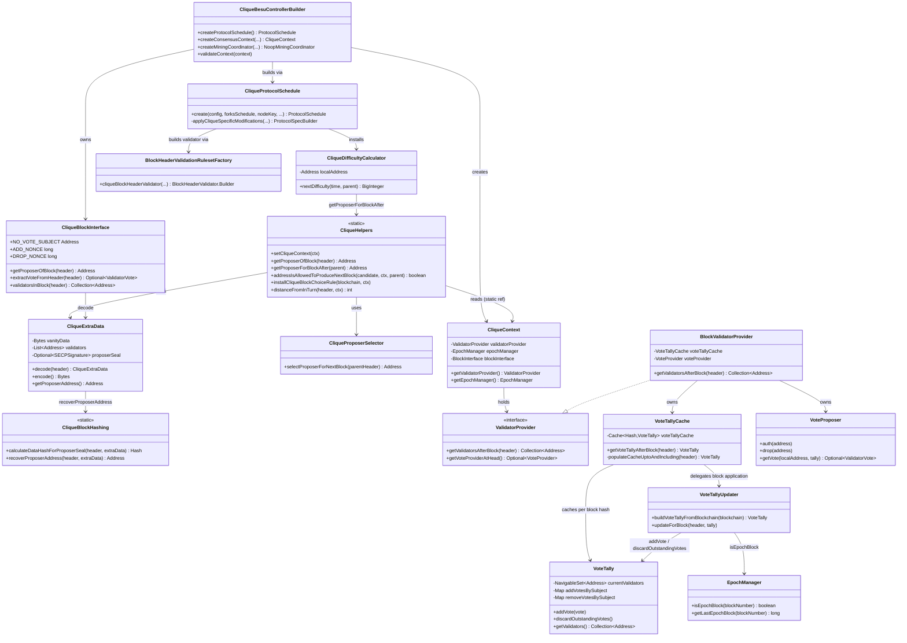
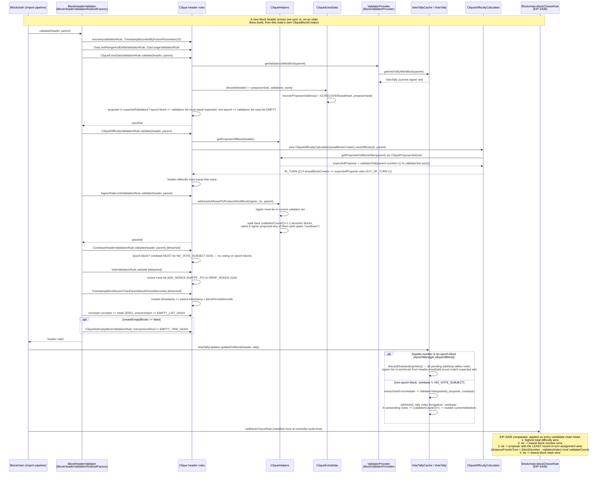

# 04 — Consensus: Clique (Proof of Authority)

> Source: `_references/besu/consensus/clique/src/main/java/org/hyperledger/besu/consensus/clique/**`, cross-referenced against `_references/besu/consensus/common/src/main/java/org/hyperledger/besu/consensus/common/**`, `_references/besu/app/src/main/java/org/hyperledger/besu/controller/CliqueBesuControllerBuilder.java`, and `_references/besu/CHANGELOG.md`. Vendored commit: `7e05c2342404d27bd06a992e336c5e0c86a5d8d1` (`main`, tagged `26.7.0-301-g7e05c23424`). This repo's own testnet runs QBFT, not Clique — see `docs/Besu-config.md` §3 — so this chapter documents a consensus family Besu still ships code for but no longer lets you run live.

---

## 0. Load-bearing fact: Clique is sync-only in this vendored source

Before anything else: **this version of Besu cannot start, mine on, or vote on a Clique network.** Confirmed directly from `CHANGELOG.md` and git history in the vendored tree:

| Phase | Commit | What it removed |
|---|---|---|
| — | `b1fe89233c` (#9852, "Remove support for running Clique networks not migrated to PoS") | Besu can no longer **start or mine** on pure Clique networks. `CHANGELOG.md` under `26.4.0`: *"Clique consensus has been removed. Besu can no longer start or mine on pure Clique networks. Syncing networks that started as Clique and have since transitioned to PoS via `terminalTotalDifficulty` (e.g. Linea Mainnet) are still supported."* |
| Phase 2 | `32bb851e78` (#9992) | All `clique_*` JSON-RPC methods (`clique_getSigners`, `clique_propose`, `clique_discard`, `clique_proposals`, `clique_getSignerMetrics`, `clique_getSignersAtHash`) and their `consensus/clique/.../jsonrpc/` implementation package (12 files) — deleted outright, not deprecated. |
| Phase 3 | `1c6f9904c5` (#10035) | Clique block production / mining infrastructure. |

The practical effect visible in the surviving source: `CliqueBesuControllerBuilder.createMiningCoordinator()` (`app/src/main/java/org/hyperledger/besu/controller/CliqueBesuControllerBuilder.java:63-72`) unconditionally returns a `NoopMiningCoordinator` — there is no `CliqueBlockCreator`, `CliqueMinerExecutor`, or `CliqueMiningCoordinator` anywhere in this tree (verified: no matches for those class names in the whole repository). A node running this Besu build simply cannot propose Clique blocks, regardless of whether its key is in the signer set.

What **does** remain, and is what this chapter documents, is the block-header validation, vote-tallying, difficulty, and fork-choice logic under `consensus/clique/` and `consensus/common/validator/blockbased/` — because Besu still needs to **follow and validate** historical chains that ran under Clique before migrating to proof-of-stake via `terminalTotalDifficulty` (Linea Mainnet is the named example). Every mechanism below — in-turn/out-of-turn proposal, the vote nonce/beneficiary encoding, the extraData signer-list format, the EIP-3436 fork-choice rule — is still live code, exercised on block *import*, not on block *production*. Treat the "signer" language below as describing what a historical Clique block header asserts and how Besu checks it, not a mining capability this build has.

---

## 1. Overview

**Clique** is Ethereum's canonical proof-of-authority consensus algorithm, specified in **EIP-225** and originally implemented in go-ethereum. A fixed-but-votable set of **signers** (authorized addresses) take turns proposing blocks. There is no stake, no BFT quorum, and — critically — **no instant finality**: canonical-chain selection is a difficulty-accumulation (longest-chain-style) rule, the same conceptual family as proof-of-work fork choice, just with a difficulty function driven by signer turn-taking instead of hashing.

Besu's `consensus/clique` module is a from-scratch Java re-implementation of the EIP-225 rules against Besu's block-import pipeline (`BlockHeaderValidator`, `ProtocolSchedule`, `DifficultyCalculator`), not a port of go-ethereum's `clique` package. It shares Besu's generic PoA scaffolding (`consensus/common`'s `BlockInterface`, `EpochManager`, `ValidatorProvider`, `VoteTally` — the "blockbased" voting model) with Besu's other PoA engine, but **not** the BFT round/quorum machinery.

### Why Clique is architecturally separate from QBFT/IBFT

Besu's `consensus/common` module contains two structurally distinct things:

1. **`org.hyperledger.besu.consensus.common`** (top-level package) — generic PoA plumbing: `BlockInterface`, `EpochManager`, `PoaContext`, `ForksSchedule`/`ForkSpec`, and `validator.blockbased.*` (`VoteTally`, `VoteTallyCache`, `VoteTallyUpdater`, `VoteProposer`, `BlockValidatorProvider`). This is signer-list-in-extraData, majority-vote-based validator management — the model Clique uses.
2. **`org.hyperledger.besu.consensus.common.bft`** (sub-package) — the shared Istanbul-BFT-family scaffolding used by QBFT and IBFT2: round-based `statemachine/` (`BaseBftController`, `BlockHeightManagerFactory`), `messagewrappers/`/`payload/` (signed round-change/prepare/commit messages), `network/` (`ValidatorMulticaster`, `ValidatorPeers`), `BftBlockCreator`, `BftProposerSelector`, `ConsensusRoundIdentifier`, commit-seal validation (`BftCommitSealsValidationRule`), etc.

**Verified directly from source:** `grep -rn "consensus.common.bft" consensus/clique/src/main/java` returns **zero matches**. Clique's own `build.gradle` depends on `project(':consensus:common')` (the whole module) but nothing in Clique's Java code imports a single class from the `.bft` sub-package. Clique has no round concept, no `ConsensusRoundIdentifier`, no prepare/commit message exchange, no committed-seal quorum, and no BFT event queue/state machine — it is built entirely on the non-BFT half of `consensus.common`. This is a real architectural boundary in the codebase, not just a naming convention: QBFT/IBFT2 and Clique are two unrelated consensus engines that happen to share only the validator-set bookkeeping primitives (`BlockInterface`, `EpochManager`, the `blockbased` vote-tally model), while the actual agreement protocol — round-robin difficulty racing vs. multi-round BFT voting with committed seals — is implemented completely independently.

---

## 2. Component diagram

---

## 3. Block proposal and validation flow

The diagram below covers header-import validation (the live path in this Besu build) and annotates, in the notes, where block *production* would plug in on a Besu version that still has `CliqueMinerExecutor`/`CliqueBlockCreator` — since that is what the surviving algorithm describes even though this build cannot execute it.

**In-turn vs. out-of-turn timing (as encoded, not as executed by this build):** `CliqueProposerSelector.selectProposerForNextBlock` picks `validatorSet[(parentNumber + 1) % validatorSet.size()]` — a pure round-robin index into the *current* (post-vote) validator set, ordered by natural `Address` (`TreeSet`) ordering, not by any recency/random beacon. A block from that expected signer is **in-turn** (difficulty `2`); a block from any other current signer is **out-of-turn** (difficulty `1`). EIP-225's original design lets out-of-turn signers wait a random extra delay before broadcasting (giving the in-turn signer first-mover advantage) — that scheduling/delay behavior lived in the now-removed `CliqueBlockCreator`/miner executor, so it is not present in this source tree; only its *consequence* (the difficulty value a header must carry, and the fork-choice tiebreak that favors the block whose signer was least recently in-turn) survives in the validation path documented above.

---

## 4. Key classes and interfaces

| Class / interface | File | Responsibility |
|---|---|---|
| `CliqueProtocolSchedule` | `consensus/clique/.../CliqueProtocolSchedule.java` | Builds the per-fork `ProtocolSchedule`: wires the Clique difficulty calculator, header validators, `blockReward = 0` (`skipZeroBlockRewards(true)`), `miningBeneficiaryCalculator = CliqueHelpers::getProposerOfBlock`, and `CliqueBlockHeaderFunctions` into each `ProtocolSpec`. |
| `CliqueBesuControllerBuilder` | `app/.../controller/CliqueBesuControllerBuilder.java` | Top-level wiring for a Clique-aware node: builds the `EpochManager`/`ForksSchedule` from genesis config, constructs `CliqueContext` and installs the EIP-3436 block-choice rule, and — in this build — returns a `NoopMiningCoordinator` (no block production). |
| `CliqueContext` | `consensus/clique/.../CliqueContext.java` | `PoaContext` implementation: bundles the `ValidatorProvider`, `EpochManager`, and `BlockInterface` used everywhere else in the module; set process-globally via `CliqueHelpers.setCliqueContext`. |
| `CliqueHelpers` | `consensus/clique/.../CliqueHelpers.java` | Static utility hub: proposer lookup (`getProposerOfBlock`, `getProposerForBlockAfter`), the anti-spam signer-rate-limit check (`addressIsAllowedToProduceNextBlock`), and installer for the EIP-3436 `installCliqueBlockChoiceRule` fork-choice comparator. |
| `CliqueProposerSelector` | `consensus/clique/.../CliqueProposerSelector.java` | Pure round-robin: `validatorSet[(parentBlockNumber + 1) % validatorSet.size()]` against the validator set *after* the parent block. |
| `CliqueDifficultyCalculator` | `consensus/clique/.../CliqueDifficultyCalculator.java` | Returns difficulty `2` (`IN_TURN_DIFFICULTY`) if the given local address is the expected next proposer, else `1` (`OUT_OF_TURN_DIFFICULTY`). |
| `CliqueBlockInterface` | `consensus/clique/.../CliqueBlockInterface.java` | Decodes/encodes the vote encoded in a header: `coinbase` = vote subject (or `NO_VOTE_SUBJECT` = `0x00..00` for no vote), `nonce` = `ADD_NONCE` (`0xFFFFFFFFFFFFFFFF`) for an auth/add vote or `DROP_NONCE` (`0x0`) for a drop vote. Also exposes the epoch-block signer list via `validatorsInBlock`. |
| `CliqueExtraData` | `consensus/clique/.../CliqueExtraData.java` | Parses/serializes the 32-byte-vanity + validator-address-list + 65-byte-proposer-seal `extraData` layout (EIP-225 format); recovers the proposer address by ECRECOVER over the seal. |
| `CliqueBlockHashing` | `consensus/clique/.../CliqueBlockHashing.java` | RLP-serializes a header with the proposer seal zeroed out to produce the hash that gets signed (the seal), and recovers the signer's address from a sealed header. |
| `CliqueBlockHeaderFunctions` | `consensus/clique/.../CliqueBlockHeaderFunctions.java` | `BlockHeaderFunctions` impl: header hash, `CliqueExtraData` parsing, and checkpoint window size = validator-set size (used by fast/snap-sync header-chain verification). |
| `CliqueForksSchedulesFactory` | `consensus/clique/.../CliqueForksSchedulesFactory.java` | Builds a `ForksSchedule<CliqueConfigOptions>` supporting genesis-config transitions of `blockperiodseconds` and `createemptyblocks` at specific block heights. |
| `BlockHeaderValidationRulesetFactory` | `consensus/clique/.../BlockHeaderValidationRulesetFactory.java` | Assembles the ordered list of header validation rules (see §3) into a `BlockHeaderValidator.Builder`, including the `MergeConfiguration`-gated detached/attached rule split for post-merge (PoS-transitioned) Clique-derived chains. |
| `CliqueExtraDataValidationRule` | `.../headervalidationrules/CliqueExtraDataValidationRule.java` | Proposer must be a member of the validator set after the parent block; on epoch blocks the header's validator list must exactly equal the expected set, on non-epoch blocks it must be empty. |
| `CliqueDifficultyValidationRule` | `.../headervalidationrules/CliqueDifficultyValidationRule.java` | Header's `difficulty` must match what `CliqueDifficultyCalculator` computes for the actual signer. |
| `SignerRateLimitValidationRule` | `.../headervalidationrules/SignerRateLimitValidationRule.java` | Enforces the EIP-225 "cannot sign twice within `floor(signerCount/2)+1` blocks" cooldown via `CliqueHelpers.addressIsAllowedToProduceNextBlock`. |
| `CoinbaseHeaderValidationRule` | `.../headervalidationrules/CoinbaseHeaderValidationRule.java` | No voting (`coinbase` must be `NO_VOTE_SUBJECT`) is allowed on epoch blocks. |
| `VoteValidationRule` | `.../headervalidationrules/VoteValidationRule.java` | `nonce` must be exactly `ADD_NONCE` or `DROP_NONCE`. |
| `CliqueNoEmptyBlockValidationRule` | `.../headervalidationrules/CliqueNoEmptyBlockValidationRule.java` | Optional rule (only added when genesis `createemptyblocks = false`): rejects headers whose `transactionsRoot` is the empty-trie hash. |
| `EpochManager` | `consensus/common/.../EpochManager.java` | `isEpochBlock(n)` / `getLastEpochBlock(n)`: epoch boundary arithmetic shared by Clique (and QBFT/IBFT) for periodic vote-tally reset and validator-set checkpointing. |
| `PoaContext` | `consensus/common/.../PoaContext.java` | Marker interface (`ConsensusContext` + `getBlockInterface()`) that `CliqueContext` implements — the generic, non-BFT PoA consensus-context contract. |
| `ValidatorProvider` | `consensus/common/validator/.../ValidatorProvider.java` | Interface for "who are the validators at/after block X" and "what vote should I cast next" — implemented for Clique by `BlockValidatorProvider`. |
| `BlockValidatorProvider` | `consensus/common/validator/blockbased/BlockValidatorProvider.java` | The `ValidatorProvider` used by Clique (`nonForkingValidatorProvider`): backs onto a `VoteTallyCache` + `VoteProposer`. |
| `VoteTally` | `consensus/common/validator/blockbased/VoteTally.java` | The actual signer-set + vote-count state machine: `addVote` tallies per-subject add/remove votes and mutates `currentValidators` once a vote crosses the `(currentValidators.size()/2)+1` majority threshold, clearing outstanding votes for that subject on both a successful add and a successful remove. |
| `VoteTallyUpdater` | `consensus/common/validator/blockbased/VoteTallyUpdater.java` | Replays header-by-header vote application from the last epoch block to a target block (`buildVoteTallyFromBlockchain`), and resets all outstanding votes on every epoch block (`discardOutstandingVotes`) without touching the current validator list itself. |
| `VoteTallyCache` | `consensus/common/validator/blockbased/VoteTallyCache.java` | Per-block-hash memoized `VoteTally` (Guava cache, max 100 entries) — this **is** the "snapshot" mechanism: it walks back to the nearest cached ancestor or epoch block, then replays forward, caching every intermediate header's resulting tally so repeated lookups are O(1) after the first pass. |
| `VoteProposer` | `consensus/common/validator/blockbased/VoteProposer.java` | Holds this node's own pending auth/drop proposals (would have been populated by the now-removed `clique_propose`/`clique_discard` RPCs) and would select which one-to-cast on this node's next mined block — dead code in this build since nothing calls `createMiningCoordinator` to produce a block. |
| `VoteType` | `consensus/common/validator/VoteType.java` | `ADD` / `DROP` enum shared by the vote-tally model. |
| `ValidatorVote` | `consensus/common/validator/ValidatorVote.java` | Immutable `(polarity, proposer, recipient)` tuple extracted from a header's `(nonce, coinbase)` pair. |

---

## 5. Fork choice: Clique's difficulty accumulation vs. QBFT/IBFT's instant finality

Clique's canonical-chain rule, installed once per node via `CliqueHelpers.installCliqueBlockChoiceRule` (`consensus/clique/.../CliqueHelpers.java:151-166`), is the **EIP-3436 Expanded Clique Block Choice Rule** — a strict, ordered comparator applied to competing chain heads:

1. **Highest total difficulty wins.** Since every block contributes `2` (in-turn) or `1` (out-of-turn) to cumulative difficulty, this is structurally identical in shape to proof-of-work's "heaviest chain" rule — just with a difficulty source driven by turn-taking instead of hash-rate.
2. **Tie → lowest block number wins** (prefer the shorter/more-direct chain).
3. **Tie → the block whose proposer had the *least-recently* in-turn assignment wins** (`distanceFromInTurn`, `CliqueHelpers.java:177-193`): `(blockNumber - validatorIndex) mod validatorCount`. This tiebreak specifically resolves the classic Clique "duplicate in-turn block" attack/edge-case from the original EIP-225 spec.
4. **Tie → lowest block hash wins** (final deterministic tiebreak).

This is fundamentally **probabilistic finality**: a Clique block is never "final" by protocol rule — it is only progressively less likely to be reorganized out as more difficulty accumulates on top of it, exactly like a PoW chain. A short-lived fork where an out-of-turn signer's block briefly outraces the in-turn signer's block (e.g. due to network latency) is expected, normal behavior, resolved later purely by whichever branch accumulates more difficulty.

**QBFT/IBFT2, by contrast** (per `consensus/common/bft/` and `consensus/qbft/` — not read in depth for this chapter, but structurally evident from the shared scaffolding Clique explicitly does *not* use, see §1): validators run an explicit multi-round prepare/commit voting protocol per block height, and a block is only imported once it carries a quorum of validator **committed seals** (`BftCommitSealsValidationRule` in `consensus/common/bft/headervalidationrules/`). Once that quorum-sealed block is imported, it is final immediately — there is no concept of "more difficulty accumulating on top" changing that outcome, and indeed QBFT/IBFT headers don't carry a meaningful variable difficulty at all (this repo's own `genesis.json` fixes `difficulty: "0x1"` for its QBFT chain — see `docs/Besu-config.md` §3, "Required to be exactly `0x1` for QBFT... not used for actual difficulty adjustment under BFT consensus"). This is the single largest practical consequence of the architectural split documented in §1: Clique inherits PoW-style probabilistic settlement and short reorgs by design, while QBFT/IBFT2 trade that away for deterministic, round-based instant finality at the cost of needing a live 2f+1-of-3f+1 quorum of validators online to make any progress at all. For a reader coming from this repo's QBFT testnet, the practical implication is that "block N is on the chain" means something categorically stronger under QBFT (byzantine-fault-tolerant agreement, final on import) than it would under Clique (longest-chain convention, only probabilistically settled) — a distinction that matters if this project's design principles (`CLAUDE.md` §6, NFR-first: Availability/Security) are ever applied to a network choice.

---

## 6. Signer-list / snapshot mechanism, summarized

- **Where the signer list lives:** only on **epoch blocks** (`EpochManager.isEpochBlock`, default `epochlength = 30000` per Besu default / this repo's QBFT genesis uses the same default for its own `epochlength`, see `docs/Besu-config.md` §3) — `CliqueExtraData.getValidators()` on a non-epoch block must be empty (enforced by `CliqueExtraDataValidationRule`); the authoritative signer set for any block is always derived by replaying votes, not by reading validators off arbitrary headers.
- **The "snapshot":** `VoteTallyCache` is the mechanism. It is not a periodic snapshot to disk — it's an in-memory, per-block-hash memoization (`Cache<Hash, VoteTally>`, `maximumSize(100)`) of the fully-replayed `VoteTally` state as of that block. A cache miss walks parent-pointers back until it hits either a cached ancestor or an epoch block (whose signer list is authoritative by definition), then replays `VoteTallyUpdater.updateForBlock` forward over every intermediate header, caching each step.
- **Voting mechanics (`VoteTally.addVote`, `consensus/common/.../VoteTally.java:59-85`):** a header with `coinbase != NO_VOTE_SUBJECT` casts one vote from `proposer` (the header's actual signer) toward `recipient` (`coinbase`), polarity from `nonce` (`ADD_NONCE`/`DROP_NONCE`). Once a subject accumulates `(currentValidators.size()/2)+1` outstanding votes of one polarity, the mutation applies immediately (mid-epoch) — the subject is added to or removed from `currentValidators`, and all outstanding votes for that subject (both add and remove) are discarded. Every **epoch block** unconditionally discards **all** outstanding votes for **every** subject (`discardOutstandingVotes`) — pending-but-not-yet-majority votes do not carry across an epoch boundary and must be re-cast.

---

## 7. Related docs

- `docs/Besu-config.md` §3 — this repo's actual QBFT genesis parameters (`blockperiodseconds`, `epochlength`, `extraData` format under QBFT for comparison).
- `docs/architecture.md` — overall system architecture; §2 topology shows this repo's 4 QBFT validators, not Clique.
