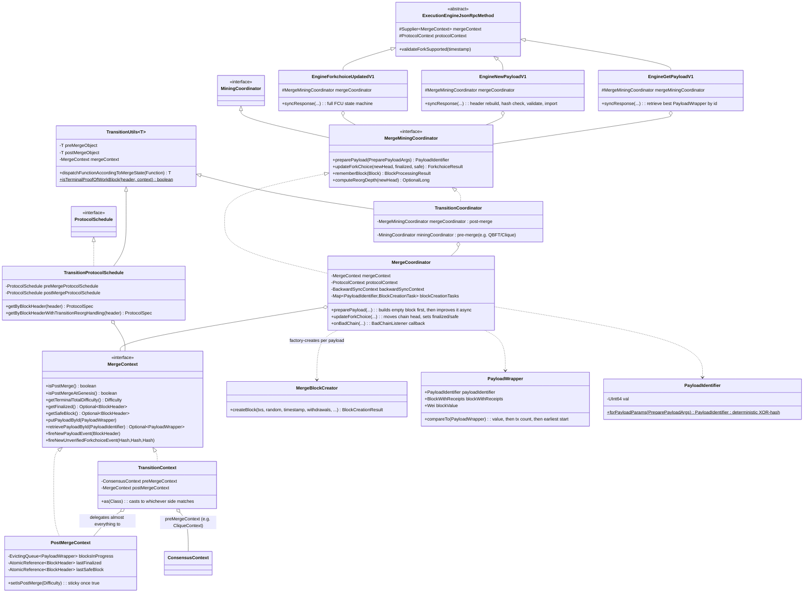
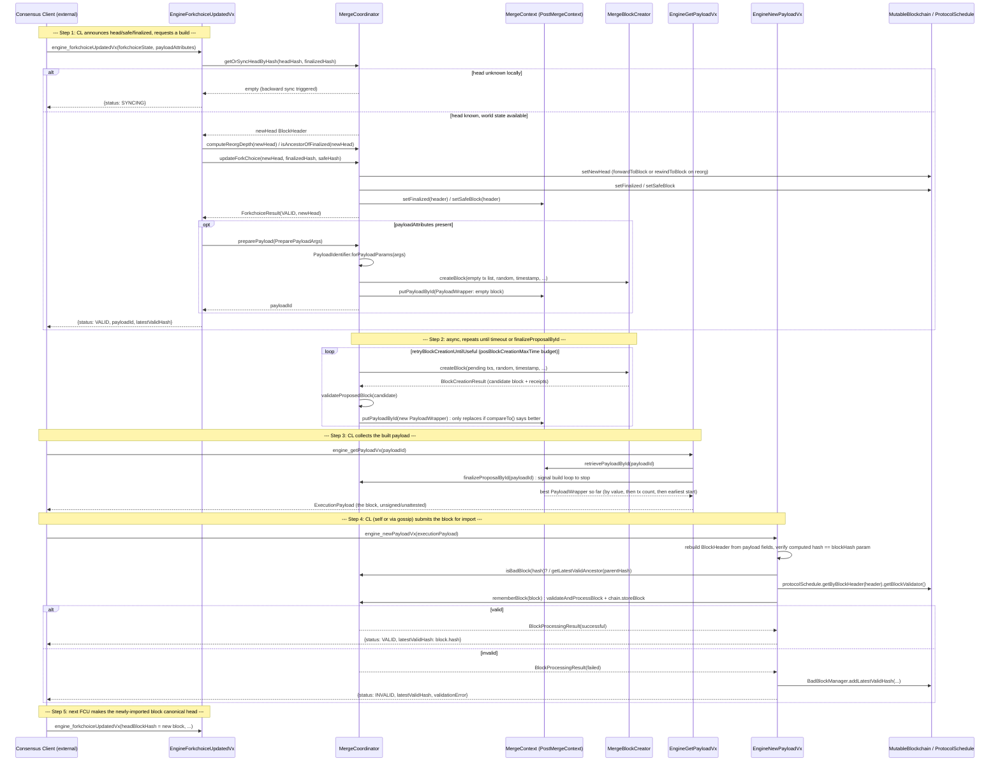

# 05 — Consensus: Post-Merge / Proof-of-Stake Integration (`consensus/merge`)

> Covers `_references/besu/consensus/merge/` (the merge-transition consensus module) plus its direct
> wiring point in `_references/besu/ethereum/api/.../jsonrpc/internal/methods/engine/` (the Engine API
> handler classes) and `_references/besu/app/src/main/java/org/hyperledger/besu/controller/` (where the
> module gets assembled into a running node). All file paths below are relative to
> `_references/besu/` unless stated otherwise. Read against the vendored source, not upstream docs —
> class-by-class behavior described here was traced directly from the Java in this repo's submodule.

---

## 1. Overview

**What changed at The Merge (Paris upgrade, September 2022):** Ethereum split its previously
monolithic "one client does everything" design into two cooperating processes:

- **Consensus Layer (CL)** — a Beacon Chain client (Prysm, Lighthouse, Teku, Nimbus, Grandine, …).
  Owns proof-of-stake consensus: validator duties, attestations, LMD-GHOST fork-choice, slashing,
  finality (Casper FFG). This is now the **sole authority** for "what is the canonical chain head."
- **Execution Layer (EL)** — Besu (or Geth, Nethermind, Erigon, Reth). Owns the EVM: transaction
  execution, state trie, mempool, and (still) the historical peer-to-peer block/transaction gossip
  network. Besu no longer decides which block is canonical — it is *told* by the CL.

Before the Merge, Besu's own consensus modules (`consensus/clique`, `consensus/qbft`, or plain
`ethash` PoW) independently decided fork choice and produced blocks on a timer. After the Merge, for
any chain running proof-of-stake, that authority moves outside the EL entirely. Besu's job shrinks to:
building a *candidate* block when asked, validating a block's EVM-level correctness when handed one,
and applying whatever head/finalized/safe pointers the CL dictates — it no longer runs its own
fork-choice rule for PoS blocks (`GHOST`/longest-chain/QBFT-round-based selection all stop applying).

**The Engine API is the CL↔EL bridge.** It is a second, separately-authenticated (JWT, via
`EngineAuthService`, distinct port — default `8551`) JSON-RPC namespace, `engine_*`, sitting next to
Besu's normal `eth_*` namespace. Its three load-bearing calls, all engineered around here:

| Call | Direction | Purpose |
|---|---|---|
| `engine_forkchoiceUpdatedVN` | CL → EL | "This is the new head/safe/finalized state; also start building me a block for this slot" (payload build is optional, triggered by the presence of `payloadAttributes`) |
| `engine_getPayloadVN` | CL → EL | "Give me the block you've been building for payload ID X" |
| `engine_newPayloadVN` | CL → EL | "Validate and (if valid) import this exact block" — used both for the CL's own proposed block and for blocks arriving from other validators |

`consensus/merge` is where the *logic* those three calls delegate to actually lives: candidate-block
construction, fork-choice application, the pre-merge→post-merge transition machinery, and the header
validation rules unique to a zero-difficulty, externally-driven chain.

**Terminal Total Difficulty (TTD)** is the mechanism by which a chain that started under PoW
transitions to PoS at a specific point without a hard-coded block number: once cumulative chain
difficulty reaches a configured `terminalTotalDifficulty`, the *next* block must be a zero-difficulty,
zero-nonce PoS block. `consensus/merge` carries the machinery for this transition (`Transition*`
classes) even though a chain that launches **already post-merge** ("merge-at-genesis") short-circuits
almost all of it — see `MergeContext.isPostMergeAtGenesis()`.

---

## 2. Component Diagram

Notes on what the diagram compresses:

- `EngineForkchoiceUpdatedV1`/`EngineNewPayloadV1`/`EngineGetPayloadV1` are each the *root* of a sealed
  version hierarchy (`V1 permits V2`, `V2 permits V3`, …) — every later version extends the previous
  one and overrides specific hooks (parameter parsing, validation, response shape) rather than
  reimplementing the flow. `EngineForkchoiceUpdatedV1`/`V2`/`EngineNewPayloadV1`/`V2` additionally
  extend `OrderedExecutionJsonRpcMethod` (not shown), which forces these two call families onto a
  single shared Vert.x executor (`syncVertx` in `ExecutionEngineJsonRpcMethod`) so they process in
  strict receipt order — required because both calls mutate canonical chain state and the Engine API
  spec mandates in-order processing.
- `MergeContext` is looked up via `ProtocolContext.getConsensusContext(MergeContext.class)` throughout
  the header-validation rules and `TransitionUtils.isTerminalProofOfWorkBlock` — it is the one object
  every merge-aware component reaches into to ask "are we post-merge yet?"

---

## 3. Sequence: `forkchoiceUpdated` → `getPayload` → block built → `newPayload` → import

This mirrors the staged comments left directly in the source (`EngineForkchoiceUpdatedV1.syncResponse`
and `EngineNewPayloadV1.syncResponse` both carry inline numbered comments quoting the EIP-3675 payload
validation / fork-choice steps almost verbatim). One subtlety worth flagging explicitly: `preparePayload`
**does not** import the candidate block into the chain — `validateProposedBlock` validates and processes
it (to compute state root, receipts, and `blockValue` for `PayloadWrapper.compareTo`) but only
`rememberBlock` (called from `engine_newPayload`, or internally by backward sync) calls
`chain.storeBlock(...)`. That means even a node that proposes its own block still needs an
`engine_newPayload` round-trip (self- or gossip-sourced) before that block is actually persisted —
`consensus/merge` never short-circuits this for locally-built payloads.

---

## 4. Key Classes and Interfaces

### `consensus/merge` — transition & fork-choice core

| Class / Interface | File | Responsibility |
|---|---|---|
| `MergeContext` | `consensus/merge/src/main/java/.../MergeContext.java` | Interface (extends `ConsensusContext`) for all merge-state: TTD, `isPostMerge`/`isPostMergeAtGenesis`, finalized/safe block headers, in-flight payload registry, forkchoice/new-payload listener subscriptions |
| `PostMergeContext` | `consensus/merge/src/main/java/.../PostMergeContext.java` | Concrete `MergeContext`. Holds an `EvictingQueue<PayloadWrapper>` (capacity `MAX_BLOCKS_IN_PROGRESS = 12`) as the in-progress payload cache; `setIsPostMerge` is **one-way** — once true (TTD reached), it never flips back even on reorg |
| `TransitionContext` | `consensus/merge/src/main/java/.../TransitionContext.java` | `MergeContext` decorator wrapping a pre-merge `ConsensusContext` (e.g. a Clique/QBFT context) and a `PostMergeContext`; `as(Class)` casts to whichever side matches the requested type, so legacy pre-merge code paths can still fetch their own context type through the same `ProtocolContext` |
| `TransitionUtils<SwitchingObject>` | `consensus/merge/src/main/java/.../TransitionUtils.java` | Generic dispatcher: holds a pre-merge and a post-merge instance of the same interface and picks one via `mergeContext.isPostMerge()` (optionally also checking the block header's difficulty == 0). Also hosts the static `isTerminalProofOfWorkBlock(header, context)` — the TTD-crossing check reused by every header validation rule |
| `TransitionProtocolSchedule` | `consensus/merge/src/main/java/.../TransitionProtocolSchedule.java` | `ProtocolSchedule` implementation built from `TransitionUtils<ProtocolSchedule>`; `getByBlockHeaderWithTransitionReorgHandling` specifically handles the case where backward sync must decide pre- vs post-merge rules for a block *before* a finalized block exists, including detecting the terminal PoW block itself |
| `TransitionBackwardSyncContext` | `consensus/merge/src/main/java/.../TransitionBackwardSyncContext.java` | `BackwardSyncContext` specialization that uses a `TransitionProtocolSchedule` so backward-filling blocks around the merge boundary picks the correct ruleset per block |
| `TransitionBestPeerComparator` | `consensus/merge/src/main/java/.../TransitionBestPeerComparator.java` | Peer-selection comparator that also switches behavior pre/post merge (post-merge, "best peer" stops being meaningfully driven by declared total difficulty) |
| `MergeProtocolSchedule` | `consensus/merge/src/main/java/.../MergeProtocolSchedule.java` | Static factory for the **post-merge** `ProtocolSchedule`: Paris EVM, `isPoS(true)`, `blockReward = Wei.ZERO`, difficulty calculator pinned to `BigInteger.ZERO`, and the merge `BlockHeaderValidator`. Registered as milestone `0` and explicitly un-applied again from the first Shanghai+ fork timestamp onward, because the merge activates by TTD rather than by block number/timestamp and so can't sit naturally in the normal milestone table |
| `MergeValidationRulesetFactory` | `consensus/merge/src/main/java/.../MergeValidationRulesetFactory.java` | Builds the merge `BlockHeaderValidator`: reuses several Mainnet rules (ancestry, gas usage/limit, base fee, extra-data length, future-timestamp bound) plus four merge-only rules below |
| `PayloadWrapper` | `consensus/merge/src/main/java/.../PayloadWrapper.java` | Bundles a built block: `PayloadIdentifier`, `BlockWithReceipts`, optional `BlockAccessList`, optional EIP-7685 `requests`, and build timing. `Comparable`: ranks by `blockValue`, then transaction count, then earliest start time — this is the "pick the best candidate so far" ordering `PostMergeContext.putPayloadById` uses |

### `consensus/merge/blockcreation` — payload building & fork-choice application

| Class / Interface | File | Responsibility |
|---|---|---|
| `MergeMiningCoordinator` | `.../blockcreation/MergeMiningCoordinator.java` | Interface extending `MiningCoordinator` with the PoS-specific surface: `preparePayload`, `updateForkChoice`, `rememberBlock`/`validateBlock`, reorg-depth/ancestor checks, bad-block queries. Declares `MAX_REORG_DEPTH = 90_000L` and the nested `ForkchoiceResult` (statuses `VALID`/`INVALID`/`INVALID_PAYLOAD_ATTRIBUTES`/`IGNORE_UPDATE_TO_OLD_HEAD`) and `PreparePayloadArgs` record (parent header, timestamp, prevRandao, fee recipient, withdrawals, parent beacon block root, slot number, target gas limit) |
| `MergeCoordinator` | `.../blockcreation/MergeCoordinator.java` | The concrete post-merge coordinator. `preparePayload` computes a deterministic `PayloadIdentifier`, immediately builds and stores an **empty** block (so `getPayload` always has something to return even under time pressure), then runs `tryToBuildBetterBlock`/`retryBlockCreationUntilUseful` asynchronously via `EthScheduler`, replacing the cached payload only when a fuller block scores higher. `updateForkChoice`/`applyForkChoice` move the chain head (`forwardToBlock` for a simple extension, `rewindToBlock` for a reorg), set finalized/safe pointers on both the blockchain and `MergeContext`. Also implements `BadChainListener.onBadChain` to propagate bad-block marks (and `latestValidHash`) to descendants found by backward sync |
| `TransitionCoordinator` | `.../blockcreation/TransitionCoordinator.java` | `TransitionUtils<MiningCoordinator>` + `MergeMiningCoordinator`. Dispatches generic `MiningCoordinator` methods (`start`/`stop`/`enable`/`isMining`/`createBlock`) to whichever coordinator matches the current merge state; all PoS-only methods (`preparePayload`, `updateForkChoice`, `rememberBlock`, reorg/ancestor queries) always delegate straight to the wrapped `MergeCoordinator`, since those concepts have no pre-merge equivalent. `start()` only starts the legacy pre-merge coordinator if `isMiningBeforeMerge()` is true |
| `MergeBlockCreator` | `.../blockcreation/MergeBlockCreator.java` | Package-private `AbstractBlockCreator` specialization: always sets `difficulty = 0`, `nonce = 0` on the header it builds, and requires `random` (prevRandao) — throws `UnsupportedOperationException` on the legacy `createBlock` overloads that don't supply it |
| `PayloadIdentifier` | `.../blockcreation/PayloadIdentifier.java` | 64-bit (`UInt64`) opaque ID. `forPayloadParams(...)` derives it deterministically by XOR-folding the parent hash, timestamp, prevRandao, fee recipient, parent beacon block root, slot number, withdrawals, and target gas limit — explicitly designed to avoid collisions across reorgs and mid-build CL config changes |

### `consensus/merge/headervalidationrules` — merge-specific header rules

All four extend/rely on `MergeConsensusRule.shouldUsePostMergeRules(header, context)`, which returns
`true` unconditionally once anything has ever been finalized (sticky), otherwise checks whether
`parentTotalDifficulty + headerDifficulty >= TTD` while excluding the terminal PoW block itself.

| Class | File | Rule |
|---|---|---|
| `MergeConsensusRule` | `.../headervalidationrules/MergeConsensusRule.java` | Abstract base — shared "are we validating under post-merge rules yet?" decision |
| `ConstantOmmersHashRule` | `.../headervalidationrules/ConstantOmmersHashRule.java` | Once total difficulty ≥ TTD, `ommersHash` must equal the RLP-empty-list hash (no uncles under PoS). Note: computes its own TTD check directly rather than going through `MergeConsensusRule`, so it is **not** gated by the "sticky after finalization" behavior the other three rules share — worth flagging as a structural asymmetry if auditing this code |
| `NoNonceRule` | `.../headervalidationrules/NoNonceRule.java` | Post-TTD (and not the terminal PoW block), header `nonce` must be `0` |
| `NoDifficultyRule` | `.../headervalidationrules/NoDifficultyRule.java` | Post-TTD, header `difficulty` must be `null` or `Difficulty.ZERO` |
| `IncrementalTimestampRule` | `.../headervalidationrules/IncrementalTimestampRule.java` | Post-TTD, block timestamp must be strictly greater than the parent's (unsigned comparison) — this is the *only* timing constraint the EL enforces; block cadence/slot timing itself is entirely the CL's responsibility |

### `ethereum/api` — Engine API handler classes (the connection point)

`ethereum/api` is a sibling module and out of scope for a deep dive here, but these are the concrete
classes that call into everything above, and are the ones a CL actually talks to over the wire:

| Class | File | Role |
|---|---|---|
| `ExecutionEngineJsonRpcMethod` | `ethereum/api/.../jsonrpc/internal/methods/ExecutionEngineJsonRpcMethod.java` | Abstract base for every `engine_*` method. Holds `Supplier<MergeContext> mergeContext`, `ProtocolSchedule`/`ProtocolContext`, `EngineCallListener`, the shared `syncVertx` executor, and per-method hardfork range enforcement (`validateForkSupported`) |
| `EngineForkchoiceUpdatedV1` (→`V2`→`V3`→`V4`) | `.../methods/engine/EngineForkchoiceUpdatedV1.java` (+siblings) | Implements the full FCU state machine described in §3: bad-block short-circuit, sync-triggering head lookup, forkchoice-state ancestry validation (`-38002`), ancestor-of-finalized skip, reorg-depth limit (`-38006`), payload-attributes validation and `preparePayload` dispatch. Sealed hierarchy — each version overrides `readRequestParameters`/`validatePayloadAttributes`/`setPreparePayloadArgs` rather than re-deriving the flow |
| `EngineNewPayloadV1` (→`V2`→`V3`→`V4`→`V5`) | `.../methods/engine/EngineNewPayloadV1.java` (+siblings) | Rebuilds a `BlockHeader` from the wire payload, verifies the computed hash matches the claimed `blockHash` *before any other check*, triggers backward sync on an unknown parent, delegates block validation to `MergeCoordinator.rememberBlock`, and maps results to `VALID`/`INVALID`/`INVALID_BLOCK_HASH`/`SYNCING` |
| `EngineGetPayloadV1` (→`V2`→`V3`→`V4`→`V5`→`V6`) | `.../methods/engine/EngineGetPayloadV1.java` (+siblings) | Retrieves the best `PayloadWrapper` for a `PayloadIdentifier` from `MergeContext`, calls `finalizeProposalById` to signal the build loop to stop, and — if only the empty block has been built so far — blocks briefly via `awaitCurrentBuildCompletion` to give the async builder a chance to produce something non-trivial before responding |
| `EngineExchangeCapabilities`, `EngineExchangeTransitionConfigurationV1`, `EngineGetPayloadBodiesBy{Hash,Range}V1/V2`, `EngineGetBlobsV1-V4`, `EngineGetClientVersionV1`, `EngineQosTimer` | same package | Supporting Engine API surface (capability negotiation, legacy TTD handshake, payload-body/blob lookups, client identification, and a QoS timer that flags when the CL has stopped calling the engine API at all) — not part of the core FCU/newPayload/getPayload triangle and not detailed further here |
| `EngineJsonRpcService` | `ethereum/api/.../jsonrpc/EngineJsonRpcService.java` | The separate HTTP(S) service exposing the `engine_*` namespace on its own port, gated by JWT via `EngineAuthService` — this is what a CL's `--execution-endpoint`/`--jwt-secret` flags actually point at |
| `MergeBesuControllerBuilder`, `TransitionBesuControllerBuilder` | `app/src/main/java/org/hyperledger/besu/controller/` | Where `PostMergeContext`, `TransitionContext`, `TransitionCoordinator`, and `TransitionProtocolSchedule` actually get constructed and wired into a running Besu node at startup — the composition root for everything in §2 |

---

## 5. Relevance to This Repo

This repository's own testnet (`docker-compose.yml`, `network-config/genesis.json`) runs **QBFT**, a
pre-merge-style Byzantine-fault-tolerant consensus algorithm (`consensus/qbft`), not proof-of-stake.
QBFT validators reach consensus on block proposals among themselves via a round-based BFT protocol —
there is no external consensus client, no Engine API port, and no `MergeCoordinator` in the running
system. `genesis.json`'s `config.qbft` block (see `docs/Besu-config.md` §3) is the actual consensus
configuration in force here; `consensus/merge` is never instantiated (`MergeBesuControllerBuilder` /
`TransitionBesuControllerBuilder` are QBFT-irrelevant code paths) and the Engine API (`engine_*`
namespace, port `8551`, JWT auth) is never enabled anywhere in `docker-compose.yml`.

This chapter therefore documents Besu's **general capability** as a post-Merge Ethereum execution
client — relevant if this project, or a fork of it, ever targets a real (or simulated) proof-of-stake
Ethereum network — not a subsystem this repo's own docker-compose stack exercises. If validating any
claim above against a running node, do so against a separate PoS-configured Besu (or public
testnet/mainnet) instance, not against `besu-validator-1..4` in this repo.
