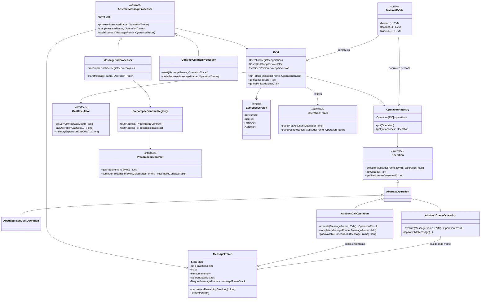
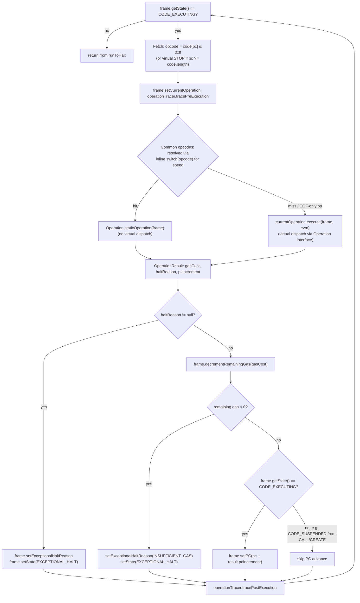

# 06 — EVM Execution Engine

> Covers the `evm` Gradle module of Hyperledger Besu — the component that interprets EVM bytecode, meters gas, and runs precompiled contracts. Source vendored at `_references/besu/evm` (package `org.hyperledger.besu.evm`). This repo's genesis sets `config.berlinBlock: 0` (`network-config/genesis.json`, see `docs/Besu-config.md` §2), so every claim about "what's active in this network" in §6 below is scoped to the **Berlin** fork. All class/file references are paths under `_references/besu/evm/src/main/java/org/hyperledger/besu/evm/` unless stated otherwise.

---

## 1. Overview

The `evm` module is Besu's standalone EVM interpreter library. Its `build.gradle` (`_references/besu/evm/build.gradle`) declares the Maven artifact `org.hyperledger.besu:besu-evm` / `Automatic-Module-Name: org.hyperledger.besu.evm`, and its only Besu-internal dependencies are `crypto:algorithms`, `datatypes`, `ethereum:rlp`, and `util` — plus a handful of low-level libraries (Tuweni `bytes`/`units`, Guava, Caffeine for caching, the native `secp256k1`/`gnark`/`boringssl`/KZG bindings for precompiles). It does **not** depend on `ethereum:core`, `consensus:*`, or any node/controller module. That confirms the module is designed to be usable in isolation — e.g. by the standalone `evmtool` CLI (`ethereum/evmtool`) or by third-party tooling that wants "just an EVM" without pulling in P2P, storage, or consensus code.

To make standalone use practical, the module ships its own minimal harness under `fluent/`:

- `fluent/EVMExecutor.java` — a builder-style facade that assembles an `EVM`, a `WorldUpdater`, a `MessageFrame`, and drives execution to completion without any of Besu's block-processing machinery.
- `fluent/SimpleWorld.java` / `fluent/SimpleAccount.java` — in-memory `WorldUpdater`/`Account` implementations so the executor doesn't need a real trie-backed world state.

Inside a full Besu node, this harness isn't used — instead `ethereum/core`'s `MainnetTransactionProcessor` wires a real `WorldUpdater` (Bonsai/Forest backed) and drives the same `EVM`/`MessageCallProcessor`/`ContractCreationProcessor` classes described below. Either way, the module's own responsibility stops at "given a world state, a message, and a gas budget, execute bytecode and report the outcome" — block validation, transaction selection, and consensus all live one layer up.

Core responsibilities:

- **Bytecode interpretation** — the fetch/decode/execute loop over 256 possible opcodes (`EVM.java`).
- **Gas metering** — per-opcode static and dynamic gas costs, memory expansion cost, refunds, out-of-gas halting (`gascalculator/GasCalculator.java` and its per-fork implementations).
- **Precompiled contracts** — the fixed-address "cheat codes" for expensive cryptographic primitives (`precompile/`).
- **Message framing** — the `MessageFrame` state machine that represents one call/create context, including its stack, memory, and links to parent/child frames (`frame/MessageFrame.java`).
- **Fork/spec versioning** — assembling the correct opcode set, gas schedule, and precompile set for a given hard fork (`MainnetEVMs.java`, `EvmSpecVersion.java`, `precompile/MainnetPrecompiledContracts.java`).

---

## 2. Component Diagram



---

## 3. Execution Flows

### 3.1 Single opcode execution cycle

`EVM.runToHalt()` (`EVM.java:233`) is the interpreter's hot loop. It runs entirely inside one `MessageFrame`'s `CODE_EXECUTING` state and only returns when that frame halts (success, revert, exceptional halt) or suspends to spawn a child call/create.



Key points grounded in the source:

- `OverflowException`/`UnderflowException` thrown by stack operations are caught around the dispatch (`EVM.java:444-448`) and converted into fixed `OVERFLOW_RESPONSE`/`UNDERFLOW_RESPONSE` results rather than propagating as Java exceptions — this keeps the hot loop exception-cheap for the common (non-error) path.
- Frequently-executed arithmetic/stack opcodes (`ADD`, `PUSH*`, `DUP*`, `SWAP*`, `JUMP*`, etc.) are dispatched through a `switch (opcode)` directly to each operation's `static staticOperation(frame)` method (e.g. `AddOperation.staticOperation`), bypassing the `Operation` interface's virtual `execute()` call. Only opcodes not covered by the switch's `default` branch fall through to `currentOperation.execute(frame, this)` — ordinary virtual dispatch through the `OperationRegistry`-resolved `Operation` object. The code comment at `EVM.java:229-232` explicitly calls this out as a deliberately non-idiomatic hot path ("lots of Java idioms and OO principals are being set aside in the name of performance").
- A second interpreter path, `runToHaltV2` (`EVM.java:473`), exists behind `evmConfiguration.enableEvmV2()` — an in-progress rewrite using a `long[]`-based stack representation for a subset of opcodes (currently `ADD`..`MULMOD`, `SHL`/`SHR`/`SAR`), falling back to the v1 `Operation.execute()` path for everything else. This is scaffolding for a future optimization, not something this repo's Berlin-only chain exercises differently from v1.
- `Operation.execute()` itself is documented (`operation/Operation.java:156-166`) as being responsible for *everything* — gas cost calculation, OOG checks, side effects, and exceptional-halt detection — the `EVM` loop only applies the returned `gasCost` and reacts to `haltReason`; it does not compute gas costs itself.

### 3.2 CALL / message-call flow between two contracts

This traces a `CALL` opcode in contract A's bytecode invoking contract B, both executing to completion, using `operation/AbstractCallOperation.java`, `frame/MessageFrame.java`, and `processor/MessageCallProcessor.java`. The outer driver loop shown (`while (!messageFrameStack.isEmpty()) process(...)`) lives in `ethereum/core`'s `MainnetTransactionProcessor` (outside the `evm` module) — it is included here because it's what actually resumes a suspended parent frame; nothing inside `evm` drives that loop itself.

```mermaid
sequenceDiagram
    participant Driver as MainnetTransactionProcessor<br/>(ethereum/core, outside evm module)
    participant FrameA as MessageFrame A<br/>(caller, CODE_EXECUTING)
    participant EVM as EVM.runToHalt
    participant CallOp as CallOperation<br/>(AbstractCallOperation)
    participant Stack as messageFrameStack (Deque)
    participant MCP as MessageCallProcessor
    participant FrameB as MessageFrame B<br/>(callee)

    Driver->>Stack: peekFirst() -> Frame A
    Driver->>MCP: process(Frame A, tracer)
    MCP->>EVM: codeExecute -> runToHalt(Frame A)
    EVM->>CallOp: dispatch CALL opcode -> execute(Frame A, evm)
    CallOp->>CallOp: compute static+dynamic gas cost<br/>(EIP-2929 warm/cold access, value transfer, memory expansion)
    CallOp->>CallOp: check balance sufficient, depth < 1024
    CallOp->>FrameB: MessageFrame.builder()...completer(complete).build()
    Note over FrameB: addFirst on messageFrameStack;<br/>state = NOT_STARTED
    CallOp->>FrameA: setState(CODE_SUSPENDED)
    EVM-->>MCP: runToHalt returns (state != CODE_EXECUTING)
    MCP-->>Driver: process() returns (frame suspended)

    Driver->>Stack: peekFirst() -> Frame B (now on top)
    Driver->>MCP: process(Frame B, tracer)
    MCP->>MCP: start(Frame B): transferValue()
    alt to-address is a precompile
        MCP->>MCP: executePrecompile(contract, Frame B)
    else regular contract
        MCP->>FrameB: setState(CODE_EXECUTING)
        MCP->>EVM: codeExecute -> runToHalt(Frame B)
        EVM->>EVM: fetch-decode-execute loop (see 3.1)<br/>until STOP/RETURN/REVERT/halt
        EVM-->>MCP: Frame B state = CODE_SUCCESS
        MCP->>FrameB: codeSuccess -> setState(COMPLETED_SUCCESS)
    end
    MCP->>FrameB: worldUpdater.commit()
    MCP->>Stack: messageFrameStack.removeFirst()
    MCP->>FrameB: notifyCompletion() -> invokes completer callback
    FrameB-->>CallOp: complete(Frame A, Frame B)
    CallOp->>FrameA: copy output to memory, merge logs/selfdestructs/creates,<br/>refund unused gas, push success/fail flag, PC += 1
    CallOp->>FrameA: setState(CODE_EXECUTING)
    MCP-->>Driver: process() returns

    Driver->>Stack: peekFirst() -> Frame A (top again)
    Driver->>MCP: process(Frame A, tracer)
    MCP->>EVM: codeExecute -> runToHalt(Frame A) resumes after CALL
```

Semantics of the four call-family opcodes and two create-family opcodes, from their concrete `AbstractCallOperation`/`AbstractCreateOperation` subclasses:

| Opcode | Class | `value()` | `address(frame)` (context/storage owner) | `sender(frame)` | Static? |
|---|---|---|---|---|---|
| `CALL` (`0xF1`) | `operation/CallOperation.java` | stack item — real transfer | callee (`to`) | caller's own address | inherits caller's staticness; reverts if `!value.isZero()` inside a static context |
| `CALLCODE` (`0xF2`) | `operation/CallCodeOperation.java` | stack item — real transfer | **caller's own address** (runs callee's code against caller's storage) | caller's own address | inherits |
| `DELEGATECALL` (`0xF4`) | `operation/DelegateCallOperation.java` | always `Wei.ZERO`; `apparentValue()` forwards the **parent's** value | **caller's own address** | **forwarded from caller's sender** (preserves original `msg.sender`) | inherits |
| `STATICCALL` (`0xFA`) | `operation/StaticCallOperation.java` | always `Wei.ZERO` | callee (`to`) | caller's own address | forced `true` — any state-changing opcode in the callee halts with `ILLEGAL_STATE_CHANGE` |
| `CREATE` (`0xF0`) | `operation/CreateOperation.java` | stack item, deployed with new contract | new address = `keccak256(rlp(sender, nonce))` | — | `frame.isStatic()` blocks entirely (`AbstractCreateOperation.execute`) |
| `CREATE2` (`0xF5`) | `operation/Create2Operation.java` | stack item | new address = `keccak256(0xff ‖ sender ‖ salt ‖ keccak256(initcode))[12:]` (`Create2Operation.java:60-67`) | — | same static restriction |

Both `AbstractCallOperation.execute()` and `AbstractCreateOperation.execute()` follow the same shape: validate stack depth → price the operation via `GasCalculator` → check the frame can afford it → check balance/depth (call) or balance/depth/nonce (create) → build a child `MessageFrame` via the fluent `MessageFrame.Builder`, registering a `completer` lambda → set the **current** frame's state to `CODE_SUSPENDED` and return. The child frame is never executed synchronously inside the opcode's `execute()` call — it's merely pushed (`addFirst`) onto the shared `messageFrameStack`; the outer driver loop is what actually invokes it next, which is why the interpreter for A must fully return before B starts.

---

## 4. Key Classes and Interfaces

| Class / interface | File | Responsibility |
|---|---|---|
| `EVM` | `EVM.java` | Owns the fetch-decode-execute loop (`runToHalt`/`runToHaltV2`), holds the `OperationRegistry` + `GasCalculator` for one fork, exposes `getMaxCodeSize()`/`getMaxInitcodeSize()` per `EvmSpecVersion`, caches jump-destination analysis (`JumpDestOnlyCodeCache`). |
| `OperationRegistry` | `operation/OperationRegistry.java` | A flat `Operation[256]` array keyed by opcode byte; `put`/`get` only — the actual per-fork population happens in `MainnetEVMs`. |
| `Operation` (interface) | `operation/Operation.java` | Contract every opcode implementation fulfills: `execute(frame, evm)` returns an `OperationResult{gasCost, haltReason, pcIncrement}`; also exposes stack in/out counts used for static analysis. |
| `AbstractOperation` | `operation/AbstractOperation.java` | Base class wiring opcode/name/stack-count metadata and `GasCalculator` access; adds EIP-7928 access-list bookkeeping helpers (`getAccount`, `getStorageValue`, etc.) shared by concrete opcodes. |
| `AbstractFixedCostOperation` | `operation/AbstractFixedCostOperation.java` | Base for opcodes with a constant gas price (e.g. `ADD` = very-low tier); pre-checks `frame.getRemainingGas()` against the fixed cost before delegating to the concrete op. |
| `AbstractCallOperation` | `operation/AbstractCallOperation.java` | Shared machinery for `CALL`/`CALLCODE`/`DELEGATECALL`/`STATICCALL`: gas pricing (incl. EIP-2929 warm/cold), balance/depth checks, child-frame construction, and the `complete()` callback that merges the child's outcome back into the parent. |
| `AbstractCreateOperation` | `operation/AbstractCreateOperation.java` | Shared machinery for `CREATE`/`CREATE2`: EIP-3860 initcode-size check, nonce increment, child-frame construction for contract-creation frames, `complete()` callback pushing the new address or `0` on failure. |
| `MessageFrame` | `frame/MessageFrame.java` | The per-call/create execution context: PC, gas remaining, `Memory`, operand `OperandStack`, world-state `WorldUpdater` view, parent/child linkage via the shared `messageFrameStack` `Deque`, and the `State` enum (`NOT_STARTED → CODE_EXECUTING → {CODE_SUSPENDED, CODE_SUCCESS, EXCEPTIONAL_HALT, REVERT} → {COMPLETED_SUCCESS, COMPLETED_FAILED}`). |
| `AbstractMessageProcessor` | `processor/AbstractMessageProcessor.java` | Drives one `MessageFrame` through its `State` lifecycle (`process()` method), calling the subclass's `start()`/`codeSuccess()` hooks and handling `EXCEPTIONAL_HALT`/`REVERT`/`COMPLETED_*` transitions generically. |
| `MessageCallProcessor` | `processor/MessageCallProcessor.java` | `AbstractMessageProcessor` for `MESSAGE_CALL` frames: transfers `frame.getValue()`, checks the `PrecompileContractRegistry` for the target address, and either executes the precompile or sets `CODE_EXECUTING` to run interpreted bytecode. |
| `ContractCreationProcessor` | `processor/ContractCreationProcessor.java` | `AbstractMessageProcessor` for `CONTRACT_CREATION` frames: EIP-684 duplicate-account rejection, nonce/storage init on `start()`, code-deposit gas charge + `ContractValidationRule`s (e.g. max code size, EIP-3541) on `codeSuccess()`. |
| `GasCalculator` (interface) | `gascalculator/GasCalculator.java` | The single seam for all fork-specific gas pricing: tier costs (`getVeryLowTierGasCost()` etc.), precompile costs, memory expansion, call/create pricing, EIP-2929 cold/warm access costs, SSTORE net-gas metering. Implemented once per fork (`FrontierGasCalculator` → … → `BerlinGasCalculator` → … → `OsakaGasCalculator`), each typically extending the previous fork's class and overriding only what changed. |
| `PrecompileContractRegistry` | `precompile/PrecompileContractRegistry.java` | `Address → PrecompiledContract` map, populated per fork by `MainnetPrecompiledContracts`. |
| `PrecompiledContract` (interface) | `precompile/PrecompiledContract.java` | `gasRequirement(input)` + `computePrecompile(input, frame)` returning a `PrecompileContractResult` (success/revert/halt). |
| `MainnetEVMs` | `MainnetEVMs.java` | Static factory assembling a complete `EVM` (operations + gas calculator + spec version) per named hard fork, e.g. `MainnetEVMs.berlin(chainId, evmConfiguration)`. Each fork method typically calls the prior fork's operation-registration method and layers its own additions (e.g. `registerLondonOperations` calls `registerIstanbulOperations` then adds `BaseFeeOperation`). |
| `EvmSpecVersion` | `EvmSpecVersion.java` | Enum of all known fork spec versions (`FRONTIER` … `BERLIN` … `CANCUN` … `OSAKA` … experimental future forks); carries per-version `maxCodeSize`/`maxInitcodeSize` limits and fork metadata (`HardforkId`). |
| `OperationTracer` (interface) | `tracing/OperationTracer.java` | Pluggable hook invoked around every opcode (`tracePreExecution`/`tracePostExecution`) and around precompile/context transitions; `OperationTracer.NO_TRACING` is the zero-overhead default used when no debug/trace API is active. |
| `EVMExecutor` | `fluent/EVMExecutor.java` | Standalone builder/facade for running the `evm` module outside a full Besu node (used by `evmtool` and tests). |

---

## 5. Precompiled Contracts

All addresses are the single-byte form `0x00…000N`, registered via `precompile/PrecompileContractRegistry.put(Address, PrecompiledContract)` and assembled per fork by `precompile/MainnetPrecompiledContracts.java`. Gas costs below are the **Berlin** figures (this repo's active fork) unless noted.

| Address | Name | Class | Purpose | Gas cost (Berlin) | Introduced |
|---|---|---|---|---|---|
| `0x01` | ECRECOVER | `precompile/ECRECPrecompiledContract.java` | Recovers the signer address from an ECDSA signature | flat `3,000` (`FrontierGasCalculator.ECREC_PRECOMPILED_GAS_COST`) | Frontier |
| `0x02` | SHA2-256 | `precompile/SHA256PrecompiledContract.java` | SHA-256 hash | `60 + 12` per 32-byte word | Frontier |
| `0x03` | RIPEMD-160 | `precompile/RIPEMD160PrecompiledContract.java` | RIPEMD-160 hash | `600 + 120` per 32-byte word | Frontier |
| `0x04` | IDENTITY | `precompile/IDPrecompiledContract.java` | Returns input unchanged (cheap memory copy) | `15 + 3` per 32-byte word | Frontier |
| `0x05` | MODEXP | `precompile/BigIntegerModularExponentiationPrecompiledContract.java` | Big-integer modular exponentiation | EIP-2565 formula (`BerlinGasCalculator.modExpGasCost`) — complexity-based, min `200` | Byzantium (repriced EIP-2565 in Berlin) |
| `0x06` | ALT_BN128_ADD | `precompile/AltBN128AddPrecompiledContract.java` | BN254 (alt_bn128) elliptic-curve point addition | `150` (Istanbul price, unchanged in Berlin) | Byzantium (repriced Istanbul) |
| `0x07` | ALT_BN128_MUL | `precompile/AltBN128MulPrecompiledContract.java` | BN254 elliptic-curve scalar multiplication | `6,000` (Istanbul price) | Byzantium (repriced Istanbul) |
| `0x08` | ALT_BN128_PAIRING | `precompile/AltBN128PairingPrecompiledContract.java` | BN254 pairing check (zk-SNARK verification) | `34,000 + 45,000` per pair (Istanbul price) | Byzantium (repriced Istanbul) |
| `0x09` | BLAKE2F | `precompile/BLAKE2BFPrecompileContract.java` | BLAKE2b F compression function (explicit round count in input) | dynamic, proportional to round count | Istanbul |
| `0x0a` | KZG_POINT_EVAL | `precompile/KZGPointEvalPrecompiledContract.java` | KZG point evaluation for EIP-4844 blob commitments | flat, fork-fixed | Cancun — **not active under Berlin** |
| `0x0b`–`0x11` | BLS12-381 ops (`G1ADD`, `G1MULTIEXP`, `G2ADD`, `G2MULTIEXP`, `PAIRING`, `MAP_FP_TO_G1`, `MAP_FP2_TO_G2`) | `precompile/BLS12*PrecompiledContract.java` | BLS12-381 curve operations (EIP-2537) | per-EIP formulas | Prague — **not active under Berlin** |
| `0x0100` | P256VERIFY | `precompile/P256VerifyPrecompiledContract.java` | secp256r1 (P-256) signature verification (EIP-7951) | flat `6,900` | Osaka — **not active under Berlin** |

`MainnetPrecompiledContracts.populateForIstanbul()` is the last population step Berlin actually uses — `MainnetEVMs.berlin()` reuses `istanbulOperations()` for the opcode set (see §6) and there is no separate `populateForBerlin()` method in `MainnetPrecompiledContracts.java`: Berlin changed *gas accounting* (EIP-2929/2930) but added no new precompile and no new opcode. Any addresses from `0x0a` upward are therefore **inert** (not registered) on this repo's chain — a `CALL` to them behaves like a call to an empty account, not a precompile.

---

## 6. Fork / Spec Versioning and What's Active Under Berlin

Besu doesn't hardcode "the EVM" — `MainnetEVMs.java` builds a distinct `EVM` instance per hard fork, each pairing an `OperationRegistry` (opcode set), a `GasCalculator` implementation (pricing), and an `EvmSpecVersion` (code-size limits + fork metadata). The registration methods are additive and layered: each fork's `register<Fork>Operations()` calls the prior fork's method first, then adds only its own new opcodes.

```
frontier → homestead (+DELEGATECALL)
         → spuriousDragon / tangerineWhistle (repricing only, same ops as homestead)
         → byzantium (+REVERT, +STATICCALL, +RETURNDATACOPY/SIZE)
         → constantinople (+CREATE2, +SHL/SHR/SAR, +EXTCODEHASH)
         → petersburg (= constantinople ops, reverted gas repricing)
         → istanbul (+CHAINID, +SELFBALANCE, EIP-1706 SSTORE stipend)
         → berlin  (= istanbul ops, EIP-2929/2930 gas repricing only)  <-- this repo
         → london (+BASEFEE)
         → paris (+PREVRANDAO, replaces DIFFICULTY semantics)
         → shanghai (+PUSH0)
         → cancun (+TSTORE/TLOAD, +MCOPY, +BLOBHASH, +BLOBBASEFEE, nerfed SELFDESTRUCT)
         → prague, osaka, amsterdam, bogota, polis, bangkok, futureEips, experimentalEips (later/unfinalized forks)
```

(`MainnetEVMs.java:201-1519`, traced via each `register<Fork>Operations` calling its predecessor.)

**What `MainnetEVMs.berlin(chainId, evmConfiguration)` actually assembles** (`MainnetEVMs.java:607-639`):

- **Opcode set**: `istanbulOperations(gasCalculator, chainId, evmConfiguration)` — i.e. *identical* to Istanbul's opcode set. Berlin introduced no new opcodes at the EVM level (its EIPs — 2565, 2929, 2930, 2718 — are a precompile repricing, a gas-accounting change, a new transaction type, and a typed-transaction envelope respectively; none add opcodes).
- **Gas calculator**: `BerlinGasCalculator`, which extends `IstanbulGasCalculator` and overrides:
  - EIP-2929 cold/warm access accounting: `getColdSloadCost()` = 2,100, `getColdAccountAccessCost()` = 2,600, `getWarmStorageReadCost()` = 100 — applied via `MessageFrame.warmUpAddress()`/`warmUpStorage()` (first touch in a transaction is "cold" and expensive; subsequent touches are "warm" and cheap). This directly reprices `SLOAD`, `BALANCE`, `EXTCODESIZE`, `EXTCODECOPY`, `EXTCODEHASH`, and the base cost of `CALL`/`CALLCODE`/`DELEGATECALL`/`STATICCALL` (see `BerlinGasCalculator.java:87-171`).
  - EIP-2565 MODEXP repricing (`modExpGasCost`, `BerlinGasCalculator.java:244-281`) — the complexity-based formula replacing Byzantium's simpler cost.
  - SSTORE net-gas costs re-derived against the new cold-access baseline (`calculateStorageCost`/`calculateStorageRefundAmount`, unchanged formula from EIP-2200/Istanbul but with `SLOAD_GAS` now equal to the new warm-read cost).
- **Precompile set**: unchanged from Istanbul — `ECRECOVER`, `SHA256`, `RIPEMD160`, `IDENTITY`, `MODEXP` (repriced per EIP-2565, address unchanged), `ALT_BN128_ADD`/`MUL`/`PAIRING`, `BLAKE2F` (§5 table, addresses `0x01`–`0x09`).
- **Max code/init-code size**: `Limits.MAX_CODE_SIZE_SPURIOUS_DRAGON` = `0x6000` (24 KiB, EIP-170, unchanged since Spurious Dragon) and `maxInitcodeSize` = `Integer.MAX_VALUE` — EIP-3860's 48 KiB initcode cap doesn't exist yet; it only arrives at `SHANGHAI` (`EvmSpecVersion.java:47-56`). A contract-creation transaction on this repo's chain can submit initcode of effectively unbounded size, gas permitting.

**What is explicitly *not* active** on this repo's Berlin-pinned chain, because it first appears at a later fork than Berlin:

| Feature | First active at | Why it matters here |
|---|---|---|
| `BASEFEE` opcode, EIP-1559 fee market | London | `--min-gas-price=0` already makes this moot for this repo (see `docs/Besu-config.md` §1), but the opcode itself would also halt as `INVALID_OPERATION` if executed |
| `PREVRANDAO` (replacing `DIFFICULTY` semantics) | Paris | QBFT doesn't use either value meaningfully, but the opcode exists under the `DIFFICULTY` mnemonic pre-Paris |
| `PUSH0` | Shanghai | Contracts compiled with a Shanghai+ Solidity target that emit `PUSH0` will halt on this chain with `INVALID_OPERATION` unless the compiler is configured for an older EVM target |
| `TSTORE`/`TLOAD` (EIP-1153 transient storage), `MCOPY`, `BLOBHASH`, `BLOBBASEFEE`, KZG_POINT_EVAL precompile | Cancun | Any Solady/Solmate-style library code relying on transient storage will fail to deploy/execute as expected |
| BLS12-381 precompiles (`0x0b`–`0x11`) | Prague | Relevant only if pointing verification-heavy contracts (e.g. some rollup/bridge contracts) at this chain |
| P256VERIFY precompile, MODEXP upper-bound tightening (EIP-7823) | Osaka | — |

Practically: any contract deployed to this repo's network must be compiled with an EVM target of **Berlin or earlier** (e.g. Solidity `--evm-version berlin`) to avoid emitting opcodes the `berlinOperations()` registry doesn't recognize — an unrecognized opcode resolves to `InvalidOperation` in the registry (`registerFrontierOperations` pre-fills all 255 slots with `InvalidOperation` before valid opcodes overwrite their slots, `MainnetEVMs.java:205-207`) and halts the frame with `ExceptionalHaltReason.INVALID_OPERATION`.
