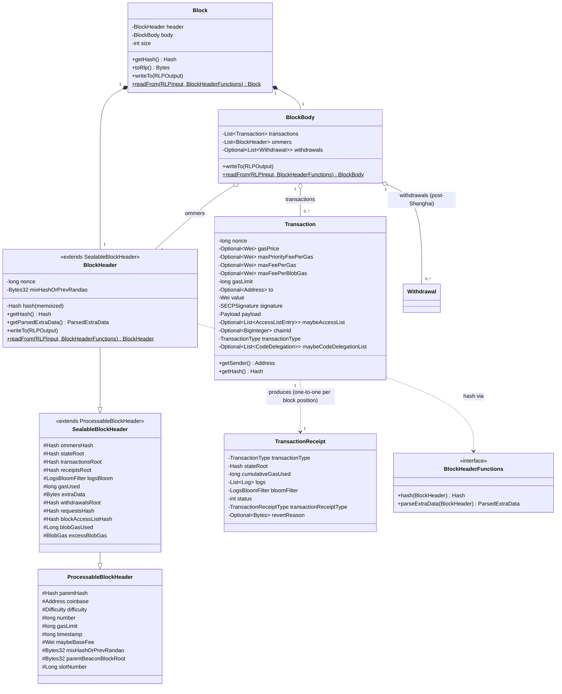
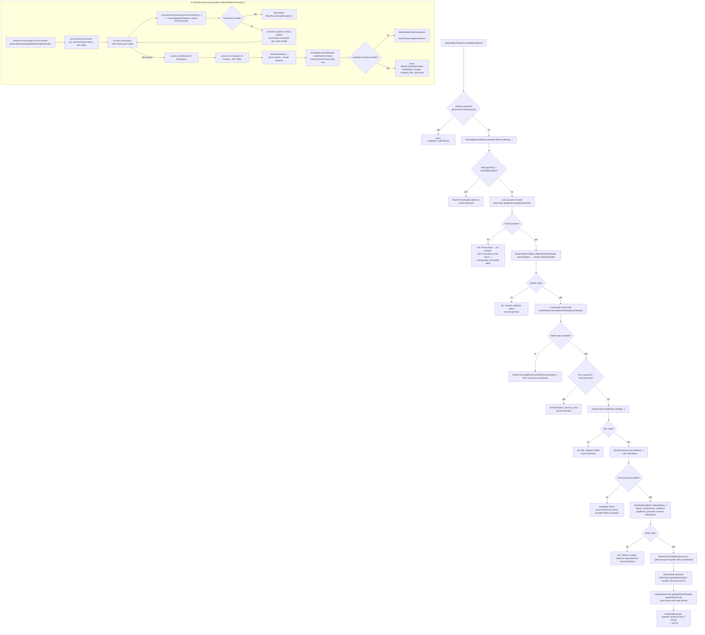

# 07 — `ethereum/core`: Block Data Model and the Block Processing Pipeline

> Source module: `_references/besu/ethereum/core` (package `org.hyperledger.besu.ethereum.core`, plus sibling packages `org.hyperledger.besu.ethereum.chain`, `org.hyperledger.besu.ethereum.mainnet`, and the top-level `org.hyperledger.besu.ethereum` classes that also live in this Gradle module — `MainnetBlockValidator`, `BlockValidationResult`, `BlockProcessingResult`). All class/file references below were read directly from source; ambiguous or version-specific behavior is flagged inline. This repo pins `hyperledger/besu:26.8.1` (see `docs/Besu-config.md` §1), and the vendored source reflects a current/near-current Besu tree — some described mechanisms (EIP‑8037 dual gas accounting, Block Access Lists, `slotNumber`) are recent additions and may not be relevant to every historical Besu release.
>
> Trie/state-storage internals (Merkle-Patricia trie nodes, Bonsai vs. Forest storage formats, flat DB layout) are covered lightly here and in depth by the sibling storage/trie chapter. This chapter's scope is: the block/header/transaction/receipt data model, the RLP wire format, the `chain` package's append/reorg logic, and the `mainnet` package's block-import pipeline.

---

## 1. Role of this module

`ethereum/core` is the structural and behavioral heart of Besu's Ethereum client: it defines what a block *is* (`Block`, `BlockHeader`, `BlockBody`, `Transaction`, `TransactionReceipt`), how those objects are serialized to and from the wire format (RLP), how a node's canonical view of history is stored and updated (`Blockchain` / `MutableBlockchain` / `DefaultBlockchain`), and how a candidate block is validated, executed, and either accepted onto the chain or rejected (`MainnetBlockValidator`, `AbstractBlockProcessor`, `MainnetBlockImporter`).

Almost every other subsystem in Besu — P2P sync, JSON-RPC, mining/block-creation, consensus plugins (QBFT/IBFT2/Clique), the EVM — ultimately calls into this module to interpret or produce a `Block`, or to ask "is this a valid successor to my current chain head, and if I execute it, what world state does it leave behind?" The `mainnet` sub-package is also where Besu's **fork logic** lives: each Ethereum hard fork (Frontier → Homestead → ... → Berlin → London → ... → Cancun/Prague and beyond) is expressed as a `ProtocolSpec` — a fully-wired bundle of validators, an EVM, a transaction processor, and a difficulty/fee-market calculator — and the `ProtocolSchedule` selects the right `ProtocolSpec` for any given block purely from its number/timestamp.

---

## 2. Component diagram — core data structures



**Key points on the data model:**

| Type | File | Notes |
|---|---|---|
| `Block` | `core/Block.java` | Thin wrapper of `{header, body}` plus a lazily-computed RLP `size`. `getHash()` delegates to the header. |
| `BlockHeader` | `core/BlockHeader.java` | Extends `SealableBlockHeader` → `ProcessableBlockHeader`. The header's hash and its `ParsedExtraData` (consensus-specific payload, e.g. QBFT validator list) are both memoized `Supplier`s computed via a pluggable `BlockHeaderFunctions` (e.g. `MainnetBlockHeaderFunctions`), because different consensus mechanisms hash/interpret the header differently. |
| `ProcessableBlockHeader` | `core/ProcessableBlockHeader.java` | The minimal fields needed *before* a block is sealed: `parentHash`, `coinbase`, `difficulty`, `number`, `gasLimit`, `timestamp`, optional `baseFee`, `mixHashOrPrevRandao` (PoW mix hash pre-Merge / `prevRandao` post-Merge), optional `parentBeaconBlockRoot` (EIP-4788), optional `slotNumber`. |
| `SealableBlockHeader` | `core/SealableBlockHeader.java` | Adds the fields only known once the block body is finalized: `ommersHash`, `stateRoot`, `transactionsRoot`, `receiptsRoot`, `logsBloom`, `gasUsed`, `extraData`, optional `withdrawalsRoot` (Shanghai), optional `requestsHash` (Prague/EIP-7685), optional `blockAccessListHash` (`balHash`), optional `blobGasUsed`/`excessBlobGas` (Cancun/EIP-4844). |
| `BlockBody` | `core/BlockBody.java` | `{transactions, ommers, Optional<withdrawals>}`. A comment on the `transactions` field warns that adding a new body field with a header root requires updating `GetBodiesFromPeerTask.BodyIdentifier` and `RawBlockIterator` — a real coupling point to watch. |
| `Transaction` | `core/Transaction.java` | Covers every transaction type (`FRONTIER`=0xf8/legacy, `ACCESS_LIST`=0x01/EIP-2930, `EIP1559`=0x02, `BLOB`=0x03/EIP-4844, `DELEGATE_CODE`=0x04/EIP-7702) in one class, with `Optional` fields for the parameters that don't apply to every type (`gasPrice` vs. `maxFeePerGas`/`maxPriorityFeePerGas`, `maxFeePerBlobGas`, `maybeAccessList`, `maybeCodeDelegationList`). Sender recovery is cached (`senderCache`, a Guava cache keyed by hash) since ECDSA public-key recovery is expensive. |
| `TransactionReceipt` | `core/TransactionReceipt.java` | Two wire formats distinguished by `TransactionReceiptType`: **root-encoded** (pre-Byzantium — carries the post-tx world state root) and **status-encoded** (Byzantium+ — carries a `0`/`1` success status instead). Also carries `cumulativeGasUsed`, `logs`, a `LogsBloomFilter`, and an optional revert reason. |
| `Withdrawal` | `core/Withdrawal.java` | Shanghai EIP-4895 validator withdrawals; part of `BlockBody` and committed to `withdrawalsRoot`. |

### RLP encoding

Every core type implements a symmetric `writeTo(RLPOutput)` / static `readFrom(RLPInput, ...)` pair (Besu's own RLP codec, `ethereum/rlp`), not a general-purpose serialization framework:

- **`Block.writeTo`**: a single RLP list `[header, [tx...], [ommer_header...], [withdrawal...]?]` (`Block.java:67-76`).
- **`BlockHeader.writeTo`**: encodes the 15 "classic" fields (`parentHash` … `nonce`) unconditionally, then a cascading `do { ... break; } while(false)` block that appends `baseFee`, `withdrawalsRoot`, `blobGasUsed`+`excessBlobGas`, `parentBeaconBlockRoot`, `requestsHash`, `blockAccessListHash`, `slotNumber` — each field is only appended if the previous optional field in the chain was also present, so the header's RLP shape naturally reflects which forks are active for that block. If a header was parsed from raw bytes (`rawRlp` is present), `writeTo` just re-emits the original bytes verbatim rather than re-encoding, preserving byte-for-byte round-tripping.
- **`BlockHeader.readFrom`** mirrors this: it reads fields unconditionally up through `nonce`, then keeps reading additional optional fields only `while (!headerRlp.isEndOfCurrentList())`, so older (pre-London, pre-Shanghai, ...) headers with fewer fields decode correctly.
- **`Transaction`** encoding is type-specific and delegated to dedicated encoders (`AccessListTransactionEncoder`, `BlobTransactionEncoder`, `CodeDelegationTransactionEncoder`, generic `TransactionEncoder`), since each `TransactionType` has a distinct EIP-2718 typed-envelope RLP shape.
- **`BodyValidation`** (`mainnet/BodyValidation.java`) computes the trie roots committed to in the header: `transactionsRoot`, `withdrawalsRoot`, and `requestsHash` are all Merkle-Patricia-trie roots over RLP-opaque-encoded lists (`Util.getRootFromListOfBytes`); `requestsHash` is actually a `sha256`-based hash-of-hashes per EIP-7685, not a trie root.

---

## 3. Block-import pipeline (flowchart)

The canonical entry point is `MainnetBlockImporter.importBlock(...)` (`mainnet/MainnetBlockImporter.java`), which delegates almost everything to `MainnetBlockValidator.validateAndProcessBlock(...)` (`ethereum/MainnetBlockValidator.java`) and then, only on success, appends the block to the `MutableBlockchain`.



**Notes grounded in source:**

- **Bad-block bookkeeping is selective.** `handleFailedBlockProcessing` (`MainnetBlockValidator.java:292-328`) only records a block in the `BadBlockManager` when the failure indicates the block itself is invalid. Missing parent data, an unavailable parent world state, and `StorageException`s are all explicitly *not* recorded as bad blocks, because those are local-node conditions, not proof the block is malformed — the code comments say so directly ("Blocks should not be marked bad due to missing data" / "due to a local storage failure").
- **State-root verification happens twice, differently.** Inside `AbstractBlockProcessor`, `worldState.persist(header, stateRootCommitter)` computes the new state root as part of committing world-state changes and throws `StateRootMismatchException` if it doesn't match the header's `stateRoot` (`AbstractBlockProcessor.java:539-559`). Separately, `MainnetBlockBodyValidator.validateBodyRoots` (`mainnet/MainnetBlockBodyValidator.java:77-106`) re-checks `header.getStateRoot()` against `worldState.rootHash()` as part of the body-validation step that runs *after* `processBlock` returns. Both checks exist; either one failing aborts the import.
- **`HeaderValidationMode`** parameterizes how strict header validation is (e.g. `FULL` vs. lighter modes used during fast sync) — see `mainnet/HeaderValidationMode.java`.
- **`shouldRecordBadBlock` / `shouldUpdateHead`** are plumbed as explicit booleans through `validateAndProcessBlock`'s overloads, letting callers (e.g. speculative/simulated execution, or sync-time batch validation) opt out of side effects.
- The **transaction-processing loop** (`AbstractBlockProcessor.processBlock`, `mainnet/AbstractBlockProcessor.java:205-586`) tracks *two* cumulative gas counters per EIP-7778: `cumulativeExecutionGasUsed` (used for block-gas-limit enforcement, strategy-dependent pre/post-refund) and `cumulativeReceiptGasUsed` (always post-refund, what actually lands in each `TransactionReceipt.cumulativeGasUsed`). This split is recent and worth flagging as such if cross-referencing older Besu docs or a different Besu version than `26.8.1`.
- **Block Access Lists (BAL)** (`mainnet.block.access.list.*`, `getBlockAccessListValidator()`/`getBlockAccessListFactory()` on `ProtocolSpec`) are an optional, fork-gated mechanism for tracking which accounts/storage slots a block touched; they're validated both pre-execution (against a supplied BAL, e.g. from a peer) and post-execution (the locally-constructed BAL vs. what was declared). Not every fork populates `blockAccessListFactory`, so this step is a no-op on forks that don't support it.

---

## 4. The `chain` package: `Blockchain` / `MutableBlockchain` and reorgs

- **`Blockchain`** (`chain/Blockchain.java`) is the read-only interface: chain head, headers/bodies/receipts by hash or number, total difficulty, transaction location lookup, and observer registration (`observeBlockAdded`, `observeChainReorg`).
- **`MutableBlockchain`** (`chain/MutableBlockchain.java`) adds the write surface: `appendBlock`, `appendBlockWithoutIndexingTransactions`, `storeBlock` (store without updating chain state), `unsafeStoreHeader`/`unsafeImportBlock`/`unsafeSetChainHead` (used by fast-sync/checkpoint paths that bypass full validation), `rewindToBlock`, `forwardToBlock`, `setFinalized`/`setSafeBlock` (post-Merge fork-choice fields).
- **`DefaultBlockchain`** (`chain/DefaultBlockchain.java`) is the concrete implementation backed by `BlockchainStorage`. The append path:
  1. `appendBlockHelper` (`DefaultBlockchain.java:665-700`) persists the header, body, optional BAL, receipts, and total difficulty unconditionally via a `BlockchainStorage.Updater`.
  2. It then calls `updateCanonicalChainData` (`:799-827`), which branches three ways by comparing the new block's parent hash against the current chain head hash, and — if not a direct extension — the configured `blockChoiceRule` (default: **heaviest total difficulty wins**, `heaviestChainBlockChoiceRule = Comparator.comparing(this::calculateTotalDifficulty)`, `:72-73`):
     - **`handleNewHead`** (`:833-855`) — the common case, the new block extends the current head directly. Updates the number→hash index, sets chain head, indexes transactions, and returns a `BlockAddedEvent` for head advancement.
     - **`handleChainReorg`** (`:873-...`) — the new block's chain is preferred by `blockChoiceRule` but doesn't extend the current head directly. This walks both the old and new chains back to their common ancestor (three `while` loops: advance the longer chain down to the shorter chain's height, then walk both back together until hashes match), tracking added/removed transactions and added/removed logs along the way, re-indexes the surviving transactions, and fires reorg observers.
     - **`handleFork`** (`:857-871`) — the new block is valid but not preferred (lower total difficulty than the current head); it's stored and tracked in `forkHeads` but doesn't become canonical.
  3. `calculateTotalDifficulty` (`:756-767`) is a simple `parent's total difficulty + this block's difficulty`, recursively grounded in genesis (`difficulty` at `GENESIS_BLOCK_NUMBER`). Under QBFT (this repo's consensus), `difficulty` is fixed at `0x1` for every block (see `docs/Besu-config.md` §3), so total difficulty is effectively "block height" — but the comparator logic itself is consensus-agnostic; QBFT's actual fork-choice guarantees come from its BFT voting, not from this difficulty comparison mattering in practice.
- **Unsafe/sync-path methods** (`unsafeImportBlock`, `unsafeImportSyncBodiesAndReceipts`, `unsafeSetChainHead`) exist for bulk import during snap/checkpoint sync, where blocks are already trusted (verified by a checkpoint or by a different validation pipeline) and re-running full validation would be redundant.

---

## 5. Key classes and interfaces

| Class / Interface | File | Responsibility |
|---|---|---|
| `Block` | `ethereum/core/Block.java` | Header + body pairing; RLP round-trip; size caching |
| `BlockHeader` | `ethereum/core/BlockHeader.java` | Full sealed header; memoized hash via `BlockHeaderFunctions`; fork-conditional RLP encode/decode |
| `SealableBlockHeader` / `ProcessableBlockHeader` | `ethereum/core/SealableBlockHeader.java`, `ProcessableBlockHeader.java` | Header field hierarchy split by "known before seal" vs. "known after seal" |
| `BlockBody` | `ethereum/core/BlockBody.java` | Transactions + ommers + optional withdrawals |
| `Transaction` | `ethereum/core/Transaction.java` | All `TransactionType`s in one model; cached sender recovery; builder pattern (`Transaction.builder()`) |
| `TransactionReceipt` | `ethereum/core/TransactionReceipt.java` | Root- vs. status-encoded receipt; logs, bloom, revert reason |
| `Withdrawal` | `ethereum/core/Withdrawal.java` | EIP-4895 validator withdrawal entry |
| `BlockHeaderFunctions` | `ethereum/core/BlockHeaderFunctions.java` | Pluggable header hash / extra-data parsing strategy (consensus-specific, e.g. QBFT vs. mainnet PoW/PoS) |
| `Blockchain` | `ethereum/chain/Blockchain.java` | Read-only canonical-chain query interface |
| `MutableBlockchain` | `ethereum/chain/MutableBlockchain.java` | Write interface: append, store, rewind/forward, finalized/safe block tracking |
| `DefaultBlockchain` | `ethereum/chain/DefaultBlockchain.java` | Concrete `MutableBlockchain`; append/reorg/fork logic; observer dispatch |
| `BlockchainStorage` | `ethereum/chain/BlockchainStorage.java` | Persistence abstraction `DefaultBlockchain` writes through (backed by the storage/trie chapter's KV layer) |
| `GenesisState` | `ethereum/chain/GenesisState.java` | Builds the genesis `Block` + initial world state from `genesis.json` |
| `BadBlockManager` | `ethereum/chain/BadBlockManager.java` | Tracks blocks rejected by validation, with cause |
| `MainnetBlockValidator` | `ethereum/MainnetBlockValidator.java` | Orchestrates header validation → world state lookup → BAL check → processing → body validation |
| `BlockValidationResult` | `ethereum/BlockValidationResult.java` | Base success/error/cause result type |
| `BlockProcessingResult` | `ethereum/BlockProcessingResult.java` | Extends `BlockValidationResult`; carries `BlockProcessingOutputs` (receipts, requests, BAL, world state), partial/world-state-unavailable flags |
| `MainnetBlockImporter` | `ethereum/mainnet/MainnetBlockImporter.java` | Top-level import entry point; calls validator then appends to `MutableBlockchain` |
| `BlockImporter` | `ethereum/core/BlockImporter.java` | Interface `MainnetBlockImporter` implements |
| `BlockValidator` | top-level interface implemented by `MainnetBlockValidator` | `validateAndProcessBlock`, `validateBlockForSyncing` contracts |
| `AbstractBlockProcessor` / `MainnetBlockProcessor` | `ethereum/mainnet/AbstractBlockProcessor.java`, `MainnetBlockProcessor.java` | Per-transaction execution loop, withdrawals, EL requests, coinbase reward, state persistence |
| `MainnetBlockHeaderValidator` | `ethereum/mainnet/MainnetBlockHeaderValidator.java` | Assembles fork-specific header rule sets (`create()`, `mergeBlockHeaderValidator()`, etc.) from composable `AttachedBlockHeaderValidationRule`/`DetachedBlockHeaderValidationRule`s |
| `MainnetBlockBodyValidator` | `ethereum/mainnet/MainnetBlockBodyValidator.java` | Tx root, receipts root, state root, logs bloom, gas-used, ommers, withdrawals validation |
| `BodyValidation` | `ethereum/mainnet/BodyValidation.java` | Static helpers computing `transactionsRoot`, `withdrawalsRoot`, `requestsHash`, `receiptsRoot`, `logsBloom`, `ommersHash` |
| `MainnetTransactionValidator` | `ethereum/mainnet/MainnetTransactionValidator.java` | Per-transaction rule checks — see §7 |
| `MainnetTransactionProcessor` | `ethereum/mainnet/MainnetTransactionProcessor.java` | Drives actual EVM execution of a validated transaction |
| `ProtocolSchedule` / `DefaultProtocolSchedule` | `ethereum/mainnet/ProtocolSchedule.java`, `DefaultProtocolSchedule.java` | Fork → `ProtocolSpec` lookup by block header |
| `ProtocolSpec` | `ethereum/mainnet/ProtocolSpec.java` | Fully-wired rule bundle for one fork (validators, EVM, processors, calculators) |
| `ProtocolSpecBuilder` | `ethereum/mainnet/ProtocolSpecBuilder.java` | Fluent builder `ProtocolSpec` instances are assembled from |
| `MainnetProtocolSpecs` | `ethereum/mainnet/MainnetProtocolSpecs.java` | One static `xDefinition(...)` method per fork, each derived from the previous fork's builder |
| `ProtocolScheduleBuilder` | `ethereum/mainnet/ProtocolScheduleBuilder.java` | Reads `genesis.json` fork-activation fields, builds the milestone list, registers each `ProtocolSpec` |
| `MilestoneDefinitions` | `ethereum/mainnet/milestones/MilestoneDefinitions.java` | Maps each named hard fork to its `GenesisConfigOptions` block-number/timestamp getter and its `MainnetProtocolSpecFactory` method reference |

---

## 6. `ProtocolSchedule` / `ProtocolSpec` and fork selection

Besu doesn't hard-code "if block >= X, use Berlin rules" scattered through the codebase. Instead:

1. **`MainnetProtocolSpecs`** (`ethereum/mainnet/MainnetProtocolSpecs.java`) defines one static factory method per fork — `frontierDefinition`, `homesteadDefinition`, ..., `berlinDefinition`, `londonDefinition`, ... — and each one is built by taking the **previous** fork's `ProtocolSpecBuilder` and calling `.gasCalculator(...)`, `.transactionValidatorFactoryBuilder(...)`, `.hardforkId(...)`, etc. to override only what actually changed. For example, `berlinDefinition` (`MainnetProtocolSpecs.java:528-555`) starts from `muirGlacierDefinition(...)` and layers on `BerlinGasCalculator`, a `TransactionValidatorFactory` that now accepts `TransactionType.ACCESS_LIST` (EIP-2930) in addition to `FRONTIER`, and a Berlin-specific receipt factory. This inheritance chain is how a `ProtocolSpec` for a late fork ends up with the cumulative effect of every earlier fork's rule changes.
2. **`MilestoneDefinitions`** (`ethereum/mainnet/milestones/MilestoneDefinitions.java`) pairs each `HardforkId` with (a) the `GenesisConfigOptions` getter that reads its activation point out of `genesis.json`'s `config` object, and (b) the corresponding `MainnetProtocolSpecFactory` method reference. The Berlin entry is literally:
   ```java
   createBlockNumberMilestone(
       MainnetHardforkId.BERLIN, config.getBerlinBlockNumber(), specFactory::berlinDefinition)
   ```
   This is the direct code path for this repo's `genesis.json` setting `config.berlinBlock: 0` (see `docs/Besu-config.md` §2) — `config.getBerlinBlockNumber()` reads that `0`, and `ProtocolScheduleBuilder` registers the Berlin `ProtocolSpec` as active starting at block number `0`, meaning Berlin rules (and everything they inherit from Frontier through Muir Glacier) apply from genesis.
3. **`ProtocolScheduleBuilder.createMilestones`** (`ethereum/mainnet/ProtocolScheduleBuilder.java:204-229`) walks the ordered list of `MilestoneDefinition`s and buffers any fork whose `GenesisConfigOptions` getter returned an *empty* activation point (i.e. not set in `genesis.json`) into a `pendingDefinitions` list. As soon as it reaches a fork whose getter *did* return a value (`thisForkBlock`), it flushes the buffer: every pending (unset) fork, plus the fork that triggered the flush, all get a milestone entry at that same `thisForkBlock` (`:215-221`). `buildFlattenedMilestoneMap` (`:184-193`) then collapses same-block-number entries via `Collectors.toMap(..., (existing, replacement) -> replacement, ...)`, so only the **last** entry added for a given block survives — which, by construction, is always the most-recently-buffered (i.e. latest/most-fork-advanced) definition for that block. Concretely: if `genesis.json` sets only `berlinBlock: 0` and leaves every later fork (`londonBlock`, `arrowGlacierBlock`, ...) unset, those later forks' definitions keep accumulating in `pendingDefinitions` **forever** — there's no subsequent fork with an explicit value to trigger a flush — so they never produce a milestone at all, and the schedule tops out at Berlin. `addProtocolSpec` then registers each surviving entry via `protocolSchedule.putBlockNumberMilestone(blockNumber, protocolSpec)` (or `putTimestampMilestone` for post-Merge, timestamp-activated forks like Shanghai/Cancun).
4. **Fork lookup at runtime** — `DefaultProtocolSchedule.getByBlockHeader(header)` (`ethereum/mainnet/DefaultProtocolSchedule.java:67-83`) holds `protocolSpecs` as a `NavigableSet<ScheduledProtocolSpec>` sorted in **descending** milestone order, and asserts a milestone exists at block `0` (`"There must be a milestone starting from block 0"`). It then does a linear scan for the *first* entry whose milestone is `<=` the given header — i.e., the highest-numbered milestone that has already been reached. This is called once per block, from `AbstractBlockProcessor.processBlock` (`protocolSchedule.getByBlockHeader(blockHeader)`, `AbstractBlockProcessor.java:230`) and from body validation (`MainnetBlockBodyValidator.validateBodyLight`/`isOmmerValid`), so header validation rules, the EVM version, the transaction validator, the difficulty calculator, and the fee market are all re-resolved per block from the same single source of truth — a block imported at height 1,000,000 automatically gets whichever `ProtocolSpec` the schedule says is active there, with no separate "is this fork active" checks scattered through the validation/processing code.

Net effect for this repo: because `berlinBlock: 0` is the only fork-activation field set in `network-config/genesis.json` (per `docs/Besu-config.md`), every block on this chain — genesis onward — resolves to the Berlin `ProtocolSpec`, which is why this repo's `MiningConfiguration`/`--min-gas-price=0` setup and EIP-2930 access-list transaction support (inherited from Berlin) are both in effect from block 0, while London's base-fee EIP-1559 mechanics are **not** active (no `londonBlock` is set, so `getLondonBlockNumber()` returns empty and no London milestone is registered) — consistent with this repo's `--min-gas-price=0` zero-gas design (`docs/Besu-config.md` §1).

---

## 7. Transaction validation rules

`MainnetTransactionValidator.validate(...)` (`ethereum/mainnet/MainnetTransactionValidator.java:86-...`) runs stateless checks (no world state needed) in this order:

1. **Signature / chain ID** (`validateTransactionSignature`, `:367-404`): if the schedule has a chain ID and the transaction specifies a different one, reject (`WRONG_CHAIN_ID`); if the schedule has no chain ID configured but the transaction is replay-protected (EIP-155), reject (`REPLAY_PROTECTED_SIGNATURES_NOT_SUPPORTED`); if `disallowSignatureMalleability` is set, reject signatures whose `s` value exceeds half the curve order (EIP-2, malleability protection); attempt sender recovery and reject with `INVALID_SIGNATURE` if the curve point can't be decompressed.
2. **Transaction type acceptance**: the resolved `ProtocolSpec`'s `acceptedTransactionTypes` set must contain this transaction's `TransactionType` — this is exactly the mechanism by which, e.g., Berlin accepts `ACCESS_LIST` transactions and pre-Berlin forks reject them.
3. **Nonce overflow**: nonce must be `< 2^64-1` unless future-nonce is explicitly allowed (`NONCE_OVERFLOW`).
4. **Gas limit cap**: transaction gas limit must not exceed `gasLimitCalculator.transactionGasLimitCap()` (a per-fork cap; effectively unbounded pre-Osaka).
5. **Blob checks** (type `BLOB` only): delegated to `MainnetBlobsValidator`; blob count/fee-vs-cap checks against `maxFeePerBlobGas`.
6. **Intrinsic gas / calldata floor**: `gasLimit` must cover `max(intrinsicGasCost, transactionFloorCost)` — the larger of standard intrinsic gas accounting and the EIP-7623-style calldata floor.

Then, once a world-state `Account` for the sender is available, `validateForSender(...)` (`:291-361`) runs the **stateful** checks:

7. **Balance for upfront gas cost**: sender balance must cover `gasLimit * gasPrice` (or the fee-market equivalent), unless underpriced-gas is explicitly allowed.
8. **Balance for value transfer**: if `transaction.getValue()` is non-zero, sender balance (after subtracting upfront gas cost) must cover it (`INSUFFICIENT_FUNDS_FOR_TRANSFER`).
9. **Nonce too low**: `transaction.getNonce() < senderNonce` → `NONCE_TOO_LOW` (unsigned comparison).
10. **Nonce mismatch**: unless future-nonce is allowed, `transaction.getNonce() != senderNonce` → `NONCE_TOO_HIGH`.
11. **Sender-is-not-a-contract** (EIP-3607): unless explicitly allowed, a sender whose account has deployed code (`codeHash != EMPTY`) is rejected as `TX_SENDER_NOT_AUTHORIZED` — with a carve-out for EIP-7702 delegated code (`hasCodeDelegation(sender.getCode())`), since EIP-7702 intentionally lets EOAs carry delegated code and still originate transactions.

This two-phase split (stateless checks that need only the `Transaction` object, then stateful checks that need a resolved sender `Account`) is why transaction-pool admission (which may not always have fresh world state) and in-block validation (which always does) can share the same validator with different `TransactionValidationParams`.

---

## 8. World state / account model (brief — see storage/trie chapter for depth)

The account model this module's block processing reads and writes is defined by the EVM module's `Account`/`AccountState` interfaces (`evm/src/main/java/org/hyperledger/besu/evm/account/AccountState.java`), not duplicated here — `ethereum/core`/`ethereum/worldstate` consume it. Each account exposes:

| Field | Accessor | Notes |
|---|---|---|
| Nonce | `getNonce(): long` | Transaction counter; checked against `Transaction.getNonce()` during validation (§7) |
| Balance | `getBalance(): Wei` | Checked against upfront gas cost + value transfer (§7) |
| Code hash | `getCodeHash(): Hash` | `Hash.EMPTY` for externally-owned accounts; used by the EIP-3607 sender check and by EVM `CALL`/`DELEGATECALL` dispatch |
| Storage | `getStorageValue(UInt256 key): UInt256` | Per-slot access; backed by a Merkle-Patricia trie whose root is the account's `storageRoot` (the classic "storageRoot" field of pre-Bonsai state) |

`ethereum/core/worldstate` in this module contributes the higher-level plumbing around this model: `WorldStateArchive` (locates/loads the `MutableWorldState` for a given block header — used throughout the pipeline in §3 as `context.getWorldStateArchive().getWorldState(...)`), `WorldStateQueryParams` (the builder used to request a world state "as of" a parent header, optionally moving the head pointer), `DataStorageConfiguration`/`FlatDbMode` (Bonsai vs. Forest storage-format selection). The actual trie implementation, flat-database layout, and Bonsai world-state-update-accumulator mechanics are covered by the dedicated storage/trie chapter — this module treats `MutableWorldState`/`WorldUpdater` as an interface it drives (create a per-block `WorldUpdater`, a stacked per-transaction `WorldUpdater`, commit or discard), without needing to know how state is physically stored.

---

## 9. Cross-references

- Storage/trie internals (Merkle-Patricia trie, Bonsai vs. Forest, flat DB): sibling storage-trie chapter.
- Genesis construction (`GenesisState`, `genesis.json` parsing into the first `Block`): see `docs/Besu-config.md` §2-§3 for this repo's actual genesis values, and `ethereum/chain/GenesisState.java` for the code path.
- QBFT-specific header semantics (`extraData` validator list/votes/seals, `BlockHeaderFunctions` implementation for QBFT): the `BlockHeaderFunctions` abstraction in §2 is exactly the seam QBFT uses to hash/parse its headers differently from mainnet PoW/PoS headers — this repo runs QBFT (`docs/Besu-config.md` §3), not the `MainnetBlockHeaderFunctions` shown in the examples above.
