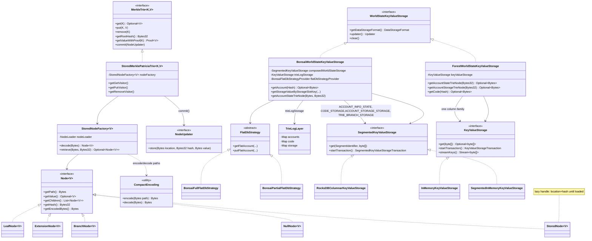
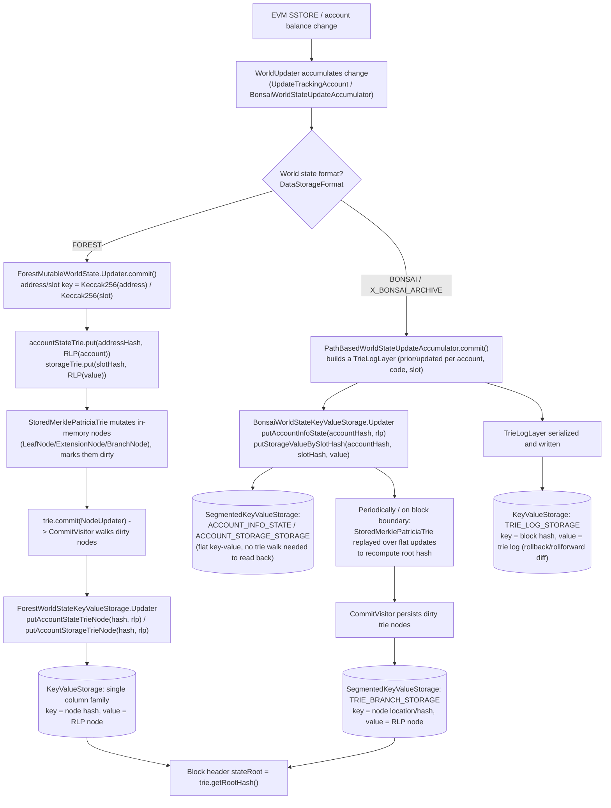

# 08 — State Storage and the Merkle Trie

> Source: Hyperledger Besu source vendored at `_references/besu` (module layout matches upstream `hyperledger/besu`). All class names, file paths, and behavior below are read directly from that checkout — this repo pins `hyperledger/besu:26.8.1` (`docker-compose.yml`), and the code referenced here is what ships in that image's version line. Primary packages covered:
> - `_references/besu/ethereum/trie/src/main/java/org/hyperledger/besu/ethereum/trie/**` — the Merkle Patricia Trie engine
> - `_references/besu/ethereum/core/src/main/java/org/hyperledger/besu/ethereum/trie/forest/**` and `.../trie/pathbased/bonsai/**` — the two world-state storage strategies
> - `_references/besu/ethereum/core/src/main/java/org/hyperledger/besu/ethereum/worldstate/**` and `.../storage/**` — world-state archive/coordinator plumbing
> - `_references/besu/services/kvstore/plugin-api/src/main/java/org/hyperledger/besu/plugin/services/storage/**` — the `KeyValueStorage` backend abstraction
> - `_references/besu/plugins/rocksdb/**` — the RocksDB backend implementation
> - `_references/besu/services/kvstore/src/main/java/org/hyperledger/besu/services/kvstore/**` — the in-memory backend implementation

---

## 1. Overview

Besu's "state" is the set of all account balances, nonces, code, and contract storage slots as of a given block — the thing `stateRoot` in every block header commits to. Two problems drive everything in this chapter:

1. **Integrity/verifiability** — every node must be able to prove, with a single 32-byte hash, that its view of millions of accounts and storage slots is identical to every other node's. Ethereum solves this with a **Merkle Patricia Trie (MPT)**: a hash-linked radix tree where the root hash is a cryptographic commitment to the entire state.
2. **State growth vs. I/O cost** — Ethereum mainnet state is hundreds of GB and grows every block. A naive trie stores one key-value pair per node and needs `O(log₁₆ n)` random disk reads per account touched, and a naive re-persist strategy after each block would duplicate the same subtrees across every historical trie ever committed. This is the core tension Besu's two world-state storage strategies (Forest and Bonsai, §5) exist to manage differently: disk footprint vs. write amplification vs. sync/import speed vs. how cheaply you can roll state back to a recent parent block (e.g. on a short reorg).

Every state read or write in Besu ultimately becomes a get/put against a `KeyValueStorage` (§4), keyed either by a Merkle node's Keccak-256 hash (trie-first, "Forest" strategy) or by the Keccak-256 hash of an account address / storage slot directly ("flat", "Bonsai" strategy, with the trie kept alongside for root-hash computation and proofs).

Besu does **not** implement Verkle tries. A repository-wide search for `Verkle` across `_references/besu` (class names, package names, source text) returns no matches — there is no Verkle trie code path, no `VerkleTrie` class, no Verkle-related CLI flag or genesis config. State commitment in this codebase is Merkle-Patricia-only.

---

## 2. Component Diagram



---

## 3. State Read/Write Path

The flow below traces a contract-storage write from EVM execution down to the physical `KeyValueStorage`, covering both strategies. Bonsai commits the flat key-value entry directly and defers trie-node hashing/persistence; Forest has no flat layer and writes only through the trie.



---

## 4. Key Classes and Interfaces

### 4.1 Trie engine (`_references/besu/ethereum/trie/src/main/java/org/hyperledger/besu/ethereum/trie/`)

| Class / Interface | File | Responsibility |
|---|---|---|
| `MerkleTrie<K,V>` | `MerkleTrie.java` | Core contract: `get`/`put`/`remove`/`getRootHash`/`getValueWithProof`/`commit`/`entriesFrom`. Defines `EMPTY_TRIE_NODE_HASH` (Keccak256 of RLP-encoded empty string) as the canonical empty-trie root. |
| `StoredMerklePatriciaTrie<K,V>` | `patricia/StoredMerklePatriciaTrie.java` | The production `MerkleTrie` implementation backed by a `NodeLoader` (lazy, on-demand node fetch from storage). Used by both Forest and Bonsai. |
| `SimpleMerklePatriciaTrie<K,V>` | `patricia/SimpleMerklePatriciaTrie.java` | Fully in-memory variant (no lazy loading) — used in tests and for small/ephemeral tries. |
| `ParallelStoredMerklePatriciaTrie<K,V>` | `patricia/ParallelStoredMerklePatriciaTrie.java` | Variant that parallelizes trie-node loading/commit across an `ExecutorService`. |
| `Node<V>` | `Node.java` | Interface implemented by all four node kinds; exposes `getPath`, `getValue`, `getChildren`, `getHash`, `getEncodedBytes`/`getEncodedBytesRef` (RLP), `isDirty`/`markDirty`. |
| `LeafNode<V>` | `patricia/LeafNode.java` | Terminal node: RLP-encodes `[compactPath, value]`. Hash is `Keccak256(encodedBytes)`, memoized via `SoftReference`. |
| `ExtensionNode<V>` | `patricia/ExtensionNode.java` | Shared-nibble-prefix node pointing at exactly one child (a `BranchNode`). RLP-encodes `[compactPath, childRef]`. |
| `BranchNode<V>` | `patricia/BranchNode.java` | 16-way fan-out node (`maxChild() == 16`, one slot per hex nibble) plus an optional value slot. RLP-encodes `[child0..child15, value]`. Handles node collapsing (`maybeFlatten`) when a branch is reduced to one child. |
| `NullNode<V>` | `NullNode.java` | Singleton representing "no node here"; RLP-encodes to `0x80` (empty string). |
| `StoredNode<V>` | `StoredNode.java` | Lazy placeholder: holds only a `location` + `Bytes32 hash` until `.load()` triggers `StoredNodeFactory.retrieve()`. This is what makes the trie "lazy" — subtrees not on the access path are never deserialized. |
| `StoredNodeFactory<V>` | `patricia/StoredNodeFactory.java` | Builds/decodes nodes; `decode()` RLP-dispatches on list arity: 1 item → null node, 2 items → leaf or extension (disambiguated by the compact-encoding leaf-terminator flag), 17 items → branch. Delegates node bytes lookup to a `NodeLoader`. |
| `CompactEncoding` | `CompactEncoding.java` | Implements Ethereum's hex-prefix (HP) path encoding: `bytesToPath`/`pathToBytes` convert bytes↔nibbles with a `LEAF_TERMINATOR` (`0x10`) sentinel nibble; `encode`/`decode` pack nibble paths into the compact RLP form with the odd-length/leaf-flag metadata nibble. |
| `GetVisitor<V>` / `PutVisitor<V>` / `RemoveVisitor<V>` | `patricia/*.java` | `PathNodeVisitor` implementations that walk the trie nibble-by-nibble from the root, matching/creating/deleting nodes as needed. `PutVisitor` splits leaves/extensions and grows branches; `RemoveVisitor` collapses branches back down via `BranchNode.maybeFlatten`. |
| `CommitVisitor<V>` | `CommitVisitor.java` | Post-order walk over dirty nodes only; calls `NodeUpdater.store(location, hash, rlp)` for any node whose RLP encoding is ≥ 32 bytes (nodes smaller than a hash are inlined by the protocol and never separately persisted — standard Ethereum MPT rule). |
| `NodeUpdater` | `NodeUpdater.java` | One-method functional interface (`store(location, hash, value)`) — the seam between the trie and whatever `KeyValueStorage`/`Updater` is doing the actual persistence. |
| `Proof<V>` / `ProofVisitor<V>` | `Proof.java`, `ProofVisitor.java` | `ProofVisitor` extends `GetVisitor` and records every visited node that is either the root or "referenced by hash" (i.e. ≥32 bytes, so it exists as a standalone stored node) into an ordered list — this is Besu's Merkle proof: the minimal set of RLP-encoded nodes needed to verify a `get()` result against a known root hash. Used for `eth_getProof` and by snap-sync range proofs. |
| `TrieIterator` | `TrieIterator.java` | In-order leaf iteration support, used by `entriesFrom`/range-collection (`RangeStorageEntriesCollector`), which backs snap-sync's ranged account/storage retrieval. |

### 4.2 World-state storage strategies

| Class | File | Responsibility |
|---|---|---|
| `WorldStateKeyValueStorage` | `ethereum/core/.../plugin-api-worldstate-backend/.../WorldStateKeyValueStorage.java` | Shared plugin-API interface both strategies implement: `getDataStorageFormat()`, `updater()`, `clear()`. |
| `ForestWorldStateKeyValueStorage` | `ethereum/core/.../trie/forest/storage/ForestWorldStateKeyValueStorage.java` | Forest backend: a single `KeyValueStorage`, keyed purely by node/code hash. No flat layer. |
| `ForestMutableWorldState` | `ethereum/core/.../trie/forest/worldview/ForestMutableWorldState.java` | Forest world state: one account trie (`MerkleTrie<Bytes32,Bytes>`) plus one storage trie per touched account. Account key = `address.addressHash()` (Keccak256(address)); storage key = `Hash.hash(slotKey)` (Keccak256 of the 32-byte slot) — this is the classic Ethereum "secure trie" (all trie keys are pre-hashed, never raw addresses/slots). |
| `BonsaiWorldStateKeyValueStorage` | `ethereum/core/.../trie/pathbased/bonsai/storage/BonsaiWorldStateKeyValueStorage.java` | Bonsai backend: a `SegmentedKeyValueStorage` (4 segments: `ACCOUNT_INFO_STATE`, `CODE_STORAGE`, `ACCOUNT_STORAGE_STORAGE`, `TRIE_BRANCH_STORAGE`) plus a separate `TRIE_LOG_STORAGE`. Same address/slot hashing as Forest (`Hash.hash`), but the flat segments are keyed *directly* by the hash — no trie walk needed for `get`. |
| `PathBasedWorldState` / `BonsaiWorldState` | `.../trie/pathbased/bonsai/worldview/*.java` | Bonsai mutable world state and its `WorldView`; `PathBasedWorldStateUpdateAccumulator` batches account/code/storage changes per block into a `TrieLogLayer` before commit. |
| `FlatDbStrategy` (+ `BonsaiFullFlatDbStrategy`, `BonsaiPartialFlatDbStrategy`) | `.../bonsai/storage/flat/*.java` | Strategy objects implementing the actual flat-DB get/put logic; Full assumes the flat segment is a complete mirror of the trie (trie is only a fallback for legacy data); Partial falls back to walking the trie on a flat-DB miss. Selected by `FlatDbMode` (§5). |
| `TrieNodeStrategy` / `BonsaiTrieNodeStrategy` | `.../bonsai/storage/trienode/*.java` | Abstracts how Bonsai trie nodes are keyed/stored in `TRIE_BRANCH_STORAGE` (plain vs. archive-aware, see `ArchiveTrieNodeStrategy`). |
| `TrieLogLayer` | `.../bonsai/trielog/TrieLogLayer.java` | Per-block diff: maps of `Address -> BonsaiValue<AccountValue>` (prior/updated), code, and `Address -> Map<StorageSlotKey, BonsaiValue<UInt256>>`. This is what lets Bonsai roll a world state forward or backward by one block without touching the trie — it is the mechanism behind cheap block-import rollback and the bounded "in-memory recent blocks" cache. |
| `TrieLogManager` / `TrieLogPruner` | `.../bonsai/trielog/*.java` | Bounds how many trie logs are retained (`DataStorageConfiguration`'s `getMaxLayersToLoad`, default 512) and prunes older ones so `TRIE_LOG_STORAGE` doesn't grow unbounded. |
| `WorldStateArchive` | `ethereum/core/.../worldstate/WorldStateArchive.java` | Top-level interface: resolves a `MutableWorldState` for a given root/block hash, produces account proofs (`getAccountProof`), independent of which storage format is active. |
| `WorldStateStorageCoordinator` | `ethereum/core/.../worldstate/WorldStateStorageCoordinator.java` | Dispatch shim: routes calls to the Bonsai or Forest storage implementation based on `getDataStorageFormat()` (`applyForStrategy(bonsaiFn, forestFn)`), so most call sites don't need `instanceof` checks. |
| `PmtStateTrieAccountValue` | `ethereum/trie/common/PmtStateTrieAccountValue.java` (referenced from both strategies) | The RLP-serialized account record stored at each address-hash key: `(nonce, balance, storageRoot, codeHash)` — the standard Ethereum account structure. |

### 4.3 Key-value storage backend abstraction

| Class / Interface | File | Responsibility |
|---|---|---|
| `KeyValueStorage` | `services/kvstore/plugin-api/.../storage/KeyValueStorage.java` | Non-segmented backend contract: `get`/`containsKey`/`stream`/`streamFromKey`/`streamKeys`/`tryDelete`/`startTransaction`/`clear`. All keys/values are raw `byte[]`. |
| `SegmentedKeyValueStorage` | `services/kvstore/plugin-api/.../storage/SegmentedKeyValueStorage.java` | Same shape as `KeyValueStorage` but every op takes a `SegmentIdentifier` — Besu's analogue of RocksDB column families, used so logically distinct data (accounts vs. code vs. trie nodes vs. blockchain) share one physical DB handle without key collisions. |
| `KeyValueStorageTransaction` / `SegmentedKeyValueStorageTransaction` | same package | Batch/atomic write handles returned by `startTransaction()`; `commit()`/`rollback()`. |
| `SnappableKeyValueStorage` / `SnappedKeyValueStorage` | same package | Point-in-time read snapshot support, used by Bonsai to give each in-flight block processing a consistent view while other blocks commit underneath it. |
| `KeyValueStorageFactory` | same package | Plugin-registered factory (`StorageService`/`StorageServiceImpl` in `app/.../services/StorageServiceImpl.java`) — this is the pluggability seam: any Besu plugin can register a new backend by implementing this factory and the interfaces above. |
| `RocksDBKeyValueStorageFactory` | `plugins/rocksdb/.../rocksdb/RocksDBKeyValueStorageFactory.java` | Built-in, default production backend. Builds a `RocksDBColumnarKeyValueStorage` (or `TransactionDBRocksDBColumnarKeyValueStorage` / `OptimisticRocksDBColumnarKeyValueStorage` depending on `--Xplugin-rocksdb-high-spec-enabled` and use case) mapping each `SegmentIdentifier` to a RocksDB column family. Tracks on-disk format via `BaseVersionedStorageFormat` (e.g. `BONSAI_WITH_RECEIPT_COMPACTION`, `FOREST_WITH_VARIABLES`) recorded in `DatabaseMetadata` so Besu can detect/refuse an incompatible on-disk layout at startup. |
| `RocksDBCLIOptions` | `plugins/rocksdb/.../configuration/RocksDBCLIOptions.java` | Tunables: `DEFAULT_MAX_OPEN_FILES = 1024`, `DEFAULT_CACHE_CAPACITY = 128 MiB` (134217728 bytes), `DEFAULT_BACKGROUND_THREAD_COUNT = 4`, high-spec mode flag, snapshot read-cache flag. |
| `InMemoryKeyValueStorage` / `SegmentedInMemoryKeyValueStorage` | `services/kvstore/src/main/java/org/hyperledger/besu/services/kvstore/*.java` | Backend used for tests and ephemeral/in-process scenarios: a `TreeMap`/`ConcurrentHashMap`-backed store with no disk I/O, implementing the same `KeyValueStorage`/`SegmentedKeyValueStorage` contracts as RocksDB — proof that the abstraction is genuinely pluggable, not RocksDB-shaped leaking through. |
| `LayeredKeyValueStorage` | `services/kvstore/src/main/java/org/hyperledger/besu/services/kvstore/LayeredKeyValueStorage.java` | Copy-on-write overlay over a parent store, used for Bonsai's per-block "world state layer" so uncommitted block processing never mutates the committed base directly. |
| `KeyValueSegmentIdentifier` | `ethereum/core/.../storage/keyvalue/KeyValueSegmentIdentifier.java` | The enum of all segments/column families Besu ever uses (`BLOCKCHAIN`, `WORLD_STATE` [Forest], `ACCOUNT_INFO_STATE`/`CODE_STORAGE`/`ACCOUNT_STORAGE_STORAGE`/`TRIE_BRANCH_STORAGE`/`TRIE_LOG_STORAGE` [Bonsai], plus sync/backward-sync/pruning segments), each tagged with which `DataStorageFormat`(s) it applies to. |

---

## 5. World-State Storage Strategy Comparison

`DataStorageFormat` (`services/kvstore/plugin-api/.../storage/DataStorageFormat.java`) defines exactly three values — this is the authoritative list; there is no fourth strategy anywhere in the source tree:

```java
public enum DataStorageFormat {
  FOREST,             // Original format. Store all tries
  BONSAI,             // New format. Store one trie, and trie logs to roll forward and backward
  X_BONSAI_ARCHIVE;   // Storing archive data e.g. state at any block
}
```

`DataStorageConfiguration.DEFAULT_CONFIG` sets `dataStorageFormat(DataStorageFormat.BONSAI)` — **Bonsai is Besu's default** for new databases (CLI: `--data-storage-format`).

| | **Forest** | **Bonsai** | **X_BONSAI_ARCHIVE** |
|---|---|---|---|
| Package | `ethereum.trie.forest.*` | `ethereum.trie.pathbased.bonsai.*` | same package, `X_BONSAI_ARCHIVE` format flag |
| Core idea | Every historical world state is its own full Merkle trie; unchanged subtrees between blocks are shared via identical node hashes (hence "forest" of tries sharing branches) | One flat key-value snapshot mirrors *current* state directly (`ACCOUNT_INFO_STATE`, `ACCOUNT_STORAGE_STORAGE`); the trie (`TRIE_BRANCH_STORAGE`) exists mainly to compute/verify the root hash and serve proofs, not to serve normal reads | Bonsai's flat/trie split plus keyed, retained history so *any* past block's account/storage state remains queryable (extra segments: `ACCOUNT_INFO_STATE_ARCHIVE`, `ACCOUNT_STORAGE_ARCHIVE`, `TRIE_BRANCH_STORAGE_ARCHIVE`) |
| Read path (account/storage) | Always a trie walk from the root — `O(depth)` random reads through `StoredNodeFactory.retrieve` | Direct flat-segment key lookup (`BonsaiWorldStateKeyValueStorage.getAccount`/`getStorageValueByStorageSlotKey`) — `O(1)` KV get in `FULL`/`ARCHIVE` flat-DB mode; falls back to a trie walk on a flat miss in `PARTIAL` mode | Same as Bonsai, plus an explicit historical-block lookup path via the archive segments/`ArchiveHistoryReader` |
| Write path | Every changed leaf mutates the trie in memory; `commit()` persists every dirty node via `CommitVisitor` — writes are proportional to trie depth touched, and unrelated old tries are never pruned automatically | Flat segment updated directly (cheap); a `TrieLogLayer` diff is written per block to `TRIE_LOG_STORAGE`; trie-node recomputation/persistence happens alongside but flat reads never depend on it being up to date first | Same as Bonsai plus archive-strategy writes (`BonsaiArchiveFlatDbStrategy`, `ArchiveTrieNodeStrategy`) that additionally key entries by block/version so old values are retained instead of overwritten |
| Rollback to a recent parent (short reorg) | Re-walk/re-root the trie to the old root hash — no explicit "undo" structure; relies on old nodes still being present (nothing pruned) | Apply the stored `TrieLogLayer` for the block being unwound in reverse (`prior` values) — O(changes in that block), not O(state size) | Same mechanism as Bonsai; archive retention additionally means far-in-the-past states remain queryable, not just "roll back a few blocks" |
| Disk usage over time | Grows fastest: unpruned, every historical trie node ever created stays on disk (only mitigated by the separate, opt-in `PRUNING_STATE` segment/pruner) | Bounded better: flat segments hold only current state; `TrieLogPruner` caps retained trie logs (`getMaxLayersToLoad`, default 512 blocks) so old diffs are eventually discarded | Largest by design — archive mode intentionally retains historical state instead of discarding it, trading disk for full historical queryability |
| Sync/import speed | Slower — every block's state changes require full trie mutation + hashing even though most reads during import don't need trie structure at all | Faster for normal use — flat writes are direct KV puts; trie maintenance can lag behind without blocking flat reads (`FlatDbMode.PARTIAL` explicitly exists as a fallback for exactly this transitional case) | Similar write path to Bonsai; extra archive bookkeeping adds overhead per historical write |
| Sub-mode toggle | None | `FlatDbMode`: `PARTIAL` (flat DB incomplete, trie is fallback — used for backward compatibility / mid-migration `DEFAULT_BONSAI_PARTIAL_DB_CONFIG`) vs. `FULL` (flat DB is complete, trie never consulted for normal reads — **default**, since `ExtraStorageConfiguration.Unstable.DEFAULT_FULL_FLAT_DB_ENABLED = true`) vs. `ARCHIVE` (Bonsai archive's own flat mode) | Same `FlatDbMode` enum, `ARCHIVE` value specifically for this format |
| Where selected | `--data-storage-format=FOREST` | `--data-storage-format=BONSAI` (implicit default) | `--data-storage-format=X_BONSAI_ARCHIVE` |
| Storage support in `KeyValueSegmentIdentifier` | `WORLD_STATE`, `PRUNING_STATE` segments (Forest-only) | `ACCOUNT_INFO_STATE`, `CODE_STORAGE`, `ACCOUNT_STORAGE_STORAGE`, `TRIE_BRANCH_STORAGE`, `TRIE_LOG_STORAGE` | Bonsai segments plus `ACCOUNT_INFO_STATE_ARCHIVE`, `ACCOUNT_STORAGE_ARCHIVE`, `TRIE_BRANCH_STORAGE_ARCHIVE` |

**No Verkle trie strategy exists.** `DataStorageFormat` has exactly the three values above; there is no `VERKLE` (or similarly named) enum constant, no Verkle package under `ethereum/trie`, and the repo-wide `grep -ri verkle` across `_references/besu` returns zero matches. Any Verkle-related roadmap item (a known upstream Ethereum-protocol direction) is not present in this vendored version line — do not assume it exists without re-checking a newer checkout.

---

## 6. State Persistence in This Repo

This repo's `docker-compose.yml` mounts no persistent volume for any Besu container's `--data-path` (`/data/db`) — state lives only in the container's writable layer. Whatever `DataStorageFormat`/backend combination a given Besu image version defaults to (Bonsai-on-RocksDB per §5 above), every validator's and RPC node's full world state — flat segments, trie nodes, and trie logs alike — is wiped on `docker compose down -v`, and the chain restarts from `genesis.json` on the next `docker compose up`. This is a deliberate MVP tradeoff (see `docs/architecture.md` §2, "Besu chain data: Ephemeral, reset every `docker compose down`") favoring a clean, reproducible demo state over session continuity; it has no bearing on which storage strategy Besu itself uses internally, only on whether that storage survives a compose teardown.

---

## 7. Related Source

- Trie engine: `_references/besu/ethereum/trie/src/main/java/org/hyperledger/besu/ethereum/trie/`
- Forest strategy: `_references/besu/ethereum/core/src/main/java/org/hyperledger/besu/ethereum/trie/forest/`
- Bonsai / archive strategy: `_references/besu/ethereum/core/src/main/java/org/hyperledger/besu/ethereum/trie/pathbased/bonsai/`
- World-state archive/coordinator: `_references/besu/ethereum/core/src/main/java/org/hyperledger/besu/ethereum/worldstate/`
- KV backend abstraction: `_references/besu/services/kvstore/plugin-api/src/main/java/org/hyperledger/besu/plugin/services/storage/`
- RocksDB backend: `_references/besu/plugins/rocksdb/src/main/java/org/hyperledger/besu/plugin/services/storage/rocksdb/`
- In-memory backend: `_references/besu/services/kvstore/src/main/java/org/hyperledger/besu/services/kvstore/`
