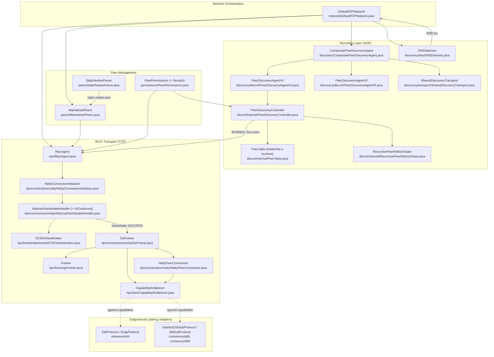
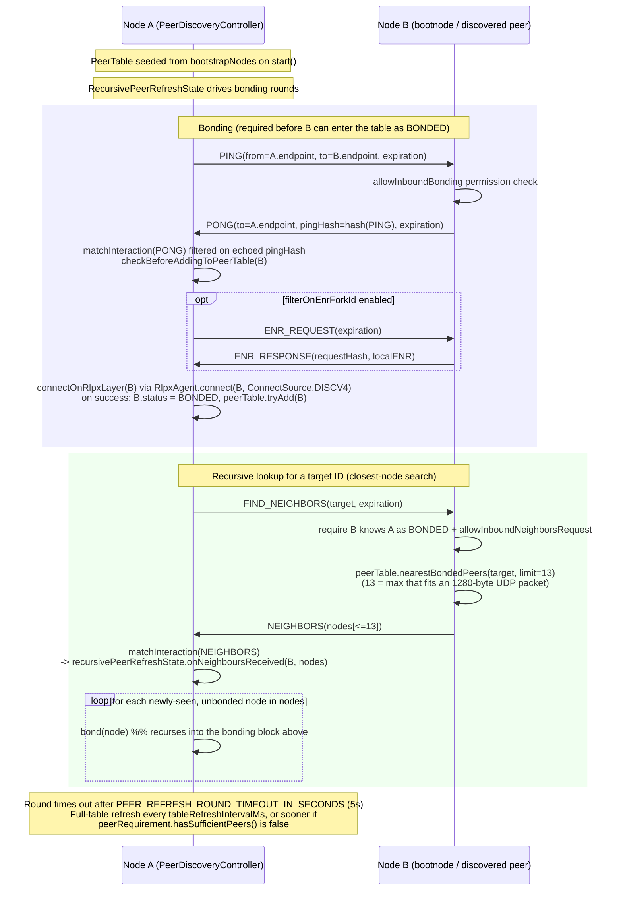

# 09 · P2P Networking

> Covers Besu's peer-to-peer networking layer: RLPx transport, node discovery, peer/connection management, and the static-nodes path this repo actually uses. Source is vendored at `_references/besu/ethereum/p2p` (module `org.hyperledger.besu.ethereum.p2p`). All class names, file paths and behavior below are read directly from that source tree, not from the Ethereum spec in the abstract — where the spec and the code diverge, the code wins and is called out.

---

## 1. Layered overview

Besu's `ethereum/p2p` module implements devp2p in three loosely-coupled layers, wired together by `DefaultP2PNetwork`:

| Layer | Package | Responsibility |
|---|---|---|
| **Discovery** | `discovery/`, `discovery/discv4`, `discovery/discv5`, `discovery/dns` | UDP-only. Finds candidate peers via a Kademlia-style DHT (discv4) and/or discv5, or a DNS node list. Produces `DiscoveryPeer` records with reachable enodes. Never carries application data. |
| **RLPx transport** | `rlpx/handshake`, `rlpx/framing`, `rlpx/connections`, `rlpx/wire` | TCP-only. Performs the ECIES encrypted handshake, frames/encrypts/MACs every message, exchanges `HELLO` and negotiates shared capabilities, and exposes the resulting `PeerConnection` to upper layers. |
| **Peer/connection management** | `peers/`, `permissions/`, `rlpx/RlpxAgent` | Tracks maintained (admin/static) peers vs. discovered peers, enforces `--max-peers` and permissioning hooks, decides who to dial and when. |
| **Network orchestration** | `network/DefaultP2PNetwork` | The composition root: starts the RLPx listener, starts discovery, periodically reconciles maintained peers and discovered peers into actual RLPx connections. |
| **Subprotocols (sibling chapters)** | outside `ethereum/p2p` — `ethereum/eth` (`EthProtocol`, `SnapProtocol`), `consensus/qbft`/`consensus/ibft` (`Istanbul100SubProtocol`, `IbftSubProtocol`) | Everything that rides on top of an established RLPx connection once capabilities are agreed — `eth/66` sync, `snap`, and QBFT/IBFT2 consensus messages. This chapter only shows the handoff point (§3, §5); message-level detail belongs to the eth-protocol/sync chapter. |

Discovery and RLPx transport are intentionally independent: discovery's job ends at "here is an enode worth dialing"; RLPx's job starts at "dial this enode and authenticate it." `DefaultP2PNetwork.attemptPeerConnections()` is the bridge — it polls `streamDiscoveredPeers()` and calls `RlpxAgent.connect(...)` for peers not already connected.

---

## 2. Component diagram



---

## 3. RLPx handshake sequence

The handshake is implemented by `ECIESHandshaker` (crypto state machine) driven by `AbstractHandshakeHandler` / `HandshakeHandlerOutbound` / `HandshakeHandlerInbound` (Netty glue), producing `HandshakeSecrets` consumed by `Framer`. Message shapes follow `InitiatorHandshakeMessageV4` / `ResponderHandshakeMessageV4` (EIP-8 format only — Besu's `ECIESHandshaker` only implements the modern EIP-8 encoding, not the legacy pre-EIP-8 fixed-size handshake).

```mermaid
sequenceDiagram
    participant A as Node A (initiator)
    participant B as Node B (responder)

    Note over A,B: TCP connect (NettyConnectionInitializer.connect)
    A->>A: ECIESHandshaker.prepareInitiator(nodeKey, B.staticPubKey)<br/>generate ephemeral keypair + 32-byte nonce
    A->>B: auth = ECIES-encrypt(EIP-8: staticPubKeyA, ephPubKeyA sig, nonceA)<br/>encrypted to B's static pubkey

    B->>B: ECIESHandshaker.prepareResponder(nodeKey)
    B->>B: handleMessage(auth): decrypt, recover ephPubKeyA + nonceA,<br/>verify keccak256(ephPubKeyA) matches signed hash
    B->>B: generate own ephemeral keypair + nonceB
    B->>A: ack = ECIES-encrypt(EIP-8: ephPubKeyB, nonceB)<br/>encrypted to A's static pubkey

    A->>A: handleMessage(ack): decrypt, recover ephPubKeyB + nonceB
    par both sides independently
        A->>A: computeSecrets(): ECDH(ephPrivA, ephPubB) -> sharedSecret<br/>-> aesSecret, macSecret, egress/ingress MAC seeds
        B->>B: computeSecrets(): ECDH(ephPrivB, ephPubA) -> identical sharedSecret
    end
    Note over A,B: handshaker.getStatus() == SUCCESS on both sides<br/>Framer(secrets) installed in place of AbstractHandshakeHandler (DeFramer)

    A->>B: HELLO (frame-encrypted, AES-256-CTR + MAC)<br/>p2pVersion, clientId, capabilities[], listenPort, nodeId
    B->>A: HELLO (frame-encrypted)

    B->>B: verify HELLO.nodeId == authenticatedNodeId from ECIES handshake<br/>(DeFramer.decode - guards against identity mismatch)
    A->>A: verify HELLO.nodeId == authenticatedNodeId

    Note over A,B: CapabilityMultiplexer(subProtocols, localCaps, peerCaps)<br/>agreed = intersection, highest version per protocol name,<br/>offset-assigned beyond the 16 codes reserved for wire protocol

    alt no shared capabilities
        A--xB: DISCONNECT(USELESS_PEER_NO_SHARED_CAPABILITIES)
    else capabilities agreed
        Note over A,B: pipeline upgraded: IdleStateHandler(15s) + WireKeepAlive<br/>+ ApiHandler + MessageFramer; NettyPeerConnection created<br/>RlpxAgent.dispatchConnect() -> ConnectCallback subscribers fire
        A->>B: eth/66 STATUS (first subprotocol message - handoff to eth-protocol chapter)
        B->>A: eth/66 STATUS
    end
```

Key implementation notes grounded in the source:

- `ECIESHandshaker.computeSecrets()` (`rlpx/handshake/ecies/ECIESHandshaker.java:301`) derives `sharedSecret = keccak256(ephemeralECDH || keccak256(responderNonce || initiatorNonce))`, then `aesSecret = keccak256(ephemeralECDH || sharedSecret)` and `macSecret = keccak256(ephemeralECDH || aesSecret)`. The initial egress/ingress MAC states are seeded from `macSecret XOR peerNonce` concatenated with each side's own encrypted handshake message bytes — this is what lets `Framer` detect any tampering or desync from frame one.
- `AbstractHandshakeHandler.channelRead0` (`rlpx/connections/netty/AbstractHandshakeHandler.java:100`) swaps itself out for a `DeFramer` the instant `handshaker.getStatus() == SUCCESS`, and a `ValidateFirstOutboundMessage` encoder enforces — by throwing `IllegalStateException` — that the very first framed message sent really is `HELLO` (`WireMessageCodes.HELLO`).
- `DeFramer.decode` (`rlpx/connections/netty/DeFramer.java:126`) is the only place that reads a raw `HELLO`; every subsequent frame goes straight to `out.add(message)` once `hellosExchanged` is true, oversized-message and pre-HELLO-message checks trigger `BREACH_OF_PROTOCOL_*` disconnects.
- `p2pVersion >= 5` in the peer's `HELLO` triggers `framer.enableCompression()` (Snappy, per EIP-706); `Framer.processFrame` transparently falls back to uncompressed framing if the first compressed frame fails to decompress (interop with older/non-compliant peers).
- Framing itself (`rlpx/framing/Framer.java`) is AES-256-CTR with a fixed zero IV (secrecy comes from the ECDH-derived key, not the IV) plus a running, chained MAC over header and frame — this is distinct from, and applied after, the ECIES handshake crypto.

---

## 4. Discovery protocol: bonding + FINDNODE/NEIGHBORS

Discovery lives entirely in `discovery/discv4` (with a parallel, ENR-native `discv5` implementation under `discovery/discv5` that can run standalone or alongside v4 via `CompositePeerDiscoveryAgent` + `SharedDiscoveryTransport`, selected by `DiscoveryMode` — `V4` (default), `V5`, or `BOTH`). The v4 state machine is `PeerDiscoveryController`, and its routing table is `PeerTable`, a 256-bucket (`N_BUCKETS`), 16-entries-per-bucket (`DEFAULT_BUCKET_SIZE`) Kademlia table keyed by XOR distance between keccak256 node-ID hashes (`PeerDistanceCalculator`).



Grounded details:

- `PacketType` (`discv4/internal/PacketType.java`) defines the on-wire packet codes: `PING(0x01)`, `PONG(0x02)`, `FIND_NEIGHBORS(0x03)`, `NEIGHBORS(0x04)`, `ENR_REQUEST(0x05)`, `ENR_RESPONSE(0x06)` — the last two are the EIP-868 ENR extension, gated by `filterOnEnrForkId`.
- Every outbound interaction (`PING`, `FIND_NEIGHBORS`, `ENR_REQUEST`) is tracked as a `PeerInteractionState` (`PeerDiscoveryController` inner class) with up to `MAX_RETRIES = 5` retries on an exponential `RetryDelayFunction`, and is matched against inbound packets by expected `PacketType` plus a per-request predicate (e.g. the `PONG` must echo the exact `PING` hash, `NEIGHBORS` accepts anything since `FIND_NEIGHBORS` has no echo field).
- `PeerTable.tryAdd` (`discv4/internal/PeerTable.java:115`) returns one of `ADDED`, `BUCKET_FULL` (caller must evict a candidate first), `ALREADY_EXISTED`, `SELF` (distance 0 — refuses to add itself), or `INVALID` (unresponsive-IP cache hit via `isIpAddressInvalid`/`invalidateIP`, populated when a bonding handshake times out).
- `PeerDiscoveryController.checkBeforeAddingToPeerTable` is notable: a **first-seen bonded peer is only added to the discovery `PeerTable` after a real RLPx TCP connection succeeds** (`connectOnRlpxLayer`) — discovery and RLPx are coupled at exactly this one point, so a peer that bonds over UDP but is unreachable over TCP never pollutes the routing table.
- A bloom filter (`idBloom`, `BloomFilter<Bytes>`) short-circuits `PeerTable.get()` lookups for the common "peer not known" case, rebuilt every 50 evictions (`BLOOM_FILTER_REGENERATION_THRESHOLD`) off the discovery dispatch thread via `ForkJoinPool.commonPool()`.
- discv5 (`discovery/discv5/PeerDiscoveryAgentV5.java`) wraps an external discv5 library (`org.ethereum.beacon.discovery`) rather than reimplementing Kademlia bonding by hand; it requires a secp256k1 node key and is preferred as the source of the authoritative ENR when both v4 and v5 run together (`CompositePeerDiscoveryAgent.getLocalNodeRecord`/`getPeer` both prefer V5).
- `DNSDaemon` (`discovery/dns/DNSDaemon.java`) is a third, independent peer-discovery source (EIP-1459 DNS node lists) — it resolves an `enrtree://` URL on a timer and feeds `EthereumNodeRecord`s straight into `DefaultP2PNetwork.addPeer`, bypassing the Kademlia table entirely.

---

## 5. Key classes and interfaces

| Class / interface | File | Responsibility |
|---|---|---|
| `ECIESHandshaker` | `rlpx/handshake/ecies/ECIESHandshaker.java` | Implements the RLPx encrypted handshake state machine (`Handshaker` interface): auth/ack exchange, ECDH, secret derivation. |
| `Handshaker` | `rlpx/handshake/Handshaker.java` | Handshake protocol contract (`UNINITIALIZED → PREPARED → IN_PROGRESS → SUCCESS/FAILED`). |
| `HandshakeSecrets` | `rlpx/handshake/HandshakeSecrets.java` | Holds AES/MAC secrets and running MAC state produced by a successful handshake. |
| `AbstractHandshakeHandler` (+ `HandshakeHandlerInbound`/`Outbound`) | `rlpx/connections/netty/AbstractHandshakeHandler.java` | Netty `ChannelInboundHandler` driving the handshake and installing `DeFramer` on success. |
| `Framer` | `rlpx/framing/Framer.java` | RLPx frame encryption/decryption (AES-256-CTR) and chained MAC validation; Snappy compression when negotiated. |
| `DeFramer` | `rlpx/connections/netty/DeFramer.java` | Deframes bytes into `MessageData`; intercepts and validates the first `HELLO`, builds the `CapabilityMultiplexer`, then hands off to `NettyPeerConnection`. |
| `CapabilityMultiplexer` | `rlpx/wire/CapabilityMultiplexer.java` | Computes agreed capabilities and multiplexes/demultiplexes wire message codes across subprotocols. |
| `HelloMessage`, `PeerInfo` | `rlpx/wire/messages/HelloMessage.java`, `rlpx/wire/PeerInfo.java` | `HELLO` payload: p2p version, client ID, capabilities, listen port, node ID. |
| `PeerConnection` (+ `AbstractPeerConnection`, `NettyPeerConnection`) | `rlpx/connections/PeerConnection.java`, `rlpx/connections/netty/NettyPeerConnection.java` | The live, post-handshake connection abstraction used by subprotocols to send/receive and disconnect. |
| `RlpxAgent` | `rlpx/RlpxAgent.java` | Top-level RLPx entrypoint: starts the Netty listener, dials/accepts connections, dedups in-flight connect attempts, enforces the peer-connection gatekeeper hook. |
| `NettyConnectionInitializer` | `rlpx/connections/netty/NettyConnectionInitializer.java` | Builds Netty `Bootstrap`/`ServerBootstrap`, wires the handshake pipeline, supports dual-stack IPv4/IPv6 binding. |
| `PeerDiscoveryAgent` (+ `CompositePeerDiscoveryAgent`) | `discovery/PeerDiscoveryAgent.java`, `discovery/CompositePeerDiscoveryAgent.java` | Discovery service contract; the composite fans out to V4 and/or V5 over one shared UDP socket. |
| `PeerDiscoveryAgentV4` | `discovery/discv4/PeerDiscoveryAgentV4.java` | Netty UDP transport + `PeerDiscoveryController` wiring for discv4. |
| `PeerDiscoveryController` | `discovery/discv4/internal/PeerDiscoveryController.java` | discv4 state machine: bonding, `FIND_NEIGHBORS`/`NEIGHBORS` lookups, table refresh, ENR requests. |
| `PeerTable` | `discovery/discv4/internal/PeerTable.java` | Kademlia k-bucket routing table (256 buckets × 16 entries), XOR-distance ordered. |
| `RecursivePeerRefreshState` | `discovery/discv4/internal/RecursivePeerRefreshState.java` | Drives iterative closest-node lookup rounds across multiple peers toward a target ID. |
| `PeerDiscoveryAgentV5` | `discovery/discv5/PeerDiscoveryAgentV5.java` | Wraps the external discv5 (ENR-native) implementation. |
| `DNSDaemon` | `discovery/dns/DNSDaemon.java` | EIP-1459 DNS-based peer list resolution, independent of Kademlia. |
| `DefaultP2PNetwork` | `network/DefaultP2PNetwork.java` | Composition root: starts RLPx + discovery, reconciles maintained/discovered peers into connections on a schedule. |
| `MaintainedPeers` | `peers/MaintainedPeers.java` | The set of peers Besu actively tries to keep connected (admin-added and static nodes both land here). |
| `StaticNodesParser` | `peers/StaticNodesParser.java` | Parses `static-nodes.json` into `EnodeURLImpl`s. |
| `PeerPermissions` (+ `PeerPermissionsDenylist`) | `permissions/PeerPermissions.java` | Pluggable allow/deny hook queried at bonding, inbound/outbound connect, and ongoing-connection time. Deep policy logic (rules engine, allowlist/denylist file sources) lives in the sibling `ethereum/permissioning` module — this class is only the integration seam the p2p layer calls into. |
| `PeerPrivileges` (+ `DefaultPeerPrivileges`) | `peers/PeerPrivileges.java`, `peers/DefaultPeerPrivileges.java` | Answers whether a peer (in practice: a maintained/static peer) may exceed connection limits; consumed by the eth-protocol layer's peer-count enforcement (`EthPeers`), not enforced directly in `ethereum/p2p`. |
| `Capability`, `SubProtocol` | `rlpx/wire/Capability.java`, `rlpx/wire/SubProtocol.java` | A capability is a `(name, version)` pair (e.g. `eth/66`); `SubProtocol` is the contract implemented outside this module by `EthProtocol`, `SnapProtocol`, `Istanbul100SubProtocol`, `IbftSubProtocol` to claim a message-code range once capabilities are agreed. |

---

## 6. Static nodes / bootnodes as an alternative to discovery

This repository is a concrete example of the static-peering path: `network-config/static-nodes.json` lists the four validators' enodes (`enode://<nodeId>@172.28.0.1{1..4}:30303`), and every Besu container reads it automatically from its `--data-path` directory (no CLI flag — confirmed by `StaticNodesParser.fromPath`, which silently returns an empty set if the file is absent, and `BesuCommand.loadStaticNodes()`, which resolves the path to `<dataDir>/static-nodes.json` unless `--static-nodes-file` overrides it).

The wiring, traced end-to-end through the source:

1. `BesuCommand.loadStaticNodes()` parses the file via `StaticNodesParser.fromPath(...)`, requiring every entry to have a listening port (`checkArgument(enode.isListening(), ...)`).
2. `RunnerBuilder.staticNodes(...)` stores the parsed set; at startup (`RunnerBuilder` around the `build()` path) each static enode is sanitized, converted with `DefaultPeer.fromEnodeURL(...)`, and passed to `peerNetwork.addMaintainedConnectionPeer(...)` — the exact same `P2PNetwork` API used by the `admin_addPeer` JSON-RPC method (`AdminAddPeer.java`).
3. `DefaultP2PNetwork.addMaintainedConnectionPeer` (`network/DefaultP2PNetwork.java:356`) adds the peer to `MaintainedPeers` and immediately calls `rlpxAgent.connect(peer, ConnectSource.ADMIN)` — this is a direct RLPx dial, entirely independent of the discovery `PeerTable`.
4. `DefaultP2PNetwork.checkMaintainedConnectionPeers()` (`network/DefaultP2PNetwork.java:405`) re-runs on a fixed schedule (`config.checkMaintainedConnectionsFrequency()`) for the life of the node, re-dialing any maintained/static peer that isn't currently connected — so a validator that restarts or has its connection drop gets reconnected without discovery ever being involved.
5. `DefaultPeerPrivileges.canExceedConnectionLimits` (`peers/DefaultPeerPrivileges.java:27`) checks membership in `MaintainedPeers` — meaning static/admin-added peers are flagged as privileged and (per the eth-protocol layer's own peer-count logic, `EthPeers.canExceedConnectionLimits`, outside this module) can be kept connected even at `--max-peers`.

Practically, this means discovery (`--discovery-enabled`, default `true` per `docs/Besu-config.md`) does not need to be disabled for static peering to work — `static-nodes.json` and Kademlia discovery are additive, not mutually exclusive, paths into the same `RlpxAgent.connect(...)` entrypoint, distinguished only by `ConnectSource` (`ADMIN`/`MAINTAIN` for static/maintained peers vs. `DISCV4`/`DISCV5` for discovery-originated ones — see `rlpx/ConnectSource.java`). For a private, fully-enumerated 4-validator network like this repo's, static nodes give deterministic, immediate peering on container start without waiting on PING/PONG bonding rounds or a Kademlia lookup to converge — Kademlia's discovery cost only pays off when the peer set isn't already known in full, which isn't the case here.
