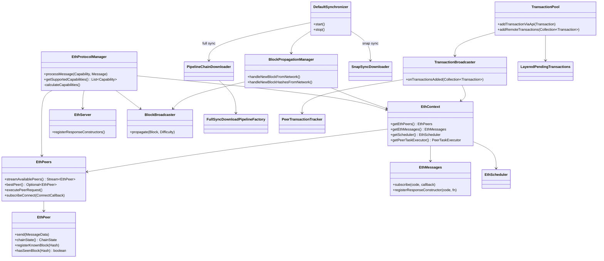
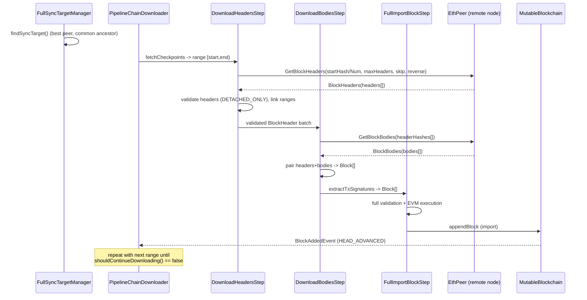
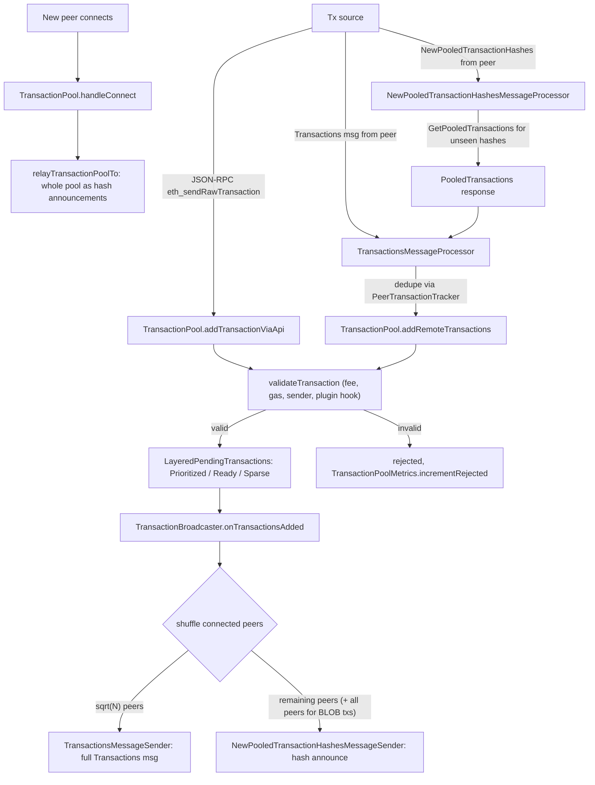

# 10 — Eth Subprotocol & Blockchain Synchronization

> Covers `ethereum/eth` in the vendored Besu source (`_references/besu/ethereum/eth`): the `eth` wire subprotocol (message types, version negotiation), the full-sync and snap-sync download pipelines, the transaction pool (mempool) and its gossip behaviour, and block propagation. Sibling chapter `09-p2p-networking.md` covers the RLPx transport (framing, handshake, capability multiplexing) that `eth` sits on top of — not re-explained here.
>
> Source is read directly from `_references/besu/ethereum/eth/src/main/java/org/hyperledger/besu/ethereum/eth/**`. Every class/file reference below was confirmed present in that tree at the time of writing. Where the vendored source diverges from commonly-cited Besu/Ethereum documentation (for example, supported `eth` versions), the divergence is called out explicitly rather than silently reconciled.

---

## 1. Where `eth` sits in the stack

`eth` is a **DevP2P subprotocol** (a `SubProtocol` / `Capability`, in RLPx terms) multiplexed over the same authenticated, encrypted RLPx connection that `09-p2p-networking.md` establishes between two peers. RLPx handles peer discovery, the ECIES handshake, and framing/multiplexing of subprotocol messages by capability name + version (`"eth"`, `68`..`71` in this codebase — see §3). `eth` itself only defines:

- **The message types** exchanged once the RLPx session and capability are negotiated (`org.hyperledger.besu.ethereum.eth.messages.*`, code points in `EthProtocolMessages`).
- **The per-peer bookkeeping and request/response correlation** needed to use those messages for something (`org.hyperledger.besu.ethereum.eth.manager.*` — `EthPeer`, `EthPeers`, `EthContext`, `EthScheduler`, `RequestManager`).
- **The application logic that consumes those messages**: chain synchronization (`org.hyperledger.besu.ethereum.eth.sync.*`) and the transaction pool / gossip (`org.hyperledger.besu.ethereum.eth.transactions.*`).

`EthProtocolManager` (`manager/EthProtocolManager.java`) is the top-level `ProtocolManager` implementation Besu registers with the RLPx layer for the `"eth"` capability name; it is the thing that receives dispatched wire messages per connection and wires up everything else described in this chapter. A separate `SnapProtocolManager` (`manager/snap/SnapProtocolManager.java`) does the same for the `"snap"` capability used by snap sync (§4).

This repo's network (`docs/architecture.md`, `docs/Besu-config.md`) is a 4-validator QBFT network with `static-nodes.json` peering — see §7 for what that means for which parts of this chapter actually apply.

---

## 2. Component diagram



---

## 3. The `eth` wire subprotocol

### 3.1 Message types

All message type codes live in `messages/EthProtocolMessages.java`:

| Code | Message | Since | Direction |
|---|---|---|---|
| `0x00` | `Status` | eth/68 | handshake, both ways |
| `0x01` | `NewBlockHashes` | eth/68 | announce, gossip |
| `0x02` | `Transactions` | eth/68 | gossip (full tx bodies) |
| `0x03` | `GetBlockHeaders` | eth/68 | sync request |
| `0x04` | `BlockHeaders` | eth/68 | sync response |
| `0x05` | `GetBlockBodies` | eth/68 | sync request |
| `0x06` | `BlockBodies` | eth/68 | sync response |
| `0x07` | `NewBlock` | eth/68 | announce, gossip (full block) |
| `0x08` | `NewPooledTransactionHashes` | eth/68 | gossip (hash-only announce) |
| `0x09` | `GetPooledTransactions` | eth/68 | mempool sync request |
| `0x0A` | `PooledTransactions` | eth/68 | mempool sync response |
| `0x0F` | `GetReceipts` | eth/68 | request |
| `0x10` | `Receipts` | eth/68 | response |
| `0x11` | `BlockRangeUpdate` | eth/69 | announce (EIP-7642) |
| `0x12` | `GetBlockAccessLists` | eth/71 | request |
| `0x13` | `BlockAccessLists` | eth/71 | response |

(`GetPaginatedReceiptsMessage`/`PaginatedReceiptsMessage` also exist under `messages/` but are not part of the standard `eth` message space keyed by `EthProtocolMessages` — they belong to a separate paginated-receipts extension.)

`EthProtocol.REQUEST_ID_MESSAGES` (in `EthProtocol.java`) marks which of the above carry a request-id wrapper for request/response correlation: `GetBlockHeaders`/`BlockHeaders`, `GetBlockBodies`/`BlockBodies`, `GetPooledTransactions`/`PooledTransactions`, `GetReceipts`/`Receipts`, `GetBlockAccessLists`/`BlockAccessLists`. `Status`, `NewBlockHashes`, `Transactions`, `NewBlock`, `NewPooledTransactionHashes`, and `BlockRangeUpdate` are fire-and-forget/gossip messages with no request id.

`EthProtocolVersion.java` defines exactly which of the above codes are valid per protocol version:

- **eth/68** — the base set through `PooledTransactions` (no `BlockRangeUpdate`, no block-access-list messages).
- **eth/69**/**eth/70** — adds `BlockRangeUpdate` (`0x11`), otherwise identical to eth/68's message set.
- **eth/71** — adds `GetBlockAccessLists`/`BlockAccessLists` (`0x12`/`0x13`) on top of eth/69's set.

`EthProtocol.messageSpace(protocolVersion)` returns the RLPx message-id-space size Besu reserves per version: 17 for eth/68, 18 for eth/69 and eth/70, 20 for eth/71.

> **Note on version numbers vs. the task brief**: the vendored source in this repo supports **eth/68, eth/69, eth/70, and eth/71 only** (`EthProtocol.ETH68`..`ETH71`, `EthProtocolVersion.V68`..`V71`). There is no `eth/66` or `eth/67` capability advertised anywhere in `EthProtocolManager.calculateCapabilities()` or `EthProtocol.java` — those older versions have been dropped from this Besu build. This chapter describes what is actually in the source, not the older eth/66-67 versions historically documented elsewhere.

### 3.2 Version negotiation

`EthProtocolManager.calculateCapabilities()` builds the list of `Capability` objects this node advertises during the RLPx `Hello` handshake:

```java
capabilities.add(EthProtocol.ETH68);
capabilities.add(EthProtocol.ETH69);
capabilities.add(EthProtocol.ETH70);
capabilities.add(EthProtocol.ETH71);
capabilities.removeIf(cap -> cap.getVersion() > ethProtocolConfiguration.getMaxEthCapability());
capabilities.removeIf(cap -> cap.getVersion() < ethProtocolConfiguration.getMinEthCapability());
```

`EthProtocolConfiguration`'s min/max eth-capability settings let an operator restrict the advertised range; RLPx's standard subprotocol negotiation (highest mutually-supported version wins, per-connection) then picks the actual session version — that negotiation mechanics live in the p2p/RLPx layer covered by `09-p2p-networking.md`.

Once negotiated, every session starts with a `Status` handshake (`messages/StatusMessage.java`). The wire shape of `Status` itself changed at eth/69, and `EthStatus`'s constructor enforces the two shapes are mutually exclusive:

- **eth/68 and below**: `[version, networkId, totalDifficulty, bestHash, genesisHash, forkId]` — carries `totalDifficulty`, no block range.
- **eth/69 and above**: `[version, networkId, genesisHash, forkId, earliestBlock, latestBlock, bestHash]` — carries a `BlockRange` (`earliestBlock`/`latestBlock`, EIP-7642), no `totalDifficulty` (irrelevant post-merge).

`StatusMessage.readFrom` inspects whether the third RLP element is a list to disambiguate the two shapes and throws `RLPException` if a peer sends a shape inconsistent with its claimed `protocolVersion`. `genesisHash` and `forkId` (via `ForkIdManager`) are what actually gate whether two peers are compatible — `networkId` and `genesisHash` mismatches, or an incompatible `forkId`, are the standard reasons a handshake is rejected.

`BlockRangeUpdate` (eth/69+, `EthProtocolMessages.BLOCK_RANGE_UPDATE`) is broadcast by `BlockRangeBroadcaster` (`sync/BlockRangeBroadcaster.java`), created only `if (hasSupportForBlockRangeMessage)` in `EthProtocolManager.subscribeBlockRangeBroadcaster()` — i.e., only when at least one supported capability's message space includes it.

### 3.3 Request/response plumbing

`EthPeers`/`EthPeer` (`manager/EthPeers.java`, `manager/EthPeer.java`) track one live `EthPeer` object per connected RLPx peer: reputation (`PeerReputation`), chain-state estimate (`ChainState`/`ChainStateSnapshot`), which blocks/transactions it's already seen (`registerKnownBlock`/`hasSeenBlock`), and outstanding request bookkeeping via `RequestManager`. `EthContext` bundles `EthPeers`, `EthMessages` (a code → handler registry for both fire-and-forget subscriptions and request/response constructors), `EthScheduler` (worker-thread pools for sync/tx-pool tasks), and `PeerTaskExecutor`.

Two calling conventions coexist in the source for issuing a request and getting a typed response:

- The older **`EthTask`/`AbstractPeerRequestTask`** family (`manager/task/*`) — e.g. `GetHeadersFromPeerByHashTask`, `GetBodiesFromPeerTask` (task variant).
- The newer **`PeerTask`/`PeerTaskExecutor`** family (`manager/peertask/*`) — e.g. `GetHeadersFromPeerTask`, `GetBodiesFromPeerTask` (peertask variant), used by the full-sync pipeline (§4.1) and by snap sync's `manager/snap/*` tasks (`GetAccountRangeFromPeerTask`, `GetStorageRangeFromPeerTask`, `GetByteCodesFromPeerTask`, `GetTrieNodeFromPeerTask`, each with a `Retrying*` wrapper for retry-with-different-peer semantics).

`EthServer` (`manager/EthServer.java`) is the **server side**: its constructor calls `registerResponseConstructors()` to register handlers for `GET_BLOCK_HEADERS`, `GET_BLOCK_BODIES`, `GET_RECEIPTS`, and the pooled-transactions/paginated-receipts equivalents against `EthMessages`, so that when a peer asks this node for headers/bodies/receipts, Besu can answer from its own `Blockchain`/`TransactionPool`.

---

## 4. Synchronization strategies

`SyncMode` (`sync/SyncMode.java`) defines exactly two modes in this source tree:

```java
public enum SyncMode {
  FULL, // Fully validate all blocks as they sync
  SNAP  // Perform snapsync
}
```

There is **no separate `FAST` enum value** — the older "fast sync" (download headers/bodies/receipts to a pivot, then download state via `eth`'s `GetNodeData`) has been superseded by snap sync in this codebase. Internal class/field names in the snap-sync package still say `fastSyncActions`, `fastSyncDownloader`, `FAST_SYNC_RETRY_DELAY` (`sync/snapsync/SnapSyncDownloader.java`) — this is legacy naming carried over from when snap sync's pivot-selection scaffolding (`PivotSyncActions`, `PivotBlockSelector`) was shared with true fast sync; it does not indicate a third mode is selectable via configuration today.

### 4.1 Full sync

Driven by `FullSyncDownloader` + `PipelineChainDownloader` (`sync/PipelineChainDownloader.java`), which loops: pick a sync target peer (`AbstractSyncTargetManager`/`FullSyncTargetManager`) → build and run a download `Pipeline` (`FullSyncDownloadPipelineFactory.createDownloadPipelineForSyncTarget`) → repeat until `syncTargetManager.shouldContinueDownloading()` is false or terminal difficulty is reached (merge boundary).

The pipeline (built with `PipelineBuilder`, `services/pipeline`) has these named stages, in order:

1. **`fetchCheckpoints`** — `SyncTargetRangeSource` walks forward from the common ancestor in chunks (`RangeHeadersFetcher`), each chunk a `SyncTargetRange`.
2. **`downloadHeaders`** — `DownloadHeadersStep` issues `GetBlockHeaders` requests (via `DownloadHeaderSequenceTask`) for each range and validates them against `ValidationPolicy` (`DETACHED_ONLY` for in-range headers, joined up at range boundaries).
3. **`validateHeadersJoin`** — `RangeHeadersValidationStep` stitches adjacent ranges' headers into one contiguous, hash-linked sequence.
4. **`downloadBodies`** — `DownloadBodiesStep` issues `GetBlockBodies` requests (via `CompleteBlocksWithPeerTask`, dispatched through `EthContext.getPeerTaskExecutor()`) to pair each header with its body and produce full `Block`s.
5. **`extractTxSignatures`** — `ExtractTxSignaturesStep` eagerly recovers transaction sender addresses off the hot import path.
6. **`importBlock`** (`andFinishWith`) — `FullImportBlockStep` runs full block validation/execution and appends to `MutableBlockchain`.

Full sync **fully executes every block from genesis (or the configured start) to head** — it is CPU/EVM-execution-bound, not just I/O-bound, which is why it's the slowest strategy for catching up a node far behind head.

### 4.2 Snap sync

Driven by `SnapSyncDownloader` (`sync/snapsync/SnapSyncDownloader.java`) implementing `SnapSyncController`, using a separate `"snap"` RLPx capability (`manager/snap/SnapProtocolManager.java`, messages in `messages/snap/*`: `GetAccountRangeMessage`/`AccountRangeMessage`, `GetStorageRangeMessage`/`StorageRangeMessage`, `GetByteCodesMessage`/`ByteCodesMessage`, `GetTrieNodesMessage`/`TrieNodesMessage`, versioned as `SnapV1`/`SnapV2`).

At a high level (confirmed from `DefaultSynchronizer`'s wiring, `SnapSyncDownloader`, and the `sync/snapsync/*` class set):

1. A **pivot block** near current chain head is selected (`PivotBlockSelector`, `DynamicPivotBlockSelector`, `PivotBlockConfirmer` under `sync/common/`) — the block whose state root snap sync will reconstruct.
2. Block **headers** down to the pivot are downloaded and validated the same way full sync does (shared header-download machinery), without executing every block.
3. The **world state at the pivot** is downloaded directly as account/storage ranges and bytecode via the `snap` capability's range-request messages (`RequestDataStep`, `DownloadedAccountRangeTracker`, `DownloadedStorageRangeTracker`, `PersistDataStep`, `CompleteTaskStep`), rather than replayed by executing every intervening block — this is the core difference from full sync.
4. `SnapSyncProcessState`/`SnapWorldDownloadState` track progress; on completion `DefaultSynchronizer.handleSyncResult()` calls `protocolContext.getWorldStateArchive().resetArchiveStateTo(pivotHeader)`, verifies the world state is actually available at that root, and re-triggers a resync of the world state if not.
5. **Snap sync hands off to full sync** once the pivot's state is in place: `DefaultSynchronizer.handleSyncResult()` unconditionally calls `startFullSync()` afterward (when `terminationCondition.shouldContinueDownload()`), so `FullSyncDownloader` executes forward from the pivot to catch up to (and then keep up with) chain head block-by-block.

`SnapServerChecker` (`sync/SnapServerChecker.java`) is used to verify candidate peers actually serve the `snap` capability before relying on them as a snap-sync source — set up only `if (syncConfig.getSyncMode() == SyncMode.SNAP)` in `DefaultSynchronizer`'s constructor.

`Era1FileReader`/`Era1FileSource`/`Era1HttpFileSource`/`FileImportChainDownloader` (`sync/fullsync/era1prepipeline/*`) provide an additional pre-pipeline path for importing history from local/HTTP [ERA1](https://github.com/eth-clients/e2store-format-specs) archive files instead of downloading it peer-by-peer — a bulk-import optimization layered in front of the normal full-sync pipeline, not a distinct `SyncMode`.

### 4.3 Sync strategy comparison

| | Full sync (`SyncMode.FULL`) | Snap sync (`SyncMode.SNAP`) |
|---|---|---|
| What's exchanged | Every header + body from start to head, over `eth` (`GetBlockHeaders`/`GetBlockBodies`) | Headers to a pivot (same as full sync) **plus** account/storage state ranges + bytecode via the separate `snap` capability, then full-sync headers/bodies from the pivot forward |
| Validation | Every block fully executed (`FullImportBlockStep`) — strongest guarantee, no trust in peers' state roots beyond normal header/body validation | Blocks below the pivot are *not* individually executed; the downloaded state is validated against the pivot header's `stateRoot` via trie proofs/range consistency, then full sync resumes (fully executed) from the pivot onward |
| Disk/CPU cost | Highest — replays entire chain history's EVM execution | Lower — state is fetched pre-computed; only post-pivot blocks are executed |
| Time to a usable node | Slowest for a chain with deep history | Much faster to reach a synced, servable state near head |
| Checkpointing | Progress is just "current chain head imported" — resumable range-by-range via `SyncTargetRangeSource` | Explicit persisted state: `SnapSyncProcessState`/pivot persistence (`SnapSyncStatePersistenceManager`) so an interrupted snap sync resumes mid-range-download instead of restarting; can re-pivot if the chain moves too far ahead |
| Failure/edge handling | `PipelineChainDownloader` retries with a short pause and can switch sync target; disconnects the sync-target peer on `InvalidBlockException` (`BREACH_OF_PROTOCOL_INVALID_BLOCK`) | Additionally handles a stalled/incomplete world-state download (`resyncWorldState()`), a pivot that falls at or below a configured checkpoint (`PivotAtOrBelowCheckpointException`), and detection of a wrong-chain pivot (`WrongChainException`, with a repeated-repivot warning threshold) |
| Typical use case | Small/private networks, archive nodes, chains where full historical execution is required or the chain is short | Bootstrapping a new node onto a public network with deep history (mainnet, public testnets) |

---

## 5. Full-sync block download sequence



---

## 6. Transaction gossip (mempool)

### 6.1 Receipt and validation

Transactions enter `TransactionPool` (`transactions/TransactionPool.java`) from two sources:

- **`addTransactionViaApi(Transaction)`** — local submission via JSON-RPC (`eth_sendRawTransaction` et al.), marked `isLocal = true`.
- **`addRemoteTransactions(Collection<Transaction>)`** — batches received from peers, sorted by sender+nonce, each validated and added individually.

Both funnel into `addTransaction(...)`, which: rejects if already pooled (`TRANSACTION_ALREADY_KNOWN`); applies any fork-specific `TransactionPoolPreProcessor`; runs `validateTransaction(...)` (chain-head availability, `getSizeForBlockInclusion()` vs. `getTxPoolMaxTxBytes()`, gas-price floor — local vs. `p2pTxFeeCap` for remote — `TransactionValidator.validate(...)`, gas-limit-vs-block-limit, EIP-1559/blob-specific checks, a plugin validator hook, and finally sender-account/balance checks against current world state); then calls `pendingTransactions.addTransaction(...)` to place it in the pool proper.

### 6.2 Pool structure (layered pending transactions)

The default pool implementation, `LayeredPendingTransactions` (`transactions/layered/LayeredPendingTransactions.java`), organizes transactions into three ordered layers plus a terminal drop layer (`transactions/layered/package-info.java`):

| Layer | Role | Ordering / limits |
|---|---|---|
| **Prioritized** | Candidates for the next block proposal | Ordered by score then effective priority fee; size-limited (2000 by default); no nonce gaps allowed; evicts the highest-nonce, lowest-score/fee tx per sender down to **Ready** |
| **Ready** | Buffer feeding Prioritized | Space-limited (holds 10K-100K+ txs); only each sender's first tx is fully ordered (score, then max fee per gas); no nonce gaps; evicts down to **Sparse** |
| **Sparse** | Purgatory for out-of-order/non-contiguous txs | Space-limited; nonce gaps *are* allowed here; oldest-first eviction to the **End Layer** (drop); promotes to Ready as gaps fill |
| **End Layer** | Terminal | Drops the transaction |

A transaction can only be in one layer at a time; layers are not individually thread-safe, and `LayeredPendingTransactions` provides the single synchronization point.

### 6.3 Propagation (gossip) to peers

`TransactionBroadcaster` (`transactions/TransactionBroadcaster.java`) is subscribed as a `TransactionBatchAddedListener` and fans a newly-added batch out to peers on `onTransactionsAdded(...)`:

```java
final int numPeersToSendFullTransactions = (int) Math.round(Math.sqrt(currPeerCount));
```

Peers are shuffled, and only `sqrt(connectedPeerCount)` of them receive the **full transaction** (`Transactions` message, `0x02`) via `TransactionsMessageSender`; the rest receive only a **hash announcement** (`NewPooledTransactionHashes`, `0x08`) via `NewPooledTransactionHashesMessageSender`. Blob-type transactions (`ANNOUNCE_HASH_ONLY_TX_TYPES = EnumSet.of(BLOB)`) are always hash-announced to every peer regardless of the sqrt split, never sent in full unprompted — a peer that wants the blob data must explicitly pull it. `PeerTransactionTracker` queues per-peer send lists and de-dupes against what each `EthPeer` is already known to have seen. A newly-connected peer additionally gets the **entire current pool** relayed to it as hash announcements (`TransactionPool.handleConnect` → `TransactionBroadcaster.relayTransactionPoolTo`).

On the receiving side:

- `TransactionsMessageProcessor` handles inbound `Transactions`: drops the peer (`BREACH_OF_PROTOCOL_MALFORMED_MESSAGE_RECEIVED`) if the message exceeds `maxTransactionsPerMessage`; deduplicates via `PeerTransactionTracker.receivedTransactions(...)`; feeds the fresh set into `TransactionPool.addRemoteTransactions(...)`.
- `NewPooledTransactionHashesMessageProcessor` handles inbound hash-only announcements: dedupes fresh hashes via `PeerTransactionTracker.receivedAnnouncements(...)`, then schedules a pull of the actual transaction bodies from that peer via `BufferedGetPooledTransactionsFromPeerFetcher` — i.e., a `GetPooledTransactions` request for the hashes it doesn't have yet.

A message-level TTL (`keepAlive`, configurable, default derived from `TransactionPoolConfiguration.Unstable`) protects against processing a `Transactions`/`NewPooledTransactionHashes` message that sat in an internal queue too long — expired messages are dropped and counted in `TransactionPoolMetrics` rather than processed.

### 6.4 Flow diagram



---

## 7. Block propagation (newly imported/mined block)

`BlockPropagationManager` (`sync/BlockPropagationManager.java`) both **sends** and **receives** block announcements, and reconciles them with the sync pipeline:

- **Sending**: it observes `Blockchain.observeBlockAdded(...)`; the actual outbound announce is `BlockBroadcaster.propagate(Block, Difficulty)` (`sync/BlockBroadcaster.java`), which builds a `NewBlockMessage` and sends it to **every currently available peer that hasn't already seen this block hash** (`ethPeer.hasSeenBlock(...)` / `registerKnownBlock(...)`) — unlike transaction gossip, there is no sqrt-subset split for full blocks; `NewBlockHashesMessage`-only announcement to some peers is not present in `BlockBroadcaster` (that message type is only ever *received and handled*, in this source, not emitted as part of the propagate-on-mine path).
- **Receiving `NewBlock` (`0x07`)**: `handleNewBlockFromNetwork` updates the sending peer's `ChainState` from the block+total-difficulty, early-returns if the block isn't worth importing (`shouldImportBlockAtHeight`, already pending, already present, or already known-bad via `BadBlockManager`), then calls `importOrSavePendingBlock` — either importing immediately if its parent is already on-chain, or buffering it in `PendingBlocksManager` keyed by parent hash until the parent arrives.
- **Receiving `NewBlockHashes` (`0x01`)**: `handleNewBlockHashesFromNetwork` parses announced `(number, hash)` pairs, keeps only the first hash per block number (penalizing the peer for duplicates via `recordUselessResponse`), updates `ChainState` for each, filters to blocks worth importing, and — for those Besu doesn't already have — schedules retrieval (headers+body, same request machinery as full sync) rather than waiting for a push.
- **Reconciliation with sync**: on every `BlockAddedEvent`, `onBlockAdded` checks whether any buffered pending blocks are now importable (their parent just landed) and, if not, opportunistically fetches non-announced gap blocks within `config.getBlockPropagationRange()` of the local head.

---

## 8. EthPeers / EthContext — the peer abstraction

`EthPeers` (`manager/EthPeers.java`) is the single source of truth for "which peers can I currently talk to on the `eth` capability, and how good are they." Key surface used throughout sync and tx-pool code (both confirmed in source):

- `streamAvailablePeers()` / `streamAllConnectedPeers()` / `streamBestPeers()` — peer enumeration, the basis for both `TransactionBroadcaster`'s shuffled peer list and `BlockBroadcaster`'s "everyone who hasn't seen this block" fan-out.
- `bestPeer()` / `bestPeerWithHeightEstimate()` / `bestPeerMatchingCriteria(...)` with pluggable comparators (`TOTAL_DIFFICULTY`, `CHAIN_HEIGHT`, `MOST_USEFUL_PEER`, `TOTAL_DIFFICULTY_THEN_HEIGHT`, `LEAST_TO_MOST_BUSY`) — used to pick sync targets.
- `executePeerRequest(...)` / `dispatchMessage(...)` — request correlation and inbound-message routing into `EthMessages`' registered handlers.
- `subscribeConnect(...)`/`subscribeDisconnect(...)` — hook points; e.g. `TransactionPool.handleConnect` relays the whole pool to a peer the moment it connects, and `ChainHeadTracker` (`manager/ChainHeadTracker.java`) tracks each new peer's chain head.
- `disconnectWorstUselessPeer()`, `gatePeerConnection(...)`, `getMaxPeers()` — connection-slot management (peer reputation via `PeerReputation`, usefulness threshold `USEFULL_PEER_SCORE_THRESHOLD`).

`EthContext` (`manager/EthContext.java`) is the narrow bundle actually threaded through sync/tx-pool code as a single dependency: `EthPeers`, `EthMessages`, an optional `EthMessages` for the `snap` capability, `EthScheduler` (worker pools for sync/tx-pool/service tasks), and `PeerTaskExecutor` (the newer per-request task runner used by full sync and snap sync). Almost every class discussed above — `TransactionPool`, `TransactionBroadcaster`, `BlockPropagationManager`, `BlockBroadcaster`, `PipelineChainDownloader`, the snap-sync controller — is constructed with an `EthContext` rather than reaching into `EthPeers`/`EthMessages` directly.

---

## 9. Key classes and interfaces

| Class / interface | File | Responsibility |
|---|---|---|
| `EthProtocol` | `eth/EthProtocol.java` | `SubProtocol` impl for `"eth"`; capability constants `ETH68`-`ETH71`; message-code validity per version |
| `EthProtocolVersion` | `eth/EthProtocolVersion.java` | Per-version supported message-code lists |
| `EthProtocolMessages` | `eth/messages/EthProtocolMessages.java` | Wire message type codes |
| `StatusMessage` | `eth/messages/StatusMessage.java` | Handshake message; eth/68 vs eth/69+ wire shapes |
| `GetBlockHeadersMessage` / `BlockHeadersMessage` | `eth/messages/*` | Header range request/response |
| `GetBlockBodiesMessage` / `BlockBodiesMessage` | `eth/messages/*` | Body request/response |
| `NewBlockMessage` / `NewBlockHashesMessage` | `eth/messages/*` | Full-block / hash-only block announcement |
| `TransactionsMessage` / `NewPooledTransactionHashesMessage` / `PooledTransactionsMessage` | `eth/messages/*` | Full-tx gossip / hash announce / pooled-tx fetch response |
| `EthProtocolManager` | `eth/manager/EthProtocolManager.java` | Top-level `ProtocolManager` for `"eth"`; capability negotiation, message dispatch entry point |
| `EthPeers` | `eth/manager/EthPeers.java` | Registry of connected `eth` peers; selection, reputation, connect/disconnect hooks |
| `EthPeer` | `eth/manager/EthPeer.java` | Per-peer state: `ChainState`, known-block/tx tracking, send/request API |
| `EthContext` | `eth/manager/EthContext.java` | Bundles `EthPeers`, `EthMessages`, `EthScheduler`, `PeerTaskExecutor` |
| `EthMessages` | `eth/manager/EthMessages.java` | Code → handler / response-constructor registry |
| `EthScheduler` | `eth/manager/EthScheduler.java` | Worker-thread pools for sync/tx-pool/service tasks |
| `EthServer` | `eth/manager/EthServer.java` | Registers server-side responders for `GetBlockHeaders`/`GetBlockBodies`/`GetReceipts`/etc. |
| `PeerTaskExecutor` | `eth/manager/peertask/PeerTaskExecutor.java` | Executes typed `PeerTask`s (headers/bodies/snap-range requests) against a chosen peer |
| `DefaultSynchronizer` | `eth/sync/DefaultSynchronizer.java` | Top-level sync orchestrator; chooses/sequences snap-then-full or full-only |
| `SyncMode` | `eth/sync/SyncMode.java` | `FULL` / `SNAP` enum |
| `PipelineChainDownloader` | `eth/sync/PipelineChainDownloader.java` | Drives repeated sync-target selection + pipeline execution |
| `FullSyncDownloadPipelineFactory` | `eth/sync/fullsync/FullSyncDownloadPipelineFactory.java` | Builds the header→body→import pipeline stages |
| `DownloadHeadersStep` / `DownloadBodiesStep` | `eth/sync/*` | Pipeline stages issuing `GetBlockHeaders` / `GetBlockBodies` |
| `FullImportBlockStep` | `eth/sync/fullsync/FullImportBlockStep.java` | Full block validation + execution + chain append |
| `SnapSyncDownloader` | `eth/sync/snapsync/SnapSyncDownloader.java` | Snap-sync orchestrator: pivot selection, world-state download, handoff to full sync |
| `SnapProtocolManager` | `eth/manager/snap/SnapProtocolManager.java` | `ProtocolManager` for the separate `"snap"` capability |
| `BlockPropagationManager` | `eth/sync/BlockPropagationManager.java` | Handles inbound `NewBlock`/`NewBlockHashes`, buffers pending blocks, triggers outbound propagation |
| `BlockBroadcaster` | `eth/sync/BlockBroadcaster.java` | Sends `NewBlock` to all peers that haven't seen a given block |
| `TransactionPool` | `eth/transactions/TransactionPool.java` | Validation, addition (local/remote), pool lifecycle, save/restore to disk |
| `LayeredPendingTransactions` | `eth/transactions/layered/LayeredPendingTransactions.java` | Default pool implementation; delegates to Prioritized/Ready/Sparse layers |
| `TransactionBroadcaster` | `eth/transactions/TransactionBroadcaster.java` | Fan-out of newly-added txs: full vs. hash-only per peer, sqrt(N) split |
| `PeerTransactionTracker` | `eth/transactions/PeerTransactionTracker.java` | Per-peer seen/send-queue tracking and de-duplication for tx gossip |
| `TransactionsMessageProcessor` | `eth/transactions/TransactionsMessageProcessor.java` | Handles inbound full `Transactions` messages |
| `NewPooledTransactionHashesMessageProcessor` | `eth/transactions/NewPooledTransactionHashesMessageProcessor.java` | Handles inbound hash announcements; triggers `GetPooledTransactions` pulls |

---

## 10. Relevance to this repo's network

This repo's chain is a 4-validator QBFT network peered exclusively via `static-nodes.json`, where every node is already known and connected from genesis (`docs/architecture.md`, `docs/Besu-config.md`). Fast/snap sync exists in Besu to solve a problem this topology doesn't have — bootstrapping a new node against a public chain with years of history and a discovery-based peer set — so full sync (or, in practice, simply staying live at head via block propagation) is what actually matters here; this chapter's snap-sync detail is included for completeness against the vendored source, not because this repo's nodes are expected to exercise it.
