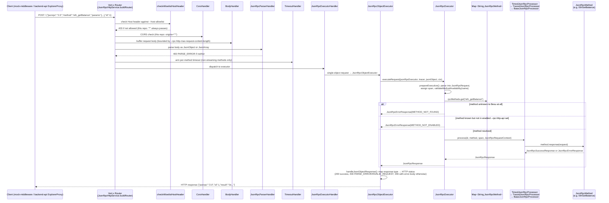
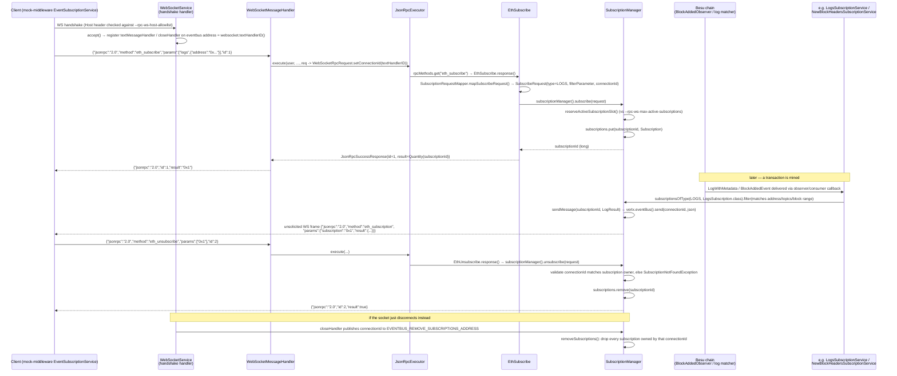

# Besu Internals — Chapter 11: The Client-Facing API Layer (`ethereum/api`)

> Source: `_references/besu/ethereum/api` (module `hyperledger/besu:26.8.1`, vendored). All class names, file paths and defaults below are read directly from that source tree, not from Besu's public docs. Where this repo's Besu wiring (`docker-compose.yml`, `docs/Besu-config.md`) is directly relevant, it's called out explicitly.

---

## 1. Overview

`ethereum/api` is the module that turns Besu's internal `BlockchainQueries`, `TransactionPool`, `Synchronizer`, etc. into the three network-facing protocols external callers actually use. It owns no consensus or state logic itself — every RPC method is a thin adapter over objects constructed elsewhere in the codebase (`ethereum/core`, `ethereum/eth`) and handed in via `JsonRpcMethodsFactory`.

The module exposes three independent protocols, each with its own Vert.x `HttpServer`, each independently enabled/disabled by CLI flags:

| Protocol | Entry class | Default port | CLI enable flag | Transport |
|---|---|---|---|---|
| HTTP JSON-RPC | `org.hyperledger.besu.ethereum.api.jsonrpc.JsonRpcHttpService` | `8545` (`JsonRpcConfiguration.DEFAULT_JSON_RPC_PORT`) | `--rpc-http-enabled` | Request/response over HTTP POST `/` |
| WebSocket JSON-RPC | `org.hyperledger.besu.ethereum.api.jsonrpc.websocket.WebSocketService` | shares HTTP's RPC config; own host/port fields | `--rpc-ws-enabled` | Persistent socket, same JSON-RPC 2.0 envelope plus `eth_subscribe`/`eth_unsubscribe` |
| GraphQL | `org.hyperledger.besu.ethereum.api.graphql.GraphQLHttpService` | `--graphql-http-port` | `--graphql-http-enabled` | HTTP POST/GET `/graphql`, backed by `graphql-java` |
| Engine API (consensus-client-facing, not covered here) | `org.hyperledger.besu.ethereum.api.jsonrpc.EngineJsonRpcService` | `8551` | `--engine-rpc-enabled` | Separate JWT-secured HTTP+WS pair for the `engine_*` namespace |

There's also an `--engine-rpc-enabled`/`EngineJsonRpcService` and an IPC transport (`jsonrpc/ipc`, Unix-socket only — irrelevant on this repo's Docker/Windows setup) in the same module; both are out of scope for this project and mentioned only for completeness.

**This repo's config** (`docs/Besu-config.md` §1): `besu-rpc-anson`/`besu-rpc-beatrice` run with `--rpc-http-enabled` and `--rpc-ws-enabled` (WS on RPC nodes only), `--host-allowlist=*`, `--rpc-http-cors-origins=*`, no `--rpc-http-authentication-enabled` — i.e. the HTTP and WebSocket servers documented below run with **no JWT auth** and accept any `Host` header, an accepted MVP risk for a localhost/Docker-internal deployment (see `docs/architecture.md` §10).

---

## 2. Component Diagram — Request Pipeline Classes

```mermaid
classDiagram
    class JsonRpcHttpService {
      -Vertx vertx
      -Map~String,JsonRpcMethod~ rpcMethods
      +start() CompletableFuture
      -buildRouter() Router
    }
    class WebSocketService {
      -WebSocketMessageHandler websocketMessageHandler
      +start() CompletableFuture
      -webSocketHandshakeHandler() Handler
    }
    class HandlerFactory {
      +jsonRpcParser() Handler
      +jsonRpcExecutor(...) Handler
      +authentication(...) Handler
      +timeout(...) Handler
    }
    class JsonRpcParserHandler {
      +handler() Handler
    }
    class JsonRpcExecutorHandler {
      +handler(JsonRpcExecutor, Tracer, JsonRpcConfiguration) Handler
    }
    class AbstractJsonRpcExecutor {
      <<abstract>>
      #execute()
    }
    class JsonRpcObjectExecutor
    class JsonRpcArrayExecutor
    class JsonRpcExecutor {
      -JsonRpcProcessor rpcProcessor
      -Map~String,JsonRpcMethod~ rpcMethods
      +execute(...) JsonRpcResponse
      +executeStreaming(...) Optional~JsonRpcResponse~
      -validateMethodAvailability(...) Optional~RpcErrorType~
    }
    class JsonRpcProcessor {
      <<interface>>
      +process(...) JsonRpcResponse
    }
    class BaseJsonRpcProcessor
    class TimedJsonRpcProcessor
    class TracedJsonRpcProcessor
    class AuthenticatedJsonRpcProcessor
    class JsonRpcMethod {
      <<interface>>
      +getName() String
      +response(JsonRpcRequestContext) JsonRpcResponse
      +isStreaming() boolean
      +getPermissions() List~String~
    }
    class JsonRpcMethods {
      <<interface>>
      +create(Collection~String~) Map~String,JsonRpcMethod~
    }
    class ApiGroupJsonRpcMethods {
      <<abstract>>
      #getApiGroup() String
      #create() Map~String,JsonRpcMethod~
    }
    class JsonRpcMethodsFactory {
      +methods(...) Map~String,JsonRpcMethod~
    }
    class EthJsonRpcMethods
    class AdminJsonRpcMethods
    class NetJsonRpcMethods
    class Web3JsonRpcMethods
    class DebugJsonRpcMethods
    class TxPoolJsonRpcMethods
    class TraceJsonRpcMethods
    class MinerJsonRpcMethods
    class PermJsonRpcMethods
    class QbftJsonRpcMethods
    class IbftJsonRpcMethods
    class RpcApis {
      <<enum>>
      ETH NET WEB3 ADMIN DEBUG TXPOOL TRACE MINER PERM PLUGINS QBFT IBFT ENGINE TESTING
    }
    class WebSocketMessageHandler {
      +handle(ServerWebSocket, Buffer, Optional~User~)
    }
    class SubscriptionManager {
      -Map~Long,Subscription~ subscriptions
      +subscribe(SubscribeRequest) Long
      +unsubscribe(UnsubscribeRequest) boolean
      +sendMessage(Long, JsonRpcResult)
    }

    JsonRpcHttpService --> HandlerFactory
    HandlerFactory --> JsonRpcParserHandler
    HandlerFactory --> JsonRpcExecutorHandler
    JsonRpcExecutorHandler --> AbstractJsonRpcExecutor
    AbstractJsonRpcExecutor <|-- JsonRpcObjectExecutor
    AbstractJsonRpcExecutor <|-- JsonRpcArrayExecutor
    JsonRpcObjectExecutor --> JsonRpcExecutor
    JsonRpcArrayExecutor --> JsonRpcExecutor
    JsonRpcExecutor --> JsonRpcProcessor
    JsonRpcExecutor --> JsonRpcMethod
    JsonRpcProcessor <|.. BaseJsonRpcProcessor
    JsonRpcProcessor <|.. TimedJsonRpcProcessor
    JsonRpcProcessor <|.. TracedJsonRpcProcessor
    JsonRpcProcessor <|.. AuthenticatedJsonRpcProcessor
    TimedJsonRpcProcessor --> TracedJsonRpcProcessor
    TracedJsonRpcProcessor --> BaseJsonRpcProcessor
    JsonRpcMethods <|.. ApiGroupJsonRpcMethods
    ApiGroupJsonRpcMethods <|-- EthJsonRpcMethods
    ApiGroupJsonRpcMethods <|-- AdminJsonRpcMethods
    ApiGroupJsonRpcMethods <|-- NetJsonRpcMethods
    ApiGroupJsonRpcMethods <|-- Web3JsonRpcMethods
    ApiGroupJsonRpcMethods <|-- DebugJsonRpcMethods
    ApiGroupJsonRpcMethods <|-- TxPoolJsonRpcMethods
    ApiGroupJsonRpcMethods <|-- TraceJsonRpcMethods
    ApiGroupJsonRpcMethods <|-- MinerJsonRpcMethods
    ApiGroupJsonRpcMethods <|-- PermJsonRpcMethods
    ApiGroupJsonRpcMethods <|-- QbftJsonRpcMethods
    ApiGroupJsonRpcMethods <|-- IbftJsonRpcMethods
    JsonRpcMethodsFactory --> EthJsonRpcMethods
    JsonRpcMethodsFactory --> AdminJsonRpcMethods
    JsonRpcMethodsFactory --> NetJsonRpcMethods
    JsonRpcMethodsFactory --> Web3JsonRpcMethods
    JsonRpcMethodsFactory --> DebugJsonRpcMethods
    JsonRpcMethodsFactory --> TxPoolJsonRpcMethods
    JsonRpcMethodsFactory --> TraceJsonRpcMethods
    JsonRpcMethodsFactory --> MinerJsonRpcMethods
    JsonRpcMethodsFactory --> PermJsonRpcMethods
    ApiGroupJsonRpcMethods --> RpcApis
    WebSocketService --> WebSocketMessageHandler
    WebSocketMessageHandler --> JsonRpcExecutor
    WebSocketMessageHandler --> SubscriptionManager
```

*Note:* `QbftJsonRpcMethods` (`consensus/qbft/.../jsonrpc/QbftJsonRpcMethods.java`) and `IbftJsonRpcMethods` (`consensus/ibft/.../jsonrpc/IbftJsonRpcMethods.java`) live **outside** `ethereum/api`, in the `consensus/qbft` and `consensus/ibft` modules — they implement the same `ApiGroupJsonRpcMethods` base class from `ethereum/api` and are appended to the method map by `RunnerBuilder`/`*BesuControllerBuilder` in the `app` module, not by `JsonRpcMethodsFactory` itself. They're included here because this repo runs QBFT (`docs/Besu-config.md` §3).

---

## 3. HTTP JSON-RPC Request Lifecycle

Key points, all sourced from the code:

- **Vert.x routing**: `JsonRpcHttpService.buildRouter()` (`ethereum/api/.../jsonrpc/JsonRpcHttpService.java`) wires an `io.vertx.ext.web.Router` with, in order: a tracing span handler, `checkAllowlistHostHeader()`, `CorsHandler`, `BodyHandler` (body-size limit from `JsonRpcConfiguration.getMaxRequestContentLength()`, default 128 MB), then the main `POST /` route with the JSON-RPC parser/timeout/executor handler chain. A `GET /` route exists purely for health-check pings (`handleEmptyRequest`, returns `201`), plus `/liveness` and `/readiness` (`HealthService`).
- **Method dispatch by name**: `JsonRpcExecutor.prepareExecution()` looks up `rpcMethods.get(requestBody.getMethod())` — a flat `Map<String, JsonRpcMethod>` keyed by RPC method name (e.g. `"eth_getBalance"`), built once at startup by `JsonRpcMethodsFactory.methods(...)`. `validateMethodAvailability()` distinguishes "method doesn't exist anywhere in Besu" (`RpcMethod.rpcMethodExists()` returns false → `METHOD_NOT_FOUND`) from "method exists but wasn't enabled via `--rpc-http-api`" (`rpcMethods.containsKey()` false → `METHOD_NOT_ENABLED`).
- **Processor decorator chain**: the `JsonRpcProcessor` handed to `JsonRpcExecutor` is `TimedJsonRpcProcessor` (wraps in a metrics timer) → `TracedJsonRpcProcessor` (OpenTelemetry span) → `BaseJsonRpcProcessor` (the actual `method.response(request)` call, catching `InvalidJsonRpcParameters` → typed error, any other `RuntimeException` → `INTERNAL_ERROR`). If `--rpc-http-authentication-enabled` is set, `AuthenticatedJsonRpcProcessor` wraps the whole chain and checks JWT permissions before delegating (see §7). **This repo doesn't enable authentication**, so that wrapper is absent in the deployed pipeline.
- **Response framing**: `JsonRpcSuccessResponse`/`JsonRpcErrorResponse` (`ethereum/api/.../jsonrpc/internal/response/`) serialize to strict JSON-RPC 2.0 shape (`@JsonPropertyOrder({"jsonrpc","id","result"})`). HTTP status codes are derived from the RPC-level result in `JsonRpcObjectExecutor.status()`: `200` for success, `400` only for `PARSE_ERROR`/`INVALID_REQUEST`, `200` (with an error body) for every other JSON-RPC error type — i.e. most JSON-RPC errors (`METHOD_NOT_FOUND`, revert reasons, etc.) come back as HTTP `200` with a JSON-RPC-level `error` object, not an HTTP error status.
- **Notifications**: a request with no `id` (`JsonRpcRequest.isNotification() == true`) short-circuits `prepareExecution()` to `null`, and the array executor's `getType() == RpcResponseType.NONE` filter drops it from the batch array — per JSON-RPC 2.0 spec, notifications get no response at all.

### Batch requests

`JsonRpcParserHandler.handler()` (`ethereum/api/.../handlers/JsonRpcParserHandler.java`) tries `ctx.body().asJsonObject()` first; on a decode/cast failure it falls back to `ctx.body().asJsonArray()`. If it's an array, `JsonRpcExecutorHandler.createExecutor()` picks `JsonRpcArrayExecutor` instead of `JsonRpcObjectExecutor`. `JsonRpcArrayExecutor.executeRpcRequestBatch()` (`ethereum/api/.../handlers/JsonRpcArrayExecutor.java`):
- Rejects the whole batch with `EXCEEDS_RPC_MAX_BATCH_SIZE` if `batchJsonRequest.size() > JsonRpcConfiguration.getMaxBatchSize()` (default `1024`, `JsonRpcConfiguration.DEFAULT_MAX_BATCH_SIZE`).
- Otherwise processes each element independently via `executeRequest()`, streaming a JSON array of responses back through a `JsonGenerator` (one entry per non-notification request), skipping entries whose response type is `NONE`.
- A non-object element in the batch array produces an `INVALID_REQUEST` error entry rather than aborting the batch.

---

## 4. WebSocket Subscription Lifecycle

Key points, all sourced from the code:

- **Connection identity**: `WebSocketService.webSocketHandshakeHandler()` (`ethereum/api/.../jsonrpc/websocket/WebSocketService.java`) accepts the handshake (after the same `checkHostInAllowlist()` check the HTTP server does), then uses `websocket.textHandlerID()` — a Vert.x-generated event-bus address unique to that socket — as the **connection ID**. Every subscription is tagged with this ID (`Subscription.getConnectionId()`), and it's also the event-bus address `SubscriptionManager.sendMessage()` publishes to when pushing an event, and the address `WebSocketMessageHandler.replyToClient()`/push messages are delivered through.
- **Framing is identical to HTTP**: incoming WS text/binary frames go through the *same* `JsonRpcExecutor`/`JsonRpcMethod` machinery as HTTP (`WebSocketMessageHandler.handle()`, `ethereum/api/.../jsonrpc/websocket/WebSocketMessageHandler.java`), just with a `WebSocketRpcRequest` (`ethereum/api/.../jsonrpc/websocket/methods/WebSocketRpcRequest.java`) instead of a plain `JsonRpcRequest` — this subclass carries the extra `connectionId` field subscription methods need. Batch arrays are supported over WS too (same `DecodeException` fallback pattern as `JsonRpcParserHandler`).
- **`eth_subscribe`** (`EthSubscribe`, `ethereum/api/.../jsonrpc/websocket/methods/EthSubscribe.java`) parses `params[0]` into a `SubscriptionType` and delegates the rest to `SubscriptionRequestMapper.mapSubscribeRequest()`, which branches on type: `logs` requires `params[1]` to parse as a `FilterParameter` (address/topics/block range); `newHeads` reads an optional `{"includeTransactions": true}`; `transactionReceipts` reads an optional list of transaction hashes to filter on; `newPendingTransactions`/`syncing` take no extra params. `SubscriptionManager.subscribe()` assigns a monotonically increasing `subscriptionId` (`AtomicLong`) and stores a `Subscription` in an in-memory `ConcurrentHashMap<Long, Subscription>` — **there is no persistence**; a Besu restart drops every subscription, and clients must re-subscribe.
- **Subscription cap**: `SubscriptionManager.reserveActiveSubscriptionSlot()` enforces `WebSocketConfiguration.getMaxActiveSubscriptions()` via an atomic increment-then-check (avoids a TOCTOU race under concurrent `eth_subscribe` calls), throwing `MaxSubscriptionsExceededException` → `EXCEEDS_RPC_MAX_ACTIVE_SUBSCRIPTIONS` if full.
- **Event push, per subscription type** — each type has its own service class listening to a different internal signal and calling `SubscriptionManager.sendMessage(subscriptionId, JsonRpcResult)`:
  - `NewBlockHeadersSubscriptionService` (`.../subscription/blockheaders/`) implements `BlockAddedObserver`, registered directly against the blockchain; on `onBlockAdded()` for a new canonical head it walks back to the common ancestor (handling reorgs) and pushes a `BlockResult` per new block.
  - `LogsSubscriptionService` (`.../subscription/logs/`) implements `Consumer<LogWithMetadata>`; for each log it filters `subscriptionsOfType(LOGS, LogsSubscription.class)` by block range and `FilterParameter.getLogsQuery().matches(...)` (address/topic match) before pushing a `LogResult`.
  - `PendingTransactionSubscriptionService` / `PendingTransactionDroppedSubscriptionService` (`.../subscription/pending/`) push `PendingTransactionResult` (tx hash, or full detail depending on subscription params) as transactions enter/leave the pool.
  - `SyncingSubscriptionService` (`.../subscription/syncing/`) pushes sync-status transitions (`NotSynchronisingResult` or an in-progress result).
  - `TransactionReceiptsSubscriptionService` (`.../subscription/transactionreceipts/`) pushes receipts, optionally filtered to a specific set of transaction hashes (`TransactionReceiptsFilterParameter`).

  All of them funnel through `SubscriptionManager.notifySubscribersOnWorkerThread()` or `subscriptionsOfType()` + `sendMessage()`, which wraps the result in a `SubscriptionResponse` (`method: "eth_subscription"`, `params: {subscription, result}`) and publishes the serialized JSON directly onto the Vert.x event bus address that equals the client's `connectionId` — the WS server's `textMessageHandler`/write side (registered per-connection at handshake time) picks it up and writes it to the actual socket frame. This is a **fire-and-forget push**: there's no ack, no buffering, no replay — exactly matching this repo's `docs/architecture.md` §4/§8 characterization of the WS relay as an "at-most-once, best-effort choreographed observer channel," not a delivery-guaranteed system of record.
- **`eth_unsubscribe`** (`EthUnsubscribe`) validates that the `connectionId` on the unsubscribe request matches the subscription's owning connection (a client can't unsubscribe someone else's subscription) before removing it from the map; a mismatch or missing ID throws `SubscriptionNotFoundException` → `SUBSCRIPTION_NOT_FOUND`.
- **Disconnect cleanup**: `WebSocketService`'s `closeHandler` publishes the connection's ID to the well-known event-bus address `SubscriptionManager.EVENTBUS_REMOVE_SUBSCRIPTIONS_ADDRESS`; `SubscriptionManager.removeSubscriptions()` (registered as a consumer of that address in its `AbstractVerticle.start()`) then drops every subscription owned by that connection. `WebSocketMessageHandler` also re-triggers this cleanup defensively after processing a request (`cleanupSubscriptionsIfConnectionClosed`), to close a race where a subscribe request is still being processed on a worker thread when the socket closes — without this, the subscription could be registered *after* the close-handler already ran, orphaning it forever.

---

## 5. RPC API Namespaces / Groups

Each namespace is a `JsonRpcMethods` implementation (`ApiGroupJsonRpcMethods` subclass) whose `getApiGroup()` matches a value of the `RpcApis` enum (`ethereum/api/.../jsonrpc/RpcApis.java`: `ETH, DEBUG, MINER, NET, PERM, WEB3, ADMIN, TXPOOL, TRACE, PLUGINS, IBFT, ENGINE, QBFT, TESTING`). `RpcApis.DEFAULT_RPC_APIS = ["ETH", "NET", "WEB3"]` is what's enabled if `--rpc-http-api`/`--rpc-ws-api` is never passed.

| Namespace | Enum / group class | File | Representative methods |
|---|---|---|---|
| `ETH` | `EthJsonRpcMethods` | `jsonrpc/methods/EthJsonRpcMethods.java` | `eth_getBalance`, `eth_call`, `eth_sendRawTransaction`, `eth_getTransactionReceipt`, `eth_getLogs`, `eth_blockNumber`, `eth_estimateGas`, `eth_chainId` |
| `NET` | `NetJsonRpcMethods` | `jsonrpc/methods/NetJsonRpcMethods.java` | `net_version`, `net_listening`, `net_peerCount`, `net_services` |
| `WEB3` | `Web3JsonRpcMethods` | `jsonrpc/methods/Web3JsonRpcMethods.java` | `web3_clientVersion`, `web3_sha3` |
| `ADMIN` | `AdminJsonRpcMethods` | `jsonrpc/methods/AdminJsonRpcMethods.java` | `admin_peers`, `admin_addPeer`, `admin_removePeer`, `admin_nodeInfo`, `admin_changeLogLevel` |
| `DEBUG` | `DebugJsonRpcMethods` | `jsonrpc/methods/DebugJsonRpcMethods.java` | `debug_traceTransaction`, `debug_traceBlockByNumber`, `debug_accountRange`, `debug_storageRangeAt`, `debug_getRawBlock` |
| `TXPOOL` | `TxPoolJsonRpcMethods` | `jsonrpc/methods/TxPoolJsonRpcMethods.java` | `txpool_content`, `txpool_besuStatistics`, `txpool_besuPendingTransactions`, `txpool_besuTransactions` |
| `TRACE` | `TraceJsonRpcMethods` | `jsonrpc/methods/TraceJsonRpcMethods.java` | `trace_block`, `trace_call`, `trace_transaction`, `trace_filter`, `trace_replayBlockTransactions` |
| `MINER` | `MinerJsonRpcMethods` | `jsonrpc/methods/MinerJsonRpcMethods.java` | `miner_changeTargetGasLimit`, `miner_getMinGasPrice`, `miner_setMinGasPrice` |
| `PERM` | `PermJsonRpcMethods` | `jsonrpc/methods/PermJsonRpcMethods.java` | `perm_addNodesToAllowlist`, `perm_getAccountsAllowlist`, `perm_reloadPermissionsFromFile` |
| `PLUGINS` | `PluginsJsonRpcMethods` | `jsonrpc/methods/PluginsJsonRpcMethods.java` | dynamically named, one per registered `BesuPlugin`'s exposed RPC method |
| `TESTING` | `TestingJsonRpcMethods` | `jsonrpc/methods/TestingJsonRpcMethods.java` | test-only helper methods, not for production use |
| `ENGINE` | `ExecutionEngineJsonRpcMethods` | `jsonrpc/methods/ExecutionEngineJsonRpcMethods.java` | `engine_getPayloadV1..V6`, `engine_getBlobsV1..V4` — served on the separate `EngineJsonRpcService`/port `8551`, JWT-mandatory |
| `QBFT` | `QbftJsonRpcMethods` (module `consensus/qbft`, not `ethereum/api`) | `consensus/qbft/.../jsonrpc/QbftJsonRpcMethods.java` | `qbft_getValidatorsByBlockNumber`, `qbft_proposeValidatorVote`, `qbft_discardValidatorVote`, `qbft_getSignerMetrics` |
| `IBFT` | `IbftJsonRpcMethods` (module `consensus/ibft`) | `consensus/ibft/.../jsonrpc/IbftJsonRpcMethods.java` | IBFT2 equivalents of the QBFT methods above |

**WebSocket-only namespace**: `eth_subscribe`/`eth_unsubscribe` (`WebSocketMethodsFactory`, `ethereum/api/.../jsonrpc/websocket/methods/WebSocketMethodsFactory.java`) are registered only on the WS method map, layered on top of whatever HTTP-style `ETH`/etc. methods are also enabled for WS via `--rpc-ws-api`.

**`--rpc-http-api` → enabled namespace mapping**: `JsonRpcHttpOptions` (`app/src/main/java/org/hyperledger/besu/cli/options/JsonRpcHttpOptions.java`, outside `ethereum/api`) exposes `--rpc-http-api`/`--rpc-http-apis` (comma-separated, aliases of each other) as a `List<String>` defaulting to `RpcApis.DEFAULT_RPC_APIS`. That list is threaded down to `JsonRpcConfiguration.setRpcApis()` → `JsonRpcMethodsFactory.methods(rpcApis, ...)`, which builds every `ApiGroupJsonRpcMethods` group unconditionally but each group's `ApiGroupJsonRpcMethods.create(Collection<String> apis)` only actually returns its methods `if (apis.contains(getApiGroup()))` — otherwise it contributes an empty map. The `--rpc-ws-api` flag works identically for the WS method map. **This repo** does not set either flag, so both RPC nodes run with the framework default `ETH, NET, WEB3` only — no `ADMIN`, `DEBUG`, `TXPOOL`, `TRACE`, `PERM`, `MINER`, or `QBFT` methods are reachable over HTTP or WS in this deployment (confirm against the actual `docker-compose.yml` command array if this matters for a specific integration — `docs/Besu-config.md` §1 doesn't call out an explicit `--rpc-http-api` override, so the framework default should apply).

---

## 6. Key Classes and Interfaces

| Class / interface | File | Responsibility |
|---|---|---|
| `JsonRpcHttpService` | `jsonrpc/JsonRpcHttpService.java` | Owns the HTTP `Vert.x HttpServer`; builds the `Router`; enforces host-allowlist, CORS, body-size limit, connection cap |
| `WebSocketService` | `jsonrpc/websocket/WebSocketService.java` | Owns the WS `HttpServer`; handshake handling, host-allowlist, TLS/mTLS, per-connection frame handlers |
| `WebSocketMessageHandler` | `jsonrpc/websocket/WebSocketMessageHandler.java` | Parses each WS frame (single or batch), routes through the shared `JsonRpcExecutor`, writes the reply back onto the socket |
| `JsonRpcParserHandler` | `handlers/JsonRpcParserHandler.java` | HTTP-side body → `JsonObject`/`JsonArray`, deciding single-vs-batch; also provides the IPC line-delimited parser |
| `JsonRpcExecutorHandler` / `JsonRpcObjectExecutor` / `JsonRpcArrayExecutor` | `handlers/*.java` | HTTP-side glue between the parsed body and `JsonRpcExecutor`; owns per-request timeout timer and streaming-response handling |
| `JsonRpcExecutor` | `jsonrpc/execution/JsonRpcExecutor.java` | Protocol-agnostic core: validates method availability, resolves `JsonRpcMethod` by name, delegates to a `JsonRpcProcessor` |
| `JsonRpcProcessor` (+ `Base`/`Timed`/`Traced`/`AuthenticatedJsonRpcProcessor`) | `jsonrpc/execution/*.java` | Decorator chain around the actual method invocation: metrics timing, OpenTelemetry span, then (if auth enabled) permission check, then the call itself |
| `JsonRpcMethod` | `jsonrpc/internal/methods/JsonRpcMethod.java` | Interface every RPC method implements: `getName()`, `response(JsonRpcRequestContext)`, `isStreaming()`, `getPermissions()` |
| `JsonRpcMethods` / `ApiGroupJsonRpcMethods` | `jsonrpc/methods/JsonRpcMethods.java`, `ApiGroupJsonRpcMethods.java` | Interface + base class for a namespace's method factory; `create(enabledApis)` returns `{}` unless the namespace is enabled |
| `JsonRpcMethodsFactory` | `jsonrpc/methods/JsonRpcMethodsFactory.java` | Startup-time aggregator: instantiates every `ApiGroupJsonRpcMethods` group with its required dependencies and merges their maps into one `Map<String, JsonRpcMethod>` |
| `RpcApis` | `jsonrpc/RpcApis.java` | Enum of namespace names (`ETH`, `NET`, ... ) and `DEFAULT_RPC_APIS` |
| `RpcMethod` | `jsonrpc/RpcMethod.java` | Exhaustive enum of every RPC method name Besu knows about (used to distinguish "unknown method" from "known but disabled") |
| `JsonRpcRequest` / `JsonRpcRequestContext` | `jsonrpc/internal/JsonRpcRequest.java`, `JsonRpcRequestContext.java` | Deserialized request (method/params/id/jsonrpc version) plus execution context (authenticated user, liveness supplier) |
| `JsonRpcSuccessResponse` / `JsonRpcErrorResponse` / `JsonRpcNoResponse` | `jsonrpc/internal/response/*.java` | JSON-RPC 2.0 response framing; `NONE` type response for notifications, filtered out of batch output |
| `SubscriptionManager` | `jsonrpc/websocket/subscription/SubscriptionManager.java` | In-memory registry of active subscriptions (`ConcurrentHashMap<Long, Subscription>`); subscribe/unsubscribe, per-connection cleanup, event-bus push to the owning connection |
| `EthSubscribe` / `EthUnsubscribe` | `jsonrpc/websocket/methods/EthSubscribe.java`, `EthUnsubscribe.java` | The two WS-only `JsonRpcMethod`s that create/destroy subscriptions via `SubscriptionManager` |
| `SubscriptionRequestMapper` | `jsonrpc/websocket/subscription/request/SubscriptionRequestMapper.java` | Parses `eth_subscribe`/`eth_unsubscribe` params into typed `SubscribeRequest`/`UnsubscribeRequest`, branching per `SubscriptionType` |
| `SubscriptionType` | `jsonrpc/websocket/subscription/request/SubscriptionType.java` | Enum: `NEW_BLOCK_HEADERS` (`newHeads`), `LOGS`, `NEW_PENDING_TRANSACTIONS`, `DROPPED_PENDING_TRANSACTIONS`, `SYNCING`, `TRANSACTION_RECEIPTS` |
| `NewBlockHeadersSubscriptionService` / `LogsSubscriptionService` / `PendingTransactionSubscriptionService` / `SyncingSubscriptionService` / `TransactionReceiptsSubscriptionService` | `jsonrpc/websocket/subscription/{blockheaders,logs,pending,syncing,transactionreceipts}/` | Bridge between internal chain events (`BlockAddedObserver`, `Consumer<LogWithMetadata>`, tx-pool listeners) and `SubscriptionManager.sendMessage()` |
| `GraphQLHttpService` | `graphql/GraphQLHttpService.java` | HTTP server for `/graphql`, executes queries via `graphql-java`'s `GraphQL` engine against a `GraphQLDataFetcherContext` |
| `AuthenticationService` / `DefaultAuthenticationService` | `jsonrpc/authentication/*.java` | JWT issuance (`/login`) and verification (`Authorization: Bearer`) shared by HTTP and WS servers when `--rpc-http-authentication-enabled`/`--rpc-ws-authentication-enabled` is set |

---

## 7. GraphQL (brief)

`ethereum/api/.../graphql/` provides a `graphql-java`-backed endpoint, disabled by default (`--graphql-http-enabled`), served by `GraphQLHttpService` on its own port (`--graphql-http-port`) with `POST`/`GET /graphql`. `GraphQLDataFetchers` wires the schema's field resolvers to `BlockchainQueries`/`TransactionPool`/etc. — the same underlying query objects the JSON-RPC `ETH` methods use, just exposed with GraphQL's client-driven field selection instead of fixed REST-shaped responses. It goes through its own `checkAllowlistHostHeader`/CORS/TLS setup, structurally parallel to but independent of the JSON-RPC HTTP pipeline. **This repo does not use GraphQL** — `docs/Besu-config.md` and `docker-compose.yml` never set `--graphql-http-enabled`, consistent with `docs/architecture.md` §7.A/§9's decision to keep all client-facing APIs REST-shaped.

---

## 8. Authentication (JWT) — brief, and why this repo doesn't use it

Both `JsonRpcHttpService` and `WebSocketService` can require a JWT bearer token per request, controlled independently by `--rpc-http-authentication-enabled` / `--rpc-ws-authentication-enabled`. When enabled:

- `DefaultAuthenticationService` (`jsonrpc/authentication/DefaultAuthenticationService.java`) issues RS256-signed JWTs (5-minute expiry) from a `POST /login` route, backed by a TOML credentials file (`TomlAuthOptions`) checked via Vert.x's `AuthenticationProvider`.
- On each request, `AuthenticationHandler` (HTTP) or the handshake's `getAuthToken()`/`authenticate()` call (WS) validates the token and attaches the resulting `User` to the routing/request context.
- Method-level authorization is permission-string-based: `JsonRpcMethod.getPermissions()` defaults to `["*:*", "<namespace>:*", "<namespace>:<method>"]` (e.g. `eth_getBalance` → `["*:*", "eth:*", "eth:getBalance"]`), matched against the JWT's `permissions` claim via `PermissionBasedAuthorization` in `DefaultAuthenticationService.isPermitted()`. Methods listed in `--rpc-http-no-auth-methods`/`--rpc-ws-no-auth-methods` skip the check entirely.
- When auth is enabled, `JsonRpcHttpService.buildRouter()` inserts `AuthenticatedJsonRpcProcessor` as the outermost `JsonRpcProcessor` decorator, rejecting unauthorized calls before `BaseJsonRpcProcessor` ever invokes the method.

**This project's Besu nodes never set either authentication flag** (`docs/Besu-config.md` §1, `docs/architecture.md` §10) — `mock-middleware` and `backend-api`'s Explorer proxy call the HTTP and WS JSON-RPC endpoints with no `Authorization` header at all, relying entirely on `--host-allowlist=*` plus Docker-internal-network/localhost binding as the accepted-risk perimeter. If this stack were ever exposed beyond localhost, enabling `--rpc-http-authentication-enabled`/`--rpc-ws-authentication-enabled` here is the mechanism that would close that gap (tracked as risk R1 in `docs/plan.md`'s risk register).

---

## 9. Relevance to This Project

`mock-middleware` is the sole consumer of Besu's WebSocket event feed described in §4: its `EventSubscriptionService` (`docs/architecture.md` §2, unit 8) opens one `eth_subscribe("logs", ...)` — or address/template-scoped equivalents — per registered contract against `besu-rpc-anson`/`besu-rpc-beatrice`'s WS endpoint (`--rpc-ws-enabled`, `docs/Besu-config.md` §1), and relies exactly on the fire-and-forget, at-most-once push semantics documented in §4 — there is no redelivery on reconnect, matching this repo's explicit choreography decision (`docs/architecture.md` §4/§8). `mock-middleware` is also the transaction-submission path: its writes ultimately reach `EthSendRawTransaction` (`ETH` namespace, §5) over the plain HTTP JSON-RPC pipeline in §3, using `eth_estimateGas`/`eth_sendRawTransaction`/polling `eth_getTransactionReceipt` — all `ETH`-namespace methods, which is why this repo can run with only the framework-default `ETH, NET, WEB3` APIs enabled and nothing else. `backend-api`'s `ExplorerProxy` is a separate, purely read-only consumer of the same HTTP JSON-RPC pipeline (`eth_getBlockByNumber`, `eth_getTransactionByHash`, etc.), calling `besu-rpc-anson`/`besu-rpc-beatrice` directly rather than through `mock-middleware`'s ABI gateway (`docs/architecture.md` §6, `ExplorerProxy` rationale) — both consumers hit the exact same unauthenticated, `host-allowlist=*` HTTP/WS surface analyzed in §8, which is why the allowlisting responsibility for *which* RPC node name is valid is pushed up into `backend-api` itself rather than into Besu's own JSON-RPC layer.
