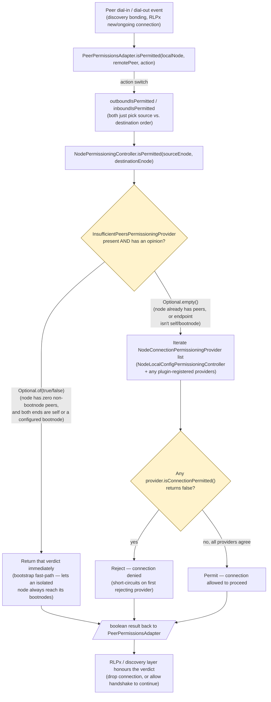
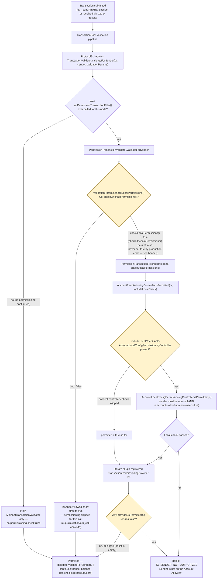

# 12 — Node and Account Permissioning

> Source: `_references/besu/ethereum/permissioning`, `_references/besu/ethereum/permissioning/plugin-api`, `_references/besu/ethereum/core/src/main/java/.../ethereum/core/PermissionTransactionFilter.java`, `_references/besu/ethereum/core/src/main/java/.../ethereum/mainnet/PermissionTransactionValidator.java`, `_references/besu/app/src/main/java/org/hyperledger/besu/RunnerBuilder.java`, `_references/besu/app/src/main/java/org/hyperledger/besu/cli/options/PermissionsOptions.java`
> Scope: how Besu decides whether a P2P connection attempt and a submitted transaction are allowed to proceed. Deep transaction-validation internals (gas/nonce/balance checks, `MainnetTransactionValidator`) live in `ethereum/core` and are a sibling chapter — this chapter stops at the hook point where permissioning wraps that pipeline.

**Headline finding, stated up front because it contradicts what a casual reading of Besu's public docs (or older Besu versions) would suggest:** as of the vendored source (`apiBaselineVersion=26.8.1` in `gradle.properties`), **Besu has no onchain/smart-contract-based permissioning left**. `CHANGELOG.md` records its removal explicitly under `25.6.0 / Breaking Changes`: *"Remove onchain permissioning [#8597]"*, grouped with Tessera's removal under a "Sunset features" heading. A full-repository search for `SmartContractPermission*` classes returns nothing, `app/src/main/java/org/hyperledger/besu/cli/options/PermissionsOptions.java` only defines four CLI flags (all local-file-based — see §6), and `ethereum/core`'s `TransactionValidationParams.checkOnchainPermissions()` is a vestigial `@Value.Default` boolean that defaults to `false` and is never set `true` by any non-test code path. Only **local, config-file-based allowlisting** exists for both node and account permissioning in this codebase. This chapter documents that reality, not the historical two-provider design some Besu documentation still describes.

---

## 1. Why Besu has a permissioning framework

A public Ethereum node has no reason to restrict who can peer with it or whose transactions it relays — permissionless is the point. A private/consortium/enterprise chain (QBFT, IBFT2, Clique) is the opposite: the operator usually wants to restrict **which nodes may even form a P2P connection** (so an unauthorized node can't sync the chain, spam the gossip network, or attempt eclipse attacks) and, independently, **which accounts may submit transactions** (so an unauthorized key can't spend gas or write to state even if it somehow gets a transaction into the mempool). Besu exposes both as pluggable checks that sit in front of, respectively, the P2P connection-acceptance path and the transaction-validation pipeline — deliberately decoupled from each other and from the consensus engine, so any combination of "provider" implementations can be composed and a plugin can add its own.

---

## 2. Component diagram

```mermaid
classDiagram
    direction TB

    %% ---------- Node permissioning ----------
    class NodeConnectionPermissioningProvider {
        <<interface, plugin-api>>
        +isConnectionPermitted(sourceEnode, destinationEnode) boolean
    }
    class ContextualNodePermissioningProvider {
        <<interface>>
        +isPermitted(source, destination) Optional~Boolean~
        +subscribeToUpdates(callback) long
    }
    class NodeLocalConfigPermissioningController {
        -List~EnodeURL~ nodesAllowlist
        -AllowlistPersistor allowlistPersistor
        +isPermitted(enode) boolean
        +addNodes(urls) NodesAllowlistResult
        +removeNodes(urls) NodesAllowlistResult
        +reload()
    }
    class InsufficientPeersPermissioningProvider {
        -P2PNetwork p2pNetwork
        -Collection~NodeIdentifier~ bootnodeIdentifiers
        +isPermitted(source, destination) Optional~Boolean~
    }
    class NodePermissioningController {
        -List~NodeConnectionPermissioningProvider~ providers
        -Optional~ContextualNodePermissioningProvider~ insufficientPeersPermissioningProvider
        +isPermitted(source, destination) boolean
        +localConfigController() Optional~NodeLocalConfigPermissioningController~
    }
    class NodePermissioningControllerFactory {
        +create(config, ..., pluginProviders) NodePermissioningController
    }
    class PeerPermissionsAdapter {
        -NodePermissioningController nodePermissioningController
        +isPermitted(localNode, remotePeer, action) boolean
    }
    class PeerPermissions {
        <<abstract, ethereum.p2p>>
    }

    NodeConnectionPermissioningProvider <|.. NodeLocalConfigPermissioningController
    ContextualNodePermissioningProvider <|.. InsufficientPeersPermissioningProvider
    NodePermissioningController --> "0..*" NodeConnectionPermissioningProvider : providers
    NodePermissioningController --> "0..1" ContextualNodePermissioningProvider : bootstrap fast-path
    NodePermissioningControllerFactory --> NodePermissioningController : builds
    NodePermissioningControllerFactory --> NodeLocalConfigPermissioningController : conditionally adds
    PeerPermissions <|-- PeerPermissionsAdapter
    PeerPermissionsAdapter --> NodePermissioningController : delegates

    %% ---------- Account / transaction permissioning ----------
    class TransactionPermissioningProvider {
        <<interface, plugin-api>>
        +isPermitted(transaction) boolean
    }
    class AccountLocalConfigPermissioningController {
        -List~String~ accountAllowlist
        -AllowlistPersistor allowlistPersistor
        +isPermitted(transaction) boolean
        +addAccounts(accounts) AllowlistOperationResult
        +removeAccounts(accounts) AllowlistOperationResult
    }
    class AccountPermissioningController {
        -Optional~AccountLocalConfigPermissioningController~ localConfig
        -List~TransactionPermissioningProvider~ pluginProviders
        +isPermitted(transaction, includeLocalCheck) boolean
    }
    class AccountPermissioningControllerFactory {
        +create(config, ..., pluginProviders) Optional~AccountPermissioningController~
    }
    class PermissionTransactionFilter {
        <<functional interface, ethereum.core>>
        +permitted(transaction, checkLocalPermissions) boolean
    }
    class PermissionTransactionValidator {
        -TransactionValidator delegate
        -PermissionTransactionFilter permissionTransactionFilter
        +validateForSender(tx, sender, params) ValidationResult
    }
    class TransactionValidatorFactory {
        +setPermissionTransactionFilter(filter)
    }
    class TransactionValidator {
        <<interface, mainnet>>
    }

    TransactionPermissioningProvider <|.. AccountLocalConfigPermissioningController
    AccountPermissioningController --> "0..1" AccountLocalConfigPermissioningController
    AccountPermissioningController --> "0..*" TransactionPermissioningProvider : pluginProviders
    AccountPermissioningControllerFactory --> AccountPermissioningController : builds
    AccountPermissioningControllerFactory --> AccountLocalConfigPermissioningController : conditionally adds
    TransactionValidator <|.. PermissionTransactionValidator
    PermissionTransactionValidator --> TransactionValidator : delegate (MainnetTransactionValidator)
    PermissionTransactionValidator --> PermissionTransactionFilter
    TransactionValidatorFactory ..> PermissionTransactionValidator : wraps base validator
    PermissionTransactionFilter <.. AccountPermissioningController : isPermitted is the filter impl

    %% ---------- Shared config / plugin surface ----------
    class LocalPermissioningConfiguration {
        -List~EnodeURL~ nodeAllowlist
        -List~String~ accountAllowlist
        -boolean nodeAllowlistEnabled
        -boolean accountAllowlistEnabled
        -String nodePermissioningConfigFilePath
        -String accountPermissioningConfigFilePath
    }
    class PermissioningConfiguration {
        -Optional~LocalPermissioningConfiguration~ localConfig
    }
    class AllowlistPersistor {
        +updateConfig(type, entries)
        +verifyConfigFileMatchesState(type, entries)
    }
    class PermissioningService {
        <<interface, plugin-api>>
        +registerNodePermissioningProvider(provider)
        +registerTransactionPermissioningProvider(provider)
    }
    class PermissioningServiceImpl {
        -List~NodeConnectionPermissioningProvider~ connectionProviders
        -List~TransactionPermissioningProvider~ transactionProviders
    }

    PermissioningConfiguration --> "0..1" LocalPermissioningConfiguration
    NodeLocalConfigPermissioningController --> LocalPermissioningConfiguration
    NodeLocalConfigPermissioningController --> AllowlistPersistor
    AccountLocalConfigPermissioningController --> LocalPermissioningConfiguration
    AccountLocalConfigPermissioningController --> AllowlistPersistor
    PermissioningService <|.. PermissioningServiceImpl
    PermissioningServiceImpl --> "0..*" NodeConnectionPermissioningProvider : plugin-registered
    PermissioningServiceImpl --> "0..*" TransactionPermissioningProvider : plugin-registered
    NodePermissioningControllerFactory ..> PermissioningServiceImpl : reads plugin providers
    AccountPermissioningControllerFactory ..> PermissioningServiceImpl : reads plugin providers
```

Both controller factories accept a `List<...PermissioningProvider>` sourced from `PermissioningServiceImpl` (the runtime implementation of the plugin-facing `PermissioningService`), so a Besu plugin can register additional providers (e.g. its own custom allowlist source) that are combined with — not instead of — the local-config provider. This plugin extension point is the closest thing left in-tree to "pluggable external permissioning source"; it is generic (any `boolean isConnectionPermitted(...)` / `boolean isPermitted(transaction)` implementation) rather than a purpose-built onchain-contract connector.

---

## 3. Node permissioning: a connection attempt being checked

`PeerPermissionsAdapter` is registered as (one half of) the active `PeerPermissions` for the `P2PNetwork` — see `RunnerBuilder`: `PeerPermissions.combine(new PeerPermissionsAdapter(nodePermissioningController, blockchain), defaultPeerPermissions)`. Every discovery bonding attempt, RLPx inbound/outbound connection, and outbound neighbours request routes through it before Besu proceeds.

Inside `NodeLocalConfigPermissioningController.isConnectionPermitted`, both the source *and* destination enode must independently satisfy `isPermitted(node)`: either the node is this node's own identity, or it appears in the in-memory `nodesAllowlist` (loaded from `permissions_config.toml`'s `nodes-allowlist` key, kept in sync with the file via `AllowlistPersistor`). There is **no** onchain-contract-backed `NodeConnectionPermissioningProvider` implementation in this codebase — the only concrete non-test implementation is the local-config controller plus whatever a plugin registers via `PermissioningService.registerNodePermissioningProvider`.

---

## 4. Account/transaction permissioning: a submitted transaction being checked

Unlike node permissioning (a dedicated `PeerPermissions` layer), account permissioning is wired in as a **decorator around the transaction validator**: `TransactionValidatorFactory.setPermissionTransactionFilter(...)` replaces the memoized `MainnetTransactionValidator` supplier with one that wraps it in `PermissionTransactionValidator`. This happens once, in `RunnerBuilder.buildAccountPermissioningController`, only if local account permissioning is configured or a plugin registered a `TransactionPermissioningProvider`. If neither applies, the plain `MainnetTransactionValidator` runs and no permissioning check exists at all for that node.

There is no onchain-contract `TransactionPermissioningProvider` implementation either — only `AccountLocalConfigPermissioningController` (local TOML allowlist, `accounts-allowlist` key) and plugin-registered providers exist. A legacy, unused `org.hyperledger.besu.ethereum.permissioning.account.TransactionPermissioningProvider` functional interface still exists alongside the plugin-api one of the same simple name; nothing in the codebase implements or references it — it appears to be dead code left over from the pre-25.6.0 design.

---

## 5. Key classes and interfaces

| Class / interface | File (relative to `_references/besu`) | Responsibility |
|---|---|---|
| `NodeConnectionPermissioningProvider` | `ethereum/permissioning/plugin-api/src/main/java/.../plugin/services/permissioning/NodeConnectionPermissioningProvider.java` | Plugin-facing SPI: `boolean isConnectionPermitted(sourceEnode, destinationEnode)`. The contract every node-permissioning provider (local or plugin) implements. |
| `NodeMessagePermissioningProvider` | `.../plugin/services/permissioning/NodeMessagePermissioningProvider.java` | Companion plugin SPI for permissioning individual wire-protocol messages between already-connected peers (collected by `PermissioningServiceImpl` but not consulted by `NodePermissioningController` itself). |
| `TransactionPermissioningProvider` (plugin-api) | `.../plugin/services/permissioning/TransactionPermissioningProvider.java` | Plugin-facing SPI: `boolean isPermitted(transaction)`. Implemented by `AccountLocalConfigPermissioningController` and any plugin provider. |
| `PermissioningService` | `.../plugin/services/PermissioningService.java` | Plugin-facing registration API (`registerNodePermissioningProvider`, `registerTransactionPermissioningProvider`, `registerNodeMessagePermissioningProvider`). |
| `PermissioningServiceImpl` | `ethereum/permissioning/src/main/java/.../ethereum/permissioning/pluginadapter/PermissioningServiceImpl.java` | Runtime implementation of `PermissioningService`; simple in-memory lists of registered providers, read by both controller factories at startup. |
| `NodePermissioningController` | `ethereum/permissioning/src/main/java/.../ethereum/permissioning/node/NodePermissioningController.java` | Aggregates all `NodeConnectionPermissioningProvider`s (local config + plugins); `isPermitted` first defers to the optional bootstrap fast-path provider, then requires every provider to agree. |
| `ContextualNodePermissioningProvider` | `.../node/ContextualNodePermissioningProvider.java` | Interface for a provider that may decline to answer (`Optional<Boolean>`) depending on runtime conditions. |
| `InsufficientPeersPermissioningProvider` | `.../node/InsufficientPeersPermissioningProvider.java` | The only `ContextualNodePermissioningProvider` implementation: while this node has zero non-bootnode peer connections, permits connections to/from itself or a configured bootnode regardless of the allowlist, so a freshly (re)started permissioned node can always reach its bootnodes to begin with. |
| `NodeLocalConfigPermissioningController` | `ethereum/permissioning/src/main/java/.../ethereum/permissioning/NodeLocalConfigPermissioningController.java` | Local allowlist-based `NodeConnectionPermissioningProvider`. Holds an in-memory `nodesAllowlist` seeded from `LocalPermissioningConfiguration`, exposes add/remove/reload backed by `AllowlistPersistor`, and always permits the local node's own identity. |
| `NodePermissioningControllerFactory` | `ethereum/permissioning/src/main/java/.../ethereum/permissioning/NodePermissioningControllerFactory.java` | Builds a `NodePermissioningController` from `PermissioningConfiguration` + plugin providers; adds `NodeLocalConfigPermissioningController` only if `LocalPermissioningConfiguration.isNodeAllowlistEnabled()`. No onchain-provider branch exists. |
| `PeerPermissionsAdapter` | `.../node/PeerPermissionsAdapter.java` | Bridges `NodePermissioningController` into the P2P layer's `PeerPermissions` abstraction; maps each `PeerPermissions.Action` (discovery bonding, RLPx inbound/outbound) onto an inbound- or outbound-ordered `isPermitted` call. |
| `AccountLocalConfigPermissioningController` | `ethereum/permissioning/src/main/java/.../ethereum/permissioning/AccountLocalConfigPermissioningController.java` | Local allowlist-based `TransactionPermissioningProvider`. Rejects senderless transactions; otherwise checks the sender address (case-insensitive) against `accountAllowlist`, backed by the same `AllowlistPersistor` pattern. |
| `AccountPermissioningController` | `ethereum/permissioning/src/main/java/.../ethereum/permissioning/account/AccountPermissioningController.java` | Aggregates the optional local controller plus plugin `TransactionPermissioningProvider`s; `isPermitted(tx, includeLocalCheck)` is the method wired in as the `PermissionTransactionFilter`. |
| `AccountPermissioningControllerFactory` | `.../account/AccountPermissioningControllerFactory.java` | Builds an `Optional<AccountPermissioningController>`; only present if local account allowlisting is enabled or at least one plugin provider is registered. No onchain-provider branch exists. |
| `PermissionTransactionFilter` | `ethereum/core/src/main/java/.../ethereum/core/PermissionTransactionFilter.java` | Functional interface (`permitted(tx, checkLocalPermissions)`) — the seam between `ethereum/core`'s transaction-validation pipeline and the permissioning module, so `ethereum/core` doesn't depend on `ethereum/permissioning` directly. `AccountPermissioningController::isPermitted` is the method reference bound to it. |
| `PermissionTransactionValidator` | `ethereum/core/src/main/java/.../ethereum/mainnet/PermissionTransactionValidator.java` | `TransactionValidator` decorator: before delegating `validateForSender` to the wrapped validator, calls the `PermissionTransactionFilter` if `checkLocalPermissions()` or `checkOnchainPermissions()` is requested; rejects with `TX_SENDER_NOT_AUTHORIZED` on failure. |
| `TransactionValidatorFactory` | `.../ethereum/mainnet/TransactionValidatorFactory.java` | `setPermissionTransactionFilter(filter)` re-memoizes the validator supplier so `PermissionTransactionValidator` wraps the base `MainnetTransactionValidator`; only called when permissioning is actually configured. |
| `TransactionValidationParams` | `.../ethereum/mainnet/TransactionValidationParams.java` | Immutables-generated params interface; `checkLocalPermissions()` defaults `true`, `checkOnchainPermissions()` defaults `false` and — per repo-wide grep — is never set `true` outside its own unit test. Vestigial from the removed onchain-permissioning feature. |
| `LocalPermissioningConfiguration` | `ethereum/permissioning/src/main/java/.../ethereum/permissioning/LocalPermissioningConfiguration.java` | Holds both allowlists and both enabled-flags and file paths in one object (node and account config share this type even though they're independent features). |
| `PermissioningConfiguration` | `.../ethereum/permissioning/PermissioningConfiguration.java` | Top-level config wrapper; today just `Optional<LocalPermissioningConfiguration>` — no sibling "onchain config" field. |
| `PermissioningConfigurationBuilder` | `.../ethereum/permissioning/PermissioningConfigurationBuilder.java` | Parses the TOML file (`nodes-allowlist` / `accounts-allowlist` keys) into `LocalPermissioningConfiguration`, validating account address format eagerly. |
| `AllowlistPersistor` | `.../ethereum/permissioning/AllowlistPersistor.java` | Reads/writes the shared `permissions_config.toml`; verifies the on-disk file still matches in-memory state before writing (`verifyConfigFileMatchesState`) to avoid clobbering concurrent edits, e.g. from `perm_reloadPermissionsFromFile`. |
| `TomlConfigFileParser` | `.../ethereum/permissioning/TomlConfigFileParser.java` | Low-level TOML load/parse helper used by both `PermissioningConfigurationBuilder` and `AllowlistPersistor`. |
| `PermissionsOptions` | `app/src/main/java/org/hyperledger/besu/cli/options/PermissionsOptions.java` | CLI surface: `--permissions-nodes-config-file-enabled`, `--permissions-nodes-config-file`, `--permissions-accounts-config-file-enabled`, `--permissions-accounts-config-file`. No `--permissions-*-contract-*` flags exist in this codebase. |
| `PermAddNodesToAllowlist`, `PermRemoveNodesFromAllowlist`, `PermGetNodesAllowlist`, `PermAddAccountsToAllowlist`, `PermRemoveAccountsFromAllowlist`, `PermGetAccountsAllowlist`, `PermReloadPermissionsFromFile` | `ethereum/api/src/main/java/.../ethereum/api/jsonrpc/internal/methods/permissioning/*.java` | The `PERM` JSON-RPC namespace (`perm_addNodesToAllowlist`, `perm_getAccountsAllowlist`, etc.) — the runtime management API for both allowlists, backed directly by the local-config controllers above. |

---

## 6. Note: this project's own scope decision

This repository's own design docs (`docs/plan.md`, decision D-17; echoed in `docs/architecture.md` §10) explicitly accept running the demo network **without any Besu-level permissioning** — neither `--permissions-nodes-config-file-enabled` nor `--permissions-accounts-config-file-enabled` is turned on for the validators/RPC nodes in this project's MVP. The stated mitigation is Docker-network/localhost isolation instead (all P2P and RPC traffic stays inside the Compose network or bound to `localhost`). That is a deliberate, already-documented scope decision for *this* project and is out of scope for further investigation here — this chapter exists to document what the Besu framework itself is capable of, not to second-guess how this repository chose to configure it.
