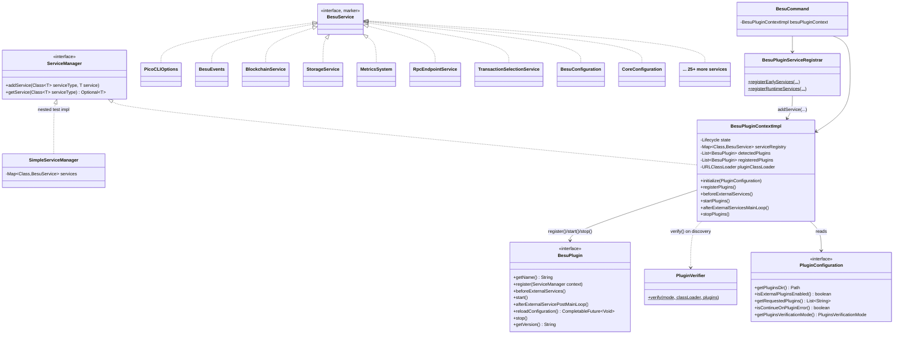
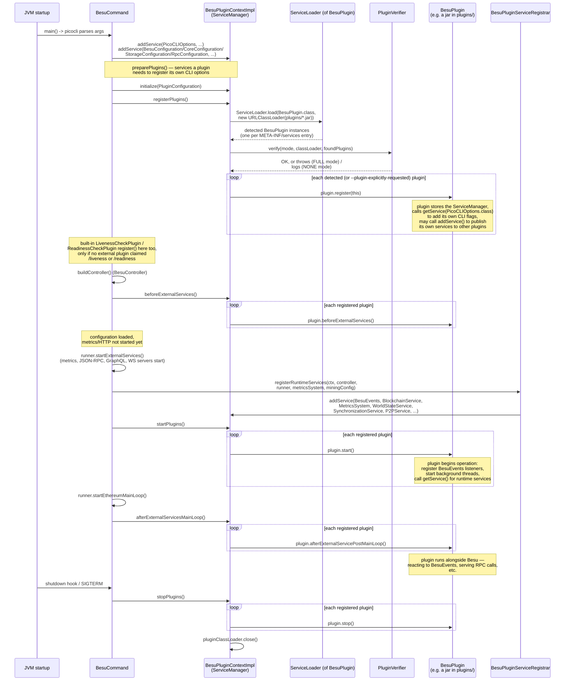

# 13 — Plugin Framework

> Source: `_references/besu/plugin-api` (the `BesuPlugin`/`ServiceManager` core contract), `_references/besu/plugins` (shipped, built-in plugins: `health`, `rocksdb`), `_references/besu/app/src/main/java/org/hyperledger/besu/services` (the runtime that discovers, registers and starts plugins), plus every `*/plugin-api*` Gradle module referenced from `org.hyperledger.besu.plugin.services` (see §4 note on module layout).
> Scope: the extension mechanism itself — lifecycle, discovery, the service-injection contract, and the plugin-facing data model. Individual consensus/EVM/RPC internals are covered in their own chapters; this chapter only covers the seam between Besu and code that isn't Besu.

---

## 1. Why Besu has a plugin API

Besu ships as a single Java process, but a meaningful share of what operators need — a bespoke storage engine, custom transaction-pool admission rules, MEV-style block-building strategies, extra JSON-RPC methods, alternate key-management backends, permissioning policy — is deployment-specific and not something the core maintainers want to build, review or version inside `besu/ethereum/*`. The plugin API is Besu's answer: a small, deliberately narrow contract (`BesuPlugin` + `ServiceManager`) that lets a separately-built, separately-versioned JAR hook into Besu's lifecycle and consume a catalogue of `*Service` interfaces, without needing to fork or recompile Besu itself. Two of Besu's own components — the default RocksDB storage engine and the default liveness/readiness HTTP checks — are implemented as plugins against this exact same contract (`plugins/rocksdb`, `plugins/health`), which is itself evidence that the API is expressive enough to replace load-bearing internals, not just add optional extras.

**Stability and versioning.** The API is explicitly *not* uniformly stable:

- `org.hyperledger.besu.plugin.Unstable` (`plugin-api/core/src/main/java/org/hyperledger/besu/plugin/Unstable.java`) is a `@Retention(CLASS)` marker annotation applied to individual interfaces and methods across the service catalogue (e.g. `BlockchainService`, `CoreConfiguration`, `SecurityModuleService`, `WorldStateService`, `TransactionSelectionService`, `TransactionSimulationService`, `P2PService`, and several fields on `plugin.data.BlockHeader` such as `getRequestsHash()`/`getBalHash()`). Its Javadoc warns these "may evolve in a way that is not backwards compatible... deleting methods, changing signatures, and adding checked exceptions." There is no compiler enforcement — it is a documentation-only signal to plugin authors.
- Several interfaces are marked `@Deprecated(forRemoval = true)` and explicitly called out as having no replacement and (in most cases) no known usage: `PluginVersionsProvider`, `BftQueryService`, `PoaQueryService`, `MiningService`. New plugin code should treat these as already gone.
- `BesuService` (`plugin-api/core/.../plugin/services/BesuService.java`) is the empty marker interface every injectable service must implement; `ServiceManager` only hands out types that extend it.
- Compatibility beyond `@Unstable`/`@Deprecated` is enforced structurally, not just by convention: `PluginVerifier` (`app/src/main/java/org/hyperledger/besu/services/PluginVerifier.java`) can check a plugin's `META-INF/plugin-artifacts-catalog.json` against Besu's own `META-INF/besu-artifacts-catalog.json` for Besu-version compatibility and classpath dependency conflicts, gated by the `--plugins-verification-mode` (`PluginsVerificationMode.NONE` default vs `FULL`, `ethereum/core/src/main/java/org/hyperledger/besu/ethereum/core/plugins/PluginsVerificationMode.java`).

---

## 2. Component diagram



`BesuPluginContextImpl` (`app/src/main/java/org/hyperledger/besu/services/BesuPluginContextImpl.java`) is the concrete `ServiceManager` — there is exactly one instance per Besu process, owned by `BesuCommand`. `BesuPluginServiceRegistrar` (`app/src/main/java/org/hyperledger/besu/services/BesuPluginServiceRegistrar.java`) is the single source of truth for *which* service implementations get registered and *when* — both `BesuCommand` (production) and `ThreadBesuNodeRunner` (acceptance tests) delegate to it so a new service only needs to be wired in one place.

---

## 3. Plugin lifecycle sequence

This traces the real call sequence in `BesuCommand.java` (line numbers as of this checkout) and `BesuPluginContextImpl.java`: `preparePlugins()` → `createPluginRegistrationTask` (PicoCLI execution strategy) → `run()` → `startPlugins(runner)` → shutdown hook.



Key details grounded in source, not inferred:

- **Discovery** is standard `java.util.ServiceLoader`: `BesuPluginContextImpl.detectPlugins()` lists every `*.jar` in the configured plugins directory (`--plugins-dir`, defaulting to `${besu.home}/plugins` or the `besu.plugins.dir` system property — `PluginConfiguration.getPluginsDir()`), builds a dedicated `URLClassLoader` over those jars (parented on Besu's own class loader), and runs `ServiceLoader.load(BesuPlugin.class, pluginClassLoader)`. A plugin jar registers itself the standard Java way, with a `META-INF/services/org.hyperledger.besu.plugin.BesuPlugin` file naming its `BesuPlugin` implementation class (this is stated directly in `BesuPlugin`'s own Javadoc). That classloader is kept open for the life of the process — it's closed only in `stopPlugins()` — because plugins may lazily load classes after startup.
- **Selective activation**: if `--plugin-<Name>-enabled`-style filtering is used (`PluginConfiguration.getRequestedPlugins()`), only plugins whose simple class name matches are registered; an unmatched requested name throws `NoSuchElementException` at startup. With no explicit list, every detected plugin is registered.
- **Error isolation**: `--plugin-continue-on-error` (`PluginConfiguration.isContinueOnPluginError()`) controls whether a failing `register()`/`beforeExternalServices()`/`start()` call aborts the whole node (default: it does) or just drops that one plugin from the `registeredPlugins` list (logged, and excluded from later lifecycle calls) so the rest of Besu keeps running.
- **Two-phase service registration** exists because some services depend on objects that don't exist until later in startup. `BesuPluginServiceRegistrar.registerEarlyServices()` runs from `preparePlugins()`, before `BesuController` is built (so plugins can add CLI options and be told about storage/security-module/blockchain-read services before configuration is even fully parsed). `registerRuntimeServices()` runs from `startPlugins(runner)`, after both `BesuController` and `Runner` exist, because services like `BesuEvents`, `MetricsSystem`, `WorldStateService`, `P2PService`, `SynchronizationService` wrap live, fully-constructed objects (the blockchain, the P2P network, the configured `MetricsSystem`). The Javadoc on `registerRuntimeServices` specifically explains `MetricsSystem` can't be phase 1: it's built from CLI-parsed `MetricsConfiguration`, and `MetricsConfiguration.validate()` rejects `--metrics-category` values not yet registered by `registerPlugins()`, which is itself still running in phase 1.
- **`reloadConfiguration()`** is a default no-op hook, invoked via a dedicated JSON-RPC endpoint (not part of the startup/shutdown sequence above) for plugins that support live config reload.
- **Built-in plugins bypass `ServiceLoader` entirely.** `RocksDBPlugin`, `InMemoryStoragePlugin`, and the fallback `LivenessCheckPlugin`/`ReadinessCheckPlugin` are constructed directly with `new` inside `BesuCommand` and have `register()` called on them explicitly (`BesuCommand.java` around the `preparePlugins()`/plugin-registration-task methods) — they implement the exact same `BesuPlugin` contract as an externally-loaded jar, but ship inside `besu-all`/the app module rather than as a discoverable jar in `plugins/`. This is the same seam Besu's own defaults are built through, not a special back door.

---

## 4. Service interfaces plugins can inject

`ServiceManager.getService(Class<T>)` returns an `Optional<T>` for any `BesuService`-typed interface Besu (or another plugin) has published via `addService`. **Architectural note on module layout**: despite the directory name, the plugin-facing service catalogue is not confined to the top-level `plugin-api/` directory — it is spread across a `plugin-api`/`plugin-api-*` Gradle module per subsystem (`crypto/plugin-api`, `metrics/plugin-api`, `services/kvstore/plugin-api`, `ethereum/api/plugin-api`, `ethereum/core/plugin-api-{chain,execution,validation,worldstate,worldstate-backend}`, `ethereum/blockcreation/plugin-api`, `ethereum/eth/plugin-api-{sync,txpool}`, `ethereum/p2p/plugin-api`, `ethereum/permissioning/plugin-api`), all sharing the `org.hyperledger.besu.plugin.services` package. This keeps each subsystem's plugin surface buildable (and versionable) independently while presenting one logical namespace to plugin authors. Only the truly core, dependency-free pieces (`BesuPlugin`, `ServiceManager`, `BesuService`, `Unstable`, `PicoCLIOptions`, `CoreConfiguration`) live in `plugin-api/core`; the rest of `plugin-api/` (root module) holds `BesuEvents`, the deprecated query services, and a handful of `plugin.data` types not tied to one subsystem.

| Service interface | File (relative to `_references/besu`) | Purpose |
|---|---|---|
| `PicoCLIOptions` | `plugin-api/core/.../plugin/services/PicoCLIOptions.java` | Register a plugin's own PicoCLI-annotated options object as a CLI mixin under a namespace prefix; only usable during `register()`. |
| `CoreConfiguration` | `plugin-api/core/.../plugin/CoreConfiguration.java` | Minimal, dependency-free access to the node's data directory path, for plugins that only depend on `plugin-api/core`. |
| `BesuConfiguration` | `services/kvstore/plugin-api/.../plugin/services/BesuConfiguration.java` | Broader node configuration (RPC host, data paths, storage format, etc.) — "generally useful configuration provided by Besu." |
| `BesuEvents` | `plugin-api/src/main/java/.../plugin/services/BesuEvents.java` | Subscribe to block-added, block-reorg, block-propagated, tx-added/dropped, log, sync-status and bad-block events, each with its own add/remove-listener pair. |
| `BlockchainService` | `ethereum/core/plugin-api-chain/.../plugin/services/BlockchainService.java` | Read blocks/headers/receipts/transactions/chain ID/fork ID; also set the safe and finalized block. `@Unstable`. |
| `WorldStateService` | `ethereum/core/plugin-api-worldstate/.../plugin/services/WorldStateService.java` | Access a view of the head world state. `@Unstable`. |
| `TrieLogService` | `ethereum/core/plugin-api-worldstate/.../plugin/services/TrieLogService.java` | Register observers for trie-log events (thread-safe implementations required). |
| `StorageService` | `services/kvstore/plugin-api/.../plugin/services/StorageService.java` | Register a `KeyValueStorageFactory` so a plugin can supply an alternative storage engine (this is how `RocksDBPlugin` installs itself). `@Unstable`. |
| `SecurityModuleService` | `crypto/plugin-api/.../plugin/services/SecurityModuleService.java` | Register a `SecurityModule` — an abstraction over cryptographic operations (e.g. an HSM) deferring to a specific provider. `@Unstable`. |
| `MetricsSystem` | `metrics/plugin-api/.../plugin/services/MetricsSystem.java` | Create counters, histograms, operation timers and suppliers of externally-sourced metric values. |
| `MetricCategoryRegistry` | `metrics/plugin-api/.../plugin/services/metrics/MetricCategoryRegistry.java` | Register custom `MetricCategory` values so `--metrics-category` recognises them; must be registered during plugin init (phase 1). |
| `RpcEndpointService` | `ethereum/api/plugin-api/.../plugin/services/RpcEndpointService.java` | Register custom JSON-RPC methods (`namespace_functionName`) backed by a `Function<PluginRpcRequest,T>`; also lets a plugin call any other enabled in-process RPC method. Must be used during `register()`. |
| `HealthCheckService` | `ethereum/api/plugin-api/.../plugin/services/HealthCheckService.java` | Override the built-in `/liveness` and `/readiness` HTTP health-check endpoints with custom logic. |
| `TransactionSelectionService` | `ethereum/blockcreation/plugin-api/.../plugin/services/TransactionSelectionService.java` | Register a `PluginTransactionSelectorFactory` to add custom transaction-selection/block-building logic during block creation. `@Unstable`. |
| `TransactionValidatorService` | `ethereum/core/plugin-api-validation/.../plugin/services/TransactionValidatorService.java` | Register additional `TransactionValidationRule`s applied wherever the node validates a transaction; must be registered in `register()`/`beforeExternalServices()`. |
| `TransactionPoolValidatorService` | `ethereum/eth/plugin-api-txpool/.../plugin/services/TransactionPoolValidatorService.java` | Register a `PluginTransactionPoolValidatorFactory` consulted before a transaction is admitted to the pool. `@Unstable`. |
| `TransactionPoolService` | `ethereum/eth/plugin-api-txpool/.../plugin/services/transactionpool/TransactionPoolService.java` | Enable/disable the transaction pool and read pending transactions. |
| `TransactionSimulationService` | `ethereum/core/plugin-api-execution/.../plugin/services/TransactionSimulationService.java` | Simulate transaction execution with configurable validation parameters. `@Unstable`. |
| `BlockSimulationService` | `ethereum/core/plugin-api-execution/.../plugin/services/BlockSimulationService.java` | Simulate processing of a block given a header, transaction list and block overrides. |
| `TraceService` | `ethereum/core/plugin-api-execution/.../plugin/services/TraceService.java` | Trace execution of a block by number. `@Unstable`. |
| `RlpConverterService` | `ethereum/core/plugin-api-chain/.../plugin/services/rlp/RlpConverterService.java` | RLP encode/decode helpers (e.g. build a block header from raw RLP). |
| `SynchronizationService` | `ethereum/eth/plugin-api-sync/.../plugin/services/sync/SynchronizationService.java` | Wraps sync state/event lifecycle; fire a forkchoice event, record safe/finalized blocks. |
| `P2PService` | `ethereum/p2p/plugin-api/.../plugin/services/p2p/P2PService.java` | Query peers/connections, subscribe to connect/disconnect/message events, send messages, control P2P network lifecycle. `@Unstable`. |
| `PermissioningService` | `ethereum/permissioning/plugin-api/.../plugin/services/PermissioningService.java` | Decide which peers to connect to and which messages to send them (connection permissioning + message permissioning hooks). |
| `MiningService` *(deprecated)* | `ethereum/blockcreation/plugin-api/.../plugin/services/mining/MiningService.java` | Start/stop mining. `@Deprecated(forRemoval = true)` — no known plugin uses it. |
| `PluginVersionsProvider` *(deprecated)* | `plugin-api/src/main/java/.../plugin/services/PluginVersionsProvider.java` | Internal-only, used to print plugin versions for `--version`; scheduled for removal with no replacement. |
| `BftQueryService` / `PoaQueryService` *(deprecated)* | `plugin-api/src/main/java/.../plugin/services/query/{Bft,Poa}QueryService.java` | Query BFT/PoA validator sets and proposers. Both `@Deprecated(forRemoval = true)`, "no known usage." |

Two more services exist but are wired via `BesuController.getAdditionalPluginServices()` rather than `BesuPluginServiceRegistrar` directly (consensus-mechanism-specific extras, e.g. BFT-only services) — out of scope for this chapter's generic lifecycle but reachable through the same `ServiceManager.getService()` call.

**Availability windows matter.** Per `ServiceManager.getService`'s own Javadoc, a service being absent is not necessarily an error: it may not have started yet (most services aren't available before `start()`), it may not exist in this Besu build/version, or it may not apply to the current configuration (e.g. a PoA-only service on a non-PoA network). Plugins are auto-loaded, so `getService()` returning empty should be handled gracefully rather than treated as fatal — `RocksDBPlugin` demonstrates this: if `StorageService` is somehow missing it just logs an error rather than throwing.

---

## 5. Example plugins shipped in `plugins/`

Only two subprojects live under `_references/besu/plugins`: `health` and `rocksdb`. Both are ordinary `BesuPlugin` implementations — no special-cased loading path beyond the built-in direct-instantiation described in §3 — and both double as Besu's own default implementations of the extension points they demonstrate.

### `plugins/health` — `LivenessCheckPlugin` / `ReadinessCheckPlugin`

`LivenessCheckPlugin` (`plugins/health/src/main/java/org/hyperledger/besu/plugin/services/health/LivenessCheckPlugin.java`) is close to the minimum viable plugin:

```java
public class LivenessCheckPlugin implements BesuPlugin {
  public void register(final ServiceManager context) {
    final HealthCheckService healthCheckService =
        context.getService(HealthCheckService.class)
            .orElseThrow(() -> new IllegalStateException("Required service missing: HealthCheckService"));
    healthCheckService.registerHealthCheck(
        "/liveness", params -> HealthCheckService.HealthCheckResult.of(true));
  }
  public void start() {}
  public void stop() {}
}
```

It demonstrates: consuming exactly one service (`HealthCheckService`), doing all its work in `register()` (nothing to start/stop), and failing loudly (`orElseThrow`) when a required service is unavailable rather than degrading silently — a valid alternative to `RocksDBPlugin`'s log-and-continue approach, appropriate here because `HealthCheckService` is always registered in phase 1. `BesuCommand` only instantiates these two plugins as a *fallback*: it checks `HealthCheckService.getHealthCheck("/liveness")`/`"/readiness"` after `registerPlugins()` has run, and only registers the built-in liveness/readiness check if no externally-loaded plugin already claimed that endpoint — so an operator can fully replace Besu's default health checks by shipping their own plugin that registers first.

### `plugins/rocksdb` — `RocksDBPlugin`

`RocksDBPlugin` (`plugins/rocksdb/src/main/java/org/hyperledger/besu/plugin/services/storage/rocksdb/RocksDBPlugin.java`) is Besu's actual default storage engine, built entirely on the plugin API:

- **`register()`**: fetches `PicoCLIOptions` (throwing `IllegalStateException` if absent — required, not optional, since CLI parsing depends on it) and calls `addPicoCLIOptions("rocksdb", options)` to expose `RocksDBCLIOptions` as CLI flags; then calls `createFactoriesAndRegisterWithStorageService()`, which fetches `StorageService` and, if present, calls `storageService.registerKeyValueStorage(factory)` with a `RocksDBKeyValueStorageFactory` built from `service.getAllSegmentIdentifiers()`.
- **`start()`**: re-runs the factory registration if it didn't already happen (defensive re-entry), then logs the resolved configuration.
- **`stop()`**: closes the `RocksDBKeyValueStorageFactory`.
- Extra, non-`BesuPlugin` methods (`addIgnorableSegmentIdentifier`, `isHighSpecEnabled`, `getBlobDBSettings`, `getResolvedMaxOpenFiles`, `reset()`) are called directly by `BesuCommand`/`Runner` via the concrete `RocksDBPlugin` type it holds — a reminder that nothing stops Besu (or another plugin) from downcasting a known built-in plugin instance and using it beyond the `BesuPlugin` contract, something an external plugin loaded purely via `ServiceLoader` could not rely on since Besu never sees anything but the `BesuPlugin` interface for those.

It demonstrates the two-service pattern most storage/backend plugins need: `PicoCLIOptions` (own configuration surface) plus one domain service to register into (`StorageService`), both consumed inside `register()`, well before `start()`.

`services/kvstore/src/main/java/org/hyperledger/besu/services/kvstore/InMemoryStoragePlugin.java` follows the identical `StorageService`-registration pattern for Besu's in-memory storage backend (used in tests), though it lives outside `plugins/` in the `services/kvstore` module and, like `RocksDBPlugin`, is instantiated directly by `BesuCommand` rather than discovered.

---

## 6. The plugin data model — decoupled from internal `ethereum/core` types

Everything a service interface hands to a plugin (a `BlockHeader`, a `Transaction`, a `Log`, a `TransactionReceipt`) is a `plugin.data` type, not the internal Besu class of the same conceptual role. `org.hyperledger.besu.plugin.data.BlockHeader` (`plugin-api/core/.../plugin/data/BlockHeader.java`) is a plain interface — Keccak hashes, gas used, extra data, mix hash/nonce, optional withdrawals/requests/blob-gas fields for post-merge/post-Prague forks — with no dependency on RLP encoding, world-state access, or any other internal machinery. `org.hyperledger.besu.ethereum.core.BlockHeader`, the real internal class used throughout block processing and consensus, is confirmed (by inspection of `ethereum/core/src/main/java/org/hyperledger/besu/ethereum/core/BlockHeader.java`) to sit on a class hierarchy that ultimately satisfies this plugin interface — i.e. the internal class *implements* the plugin-facing shape, not the other way around. The same pattern holds for `ProcessableBlockHeader`, `BlockBody`, `Log`, `TransactionReceipt`, `TransactionProcessingResult`, `Withdrawal`, and the subsystem-specific data types (`AddedBlockContext`, `PropagatedBlockContext`, `BadBlockCause`, `LogWithMetadata`, `SyncStatus`, `TransactionSelectionResult`, `BlockOverrides`, `TransactionSimulationResult`, etc., each living in the `plugin-api-*` module for its subsystem).

This is a deliberate architectural boundary, not an accident of package naming: it means the internal representation of a block, transaction or receipt can be refactored (new fields, different backing storage, a different RLP codec) without breaking plugin compilation, as long as the narrower `plugin.data` interface continues to be satisfiable. It also limits what a plugin can do with these objects to read-only, interface-shaped access — a plugin gets `BlockHeader.getStateRoot()` but never the internal mutable builder or the world-state trie behind it; anything requiring deeper access is exposed instead through an explicit service (e.g. `WorldStateService`, `BlockchainService`) rather than by leaking a wider internal type. The `@Unstable` annotations described in §1 concentrate heavily on the newer, fork-driven parts of this data model (`getRequestsHash()`, `getBalHash()`) — exactly the fields most likely to keep changing shape as new EIPs land, versus the yellow-paper-stable fields (`getStateRoot()`, `getTransactionsRoot()`, ...) which carry no such marker.

| Data type | File | Notes |
|---|---|---|
| `BlockHeader` / `ProcessableBlockHeader` | `plugin-api/core/.../plugin/data/{BlockHeader,ProcessableBlockHeader}.java` | `BlockHeader extends ProcessableBlockHeader`; the latter is the subset of fields known before a block is sealed (used during block creation/simulation). |
| `BlockBody` | `plugin-api/core/.../plugin/data/BlockBody.java` | Transactions + ommers + withdrawals view of a block body. |
| `Log` / `TransactionReceipt` / `TransactionProcessingResult` | `plugin-api/core/.../plugin/data/{Log,TransactionReceipt,TransactionProcessingResult}.java` | Read-only views of execution output. |
| `Withdrawal` | `plugin-api/core/.../plugin/data/Withdrawal.java` | Post-Shanghai validator withdrawal record. |
| `EnodeURL` | `plugin-api/core/.../plugin/data/EnodeURL.java` | Structured enode address (peer identity + host/ports). |
| `Request` / `Restriction` / `Signature` / `UnsignedPrivateMarkerTransaction` | `plugin-api/src/main/java/.../plugin/data/*.java` | Root-module data types not tied to one subsystem module (EIP-7685 request, privacy restriction marker, signature, private-transaction marker). |
| `AddedBlockContext` / `PropagatedBlockContext` / `BadBlockCause` / `LogWithMetadata` | `ethereum/core/plugin-api-chain/.../plugin/data/*.java` | Event payloads delivered through `BesuEvents` listeners. |
| `SyncStatus` | `ethereum/eth/plugin-api-sync/.../plugin/data/SyncStatus.java` | Delivered through `BesuEvents.SyncStatusListener`. |
| `TransactionSelectionResult` | `ethereum/blockcreation/plugin-api/.../plugin/data/TransactionSelectionResult.java` | Returned by a `PluginTransactionSelector` to accept/reject/defer a candidate transaction during block building. |
| `BlockOverrides` / `PluginBlockSimulationResult` / `TransactionSimulationResult` / `BlockTraceResult` / `TransactionTraceResult` | `ethereum/core/plugin-api-execution/.../plugin/data/*.java` | Inputs/outputs for the simulation and tracing services. |
| `Capability` / `Message` / `Peer` / `PeerConnection` / `PeerInfo` | `ethereum/p2p/plugin-api/.../plugin/data/p2p/*.java` | P2P-layer views exposed through `P2PService`. |

---

## 7. Summary

Besu's plugin framework is a small `ServiceLoader`-based contract (`BesuPlugin`) sitting on top of a large, subsystem-partitioned catalogue of injectable `BesuService` interfaces, all resolved through one `ServiceManager`. The lifecycle is staged deliberately — CLI-option registration, then plugin `register()`, then `beforeExternalServices()`, then a runtime-services phase once the controller/runner exist, then `start()`, then normal operation, then `stop()` — so that services are only ever handed to a plugin once the live objects behind them actually exist. Two of Besu's own default components (`RocksDBPlugin`, the health-check plugins) are built on this exact contract, and every object a plugin touches is a narrow, `@Unstable`-flagged, read-oriented `plugin.data` interface rather than an internal `ethereum/core` class — the mechanism by which Besu keeps its internals free to change without breaking the plugin ecosystem built against them.
