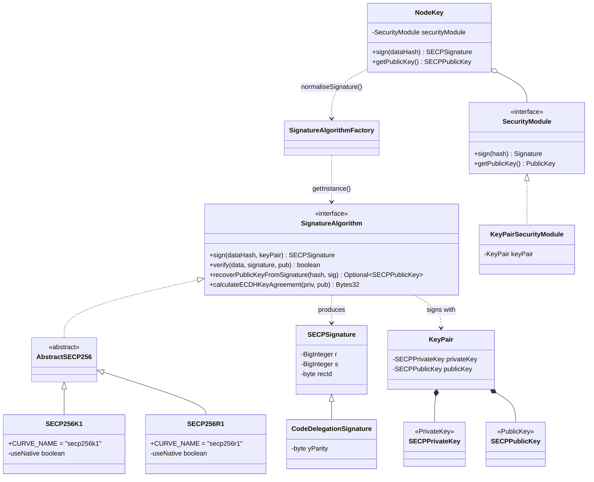
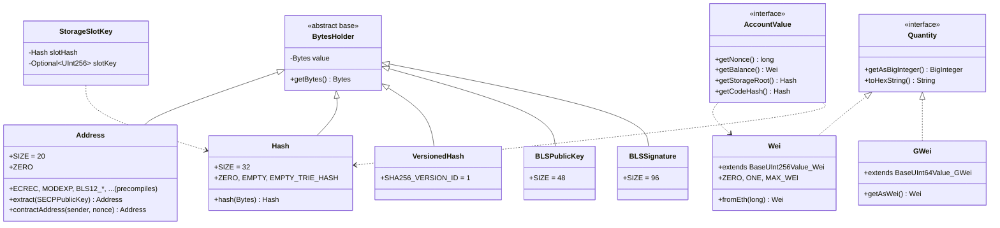
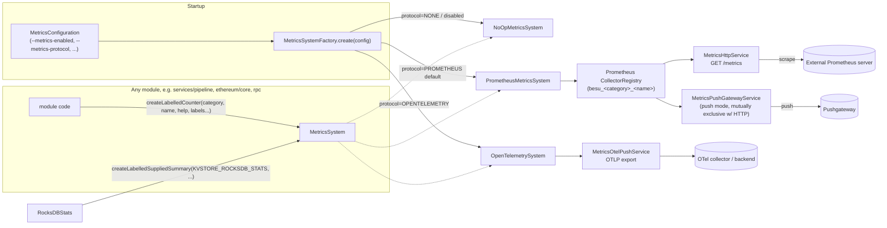

# 14. Crypto, Datatypes, Services, Metrics, and NAT

> Source: `_references/besu/{crypto,datatypes,services,metrics,nat}` (vendored Besu source). All class names, file paths, and behavior below are read directly from that source tree, not from Besu's public docs. Where the source is silent or ambiguous, it is flagged explicitly rather than guessed.

---

## 1. Overview

These five Gradle modules are Besu's **foundation layer**: small, low-level, and depended upon by almost every other module in the codebase (`ethereum/core`, `consensus/*`, `evm`, `ethereum/p2p`, `ethereum/api`, `besu` CLI, etc.), while themselves depending on very little.

| Module | What it provides | Analogy |
|---|---|---|
| `crypto` | Elliptic-curve signing/verification (SECP256K1, SECP256R1), keccak/sha256/ripemd160/blake2f hashing, key-pair types, JCA security-provider glue | Besu's cryptographic primitives library |
| `datatypes` | `Address`, `Hash`, `Wei`, `Quantity`, `TransactionType`, and the other shared value types used across the entire codebase | Besu's "vocabulary" — the nouns every other module speaks in |
| `services` | Concrete, in-process implementations of a few of the plugin-facing service interfaces (`StorageService`/`KeyValueStorage`), plus two internal frameworks (async `pipeline`, disk-backed `tasks` queues) that have no plugin-facing equivalent | Internal engine-room services vs. the plugin contracts described in `13-plugin-api.md` |
| `metrics` | The `MetricsSystem` abstraction (counters/gauges/histograms/timers) and its Prometheus, OpenTelemetry, RocksDB-stats, Vert.x, and no-op backends | Besu's observability backbone |
| `nat` | NAT-traversal support (UPnP, Docker, manual/none) so a node's P2P and JSON-RPC ports are reachable from outside a home router or container network | Networking convenience layer, not on the consensus-critical path |

None of these modules know about blocks, transactions execution, or consensus — they are pure supporting infrastructure. That is precisely why they are shared: a `Hash` or a `Wei` value means the same thing whether it is used by the EVM, the RLPx wire codec, or the JSON-RPC layer, and a `Counter` behaves the same whether it is incremented by the transaction pool or by a sync pipeline stage.

---

## 2. `crypto` — signing, hashing, and key material

### 2.1 Structure

The `crypto` directory itself has three Gradle sub-modules:

| Sub-module | Role |
|---|---|
| `crypto/algorithms` | The actual cryptographic implementations: SECP256K1/SECP256R1 signing, key types, hashing utilities, the BN254 (`altbn128`) pairing math used by the `ALTBN128_*` EVM precompiles |
| `crypto/plugin-api` | The plugin-facing `SecurityModule` interface (see `13-plugin-api.md`) — lets a plugin supply an external key custody backend (e.g. HSM) instead of an in-memory key |
| `crypto/services` | The internal glue that turns a `SecurityModule` into the `NodeKey` the rest of Besu actually calls |

### 2.2 Key classes

| Class | File | Responsibility |
|---|---|---|
| `SignatureAlgorithm` | `crypto/algorithms/.../SignatureAlgorithm.java` | Interface for an EC signature scheme: sign, verify, recover public key from signature, ECDH key agreement, signature normalization, native-library toggling |
| `AbstractSECP256` | `crypto/algorithms/.../AbstractSECP256.java` | Shared BouncyCastle-based implementation of `SignatureAlgorithm` for any secp256-family curve |
| `SECP256K1` | `crypto/algorithms/.../SECP256K1.java` | The curve used for **all standard Ethereum signing** — account keys, transaction signatures, node/discovery keys. Extends `AbstractSECP256`; prefers a native (JNA) `libsecp256k1` binding when available (`LibSecp256k1.CONTEXT != null`) and falls back to the BouncyCastle software path otherwise. Deterministic `k` per RFC 6979 (`HMacDSAKCalculator`) |
| `SECP256R1` | `crypto/algorithms/.../SECP256R1.java` | NIST P-256 curve, backing the `P256_VERIFY` precompile (EIP-7212); also has a native (`BesuNativeEC`) fast path with BouncyCastle fallback |
| `SignatureAlgorithmFactory` | `crypto/algorithms/.../SignatureAlgorithmFactory.java` | Process-wide singleton accessor for the active `SignatureAlgorithm` (defaults to SECP256K1; other modules call `SignatureAlgorithmFactory.getInstance()` rather than `new SECP256K1()` directly) |
| `KeyPair` | `crypto/algorithms/.../KeyPair.java` | Immutable `(SECPPrivateKey, SECPPublicKey)` pair; `KeyPair.generate(...)` derives Ethereum-style public keys (uncompressed point, leading `0x04` byte stripped) |
| `SECPPrivateKey` / `SECPPublicKey` | same package | Implement `java.security.PrivateKey`/`PublicKey` respectively, so they interoperate with the standard JCA key APIs |
| `SECPSignature` | `crypto/algorithms/.../SECPSignature.java` | The `(r, s, recId)` ECDSA signature tuple used on every Ethereum transaction; `recId` (0–3) lets the public key be recovered from the signature and message hash alone, which is how Ethereum avoids shipping the sender's public key in every transaction |
| `CodeDelegationSignature` | `crypto/algorithms/.../CodeDelegationSignature.java` | Extends `SECPSignature` with the different (`yParity`-based) bounds used by EIP-7702 authorization-tuple signatures |
| `Hash` (crypto) | `crypto/algorithms/.../Hash.java` | Static hashing utilities: `keccak256`, `sha256`, `ripemd160`, `blake2bf` — **not** to be confused with `datatypes.Hash`, the 32-byte value type below, which wraps this class's `keccak256` output |
| `MessageDigestFactory` | `crypto/algorithms/.../MessageDigestFactory.java` | Registers `BesuProvider` (a custom `java.security.Provider` supplying `Blake2bf`) and BouncyCastle as JCA providers, then dispatches algorithm names (`KECCAK-256`, `RIPEMD160`, `BLAKE2BF`, `SHA-256`) to the right `MessageDigest` implementation |
| `BesuProvider` | `crypto/algorithms/.../BesuProvider.java` | Custom `java.security.Provider` (name `"Besu"`) that registers `Blake2bfMessageDigest`, since the JDK/BouncyCastle don't ship the Blake2f compression function needed by the `BLAKE2B_F_COMPRESSION` precompile |
| `SecureRandomProvider` | `crypto/algorithms/.../SecureRandomProvider.java` | Single sanctioned source of `java.security.SecureRandom` in the codebase (an error-prone check enforces this is the only place `new SecureRandom()` is called) |
| `SecurityModule` | `crypto/plugin-api/.../securitymodule/SecurityModule.java` | Plugin-facing interface: `sign(hash)`, `getPublicKey()`, `calculateECDHKeyAgreement(...)` — abstracts away *where* the private key lives (marked `@Unstable`) |
| `NodeKey` | `crypto/services/.../cryptoservices/NodeKey.java` | Wraps a `SecurityModule` and is what the rest of Besu actually injects/uses to sign with the node's identity key; normalizes the raw `(r, s)` from the `SecurityModule` into a canonical `SECPSignature` via `SignatureAlgorithm.normaliseSignature(...)` |
| `KeyPairSecurityModule` | `crypto/services/.../cryptoservices/KeyPairSecurityModule.java` | The default, file-based `SecurityModule` implementation — wraps an in-memory `KeyPair` (i.e., the plaintext node key loaded from `--node-private-key-file`) |

### 2.3 altbn128 (BN254) — not BLS12-381

`crypto/algorithms/.../crypto/altbn128/` (`Fq`, `Fq2`, `Fq12`, `AltBn128Point`, `AltBn128Fq12Pairer`, etc.) implements the **BN254 (alt_bn128)** pairing-friendly curve backing the `ALTBN128_ADD`/`ALTBN128_MUL`/`ALTBN128_PAIRING` precompiles (EIP-196/197) — this is a different curve from BLS12-381.

**Ambiguity flagged:** the user's brief asked about BLS12-381 support for "validator/consensus signing." A repo-wide search of the vendored source for `BLS` found **no BLS12-381 curve arithmetic or BLS signing/verification implementation anywhere in `crypto`**. The `datatypes` module does define `BLSPublicKey` (48 bytes) and `BLSSignature` (96 bytes) value types (§3.4 below) — the right sizes for BLS12-381 — but in this vendored snapshot those two classes are referenced nowhere outside their own files: no signer, no verifier, no usage from `ethereum/core` or elsewhere. Besu is a **consensus-layer-agnostic execution client** (QBFT/IBFT/Clique validators sign with ordinary SECP256K1 node keys, same as any other Ethereum account); BLS12-381 in the wider Ethereum ecosystem is used by the **consensus-layer beacon chain** (a separate client, e.g. Teku/Prysm), not by Besu's own block-sealing. The two BLS value types here most plausibly exist to support EIP-2537 (BLS12-381 precompiles) or EIP-6110-style validator-deposit request data, but no code in this vendored tree wires them up yet — treat them as reserved/forward-declared types, not an active BLS signing path.

### 2.4 Signing flow

`SECP256K1.sign()`/`.verify()`/`.recoverPublicKeyFromSignature()` each branch on `useNative`: if the JNA-bound `libsecp256k1` native library loaded successfully (`LibSecp256k1.CONTEXT != null`), the native path is used for speed; otherwise `AbstractSECP256`'s BouncyCastle implementation is the fallback. `SECP256K1.java` notes a deliberate cross-check (`isRecoverable`) added on the native path so that native and BouncyCastle agree on out-of-range `r`/`s` values — otherwise an EIP-7702 authorization tuple with `n < r < p` could recover a different authority on different nodes, a consensus-hazard class of bug.

---

## 3. `datatypes` — the shared vocabulary

`datatypes` has (deliberately) almost no dependencies of its own — a handful of RLP and crypto helpers — precisely so it can be depended on by everything else without creating cycles. Most concrete types here extend `BytesHolder`, a thin `Bytes`-wrapping base class.

### 3.1 `BytesHolder`

`datatypes/.../BytesHolder.java` is the common superclass for every fixed-size, byte-array-backed value type (`Address`, `Hash`, `BLSPublicKey`, `BLSSignature`, `VersionedHash`, ...). It implements `Comparable<BytesHolder>` (lexicographic byte comparison) and deliberately marks its own `equals`/`hashCode`/`toString`/`size`/`toHexString` as `@Deprecated` — not because they're going away, but as a JIT-inlining nudge: the class doc explains that calling `getBytes()` first and working with the returned `Bytes` gives the JIT profiler a better chance to inline hot-path calls than funneling every subclass through these single shared method bodies.

### 3.2 Key classes

| Class | File | Responsibility |
|---|---|---|
| `Address` | `datatypes/.../Address.java` | 20-byte (`SIZE = 20`) Ethereum account/contract address. Holds every precompile's well-known address as a constant (`ECREC`, `SHA256`, `RIPEMD160`, `MODEXP`, `ALTBN128_*`, `BLAKE2B_F_COMPRESSION`, `KZG_POINT_EVAL`, `BLS12_*` (0x0B–0x11, the EIP-2537 precompiles), `P256_VERIFY` at `0x0100`). `Address.extract(SECPPublicKey)` derives an address as `keccak256(pubkey)[12:32]` — the standard Ethereum address derivation. `contractAddress(sender, nonce)` implements Yellow-Paper eq. (86) for `CREATE`. `addressHash()` is backed by a bounded Caffeine cache (max 4,000 entries) since address→hash is computed repeatedly in hot paths |
| `Hash` | `datatypes/.../Hash.java` | 32-byte hash value, default-constructed via `keccak256` (`Hash.hash(bytes)`). Predefined constants: `ZERO`, `EMPTY` (keccak256 of empty bytes), `EMPTY_TRIE_HASH`, `EMPTY_LIST_HASH`, `EMPTY_REQUESTS_HASH` (sha256-based), `EMPTY_BAL_HASH` |
| `Quantity` | `datatypes/.../Quantity.java` | Minimal interface (`getAsBigInteger()`, `toHexString()`, `toShortHexString()`) marking a type as "a discrete numeric quantity" — implemented by `Wei` and `GWei` so JSON-RPC/serialization code can treat both uniformly |
| `Wei` | `datatypes/.../Wei.java` | 256-bit (`BaseUInt256Value<Wei>`) quantity of the native currency — balances, gas prices, `msg.value`, etc. `fromEth(long)` multiplies by 10^18. `toHumanReadableString()` auto-scales through an internal `Unit` enum (Wei → KWei → ... → Ether → ... → TEther) for log/CLI output |
| `GWei` | `datatypes/.../GWei.java` | 64-bit (`BaseUInt64Value<GWei>`) quantity, used where a value is bounded to fit in 64 bits (e.g. consensus-layer gwei fields); `getAsWei()` converts by ×10⁹ |
| `TransactionType` | `datatypes/.../TransactionType.java` | Enum: `FRONTIER(0x00/0x1st-byte-RLP)`, `ACCESS_LIST(0x01)`, `EIP1559(0x02)`, `BLOB(0x03)`, `DELEGATE_CODE(0x04)` (EIP-7702). Each variant carries derived capability flags (`supportsAccessList()`, `supports1559FeeMarket()`, `supportsBlob()`, `supportsDelegateCode()`, `requiresChainId()`) computed once in a static initializer, plus static lookup tables (`fromOpaque`, `fromEthSerializedType`) that classify a transaction's first RLP byte into a type without a full parse |
| `TransactionType` companions | | `Transaction` (interface), `AccessListEntry`, `CodeDelegation` (interface — EIP-7702 authorization tuple; wraps a `SECPSignature`), `CallParameter`, `PendingTransaction` — the broader transaction-shaped vocabulary |
| `AccountValue` | `datatypes/.../AccountValue.java` | Interface for the four fields every world-state trie account leaf holds: `getNonce()`, `getBalance()` (`Wei`), `getStorageRoot()` (`Hash`), `getCodeHash()` (`Hash`), plus RLP serialization |
| `StorageSlotKey` | `datatypes/.../StorageSlotKey.java` | Pairs a storage slot's `Hash` (the trie key) with an `Optional<UInt256>` of the pre-image slot number, when known — lets code that only has the hash still work, while code that has the original slot number can avoid a redundant hash |
| `BlobGas` / `Blob` / `BlobsWithCommitments` / `BlobType` | `datatypes/.../Blob*.java` | EIP-4844 blob-carrying-transaction types |
| `VersionedHash` | `datatypes/.../VersionedHash.java` | A `Bytes32` whose leading byte is a version tag (`SHA256_VERSION_ID = 1`) rather than part of the hash itself — used to reference a blob commitment by its sha256 hash (EIP-4844 `blob_versioned_hash`) |
| `KZGCommitment` / `KZGProof` | `datatypes/.../KZG*.java` | Thin `Bytes`-holding interfaces for the KZG polynomial commitments/proofs attached to blob transactions (used by the `KZG_POINT_EVAL` precompile) |
| `RequestType` | `datatypes/.../RequestType.java` | Enum for EIP-7685 execution-layer request types: `DEPOSIT(0x00)`, `WITHDRAWAL(0x01)`, `CONSOLIDATION(0x02)`, plus `BUILDER_DEPOSIT`/`BUILDER_EXIT` (0x03/0x04, EIP-8282) |
| `BLSPublicKey` / `BLSSignature` | `datatypes/.../BLS*.java` | 48-byte / 96-byte `BytesHolder` value types sized for BLS12-381. See §2.3 — defined but not wired to any signing/verification logic in this vendored snapshot |
| `LogTopic` / `Log` / `LogsBloomFilter` | `datatypes/.../Log*.java` | EVM event-log vocabulary |
| `HardforkId` | `datatypes/.../HardforkId.java` | Enumerates named hard forks for feature-gating logic elsewhere |
| `datatypes.p2p.MessageData` | `datatypes/.../p2p/MessageData.java` | Minimal interface for a raw P2P wire message (code + payload), shared vocabulary between the RLPx layer and protocol-specific message classes |
| `parameters/*Parameter` | `datatypes/.../parameters/*.java` | `UInt256Parameter`, `UnsignedIntParameter`, `UnsignedLongParameter` — thin wrapper types for validating/binding numeric JSON-RPC parameters |

### 3.3 Value-type hierarchy

### 3.4 On BLS types (again)

Repeated here for emphasis since it's easy to miss: `BLSPublicKey`/`BLSSignature` living in `datatypes` does **not** imply Besu performs BLS12-381 signing anywhere in this vendored tree. They are pure value/serialization types; no `SignatureAlgorithm`-style BLS signer/verifier exists under `crypto`.

---

## 4. `services` — concrete cross-cutting implementations

The `services` directory contains **three independent Gradle sub-modules** that share nothing but a package prefix (`org.hyperledger.besu.services.*`):

| Sub-module | Has a `plugin-api`? | Contents |
|---|---|---|
| `services/kvstore` | **Yes** (`services/kvstore/plugin-api`) | The plugin-facing storage-engine contract, plus Besu's own concrete key-value storage implementations |
| `services/pipeline` | No | Internal generic async processing-pipeline framework |
| `services/tasks` | No | Internal disk-backed task-queue framework |

This directly matches the brief in the prompt: **`services/kvstore/plugin-api` is the plugin-facing service surface** — conceptually a sibling of what `13-plugin-api.md` documents elsewhere (a plugin can call `BesuContext.getService(StorageService.class)` to register its own `KeyValueStorageFactory`, the same pattern used for other plugin services) — while `services/kvstore/src/main`, `services/pipeline`, and `services/tasks` are **internal, concrete implementations with no plugin surface at all**.

### 4.1 `services/kvstore`

| Class | File | Responsibility |
|---|---|---|
| `StorageService` | `.../plugin/services/StorageService.java` | Plugin-facing `BesuService`: `registerKeyValueStorage(KeyValueStorageFactory)`, `getAllSegmentIdentifiers()`, `getByName(name)` — lets a plugin supply an alternative storage engine (e.g. an alternative to RocksDB) |
| `KeyValueStorage` | `.../plugin/services/storage/KeyValueStorage.java` | The core map-like contract: `get`, `containsKey`, `stream()`/`streamFromKey(...)`, `getAllKeysThat(predicate)`, `startTransaction()`, `tryDelete` (non-blocking delete), `clear()` |
| `SegmentedKeyValueStorage` / `SegmentIdentifier` | same package | Column-family-style storage: a single physical store logically partitioned into segments (e.g. one segment per trie type) |
| `KeyValueStorageTransaction` / `SegmentedKeyValueStorageTransaction` | same package | Batches `put`/`remove` for atomic commit |
| `SnappableKeyValueStorage` / `SnappedKeyValueStorage` | same package | Point-in-time consistent snapshot support over a `KeyValueStorage` |
| `DataStorageConfiguration` / `DataStorageFormat` | `.../plugin/services/storage/` | Configuration/format enum distinguishing storage layouts (e.g. Forest vs. Bonsai world-state formats) |
| `BesuConfiguration` | `.../plugin/services/BesuConfiguration.java` | Broader plugin-facing "ambient configuration" service (RPC host/timeout, data path, storage format, min gas price as `Wei`, etc.) — grouped in this module because plugins commonly need it alongside storage registration |
| `InMemoryKeyValueStorage` | `.../services/kvstore/InMemoryKeyValueStorage.java` | `ConcurrentHashMap`-backed `KeyValueStorage`, used in tests and lightweight/ephemeral scenarios |
| `LayeredKeyValueStorage` | `.../services/kvstore/LayeredKeyValueStorage.java` | Copy-on-write layer sitting on top of another `SegmentedKeyValueStorage`, backed by an in-memory map per segment — used so speculative/in-flight state changes (e.g. during Bonsai trie-log processing) can be discarded without touching the underlying disk store |
| `SegmentedInMemoryKeyValueStorage` | `.../services/kvstore/SegmentedInMemoryKeyValueStorage.java` | In-memory implementation of the segmented variant |
| `LimitedInMemoryKeyValueStorage` | `.../services/kvstore/LimitedInMemoryKeyValueStorage.java` | Bounded-size in-memory store (eviction once a cap is reached) |
| `InMemoryStoragePlugin` | `.../services/kvstore/InMemoryStoragePlugin.java` | A `KeyValueStorageFactory` implementation that produces `InMemoryKeyValueStorage`/`SegmentedInMemoryKeyValueStorage` — registered by default so tests and non-persistent modes have a working storage engine without RocksDB |
| `SegmentedKeyValueStorageAdapter` | `.../services/kvstore/SegmentedKeyValueStorageAdapter.java` | Adapts a plain `KeyValueStorage` to the `SegmentedKeyValueStorage` interface (single implicit segment) |

Note: this is the **abstraction and in-memory reference implementation** layer; the production disk engine (RocksDB) lives in a separate `storage`/`plugin-rocksdb` module outside this chapter's scope, and implements these same `plugin-api` interfaces.

### 4.2 `services/pipeline`

A generic, reusable multi-stage async processing pipeline (used heavily by block-import and world-state/snap-sync download code elsewhere in the codebase).

| Class | File | Responsibility |
|---|---|---|
| `Pipeline<I>` | `.../services/pipeline/Pipeline.java` | A running pipeline instance: an input `Pipe`, an ordered collection of `Stage`s, a `CompleterStage`, each stage on its own thread. Emits OpenTelemetry spans (`Tracer` for `"org.hyperledger.besu.services.pipeline"`) per stage for tracing |
| `PipelineBuilder<I, T>` | `.../services/pipeline/PipelineBuilder.java` | Fluent builder for constructing a `Pipeline`; stages can be `thenProcess`, `thenProcessAsync`, `thenFlatMap`, batched (`BatchingReadPipe`) or aggregated (`AggregatingReadPipe`). Pipeline stages accept a `LabelledMetric<Counter>`/metrics category, directly wiring pipeline throughput into the `metrics` module (§5) |
| `Processor<I,O>` / `MapProcessor` / `FlatMapProcessor` / `AsyncOperationProcessor` | same package | The per-stage transformation contracts |
| `Pipe<T>` / `ReadPipe<T>` / `WritePipe<T>` / `SharedWritePipe<T>` | same package | The bounded queues connecting stages |
| `IteratorSourceStage` / `BatchingReadPipe` / `AggregatingReadPipe` | same package | Source and batching/aggregation stage helpers |
| `CompleterStage<T>` | `.../services/pipeline/CompleterStage.java` | Terminal stage that resolves the pipeline's overall `CompletableFuture` |

### 4.3 `services/tasks`

A disk-spillable task/priority-queue abstraction, used where a queue of pending work (e.g. chain-download tasks) must survive being larger than memory allows.

| Class | File | Responsibility |
|---|---|---|
| `TaskCollection<T>` | `.../services/tasks/TaskCollection.java` | `add`, `remove` (returns a `Task<T>` tracked as "pending" until `markCompleted`/`requeue`), `size`, `isEmpty`, `allTasksCompleted` |
| `Task<T>` | `.../services/tasks/Task.java` | A single unit of work handed out by `remove()`; must be explicitly completed or requeued |
| `InMemoryTaskQueue<T>` | `.../services/tasks/InMemoryTaskQueue.java` | Simple in-memory FIFO `TaskCollection` |
| `InMemoryTasksPriorityQueues<T>` | `.../services/tasks/InMemoryTasksPriorityQueues.java` | Priority-ordered variant, driven by `TasksPriorityProvider` |
| `CachingTaskCollection<T>` | `.../services/tasks/CachingTaskCollection.java` | Wraps another `TaskCollection` (typically a `KeyValueStorage`-backed one from `services/kvstore`) with an in-memory cache layer, keeping hot tasks off disk while the backing store persists the full set |

---

## 5. `metrics` — observability backbone

Like `crypto`, `metrics` splits into a `plugin-api` (the interfaces a plugin, or any Besu module, programs against) and a `core` implementation module, plus a small `rocksdb` sub-module for exporting RocksDB's own internal statistics through the same system.

### 5.1 Key classes

| Class | File | Responsibility |
|---|---|---|
| `MetricsSystem` | `metrics/plugin-api/.../MetricsSystem.java` | The core abstraction (`BesuService`): `createCounter`, `createLabelledCounter`, `createLabelledSuppliedCounter`/`Gauge` (value pulled from a `Supplier` rather than pushed), `createTimer`/`createSimpleTimer`, `createLabelledHistogram`, `createLabelledSuppliedSummary` (for externally-computed summaries, "a notable example are RocksDB statistics"), `createGuavaCacheCollector`, `getEnabledCategories()`/`isCategoryEnabled(...)` |
| `Counter` / `OperationTimer` / `Histogram` / `LabelledMetric<T>` / `LabelledSuppliedMetric` / `LabelledSuppliedSummary` / `ExternalSummary` | `metrics/plugin-api/.../metrics/*.java` | The individual metric-type contracts; `LabelledMetric<T>` is the generic "a metric parameterized by label values" wrapper used for all label-bearing metric types |
| `MetricCategory` / `MetricCategoryRegistry` | `metrics/plugin-api/.../metrics/*.java` | A metric always belongs to a named, independently enable/disable-able category |
| `ObservableMetricsSystem` | `metrics/core/.../ObservableMetricsSystem.java` | Extends `MetricsSystem` with read-back capability (`streamObservations()` etc.) needed by anything that must enumerate currently-registered metrics, e.g. the HTTP scrape endpoint |
| `BesuMetricCategory` | `metrics/core/.../BesuMetricCategory.java` | Enum of Besu's built-in categories: `BLOCKCHAIN`, `ETHEREUM`, `EXECUTORS`, `NETWORK`, `PEERS`, `PERMISSIONING`, `KVSTORE_ROCKSDB(_STATS)`, `KVSTORE_PRIVATE_ROCKSDB(_STATS)`, `PRUNER`, `RPC`, `SYNCHRONIZER`, `TRANSACTION_POOL`, `BLOCK_PROCESSING`, `BAL`, `BONSAI_CACHE`, `BFT`. Every metric is exported with a `besu_` prefix |
| `StandardMetricCategory` | `metrics/core/.../StandardMetricCategory.java` | JVM/process-level categories (GC, threads, memory, etc. — the conventional Prometheus client-library defaults) |
| `MetricsSystemFactory` | `metrics/core/.../MetricsSystemFactory.java` | Selects and constructs the concrete backend from `MetricsConfiguration`: `NoOpMetricsSystem` if metrics are disabled entirely; `PrometheusMetricsSystem` if `metricsConfiguration.getProtocol() == PROMETHEUS` (the default); `OpenTelemetrySystem` if `OPENTELEMETRY`. Also disables the JVM-wide `GlobalOpenTelemetry` singleton whenever OpenTelemetry isn't the active metrics protocol |
| `PrometheusMetricsSystem` | `metrics/core/.../prometheus/PrometheusMetricsSystem.java` | The default `ObservableMetricsSystem` implementation, backed by the `io.prometheus.metrics` client library |
| `PrometheusCounter` / `PrometheusHistogram` / `PrometheusTimer` / `PrometheusSuppliedCounter` / `PrometheusSuppliedGauge` / `PrometheusSuppliedSummary` / `PrometheusGuavaCache` | `metrics/core/.../prometheus/*.java` | Per-metric-type Prometheus client adapters |
| `MetricsHttpService` | `metrics/core/.../prometheus/MetricsHttpService.java` | Pull-mode exporter: runs a `com.sun.net.httpserver` (`io.prometheus.metrics.exporter.httpserver.HTTPServer`) on the configured host/port for `GET /metrics` scraping; rejects concurrent use with push mode (`isEnabled() && isPushEnabled()` is a validation error) |
| `MetricsPushGatewayService` | `metrics/core/.../prometheus/MetricsPushGatewayService.java` | Push-mode alternative: periodically pushes to a Prometheus Pushgateway instead of being scraped |
| `MetricsConfiguration` | `metrics/core/.../prometheus/MetricsConfiguration.java` | Host/port/enabled-categories/push settings (backs the `--metrics-*` CLI flags) |
| `OpenTelemetrySystem` | `metrics/core/.../opentelemetry/OpenTelemetrySystem.java` | Alternate `ObservableMetricsSystem` backend, exporting via the OpenTelemetry SDK instead of the Prometheus client; `OpenTelemetryCounter`/`Gauge`/`Timer`/`SuppliedCounter`/`LabelledSuppliedMetric` mirror the Prometheus adapters |
| `MetricsOtelPushService` / `DebugMetricReader` | `metrics/core/.../opentelemetry/*.java` | OTLP push transport and a debug-mode metric reader |
| `NoOpMetricsSystem` / `NoOpCounter` / `NoOpValueCollector` | `metrics/core/.../noop/*.java` | Zero-overhead implementation used when metrics collection is disabled entirely |
| `VertxMetricsAdapter` / `PoolMetricsAdapter` / `VertxMetricsAdapterFactory` | `metrics/core/.../vertx/*.java` | Bridges Vert.x's own internal metrics SPI (`io.vertx.core.spi.metrics`) into the same `MetricsSystem`, so Vert.x-managed thread pools/event loops (used by the RPC/networking layers) show up alongside Besu's own metrics |
| `RunnableCounter` / `RunnableTimedCounter` | `metrics/core/.../*.java` | Convenience wrappers that increment a counter as a side effect of running a `Runnable`/timed operation |
| `RocksDBStats` | `metrics/rocksdb/.../rocksdb/RocksDBStats.java` | Translates RocksDB's own internal `Statistics`/`TickerType` counters into `MetricsSystem` calls (an `ExternalSummary`-style bridge, per the `createLabelledSuppliedSummary` doc comment's own example) |

### 5.2 Registration-to-scrape flow

A module never talks to Prometheus or OpenTelemetry directly — it only ever calls `MetricsSystem.createXxx(category, name, help, ...)` once at construction time and holds onto the returned `Counter`/`Histogram`/etc. to update inline in its own hot path (e.g. `services/pipeline`'s `PipelineBuilder` takes a `LabelledMetric<Counter>` for per-stage throughput). Which concrete backend is behind that call is decided once, at startup, by `MetricsSystemFactory`, and is otherwise invisible to the caller — the same category/name pair, e.g. `BesuMetricCategory.SYNCHRONIZER`, works whether the process is exporting to Prometheus, OpenTelemetry, or nothing at all.

---

## 6. `nat` — NAT traversal

Small module: helps a Besu node running behind a home router or inside a container discover its externally-reachable IP/ports for its P2P (`RLPX`), discovery (`DISCOVERY`), and JSON-RPC (`JSON_RPC`) services (`NatServiceType`, `nat/.../core/domain/NatServiceType.java`), and (for UPnP) actively request port forwards from the router.

| Class | File | Responsibility |
|---|---|---|
| `NatMethod` | `nat/.../NatMethod.java` | Enum: `UPNP`, `UPNPP2PONLY`, `DOCKER`, `AUTO`, `NONE` — selected via `--nat-method` |
| `NatService` | `nat/.../NatService.java` | Top-level facade wrapping an `Optional<NatManager>`; `isNatEnvironment()` is simply `currentNatMethod != NONE`; supports a fallback mode (`fallbackEnabled`, default `true`) so a failed NAT manager doesn't necessarily abort startup |
| `NatManager` | `nat/.../core/NatManager.java` | Interface every backend implements: `start()`/`stop()`/`isStarted()`, `queryLocalIPAddress()`/`queryExternalIPAddress()` (both `CompletableFuture<String>`), `getPortMappings()`, `getPortMapping(serviceType, protocol)` |
| `AbstractNatManager` | `nat/.../core/AbstractNatManager.java` | Shared base implementation for the concrete managers below |
| `NatMethodDetector` | `nat/.../core/NatMethodDetector.java` | Used by `AUTO` mode to probe the environment and pick a concrete method |
| `IpDetector` | `nat/.../core/IpDetector.java` | Interface for local/external IP discovery, implemented per-backend |
| `DockerNatManager` | `nat/.../docker/DockerNatManager.java` | NAT support for Besu running inside a Docker container: since the container's real bound host ports aren't known until the actual socket bind completes, it publishes them as `HOST_PORT_<port>` (`PORT_MAPPING_TAG`) rather than trusting the CLI-configured value |
| `DockerDetector` | `nat/.../docker/DockerDetector.java` | Detects whether the process is running inside Docker (used by `AUTO`) |
| `HostBasedIpDetector` | `nat/.../docker/HostBasedIpDetector.java` | `IpDetector` implementation for the Docker case |
| `UpnpNatManager` | `nat/.../upnp/UpnpNatManager.java` | Router port-forwarding via UPnP IGD, built on the third-party `jupnp` library (`UpnpService`/`RegistryListener`); issues `PortMappingAdd`/`PortMappingDelete`/`GetExternalIP` SOAP actions against the router's UPnP control point |
| `BesuUpnpRegistryListener` | `nat/.../upnp/BesuUpnpRegistryListener.java` | `jupnp` `RegistryListener` callback wiring for discovered UPnP devices |
| `BesuUpnpServiceConfiguration` | `nat/.../upnp/BesuUpnpServiceConfiguration.java` | `jupnp` service configuration (transport, thread pools) tuned for Besu's use |
| `OkHttpStreamClient` | `nat/.../upnp/OkHttpStreamClient.java` | OkHttp-based HTTP transport plugged into `jupnp` in place of its default stream client |
| `NatPortMapping` / `NetworkProtocol` | `nat/.../core/domain/*.java` | Value types describing a single port mapping (internal/external port, protocol, service type) |
| `NatInitializationException` | `nat/.../core/exception/NatInitializationException.java` | Thrown when a `NatManager.start()` fails |

`NatMethod.NONE` is effectively "do nothing" (manual/no NAT traversal — the operator is expected to configure port forwarding themselves, as this repo's own `docker-compose.yml` setup does implicitly via Docker's own bridge networking and published ports rather than Besu's `nat` module). NAT traversal is a connectivity convenience, not part of the consensus-critical path — nothing in `crypto`, `datatypes`, `services`, or `metrics` depends on it.
