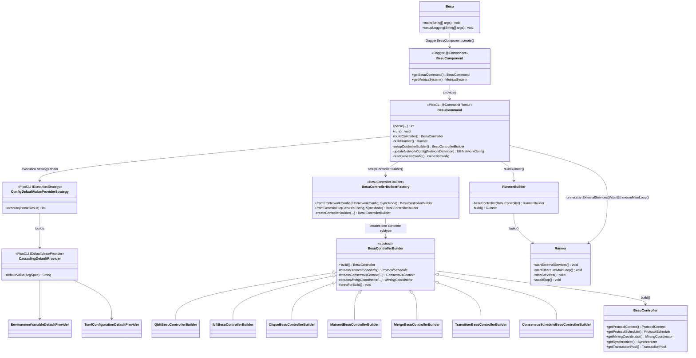
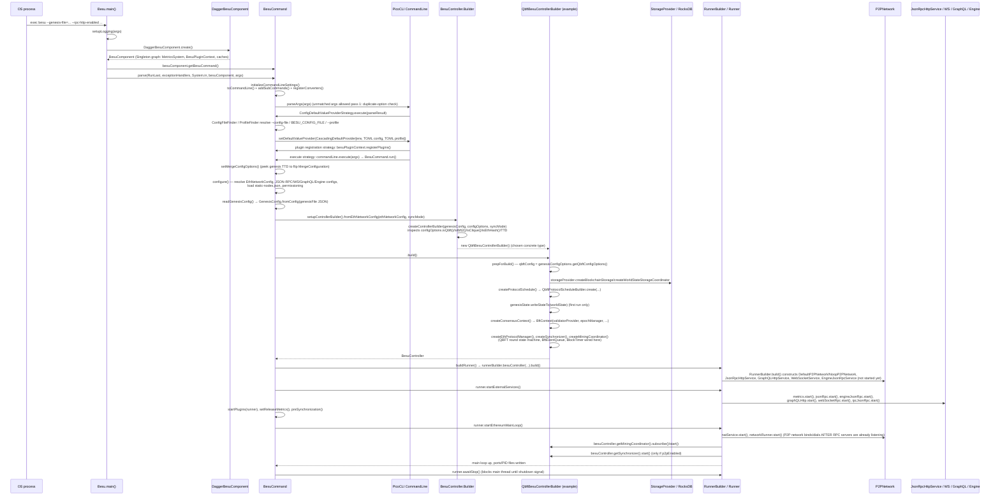

# 15 — CLI Entrypoint and Node Bootstrap (`app` module)

> Source: `_references/besu/app` (Gradle module `:app`, package `org.hyperledger.besu.*`), Besu `main` branch as vendored in this repo. All class/file references below are relative to `_references/besu/app/src/main/java/org/hyperledger/besu/` unless stated otherwise. Cross-checked against this repo's own `docs/Besu-config.md` (§1) and `network-config/genesis.json`.

---

## 1. Overview

The `app` module is Besu's **composition root**. It owns no consensus logic, no EVM, no storage engine, no devp2p wire code — those all live in other Gradle modules (`consensus/`, `ethereum/core`, `ethereum/storage`, `ethereum/p2p`, `ethereum/api`, etc., which are siblings of `app/`). What `app` provides is:

1. `Besu.main()` — the JVM process entrypoint.
2. `BesuCommand` (`cli/BesuCommand.java`, 3209 lines) — a single PicoCLI command object that declares every `--flag`, resolves configuration precedence (CLI > env var > TOML > profile > hardcoded default), and on `run()` drives the entire startup sequence.
3. `BesuController.Builder` / `BesuControllerBuilder` (`controller/`) — reads the parsed genesis config and **selects the concrete consensus module** (QBFT, IBFT2, Clique, PoW/Mainnet, Merge/PoS, or a migration schedule between them), then assembles storage, blockchain, world state, synchronizer, mining coordinator and JSON-RPC method registry into one `BesuController`.
4. `RunnerBuilder` / `Runner` (top-level `org.hyperledger.besu` package) — takes the built `BesuController` plus all the network/RPC configuration objects and wires up the P2P network, JSON-RPC/GraphQL/WebSocket/IPC servers, metrics, and the main synchronization loop, then owns their start/stop lifecycle.

Everything else in the codebase — QBFT round state machines, RocksDB backends, the EVM interpreter, devp2p framing — is a library that `app` instantiates and threads together. This chapter documents that wiring, not the libraries themselves (QBFT internals are covered in `02-consensus-qbft.md`).

---

## 2. Component Diagram

`TransitionBesuControllerBuilder` and `ConsensusScheduleBesuControllerBuilder` are *composite* builders (they wrap one or more of the concrete builders above to support PoW→PoS "the merge" transitions, and IBFT2→QBFT migration schedules, respectively) rather than independent consensus implementations.

---

## 3. Startup Sequence

Key source-grounded details:

- **Config default-value resolution happens as a PicoCLI execution-strategy chain**, not inline in `run()`. `BesuCommand.parse()` (`cli/BesuCommand.java:855`) chains three `IExecutionStrategy` steps: `createDefaultValueProviderTask` → `createPluginRegistrationTask` → `createExecuteTask`. The first step installs a `CascadingDefaultProvider` (`cli/util/CascadingDefaultProvider.java`) as PicoCLI's `IDefaultValueProvider`, so option resolution for anything **not** given on the command line falls through, in order: `EnvironmentVariableDefaultProvider` → TOML `--config-file`/`BESU_CONFIG_FILE` → TOML `--profile`. An explicit CLI flag never reaches this provider chain at all — PicoCLI only calls `defaultValue()` for an `ArgSpec` when no matching argument was parsed from `args`. This matches the precedence documented in `docs/Besu-config.md` §1 (CLI > env var > config-file).
- **RPC/metrics servers are started before the P2P network.** `Runner.startExternalServices()` starts `metrics`, `jsonRpc`, `engineJsonRpc`, `graphQLHttp`, `webSocketRpc`, `ipcJsonRpc` first; only afterwards does `Runner.startEthereumMainLoop()` call `natService.start()` / `networkRunner.start()` and start the synchronizer and mining coordinator (`app/src/main/java/org/hyperledger/besu/Runner.java:153-197`).
- **Consensus module selection is a pure inspection of `GenesisConfigOptions`**, computed from the presence of top-level keys under `genesis.json`'s `"config"` object (`config/src/main/java/org/hyperledger/besu/config/JsonGenesisConfigOptions.java`: `isQbft()` ⇔ `configRoot.has("qbft")`, `isIbft2()` ⇔ `has("ibft2")`, `isClique()` ⇔ `has("clique")`, `isEthHash()` ⇔ `has("ethash")` or fixed-difficulty). No CLI flag selects the consensus algorithm directly — it is entirely genesis-driven.

---

## 4. CLI Subcommands

Registered in `BesuCommand.addSubCommands()` (`cli/BesuCommand.java:1272`). All except `generate-completion` are hand-written `Runnable`/`Callable` PicoCLI commands with their own nested `@Command`s.

| Subcommand | Class | Purpose |
|---|---|---|
| `blocks import` / `blocks export` | `cli/subcommands/blocks/BlocksSubCommand.java` | Import blocks from an RLP/JSON file into the configured database, or export a block range from storage to a file. `--run` starts the node after import completes. |
| `txparse` | `cli/subcommands/TxParseSubCommand.java` | Parses raw transaction hex/lines and prints the recovered sender address (or an error), for debugging transaction encoding. |
| `public-key export` / `public-key export-address` | `cli/subcommands/PublicKeySubCommand.java` | Prints this node's public key or derived address (from `--node-private-key-file`) to stdout or a file. |
| `password` | `cli/subcommands/PasswordSubCommand.java` | Password-related actions (e.g. hashing a password for RPC basic-auth config). |
| `rlp encode` / `rlp decode` | `cli/subcommands/rlp/RLPSubCommand.java` | Encodes a JSON validator/typed-data object to an RLP hex string, or decodes an RLP hex string back into a validator list — used for hand-building QBFT/IBFT genesis `extraData`. |
| `operator generate-blockchain-config` | `cli/subcommands/operator/GenerateBlockchainConfig.java` | Generates validator keypairs and a genesis file with RLP-encoded `extraData` from a config template — this is the command this repo's `network-config/genesis.json` and validator keys were produced with (see `docs/FAQ.md`). |
| `operator generate-log-bloom-cache` | `cli/subcommands/operator/GenerateLogBloomCache.java` | Pre-generates block log-bloom filter caches to speed up log queries. |
| `validate-config` | `cli/subcommands/ValidateConfigSubCommand.java` | Syntax-only validation of a `--config-file` TOML file against the current CLI option set. |
| `storage revert-variables` | `cli/subcommands/storage/StorageSubCommand.java` | Reverts changes made by the "variables storage" database feature. |
| `storage rocksdb usage` / `storage rocksdb x-stats` | `cli/subcommands/storage/RocksDbSubCommand.java` | Prints RocksDB on-disk usage or internal statistics for the configured database. |
| `storage trie-log count` / `prune` / `export` / `import` | `cli/subcommands/storage/TrieLogSubCommand.java` | Inspect, prune, export, or import Bonsai trie-log records — used for trimming/relocating Bonsai state history. |
| `storage revert-metadata v2-to-v1` | `cli/subcommands/storage/RevertMetadataSubCommand.java` | Reverts database metadata from the v2 format back to v1. |
| `storage prune-pre-merge-blocks` | `cli/subcommands/storage/PrunePreMergeBlockDataSubCommand.java` | Prunes pre-merge (pre-PoS-transition) block data in configurable range sizes. |
| `generate-completion` | PicoCLI built-in `AutoComplete.GenerateCompletion` | Generates a shell completion script; registered but hidden from `--help`. |

This repo does not invoke any subcommand at runtime — every `besu-validator-*`/`besu-rpc-*` container in `docker-compose.yml` runs the bare top-level `besu` command (implicit `run`, since `BesuCommand` itself is the default `Runnable`). `operator generate-blockchain-config` was used once, out-of-band, to produce `network-config/genesis.json` and the validator keys.

---

## 5. Key Classes and Interfaces

| Class / Interface | File | Responsibility |
|---|---|---|
| `Besu` | `app/.../Besu.java` | JVM entrypoint (`main`). Sets up Log4j2/Netty logging before any logger is created, builds the Dagger graph, invokes `BesuCommand.parse()`, calls `System.exit(exitCode)`. |
| `BesuComponent` | `components/BesuComponent.java` | Dagger `@Component` (Singleton) wiring `BesuCommandModule`, `MetricsSystemModule`, `BonsaiCachedMerkleTrieLoaderModule`, `BesuPluginContextModule`, `BlobCacheModule`, `BonsaiCodeCacheModule`. Supplies the one `BesuCommand` instance and shared singletons (`MetricsSystem`, plugin context, code/trie caches) used across the process. |
| `BesuCommand` | `cli/BesuCommand.java` | The PicoCLI `@Command(name = "besu")` root object: ~every `--flag` is a field on this class or on one of its `*Options` mixins (`P2PDiscoveryOptions`, `JsonRpcHttpOptions`, `MiningOptions`, `DataStorageOptions`, etc.). Owns `run()`, the full startup orchestration, and helper methods (`buildController`, `buildRunner`, `updateNetworkConfig`, `readGenesisConfig`). |
| `ConfigDefaultValueProviderStrategy` | `cli/util/ConfigDefaultValueProviderStrategy.java` | PicoCLI `IExecutionStrategy` that resolves `--config-file`/`--profile` locations and installs the cascading default-value provider before the real command executes. |
| `CascadingDefaultProvider` | `cli/util/CascadingDefaultProvider.java` | Tries a list of `IDefaultValueProvider`s in order, returns the first non-null value — implements the env-var-then-TOML precedence. |
| `EnvironmentVariableDefaultProvider` | `cli/util/EnvironmentVariableDefaultProvider.java` | Maps `--some-flag` → `BESU_SOME_FLAG` and looks it up in the process environment (long-option names only). |
| `TomlConfigurationDefaultProvider` | `cli/util/TomlConfigurationDefaultProvider.java` | Parses a TOML file (via Tuweni `Toml`) and resolves each PicoCLI `OptionSpec`'s default value from it, including values nested one level under a `[TableHeading]`. Rejects unknown keys unless the command line already allows unmatched arguments. |
| `ConfigFileFinder` / `ProfileFinder` | `cli/util/ConfigFileFinder.java`, `cli/util/ProfileFinder.java` | Resolve the config-file/profile source from, respectively, the `--config-file`/`--profile` CLI option or `BESU_CONFIG_FILE` env var (via shared `AbstractConfigurationFinder`). |
| `BesuController.Builder` | `controller/BesuController.java` (nested `Builder`) | `fromEthNetworkConfig`/`fromGenesisFile` → `createControllerBuilder`: inspects `GenesisConfigOptions` and **returns the correct concrete `BesuControllerBuilder`** (this is the consensus-selection dispatch point). |
| `BesuControllerBuilder` | `controller/BesuControllerBuilder.java` (1553 lines, abstract) | Template-method base class. `build()` performs the entire non-consensus-specific wiring (storage provider → world state archive → blockchain → `EthPeers`/`EthContext` → transaction pool → `EthProtocolManager` → synchronizer → mining coordinator → JSON-RPC method factory → final `BesuController`). Delegates consensus-specific pieces to abstract methods (`createProtocolSchedule`, `createConsensusContext`, `createMiningCoordinator`, `createAdditionalPluginServices`) implemented by each subclass. |
| `QbftBesuControllerBuilder` | `controller/QbftBesuControllerBuilder.java` | QBFT concrete builder: reads `genesisConfigOptions.getQbftConfigOptions()` in `prepForBuild()`, builds `QbftProtocolScheduleBuilder`, `BftContext`/`ForkingValidatorProvider`, and the full QBFT round-state stack (`QbftController`, `QbftRoundFactory`, `BlockTimer`, `BftMiningCoordinator`) documented in `02-consensus-qbft.md`. |
| `IbftBesuControllerBuilder`, `CliqueBesuControllerBuilder`, `MainnetBesuControllerBuilder`, `MergeBesuControllerBuilder` | `controller/*.java` | Analogous concrete builders for IBFT2, Clique, pre-merge PoW/Ethash, and post-merge PoS respectively. |
| `TransitionBesuControllerBuilder` | `controller/TransitionBesuControllerBuilder.java` | Wraps a pre-merge builder + `MergeBesuControllerBuilder` for chains with a terminal total difficulty that haven't reached it yet (e.g. historical mainnet sync). |
| `ConsensusScheduleBesuControllerBuilder` | `controller/ConsensusScheduleBesuControllerBuilder.java` | Wraps a `Map<Long, BesuControllerBuilder>` block-height schedule for genesis files that declare an IBFT2→QBFT migration (`isConsensusMigration()`), switching builder at the configured `qbft.startBlock`. |
| `RunnerBuilder` | `RunnerBuilder.java` (top-level package, 1578 lines) | Takes the built `BesuController` plus every network/RPC configuration object and *constructs* (but does not start) the P2P network (`DefaultP2PNetwork`/`NoopP2PNetwork` via `NetworkRunner.builder()`), `JsonRpcHttpService`, `EngineJsonRpcService`, `GraphQLHttpService`, `WebSocketService`, IPC service, and metrics service. Returns a `Runner`. |
| `Runner` | `Runner.java` (598 lines) | Owns the started/stopped lifecycle: `startExternalServices()` (RPC/metrics), `startEthereumMainLoop()` (NAT, P2P network, synchronizer, mining coordinator), `stopServices()`/`stop()`, and `awaitStop()` (blocks the CLI thread until a shutdown hook fires). |
| `GenesisConfig` / `GenesisConfigOptions` / `JsonGenesisConfigOptions` | `config/src/main/java/org/hyperledger/besu/config/*.java` (module `:config`, not `:app`) | Parsed representation of `--genesis-file`'s JSON. `JsonGenesisConfigOptions.isQbft()`/`isIbft2()`/`isClique()`/`isEthHash()` test for the presence of the corresponding key (`"qbft"`, `"ibft2"`, `"clique"`, `"ethash"`) under the genesis `"config"` object — this is what `BesuController.Builder` branches on. |

---

## 6. Tracing This Repo's `--genesis-file` to the QBFT Module

Every Besu container in this repo's `docker-compose.yml` runs with `--genesis-file=/data/genesis.json`, a read-only mount of `network-config/genesis.json`. That file's `"config"` object contains a `"qbft"` key (`"chainId": 20260916, "qbft": { "blockperiodseconds": 2, "epochlength": 30000, ... }`) and no `"ethash"`, `"clique"`, or `"ibft2"` key. At startup, `BesuCommand.configure()` calls `updateNetworkConfig(network)`, which resolves `genesisFile` into a `GenesisConfig` via `readGenesisConfig()` and attaches it to the `EthNetworkConfig`. `BesuCommand.setupControllerBuilder()` then calls `controllerBuilder.fromEthNetworkConfig(ethNetworkConfig, syncMode)`, which delegates to `BesuController.Builder.createControllerBuilder()`. That method calls `configOptions.isQbft()` — true, because `JsonGenesisConfigOptions.isQbft()` checks `configRoot.has("qbft")` — and, since there's no terminal total difficulty in this genesis (no merge), returns a bare `new QbftBesuControllerBuilder().genesisConfig(genesisConfig)` (no `TransitionBesuControllerBuilder` wrapping needed). From there, `QbftBesuControllerBuilder.prepForBuild()` reads `genesisConfigOptions.getQbftConfigOptions()` — which is backed by that same `"qbft"` JSON object — into `qbftConfig`, derives `qbftForksSchedule` via `QbftForksSchedulesFactory.create(genesisConfigOptions)`, and builds the QBFT protocol schedule and round-state machinery (`QbftProtocolScheduleBuilder`, `BftContext`, `QbftController`, `BftMiningCoordinator`) that `02-consensus-qbft.md` documents in detail. In short: **the single `"qbft"` key in this repo's genesis JSON is both the switch that selects `QbftBesuControllerBuilder` over every other consensus builder, and the source of every QBFT-specific tuning parameter (block period, epoch length, request timeout, validator list) consumed once that builder is selected.**
