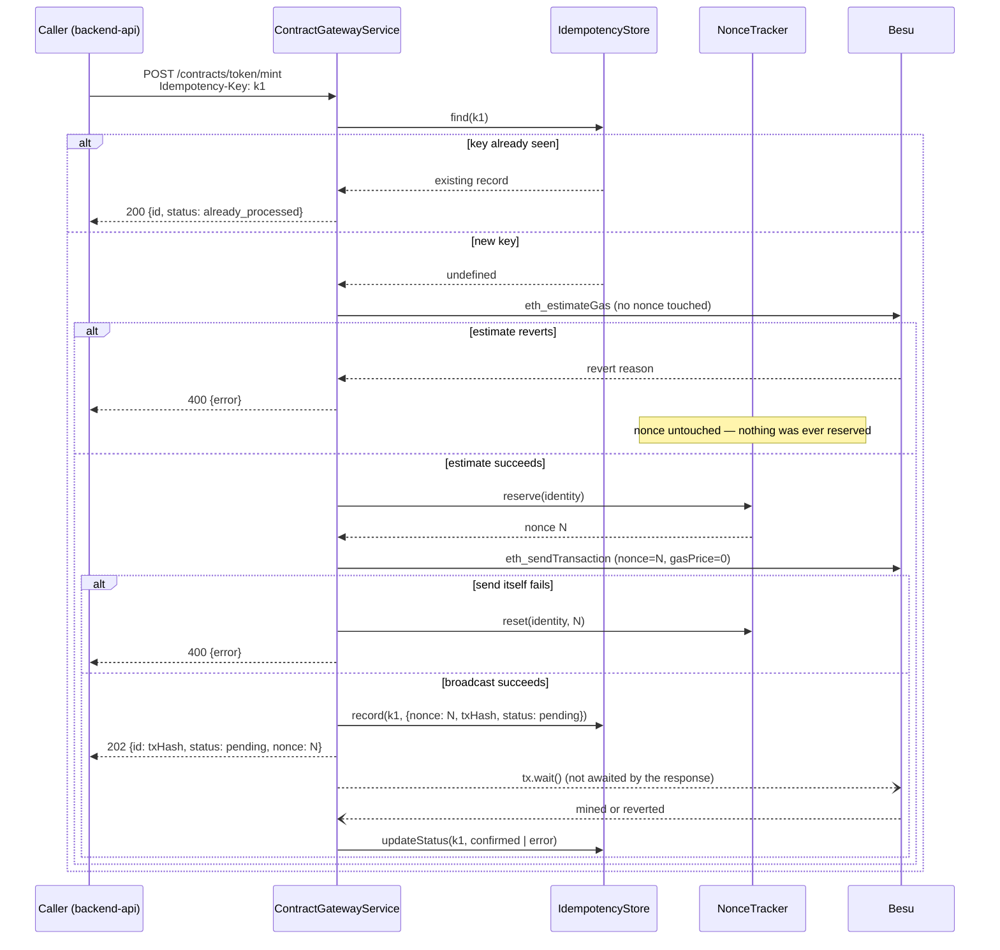
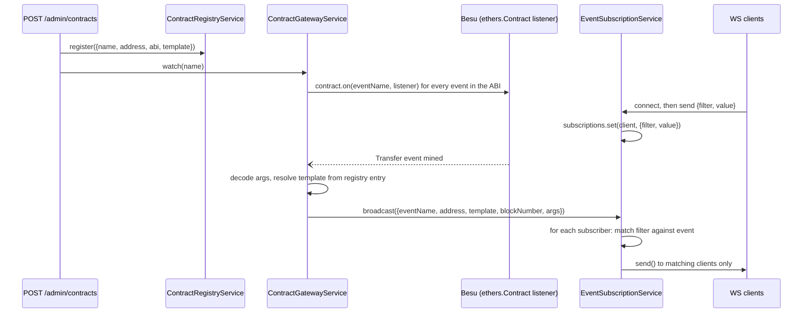

# mock-middleware — Technical Deep Dive

> How the generic ABI-driven gateway actually works, module by module. For what it's *for* and how it fits the rest of the system, see `docs/architecture.md`. For the REST/WS API surface as a user would call it, see `docs/deliverables.md` §4 and `docs/user-manual.md`.

`mock-middleware` is the network's sole chain transport (D-06): it holds every private key, and it's the only component that ever sends a transaction or reads chain state via `ethers.js`. Everything above it — `backend-api`, the frontend — reaches chain exclusively through this gateway's REST and WebSocket surface. Critically, it is *generic*: it has no idea what "registering an identity" or "minting a token" means. It only knows how to take a registered `{name, address, abi}` and turn `name.method` into a callable REST route.

---

## 1. Module map

```
mock-middleware/src/
  identities.ts                        fixed 3-identity list (admin/anson/beatrice)
  chain/
    provider.ts                        ethers signers, one per identity, loaded from .env.local
    errors.ts                          extractRevertReason() — sanitizes any ethers/RPC error into a plain string
  db/
    db.ts                              SQLite schema: contracts, idempotency_keys, nonces
  services/
    ContractRegistryService.ts         the ABI registry — register/get/list
    IdempotencyStore.ts                Idempotency-Key -> receipt map
    NonceTracker.ts                    per-identity nonce counter, estimate-before-reserve
    EventSubscriptionService.ts        WS subscriber list + broadcast/filter logic
    ContractGatewayService.ts          orchestrates all of the above into callRead/callWrite/watch
  api/
    routes.ts                          Express routes — thin, no logic of their own
    server.ts, errorHandler.ts, jsonSafe.ts
  ws/
    wsServer.ts                        attaches a ws.WebSocketServer, wires subscribe messages
  index.ts                             wiring: construct everything, re-attach watchers, listen
```

Each service is deliberately narrow and independently unit-tested (`mock-middleware/test/services/*.test.ts`) against fakes — none of them require a live Besu node to test, only `ContractGatewayService.watch()` and the real HTTP/WS surface do.

---

## 2. Read call: `GET /contracts/:name/:method?params=[...]`

1. `routes.ts` parses `params` from the query string (JSON array) and calls `gateway.callRead(name, method, params)`.
2. `ContractGatewayService.resolveContract(name)` looks the name up in `ContractRegistryService` — 404 if never registered.
3. `resolveFunction` finds the method in the ABI's `ethers.Interface` — 404 if it doesn't exist.
4. Guards that the method is actually `view`/`pure` — a `POST`-only method called via `GET` is a 400, not silently allowed through.
5. `encodeParams` ABI-encodes the call data. A bad param shape (wrong type, wrong arity) is caught here and turned into a 400 — this used to crash to 500 before a bug fix (see §7).
6. `provider.call({to, data})` — a raw `eth_call`, no signer, no gas, no nonce, because nothing gets written to chain.
7. `iface.decodeFunctionResult` decodes the raw return bytes back into typed values.
8. `jsonSafe.ts`'s `toJsonSafe()` converts any `bigint` (e.g. a `uint256` balance) to a string before JSON serialization, since `JSON.stringify` can't handle `bigint` natively.

No identity, no nonce, no idempotency key — reads are stateless and side-effect-free by construction.

---

## 3. Write call: `POST /contracts/:name/:method`

This is the core of the "exactly-once idempotent delivery" guarantee (D-08) and the nonce-safety guarantee (D-09). The sequence matters — it's designed so that a reverted or failed call can *never* leave nonce state inconsistent.



Key design choices, in order:

1. **Idempotency check happens first, before any chain interaction.** If the key was already seen, the cached `{txHash, nonce}` is returned immediately — the second (or hundredth) POST with the same key never reaches `estimateGas`, `reserve()`, or `sendTransaction`. This is what `mock-middleware/test/services/ContractGatewayService.test.ts`'s idempotency test asserts directly: `sendTransaction` is called exactly once for two identical POSTs.

2. **`estimateGas` runs before `reserve()`, always.** This is the load-bearing design decision behind D-09. A prior reference implementation (using `ethers.NonceManager`) reserved a nonce as a side effect of *building* the transaction, before the gas estimate ever ran — so a call that reverted at estimation time left a nonce permanently reserved, and every later send for that identity would sit waiting for a nonce that would never arrive. Here, nothing about nonce state is touched until the estimate has already succeeded, so that entire bug class is structurally impossible, not just patched around. See `NonceTracker.ts`'s docstring and `mock-middleware/test/services/ContractGatewayService.test.ts`'s `"returns 400 without touching the nonce when eth_estimateGas reverts"` test.

3. **`reserve()` is synchronous.** `NonceTracker.reserve()` does a plain `Map` read-increment-write with no `await` in between. Node's single-threaded event loop guarantees no other concurrent request can interleave between the read and the write, so two simultaneous writes from the same identity can never race on the same nonce — no locking needed.

4. **The response returns the moment the transaction is broadcast, not once it's mined.** `sendTransaction()` resolves as soon as Besu accepts the raw transaction into its mempool; `tx.wait()` (which blocks until mined) is called but its promise is *not* awaited before responding — it settles in the background and updates the `IdempotencyStore` row from `pending` to `confirmed`/`error` whenever it resolves. This is the `202` + async-settlement pattern: the caller gets a fast ack with the real transaction hash, and can poll `GET /admin/receipts/:id` (see §5) to find out when it actually lands.

5. **`reset()` only fires on a sendTransaction-level failure**, which is rare (the estimate already succeeded, so the transaction is very unlikely to be rejected at broadcast time) — but if it happens, the reserved nonce is rolled back so it isn't wasted, and no idempotency record is written, so the same key can be legitimately retried.

---

## 4. Idempotency store

`IdempotencyStore` (backed by the `idempotency_keys` SQLite table) does double duty:

- **Dedup lookup** — `find(key)` is what `callWrite` checks first.
- **Per-identity transaction log** — `listByIdentity(identity)` powers `GET /admin/nonce-status`'s `pending`/`lastConfirmedTx` fields, by filtering the same table for that identity's rows by status.

Deliberately, deduplication is keyed by the **client-supplied key**, not by hashing `(contract, method, params, from)`. If it hashed the call shape instead, two legitimately identical consecutive actions — e.g. two separate 10-COIN mints to the same address — would be indistinguishable from a retry and the second would be silently dropped. The caller (in this project, `backend-api`'s `MockMiddlewareChainService`) is responsible for generating a fresh key per logical action and reusing the same key only when it's genuinely retrying that exact action.

---

## 5. Nonce tracking and settlement polling

`NonceTracker` keeps an in-memory `Map<identity, nextNonce>` mirrored into the `nonces` SQLite table on every write, so a reservation survives a container restart (`init()` prefers the persisted value over re-querying chain, precisely so a nonce that's already been handed out to an in-flight transaction doesn't get handed out again after a restart).

This persistence has a sharp edge, covered in §7: it means a **restart alone cannot fix a stale cache** if something *else* advanced the identity's real on-chain nonce without going through this tracker. `resync(identity)` exists for exactly that case — it force-overwrites the cache from a live `eth_getTransactionCount(address, "pending")` query, discarding whatever was persisted.

`GET /admin/receipts/:id` is the settlement-polling endpoint: given a transaction hash (the `id` a write call returned), it looks up the matching row in `idempotency_keys` by `tx_hash` and reports its current `status`. `backend-api`'s `MockMiddlewareChainService` polls this in a loop to implement its own `tx.wait()` — this is the mechanism that makes an async-settled write *look* synchronous to `backend-api`'s callers, without `mock-middleware` itself blocking the original request.

---

## 6. Event relay



- **Registration-time wiring**: every time a contract is registered (`POST /admin/contracts`), `ContractGatewayService.watch(name)` iterates every `event` fragment in that contract's ABI and attaches an `ethers.Contract.on(eventName, ...)` listener. This also runs once at process startup for every contract already in the registry (`index.ts`), so listeners survive a restart without needing to re-upload anything.
- **Decoding**: for each event fragment, only the *named* inputs are pulled out of the payload's `args` (positional-index duplicates that ethers also attaches are skipped) and any `bigint` value is stringified — the same JSON-safety concern as read-call results.
- **Filter matching** happens entirely inside `EventSubscriptionService`, which is deliberately decoupled from `ws` — it only depends on a minimal `SocketLike` interface (`readyState` + `send()`), which is what makes it trivially unit-testable without a real socket. A client's stored filter is either `{filter: "address", value: "0x..."}` (exact, case-insensitive address match) or `{filter: "template", value: "ERC3643Token"}` (matches any contract registered with that template string — including ones registered *after* the subscription started, since the match happens per-broadcast against the current registry entry, not against a snapshot taken at subscribe time).
- **A contract registered without a `template`** (the field is optional on `POST /admin/contracts`) can only ever be reached by address-filtered subscribers — a template subscriber will never match it, by design (`event.template !== null` is part of the match condition).
- **No replay, no queue.** This is a push-only, at-most-once relay: a client that's disconnected when an event fires simply never receives it, and there is no server-side buffer to catch up on reconnect. The chain's own event log is the durable source of truth; this relay is a convenience layer for near-real-time observability, not a delivery-guaranteed message bus (architecture.md §4/§7, R2/R10).

---

## 7. Error handling

`chain/errors.ts`'s `extractRevertReason()` is the single place raw `ethers`/RPC errors get turned into a plain, safe string, used by both the read and write paths:

1. Prefer `error.reason` — ethers v6 already parses a standard `require(cond, "reason")` revert into this field for both `eth_call` gas estimation and providers that return revert data (Besu does).
2. Fall back to `error.shortMessage`.
3. Fall back to pattern-matching `error.message` against a few known shapes (`reverted with reason string '...'`, `execution reverted (...)`, `execution reverted: ...`).
4. If none of those match, the caller falls back to a generic message (`"call failed"`, `"gas estimation failed"`, etc.) — never the raw error object, and never a stack trace.

`ContractGatewayError` carries an HTTP status alongside the message; `api/errorHandler.ts` is the only place that status is read, converting it into `res.status(err.status).json({error: err.message})`. Anything that *isn't* a `ContractGatewayError` is logged server-side and returned as a generic `500`, so an unexpected internal error never leaks implementation details to a caller.

**A real bug this caught during development:** `encodeParams()` originally called `iface.encodeFunctionData()` directly, outside any `try/catch`. A malformed parameter (e.g. an invalid address string) threw synchronously from inside that call, *before* the `estimateGas` try/catch block was ever reached — so it propagated as an unhandled rejection and surfaced as a raw `500`, not a clean `400`. The fix wraps encoding itself in its own try/catch (`encodeParams`) so any input-shape problem is treated the same as any other rejected call.

---

## 8. SQLite schema

```sql
CREATE TABLE contracts (
  name TEXT PRIMARY KEY,
  address TEXT NOT NULL,
  abi TEXT NOT NULL,        -- JSON-serialized ABI array
  template TEXT,             -- nullable; ABI/contract-type label for event filtering
  created_at TEXT NOT NULL
);

CREATE TABLE idempotency_keys (
  key TEXT PRIMARY KEY,      -- the client-supplied Idempotency-Key
  identity TEXT NOT NULL,
  contract_name TEXT NOT NULL,
  method TEXT NOT NULL,
  params_json TEXT NOT NULL,
  nonce INTEGER NOT NULL,
  tx_hash TEXT NOT NULL,
  status TEXT NOT NULL,      -- 'pending' | 'confirmed' | 'error'
  error_message TEXT,
  created_at TEXT NOT NULL,
  confirmed_at TEXT
);

CREATE TABLE nonces (
  identity TEXT PRIMARY KEY,
  next_nonce INTEGER NOT NULL
);
```

No ORM, no migrations framework — three `CREATE TABLE IF NOT EXISTS` statements run at startup (`db/db.ts`), matching the project-wide convention (`node:sqlite`'s `DatabaseSync`, no C++ toolchain dependency). All three tables live in the same file, one per `mock-middleware` container — there's no persistent volume mount, so `docker compose down -v` wipes this state along with the chain itself (consistent with D-15's "no persistent Besu volume" philosophy extended to this service's own local state).

---

## 9. What's explicitly out of scope here

- **No authentication or authorization** on any endpoint — any local caller can register a contract or invoke any method with any signer identity. Accepted MVP risk (R6/R9 in `docs/plan.md`), only tenable because the whole stack is localhost-only.
- **No replicated or durable idempotency state** — if the container crashes between broadcasting a transaction and the response reaching the caller, that in-flight write's outcome is only recoverable by inspecting chain state directly, not by re-querying `mock-middleware` (R2 in `docs/plan.md`).
- **No webhook delivery** — WebSocket push only; a consumer that needs guaranteed delivery must poll `GET /admin/receipts/:id` or `GET /admin/nonce-status` instead (both durable, SQLite-backed), never rely on the WS feed for anything beyond observability.
