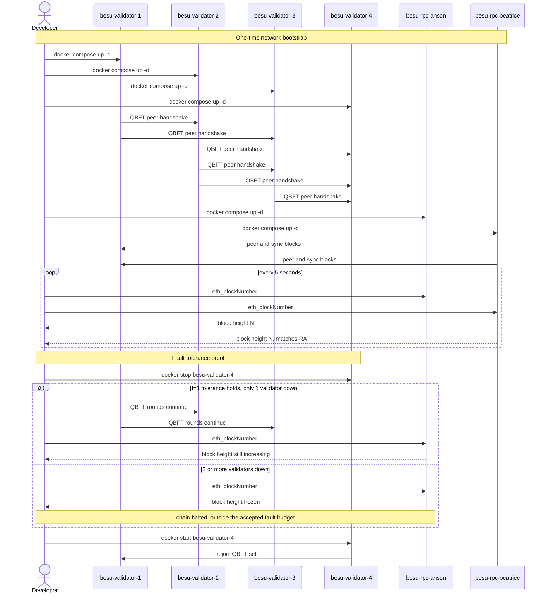
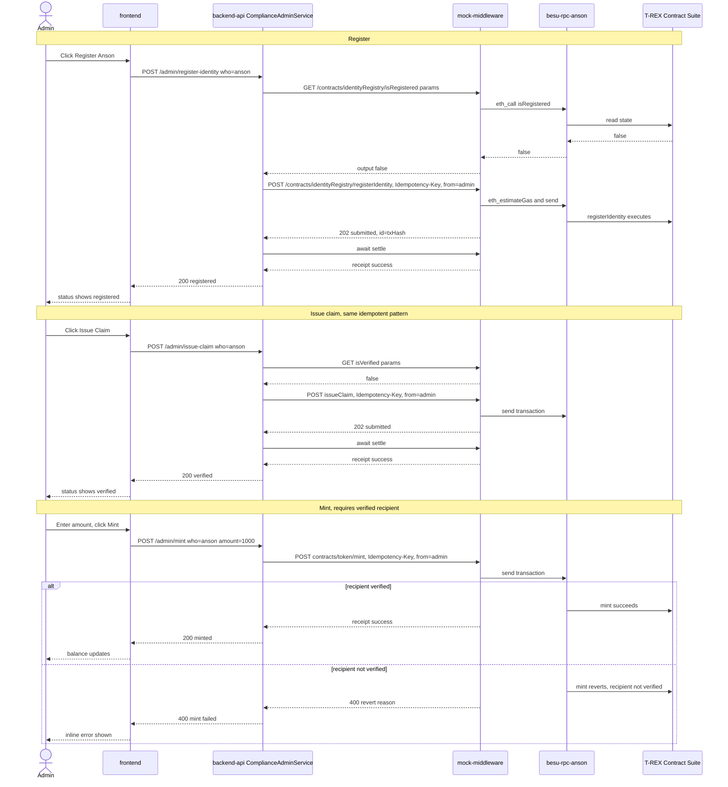
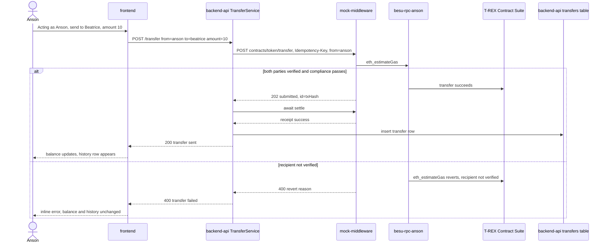
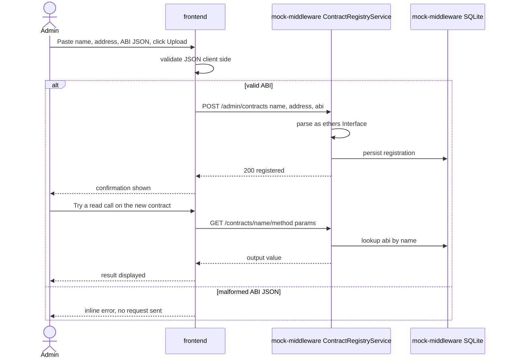
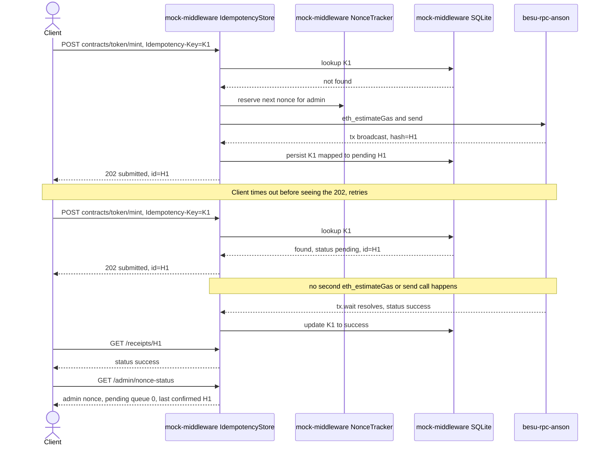
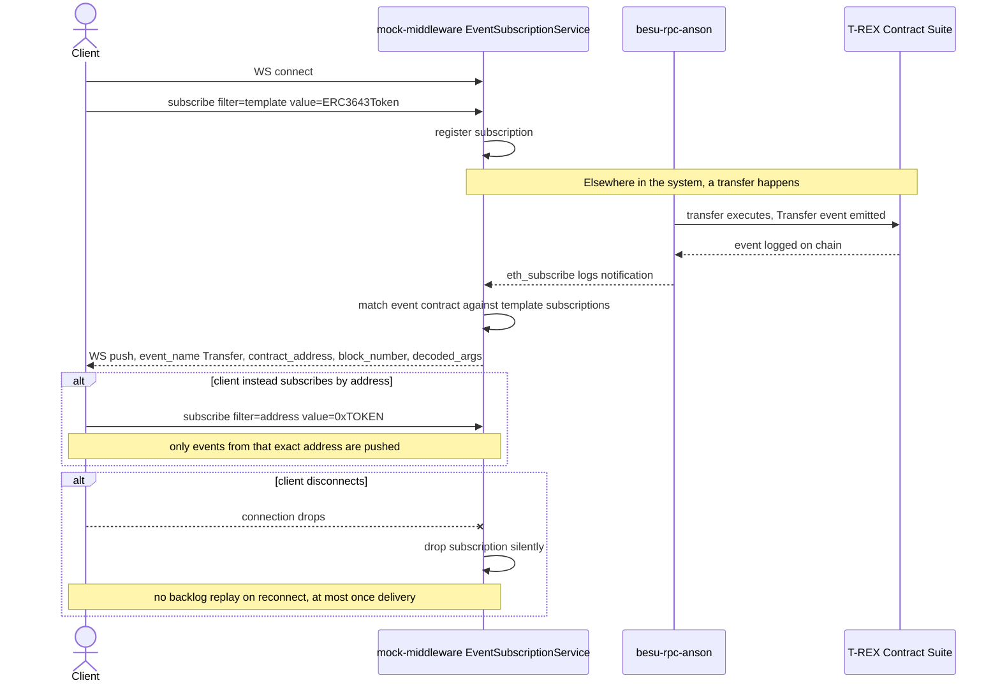
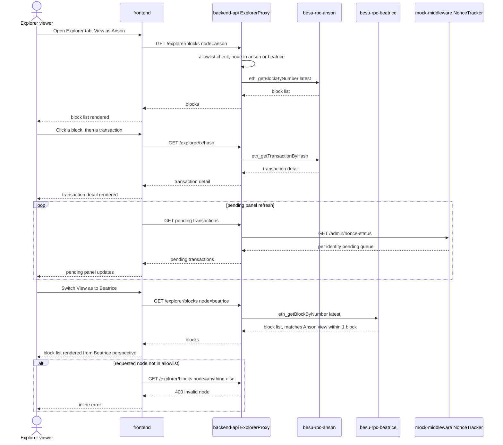

# Use Cases — Hyperledger-Besu-Docker-Testnet

> **Owner:** Howin Ho · **Created:** 2026-09-15 · **Status:** Locked (post grill-me)
> Companion docs: [docs/prd.md](prd.md), [docs/architecture.md](architecture.md)

This document is the single reference for end-to-end interaction flows.

---

## Actors

| Actor | Role |
|---|---|
| Admin | Human. Token Agent + Trusted Issuer — registers identities, issues KYC claims, mints `COIN`, uploads contract ABIs |
| Anson | Human. Verified investor, nominal operator of `besu-rpc-anson` |
| Beatrice | Human. Verified investor, nominal operator of `besu-rpc-beatrice` |
| Explorer viewer | Human. Any local user browsing chain state, no distinct identity required |
| Developer | Human. Boots and operates the stack (Phase 1 network verification) |
| `frontend` | React SPA — Admin / Transfer / Explorer tabs |
| `backend-api` | Business orchestration service — `ComplianceAdminService`, `TransferService`, `AuditLogRepository`, `ExplorerProxy` |
| `mock-middleware` | Generic ABI-driven gateway and sole chain transport — `ContractRegistryService`, `IdempotencyStore`, `NonceTracker`, `EventSubscriptionService`; holds all signing keys |
| `besu-rpc-anson` | RPC node nominally owned by Anson |
| `besu-rpc-beatrice` | RPC node nominally owned by Beatrice |
| `besu-validator-1..4` | QBFT validators |
| T-REX Contract Suite | On-chain contracts enforcing ERC-3643 compliance |

---

## UC-01: Network Boots With Genuine Fault Tolerance

**Goal:** The developer confirms the 4-validator network produces blocks and survives one validator dying, proving `f=1` fault tolerance is real, not just a topology label.

**Trigger:** `docker compose up -d` followed by manually stopping one validator container.

**Notes:**
- References `plan.md` D-04 and M1.2 exit gate; `architecture.md` §1 deployment model
- The "2 or more validators down" branch is the accepted-risk case (`plan.md` R1) — the chain halts by design, not a bug
- Playwright coverage: not applicable — this is an infra-level flow verified via the Phase 1 gate commands in `plan.md`, not a browser flow

---

## UC-02: Admin Onboards an Identity (Register, Claim, Mint)

**Goal:** Admin registers an identity, issues its KYC claim, and mints `COIN` to it, making the identity able to hold and transfer tokens.

**Trigger:** Admin clicks "Register" for an identity on the Admin panel.

**Notes:**
- Register/claim skip-if-already-true checks carried from `my-besu-net`'s Phase 4 fix (avoids paying full confirmation latency for a no-op transaction)
- Idempotent per `plan.md` D-08 / `prd.md` FR-6
- References `prd.md` US-008
- Playwright coverage: `tests/onboarding.spec.ts` covers the happy path; the mint-reverts branch is not currently covered — flagged as test backlog

---

## UC-03: Anson Transfers COIN to Beatrice

**Goal:** Anson sends `COIN` to a verified recipient; a transfer to an unverified address fails closed with no state change.

**Trigger:** Anson clicks "Send" on the Transfer tab.

**Notes:**
- Mirrors `my-besu-net`'s happy-path and compliance-rejection flows unchanged in business behavior
- References `architecture.md` §3 transfer critical-path diagram, `prd.md` FR-10, US-009
- Playwright coverage: `tests/happy-path-transfer.spec.ts` (happy path), `tests/compliance-rejection.spec.ts` (alt path)

---

## UC-04: Admin Uploads a New Contract ABI

**Goal:** Admin registers a new contract's ABI and address with `mock-middleware`, and it becomes callable via a generated REST surface immediately, with no gateway redeploy.

**Trigger:** Admin submits the "Upload Contract" form.

**Notes:**
- References `plan.md` D-07, `prd.md` FR-4/FR-5, US-004/US-010
- Registration persisted in SQLite, survives a `mock-middleware` container restart, unlike `my-besu-net`'s hardcoded two-instance list
- Playwright coverage: `tests/abi-upload.spec.ts` covers the happy path; the malformed-JSON branch is server-side validated but not yet in Playwright — flagged as test backlog

---

## UC-05: Client Retries a Write Call Safely (Exactly-Once Delivery)

**Goal:** A client that times out and retries a write call does not cause a duplicate on-chain transaction.

**Trigger:** The same POST request is sent twice with the same `Idempotency-Key` header (e.g. a client-side timeout triggers a retry).

**Notes:**
- References `plan.md` D-08/D-09, `prd.md` FR-6/FR-7, US-005/US-006
- `NonceTracker` carries the reset-on-revert fix from `my-besu-net`'s `ChainService` — a reverted `eth_estimateGas` never leaves a nonce stuck (see `architecture.md` §6)
- Playwright coverage: `tests/idempotent-retry.spec.ts`, asserted via `/admin/nonce-status` or the audit-log row count, not just UI state

---

## UC-06: Client Subscribes to On-Chain Events by Address or Template

**Goal:** A WebSocket client receives `Transfer` events for either one specific contract or every contract matching a template, in near real time.

**Trigger:** Client opens a WebSocket connection to `mock-middleware` and sends a subscribe message.

**Notes:**
- References `plan.md` D-10, `prd.md` FR-8, US-007
- Explicitly a best-effort, choreographed relay, not a durable event log — see `architecture.md` §4 and §8
- Playwright coverage: not applicable — WebSocket push is verified by a dedicated integration test per `plan.md` D-21, not forced into E2E

---

## UC-07: User Browses the Explorer

**Goal:** Any local user inspects live blocks and transactions from either RPC node's perspective, including in-flight pending transactions.

**Trigger:** User opens the Explorer tab.

**Notes:**
- References `plan.md` D-11/D-12/D-14, `prd.md` FR-11/FR-13, US-011
- Explorer bypasses `mock-middleware` entirely for raw block/tx reads — see `architecture.md` §6 `ExplorerProxy` rationale
- The allowlist-rejection branch is the SSRF mitigation from `plan.md` Phase 4 anti-gate — currently proven by a `backend-api` unit test, not yet in Playwright
- Playwright coverage: `tests/explorer-view-as.spec.ts` covers the View-as switch and block/tx rendering; the allowlist-rejection branch is flagged as test backlog
